# Documentation
## Base Elements

### UIBaseElement

### UIElement

```java 

  @Test
  public void click() {
      submit.click();
      assertEquals(sum.getText(), "Summary: 3");
  }

  @Test
  public void isDisplayed(){
      assertTrue(submit.isDisplayed());
  }

  @Test
  public void input(){
      description.input("Hello world!");
      assertEquals(description.getText(), "Hello world!");
      description.clear();
  }

  @Test
  public void hasAttribute() {
      assertTrue(submit.hasAttribute("class"));
      assertTrue(submit.hasAttribute("type"));
  }
  
```

Available methods in Java JDI Light: 

|Method | Description | Return Type 
--- | --- | --- 
**check()** | Clicks on element if it's not selected | void
**classes()** | Gets all classes as list | List<String>
**clear()** | Clears input field | void
**click()** | Clicks on element | void
**click(Element area)** | Clicks on element area(Element area could be SMART_CLICK, TOP_LEFT, TOP_RIGHT, BOTTOM_LEFT, BOTTOM_RIGHT, CENTER, JS) | void
**click(int x, int y)** | Clicks on point (x, y) | void
**doubleClick()** | Double clicks on the element | void
**dragAndDropTo(int x, int y)** | Drags and drops it to certain coordinates | void
**dragAndDropTo(WebElement to)** | Drags and drops it to another element | void
**focus()** | Focuses on element | void
**getAllAttributes()** | Gets all element’s attributes | MapArray<String, String>
**getAttribute(String value)** | Gets the attribute value | String
**getCssValue(String value)** | Gets element css value | String
**getLocation()** | Gets element location as point | Point
**getRect()** | Gets element rectangle | Rectangle
**getSize()** | Gets element size | Dimension
**getTagName()** | Returns tag name | String
**getText()** | Gets text of the element | String
**getValue()** | Gets text | String
**hasAttribute(String attrName)** | Returns true if element has expected attribute | boolean
**hasClass(String className)** | Returns true if element has expected class | boolean
**highlight()** | Highlights element with red color | void
**highlight(String color)** | Scrolls view to element and makes a border around with specified color | void
**hover()** | Hovers mouse to element | void
**input(String value)** | Inputs specified value as keys | void
**isDeselected()** | Checks that element is deselected | boolean
**isDisabled()** | Checks element is disabled | boolean
**isDisplayed()** | Checks the element is displayed | boolean
**isEnabled()** | Checks element exists | boolean
**isHidden()** | Checks element is hidden | boolean
**isNotExist()** | Checks element doesn’t exist | boolean
**isNotVisible()** | Checks element is not visible by user | boolean
**isSelected()** | Checks that element is selected | boolean
**isVisible()** | Checks element is displayed | boolean
**jsExecute(String jsCode)** | Executes java script call | String
**labelText()** | Gets label text | String
**makePhoto()** | Gets element’s screenshot | File
**placeholder()** | Gets attribute ‘placeholder’ | String
**printHtml()** | Gets the element attribute “innerHTML” value | String
**rightClick()** | Right clicks on the element | void
**select()** | Selects item | void
**select(int index)** | Selects item by index | void
**select(String value)** | Selects item by value | void
**select(String… names)** | Selects items by values | void
**sendKeys(CharSequence… value)** | Sends specified value as keys | void
**setAttribute(String name, String value)** | Sets value to the specified attribute | void
**setText(String value)** | Puts value as text | void
**setValue()** | Inputs value | void
**show()** | Scrolls screen view to item | void
**text()** | Gets text | String
**uncheck()** | Clicks on element if selected | void


Aliases in Java JDI Light: 

|Method | Description | Return Type 
--- | --- | --- 
**attr(String value)** | Gets attribute | String
**attrs()** | Gets all attributes | MapArray<String, String>
**css(String prop)** | Gets css value | String
**text()** | Gets text | String


### WebList


## Extended Selenium features
TBD

## HTML5 Common elements

### Label 

```java 
   
  //In the next test Label is found from 'name' and 'disabledName' locators:
   
  // @FindBy(css = "#name")
  @UI("#name") 
  public static TextField name;
	
  // @FindBy(css = "#disabled-name")
  @UI("#disabled-name") 
  public static TextField disabledName;
	
  //By default Label is found by locator 
  By.cssSelector("[for="+getAttribute("id")+"]")
   
  @Test
  public void labelTest() {
      assertEquals(name.label().getText(), "Your name:");
      name.label().is().text(containsString("Your"));
      disabledName.label().is().text(equalToIgnoringCase("Surname:"));
  }
	
 @Test
 public void labelAssertThatTest() {
     jdiTitle.assertThat().text(is(text));
 }

 @Test
 public void labelClickTest() {
     jdiTitle.click();
     validateAlert(containsString("JDI Title"));
 }
  
 ```

 ```csharp 
  	
 In the next test Label is found from NameTextField locator:
  
 [FindBy(Css = "div.main-content #name")]
 public TextField NameTextField { get; set; }
	
 By default Label is found by locator By.CssSelector($"[for={WebElement.GetAttribute("id")}]")

 [Test] 
 public void LabelTest() 
 { 
     Assert.AreEqual(TestSite.Html5Page.NameTextField.Label().GetText(), "Your name:");
     TestSite.Html5Page.NameTextField.Label().Is.Text(ContainsString("Your"));
     Assert.AreEqual(TestSite.Html5Page.SurnameTextField.Label().GetText(), "Surname:");
     TestSite.Html5Page.SurnameTextField.Label().Is.Text(ContainsString("Surname:")); 
 }	 
	
 [Test] 
 public void GetLabelTextTest() 
 { 
     AreEqual(TestSite.Html5Page.ColorPicker.LabelText(), "Select a color"); 
 } 
 
  ```
 **Label** – Elements' caption for a big number of JDI common elements. 
 
 

```html 
<label for="test">Description</label>
```

Label's implementation is located in the following classes: 

   - __Java__: _com.epam.jdi.light.elements.base.BaseUIElement_
   - __C#__: _JDI.Light.Elements.Base.UIElement_

 
 
Available methods in C# JDI Light: 

|Method | Description | Return Type 
--- | --- | --- 
**assertThat()** | Assert action | TextAssert
**click()** | Click the button  | void
**getText()** | Get button text | String
**is()** | Assert action | TextAssert
**Label()** | Creates label for element using the element's Id | Label 
**LabelText()** | Gets the text of a label | string 
<a href="https://github.com/jdi-testing/jdi-light-csharp/blob/master/JDI.Light/JDI.Light.Tests/Tests/Simple/LabelsTests.cs" target="_blank">C# test examples</a> 

<a href="https://github.com/jdi-testing/jdi-light/blob/master/jdi-light-html-tests/src/test/java/io/github/epam/html/tests/elements/common/LabelTests.java" target="_blank">Java test examples</a> 

[BDD Steps examples](https://jdi-docs.github.io/jdi-light/?java#label-2)


### Button

```java 
@UI("[value*='Red Button']") // @FindBy(css = "[value*='Red Button']")
public static Button redButton;

@Test
public void buttonTest() {
   redButton.is().text(text);
   redButton.assertThat().displayed()
         .and().text(is(text))
         .core()
         .css("font-size", is("14px"))
         .cssClass("uui-button red")
         .attr("type", "button")
         .tag(is("input"));
}

@Test
public void buttonAssertThatTest() {
   redButton.assertThat().text(is(text));
}

@Test
public void buttonClickTest() {
   redButton.click();
   validateAlert(containsString("Red button"));
   dblClickButton.doubleClick();
   validateAlert(containsString("Double Click"));
}
```
```csharp

[FindBy(Css = ".red")]
public Button RedButton;

[Test]
public void ClickTest() 
{
    RedButton.Click();
    Assert.AreEqual(GetAlert().GetAlertText(), "Red button");
    GetAlert().AcceptAlert();
}

[Test]
public void GetTextTest() 
{
    Assert.AreEqual(RedButton.GetText(), "Big Red Button-Input");
}

```
**Button** – Element that represents a clickable button.


```html 
<button type="button" id="red-button" class="btn btn-danger" onclick="alert('Red button');" 
ondblclick="alert('Double Click');" oncontextmenu="alert('Right Click');">Red button</button>
```

```h
<button type="button" id="red-button" class="btn btn-danger" onclick="alert('Red button');" 
ondblclick="alert('Double Click');" oncontextmenu="alert('Right Click');">Red button</button>


Button is located in the following classes:
 
  - __Java__: _com.epam.jdi.light.ui.html.common.Button_
  - __C#__: _JDI.Light.Elements.Common.Button_


Here is an example with provided HTML code:

<!--  -->

```html
<input type="button" value="Big Red Button-Input" 
class="uui-button red" onclick="alert('Red button');">
```

Available methods in Java JDI Light:

|Method | Description | Return Type
--- | --- | ---
**assertThat()** | Assert action | TextAssert
**click()** | Click the button  | void
**getText()** | Get button text | String
**is()** | Assert action | TextAssert 

<a href="https://github.com/jdi-testing/jdi-light/blob/master/jdi-light-html-tests/src/test/java/io/github/epam/html/tests/elements/common/ButtonTests.java" target="_blank">Java test examples</a>
<br>
[BDD Steps example](https://jdi-docs.github.io/jdi-light/?java#button-3)

Available methods and properties in C# JDI Light:

|Method/Property | Description | Return Type
--- | --- | ---
**AssertThat** | Assert action | TextAssert
**Click()** | Click the button  | void
**GetText()** | Get button text | string
**Is** | Assert action | TextAssert 

<a href="https://github.com/jdi-testing/jdi-light-csharp/blob/master/JDI.Light/JDI.Light.Tests/Tests/Simple/ButtonTests.cs" target="_blank">C# test examples</a>
<br>
[BDD Steps example](https://jdi-docs.github.io/jdi-light/?java#button-3)

### Checkbox

**Checkbox** – Element allows you to select single value for submission.


Checkbox is located in the following classes:
 
  - __Java__: _com.epam.jdi.light.ui.html.common.Checkbox*_
  - __C#__: _JDI.Light.Elements.Common.CheckBox*_


Here is an example with provided HTML code:

<!--  -->

```java 
//@FindBy(id = "accept-conditions") 
@UI("#accept-conditions")
public static Checkbox acceptConditions;

@Test
public void checkTest() {
    acceptConditions.check();
    acceptConditions.is().selected();
}

@Test
public void uncheckTest() {
    acceptConditions.uncheck();
    acceptConditions.is().deselected();
}

@Test
public void getLabelTextTest() {
    acceptConditions.label().is().text(labelText);
}
```
```csharp

[FindBy(XPath = "//*[@id='elements-checklist']//*[text()='Water']")]
[IsChecked(typeof(CustomCheck), nameof(CustomCheck.CheckFunc))]
public CheckBox CbWater;

[FindBy(Css = "#accept-conditions")]
public CheckBox AcceptConditions { get; set; }

[Test]
public void CheckSingleTest()
{
     Assert.DoesNotThrow(() => TestSite.MetalsColorsPage.CbWater.Check(true));
     Jdi.Assert.Contains(TestSite.ActionsLog.Texts[0], "Water: condition changed to true");
}

[Test]
public void UncheckSingleTest()
{
     TestSite.MetalsColorsPage.CbWater.Click();
     TestSite.MetalsColorsPage.CbWater.Uncheck();
  	 Jdi.Assert.Contains(TestSite.ActionsLog.Texts[0], "Water: condition changed to false");
}

[Test]
public void IsCheckTest()
{
     Assert.IsFalse(TestSite.MetalsColorsPage.CbWater.IsChecked);
     TestSite.MetalsColorsPage.CbWater.Click();
     Assert.IsTrue(TestSite.MetalsColorsPage.CbWater.IsChecked);
}

[Test]
public void MultipleUncheckTest()
{
     TestSite.MetalsColorsPage.CbWater.Click();
     TestSite.MetalsColorsPage.CbWater.Uncheck();
     TestSite.MetalsColorsPage.CbWater.Uncheck();
     Jdi.Assert.Contains(TestSite.ActionsLog.Texts[0], "Water: condition changed to false");
}

[Test]
public void ClickTest()
{
     TestSite.MetalsColorsPage.CbWater.Click();
     Jdi.Assert.Contains(TestSite.ActionsLog.Texts[0], "Water: condition changed to true");
     TestSite.MetalsColorsPage.CbWater.Click();
     var texts = TestSite.ActionsLog.Texts;
     Jdi.Assert.Contains(texts[0], "Water: condition changed to false");
}

[Test]
[TestCaseSource(typeof(CheckBoxProvider), nameof(CheckBoxProvider.InputData))]
public void SetValueTest(bool value, bool expected)
{
     if (!expected) TestSite.MetalsColorsPage.CbWater.Click();
     TestSite.MetalsColorsPage.CbWater.Value = value;
     var resultMsg = "Water: condition changed to " + expected.ToString().ToLower();
     Jdi.Assert.Contains(TestSite.ActionsLog.Texts[0], resultMsg);
}

[Test]
public void IsValidationTest()
{
    TestSite.Html5Page.Open();
    TestSite.Html5Page.AcceptConditions.Is.Selected();
    TestSite.Html5Page.AcceptConditions.Click();
    TestSite.Html5Page.AcceptConditions.Is.Deselected();
    TestSite.Html5Page.AcceptConditions.Is.Enabled();
    TestSite.Html5Page.AcceptConditions.Is.Displayed();
}

[Test]
public void LabelTest()
{
    TestSite.Html5Page.Open();
    Assert.AreEqual("Accept terms and conditions", TestSite.Html5Page.AcceptConditions.Label().GetText());
    TestSite.Html5Page.AcceptConditions.Label().Is.Text(ContainsString("terms and conditions"));
    TestSite.Html5Page.AcceptConditions.Label().Is.Text(EqualTo("accept terms and conditions"));
}

[Test]
public void AssertValidationTest()
{
    TestSite.Html5Page.Open();
    TestSite.Html5Page.AcceptConditions.AssertThat.Selected();
}

[Test]
public void BaseValidationTest()
{
    TestSite.Html5Page.Open();
    BaseElementValidation(TestSite.Html5Page.AcceptConditions);
}

```

```html
<input type="checkbox" id="accept-conditions" checked="">
<label for="accept-conditions">Accept terms and conditions</label>
```

Available methods in Java JDI Light:

|Methods | Description | Return Type
--- | --- | ---
**assertThat()** | Assert action checkbox | CheckboxAssert
**check(String)**| Set to checked on "true" (case insensitive) or unchecked otherwise | void
**check()**| Set to checked | void
**click()** | Click the checkbox  | void
**is()** | Assert action checkbox | CheckboxAssert
**isSelected()** | Verify value | boolean 
**uncheck()**| Set to unchecked | void

Available methods in C# JDI Light:

|Method | Description | Return Type
--- | --- | ---
**AssertThat** | Gets assert for checkbox | CheckBoxAssert
**Check(bool checkEnabled = true)** | Checks a checkbox | void
**Deselected()** | Checks whether a checkbox is deselected | CheckBoxAssert
**Displayed()** | Checks whether a checkbox is displayed | CheckBoxAssert
**Enabled()** | Checks whether a checkbox is enabled | CheckBoxAssert
**Is** | Gets assert for checkbox | CheckBoxAssert
**IsChecked** | Determines whether a checkbox is checked | bool
**Selected()** | Checks whether a checkbox is selected | CheckBoxAssert
**Uncheck(bool checkEnabled = true)** | Unhecks a checkbox | void

<a href="https://github.com/jdi-testing/jdi-light/blob/master/jdi-light-html-tests/src/test/java/io/github/epam/html/tests/elements/common/CheckboxTests.java" target="_blank">Java test examples</a>

<a href="https://github.com/jdi-testing/jdi-light-csharp/blob/master/JDI.Light/JDI.Light.Tests/Tests/Simple/CheckBoxTests.cs" target="_blank">C# test examples</a>

[BDD Steps example](https://jdi-docs.github.io/jdi-light/?java#checkbox-2)

### ColorPicker

```java 
@UI("#color-picker") // @FindBy(id = "color-picker")
public static ColorPicker colorPicker;

@Test
public void checkColorTest() {
    colorPicker.assertThat().color(COLOR);
    disabledPicker.is().color(DISABLED_COLOR);
}

@Test
public void setColorTest() {
    colorPicker.setColor(SETTING_COLOR);
    colorPicker.is().color(SETTING_COLOR);
}  
```
```csharp
[FindBy(Css = "#color-picker")]
public ColorPicker ColorPicker;

[Test]
public void GetColorTest() 
{
    Assert.AreEqual(ColorPicker.Color(), "#3fd7a6");
}

[Test]
public void SetColorTest() 
{
    ColorPicker.SetColor("#432376");
    Assert.AreEqual(ColorPicker.Color(), "#432376");
}
 
```
**ColorPicker** – Elements of this type provide a user interface element that lets a user specify a color, either by using a visual color picker interface or by entering the color into a text field in "#rrggbb" hexadecimal format. Only simple colors (with no alpha channel) are allowed. The values are compatible with CSS.


Colorpicker is located in the following classes:

  - __Java__: _com.epam.jdi.light.ui.html.common.ColorPicker_


Here is an example with provided HTML code:

<!-- 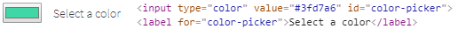 -->

```html
<input type="color" value="#3fd7a6" id="color-picker">
<label for="color-picker">Select a color</label>
```

Here is the list of some available methods in Java:

|Methods | Description | Return Type
--- | --- | ---
**assertThat()** | Assert acton color | ColorAssert 
**color()** | Returns color code in  hexadecimal format ("#rrggbb") | String
**is()** | Assert acton color | ColorAssert
**setColor(String)** | Set color from string hex representation ("#rrggbb") | void

<a href="https://github.com/jdi-testing/jdi-light/blob/master/jdi-light-html-tests/src/test/java/io/github/epam/html/tests/elements/common/ColorPickerTests.java" target="_blank">Java test examples</a>
<br>
[BDD Steps example](https://jdi-docs.github.io/jdi-light/?java#colorpicker-2)<br>

Here is the list of some available methods in C#:

|Methods | Description | Return Type
--- | --- | ---
**AssertThat()** | Assert acton color | ColorAssert 
**Color()** | Returns color code in  hexadecimal format ("#rrggbb") | string
**Is()** | Assert acton color | ColorAssert
**SetColor(String)** | Set color from string hex representation ("#rrggbb") | void

<a href="https://github.com/jdi-testing/jdi-light-csharp/blob/master/JDI.Light/JDI.Light.Tests/Tests/Simple/ColorPickerTests.cs" target="_blank">Test examples in C#</a>
<br>
[BDD Steps example](https://jdi-docs.github.io/jdi-light/?java#colorpicker-2)<br>

### DateTimeSelector

**DateTimeSelector** - Is used for Input Type Date and its derivatives and allows users to set the value of date and/or time.

The list of supported elements:

 - Input Type Date
 - Input Type Week
 - Input Type Month
 - Input Type Time
 - Input Type DateTime-Local

There following classes represent this type of element:

 - __C#__: _JDI.Light.Elements.Common.DateTimeSelector_
 - __Java__: _com.epam.jdi.light.ui.html.common.DateTimeSelector_

Here is the list of some methods available in C#:

|Method | Description | Return Type
--- | --- | ---
**AssertThat()** | Asserts action of DateTimeSelector | DateTimeSelectorAssert
**GetDateTime()** | Returns the set date or time | DateTime
**Is()** | Asserts action of DateTimeSelector | DateTimeSelectorAssert
**Max()** | Gets attribute with name max | string
**Min()** | Gets attribute with name min | string
**SetDateTime(string/DateTime value)** | Sets a date or time | void
**Value()** | Returns value attribute | string

And here are some of the methods available in Java:

|Method | Description | Return Type
--- | --- | ---
**assertThat()** | Assertion | DateTimeAssert
**is()** | Assertion | DateTimeAssert
**max()** | Gets attribute with name max | String
**min()** | Gets attribute with name min | String
**setDateTime(string value)** | Sets a date or time | void
**value()** | Returns the set date or time | String

[BDD Steps example](https://jdi-docs.github.io/jdi-light/#datetimeselector-2)

__In the following sections there are examples of different implementations of such fields.__

__Input Type Date__

```java 
//@FindBy(css = "#birth-date")
@UI("#birth-date")  
public static DateTimeSelector birthDate;

//@FindBy(id = "party-time")
@UI("#party-time") 
public static DateTimeSelector partyTime;

//@FindBy(css = "#booking-time")
@UI("#booking-date")  
public static DateTimeSelector bookingTime;

@Test
public void setDateTimeTest() {
    partyTime.setDateTime("2017-05-10T00:00");
    partyTime.show();
    partyTime.is().text("2017-05-10T00:00");
    bookingTime.setDateTime("05:00");
    bookingTime.show();
    bookingTime.is().text("05:00");
}

@Test
public void getDateTest() {
    birthDate.is().text("1985-06-18");
}

@Test
public void minMaxTest() {
    assertEquals(partyTime.min(), "2018-05-07T00:00");
    assertEquals(partyTime.max(), "2018-06-14T00:00");
}

@Test
public void labelTest() {
    birthDate.label().assertThat().text(is("Birth date"));
    birthDate.label().is().text(equalToIgnoringCase("birth date"));
    birthDate.assertThat().date(containsString("1985"));
}
```
```csharp 
[FindBy(Css = "#birth-date")]
public IDateTimeSelector BirthDate { get; set; }
        
[Test]
public void SetBirthDateTest()
{
    TestSite.Html5Page.BirthDate.Format = "yyyy-MM-dd";
    TestSite.Html5Page.BirthDate.SetDateTime(_dateTime);    
    TestSite.Html5Page.BirthDate.AssertThat().SelectedTime(Is.EqualToIgnoringCase("2019-04-01"));	
}
```
**Input Type Date** – A graphical control element that allows user to set value for date.


```html
<label for="birth-date">Birth date</label>
<input type="date" id="birth-date" value="1985-06-18" min="1970-01-01" max="2030-12-31">
```

<a href="https://github.com/jdi-testing/jdi-light-csharp/blob/master/JDI.Light/JDI.Light.Tests/Tests/Simple/DateTimeTests.cs" target="_blank">Test examples in C#</a>

<a href="https://github.com/jdi-testing/jdi-light/blob/master/jdi-light-html-tests/src/test/java/io/github/epam/html/tests/elements/common/DateTests.java" target="_blank">Test examples in Java</a>

__Input Type Week__

```csharp 
[FindBy(Css = "#autumn-week")]
public IDateTimeSelector AutumnDateTime { get; set; }
        
[Test]
public void AutumnDateTimeTest()
{
    var calendar = new GregorianCalendar();
    var weekNum = calendar.GetWeekOfYear(_dateTime, CalendarWeekRule.FirstFullWeek, DayOfWeek.Monday);
    TestSite.Html5Page.AutumnDateTime.Format = "yyyy-" + $"W{weekNum}";

    TestSite.Html5Page.AutumnDateTime.SetDateTime(_dateTime);
    var setValue = TestSite.Html5Page.AutumnDateTime.GetValue();
    Assert.AreEqual(setValue, "2019-W13");
}
```
**Input Type Week** – A graphical control element that allows user to set values for week and year.


```html
<label for="autumn-week">Autumn</label>
<input type="week" id="autumn-week" value="2018-W40"
 min="2018-W35" max="2018-W48" required="">
```


<a href="https://github.com/jdi-testing/jdi-light-csharp/blob/master/JDI.Light/JDI.Light.Tests/Tests/Simple/DateTimeTests.cs" target="_blank">Test examples in C#</a>

<a href="https://github.com/jdi-testing/jdi-light/blob/master/jdi-light-html-tests/src/test/java/io/github/epam/html/tests/elements/common/WeekTests.java" target="_blank">Test examples in Java</a>


__Input Type Month__

```csharp 
[FindBy(Css = "#month-date")]
public IDateTimeSelector MonthOfHolidays { get; set; }
        
[Test]
public void SetMonthTest()
{
    TestSite.Html5Page.MonthOfHolidays.Format = "yyyy-MM";
    TestSite.Html5Page.MonthOfHolidays.SetDateTime(_dateTime);
    var setValue = TestSite.Html5Page.MonthOfHolidays.GetValue();
    Assert.AreEqual(setValue, "2019-04");
}
```
**Input Type Month** – a graphical control element that allows user to set values for month and year.


```html
<label for="month-date">Month of Holidays</label>
<input type="month" id="month-date" min="2015-03"
 max="2020-12" value="2018-05">
```

<a href="https://github.com/jdi-testing/jdi-light-csharp/blob/master/JDI.Light/JDI.Light.Tests/Tests/Simple/DateTimeTests.cs" target="_blank">Test examples in C#</a>

<a href="https://github.com/jdi-testing/jdi-light/blob/master/jdi-light-html-tests/src/test/java/io/github/epam/html/tests/elements/common/MonthTests.java" target="_blank">Test examples in Java</a>

__Input Type Time__

```csharp 
[FindBy(Css = "#booking-time")]
public IDateTimeSelector BookingTime { get; set; }
        
[Test]
public void SetTimeTest()
{
    TestSite.Html5Page.BookingTime.Format = "H:mm";
    TestSite.Html5Page.BookingTime.SetDateTime(_dateTime);
    var setValue = TestSite.Html5Page.BookingTime.GetValue();
    Assert.AreEqual(setValue, "15:00");
}
```
**Input Type Time** – A graphical control element that allows user to set time.


```html
<label for="booking-time">Booking Time:</label>
<input type="time" id="booking-time" value="11:00" min="9:00" max="18:00">
```

<a href="https://github.com/jdi-testing/jdi-light-csharp/blob/master/JDI.Light/JDI.Light.Tests/Tests/Simple/DateTimeTests.cs" target="_blank">Test examples in C#</a>

<a href="https://github.com/jdi-testing/jdi-light/blob/master/jdi-light-html-tests/src/test/java/io/github/epam/html/tests/elements/common/TimeTests.java" target="_blank">Test examples in Java</a>

__Input Type DateTime-Local__

```csharp 
[FindBy(Css = "#party-time")]
public IDateTimeSelector PartyTime { get; set; }

[Test]
public void SetPartyTimeTest()
{
    TestSite.Html5Page.PartyTime.Format = "yyyy-MM-ddTHH:mm";
    TestSite.Html5Page.PartyTime.SetDateTime(_dateTime);
    var setValue = TestSite.Html5Page.PartyTime.GetDateTime();
    Assert.AreEqual(setValue, _dateTime);
}
```
**Input Type DateTime-Local** – A graphical control element that allows user to set time and date.


```html
<label for="party-time">Date/time:</label>
<input type="datetime-local" id="party-time" value="2018-06-12T19:30" min="2018-05-07T00:00" max="2018-06-14T00:00">
```

<a href="https://github.com/jdi-testing/jdi-light/blob/master/jdi-light-html-tests/src/test/java/io/github/epam/html/tests/elements/common/DateTimeTests.java" target="_blank">Test examples in Java</a>

<a href="https://github.com/jdi-testing/jdi-light-csharp/blob/master/JDI.Light/JDI.Light.Tests/Tests/Simple/DateTimeTests.cs" target="_blank">Test examples in C#</a>


### FileInput

**FileInput** - A graphical control element that allows user to upload documents to web site.

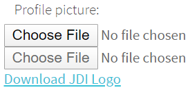

FileInput element is located in JDI Light in:

  - __Java__: _com.epam.jdi.light.ui.html.common.FileInput_
  - __C#__: _JDI.Light.Elements.Composite.FileInput_


Here is an example with HTML code provided:

<!--  -->

```java 
//@FindBy(id = "avatar")
@UI("#avatar") 
public static FileInput avatar; 

//@FindBy(xpath = "//a[@download]")
@UI("[download]") 
public static Link downloadJdiLogo;

@Test
public void uploadTest() {
    avatar.uploadFile(mergePath(PROJECT_PATH, "/src/test/resources/general.xml"));
    avatar.is().text(containsString("general.xml"));
}

@Test
public void labelTest() {
    avatar.label().is().text(containsString("picture:"));
}

@Test
public void downloadTest() {
    FileAssert.cleanupDownloads();
    FileAssert.downloadJdiLogo.click();
    FileAssert.assertThatFile("jdi-logo.jpg")
            .isDownloaded()
            .hasSize(is(32225L));
    FileAssert.assertThatFile("jdi-logo.jpg").hasSize(greaterThan(100L));
}
```
```csharp
[Test]
public void FileInputTest()
{
    FileInput.SelectFile(CreateFile(filename));
}

[Test]
public void DisabledUploadTest()
{
    Sleep(2000);
    try
    {
         TestSite.Html5Page.DisabledFileInput.SelectFile(CreateFile(_fileName));
    }
    catch (Exception e)
    {
         Logger.Exception(e);
    }
    Sleep(2000);
    TestSite.Html5Page.DisabledFileInput.Is.Text(EqualTo(""));
}

[Test]
public void LabelTest()
{
    AreEqual(TestSite.Html5Page.FileInput.LabelText(), "Profile picture:");
    TestSite.Html5Page.FileInput.Label().Is.Text(ContainsString("picture"));
}

[Test]
public void BaseValidationTest()
{
    BaseElementValidation(TestSite.Html5Page.FileInput);
}

```

```html
<label for="avatar">Profile picture:</label>
<input type="file" id="avatar" accept="image/png, image/jpeg">
<input type="file" accept="image/png, image/jpeg" disabled="">
<a href="/jdi-light/images/jdi-logo.jpg" download="">Download JDI Logo</a>
```

Available method in Java JDI Light:

|Method | Description | Return Type
--- | --- | ---
**assertThat()** | property that returns object for work with assertions | TextAssert
**click()** | click on element | void
**getValue()** | Get file name | String
**is()** | property that returns object for work with assertions | TextAssert
**hover()** | hover on element | void
**label()**| Get label | Label
**setValue(String value)** | set file path to input | void
**text()** | returns text of input field | String
**uploadFile(String path)** | set file path to input | void
**uploadFileRobot(String path, long mSecDelay)** | set file path to input | void

Available method in C# JDI Light:

|Method | Description | Return Type
--- | --- | ---
**CleanupDownloads()** | Cleans the directory | void
**HasSize(Matcher<long> size)** | Checks that a file has a particular size according to the matcher | FileAssert
**IsDownloaded()** |Checks whether a file is downloaded  | FileAssert
**SelectFile(string filepath)** |Select file to upload  | void
**Text(Matcher<string> value)** | Checks whether an occurrence of a text is contained within a text file | FileAssert

<a href="https://github.com/jdi-testing/jdi-light/blob/master/jdi-light-html-tests/src/test/java/io/github/epam/example/common/FileInputExampleTests.java">Test examples in Java</a>

<a href="https://github.com/jdi-testing/jdi-light-csharp/blob/master/JDI.Light/JDI.Light.Tests/Tests/Simple/FileInputTests.cs">Test examples in C#</a>

[BDD Steps example](https://jdi-docs.github.io/jdi-light/?java#fileinput-2)

### Icon

**Icon** – Is a simple element type that represents icons and graphic images.


```java 
@UI("#jdi-logo") 
// same as FindBy(css = "#jdi-logo")
public static Icon jdiLogo;

    @Test
    public void isValidationTest() {
        WebPage.refresh();
        jdiLogo.is().src(containsString("jdi-logo.jpg"));
        jdiLogo.is().alt(is("Jdi Logo 2"));
        jdiLogo.assertThat().height(is(100));
        jdiLogo.assertThat().width(is(101));
    }
```
```csharp 
[FindBy(Css = "#jdi-logo")]
public IIcon Logo
;

[Test]
public void GetSourceTest()
{
  Jdi.Assert.AreEquals(LogoImage.GetSource(), Src);
}

[Test]
public void GetTipTest()
{
  Jdi.Assert.AreEquals(LogoImage.GetAlt(), Alt);
}
```

```html
<label for="jdi-logo">JDI Logo:</label>

```

<a href="https://github.com/jdi-testing/jdi-light/blob/master/jdi-light-html-tests/src/test/java/io/github/epam/html/tests/elements/common/ImageTests.java" target="_blank">Test examples in Java</a>
<br>

<br><br><br><br><br><br><br><br><br>

Icon is represented by Image class:
 
[Image](https://jdi-docs.github.io/jdi-light/#image)

 
Icon in JDI is a descendant of Image. It inherits all Image's methods and serves as its wrapper. Here are Java methods for Icon, inherited from Image interface:

|Method | Description | Return Type
--- | --- | ---
**alt()** |get value of alt attribute | String
**assertThat()** |method for building assertions  | ImageAssert
**click()** | click on the image| void
**height()** |get value of height attribute| String
**is()** | method for building assertions | ImageAssert
**src()** | get value of src attribute | String
**width()** | get value of width attribute| String

Here is a list of available methods in C#:

|Method | Description | Return Type
--- | --- | ---
**Alt** |get value of alt attribute | string
**AssertThat()** |method for building assertions  | ImageAssert
**Click()** | click on the image| void
**Height** |get value of height attribute| string
**Is()** | method for building assertions | ImageAssert
**Src** | get value of src attribute | string
**Width** | get value of width attribute| string

<a href="https://github.com/jdi-testing/jdi-light/blob/master/jdi-light-html-tests/src/test/java/io/github/epam/html/tests/elements/common/ImageTests.java" target="_blank">Test examples in Java</a><br>

<a href="https://github.com/jdi-testing/jdi-light-csharp/blob/master/JDI.Light/JDI.Light.Tests/Tests/Simple/ImagesTests.cs" target="_blank">Test examples in C#</a><br>

[BDD Steps example](https://jdi-docs.github.io/jdi-light/?java#icon-2)

### Image

**Image** – Is a simple element type that represents graphic images.


```java 
@UI("#jdi-logo") 
// same as FindBy(css = "#jdi-logo")
public static Image jdiLogo;

@Test
public void isValidationTest() {
    jdiLogo.is().src(containsString("jdi-logo.jpg"));
    jdiLogo.is().alt(is("Jdi Logo 2"));
    jdiLogo.assertThat().height(is(100));
    jdiLogo.assertThat().width(is(101));
}
```
```csharp 
[FindBy(Css = "#jdi-logo")]
public IImage LogoImage;

   [Test]
   public void GetSourceTest()
   {
     Jdi.Assert.AreEquals(LogoImage.GetSource(), Src);
   }

   [Test]
   public void GetTipTest()
   {
     Jdi.Assert.AreEquals(LogoImage.GetAlt(), Alt);
   }
```
```html
<label for="jdi-logo">JDI Logo:</label>

```

<br><br><br><br><br><br><br><br><br>

Images are represented by the following classes in Java and C#:
 
  - __Java__: _com.epam.jdi.light.ui.html.common.Image_
  - __C#__: _JDI.Light.Elements.Common.Image_
  
Here is a list of available methods in Java:

|Method | Description | Return Type
--- | --- | ---
**alt()** |get value of alt attribute | String
**assertThat()** |method for building assertions  | ImageAssert
**click()** | click on the image| void
**height()** |get value of height attribute| String
**is()** | method for building assertions | ImageAssert
**src()** | get value of src attribute | String
**width()** | get value of width attribute| String

<a href="https://github.com/jdi-testing/jdi-light/blob/master/jdi-light-html-tests/src/test/java/io/github/epam/html/tests/elements/common/ImageTests.java" target="_blank">Test examples in Java</a>

Here is a list of available methods in C#:

|Method | Description | Return Type
--- | --- | ---
**Alt** |get value of alt attribute | string
**AssertThat()** |method for building assertions  | ImageAssert
**Click()** | click on the image| void
**Height** |get value of height attribute| string
**Is()** | method for building assertions | ImageAssert
**Src** | get value of src attribute | string
**Width** | get value of width attribute| string

<a href="https://github.com/jdi-testing/jdi-light-csharp/blob/master/JDI.Light/JDI.Light.Tests/Tests/Simple/ImagesTests.cs" target="_blank">Test examples in C#</a>

### Link

```java 
//@FindBy(css = "[ui=github-link]") 
@UI("[ui=github-link]") 
public static Link githubLink;

@Test
public void linkTextTest() {
    githubLink.is().text(EXPECTED_TEXT);
    githubLink.is().text(equalTo(EXPECTED_TEXT));
    githubLink.is().text(containsString(PART_OF_EXPECTED_TEXT));
}

@Test
public void linkRefTest() {
    githubLink.is().ref(EXPECTED_URL);
    githubLink.is().ref(equalTo(EXPECTED_URL));
    githubLink.is().ref(containsString(PART_OF_EXPECTED_URL));
    githubLink.is().ref(matchesPattern(EXPECTED_URL_REGEX));
}
```
```csharp 
[FindBy(Css = "[ui = github-link]")]
public ILink GithubLink;

[Test]
public void GetTextTest()
{
    Assert.AreEqual(GithubLink.GetText(), Text);
}

[Test]
public void GetUrlTest()
{
     Assert.AreEqual(GithubLink.Url(), "https://epam.github.io/JDI/html5.html");
}
```

**Link** – A graphical control element that allows user to link from one page to other web pages, files, locations within the same page, email addresses, or any other URL.

Link are represented by the following class:
 
  - __Java__: _com.epam.jdi.light.ui.html.common.Link_
  - __C#__: _JDI.Light.Elements.Common.Link_
  


```html 
<a ui="github-link" href="https://github.com/jdi-testing" alt="Github JDI Link">Github JDI</a>
```

Here is the list of available methods in Java:

|Method | Description | Return Type
--- | --- | ---
**alt()** |Returns the alternate text | String
**assertThat()** | Returns object for work with assertions | LinkAssert
**click()** |Follow the link | void
**getText()** |Returns the link text  | String
**is()** | Returns object for work with assertions | LinkAssert
**ref()** |Returns the reference  | String
**url()** |Returns the URL  | URL

<a href="https://github.com/jdi-testing/jdi-light/tree/1509---jdi-light-test-examples/jdi-light-html-tests/src/test/java/io/github/epam/example/common/LinkExampleTests.java" target="_blank">Test examples in Java</a><br>
[BDD Steps example](https://jdi-docs.github.io/jdi-light/#link-2)

Here is the list of available methods in C#:

|Method | Description | Return Type
--- | --- | ---
**Alt()** |Returns the alternate text | string
**AssertThat()** | Returns object for work with assertions | LinkAssert
**Click()** |Follow the link | void
**GetText()** |Returns the link text  | string
**Is()** | Returns object for work with assertions | LinkAssert
**Ref()** |Returns the reference  | string
**Url()** |Returns the URL  | string

<a href="https://github.com/jdi-testing/jdi-light-csharp/blob/master/JDI.Light/JDI.Light.Tests/Tests/Simple/LinkTests.cs" target="_blank">Test examples in C#</a>
<br>
[BDD Steps example](https://jdi-docs.github.io/jdi-light/#link-2)

### Menu

**Menu** - A list of links, which leads to different pages or sections of website.

Menu element is located in JDI Light in:

  - __Java__: _com.epam.jdi.light.ui.html. element
  .Menu_
  - __C#__: _JDI.Light.Elements.Composite.Menu_

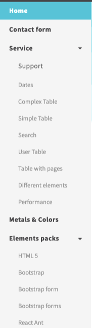 

Here is an example with provided HTML code:

<!-- 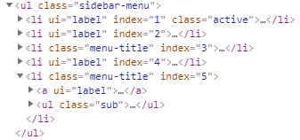 -->

```java 
@UI(".sidebar-menu span<[*'%s']<<") 
public static Menu leftMenu;
@Url("/metals-colors.html") @Title("Metal and Colors")
public static MetalAndColorsPage metalAndColorsPage;

@Test
public void selectEnumTest() {
    leftMenu.select(MetalsColors);
    metalAndColorsPage.checkOpened();
}
```
```csharp
[FindBy(Css = "ul.sidebar-menu")]
public Menu SidebarMenu;

[Test]
public void SelectEnumTest()
{
     TestSite.SidebarMenu.Select(Navigation.MetalsColors);
     TestSite.MetalsColorsPage.CheckOpened();
}

[Test]
public void IsValidationTest()
{
     TestSite.SidebarMenu.Select("Elements packs", "HTML 5");
     TestSite.SidebarMenu.Is.Selected("HTML 5")
}

[Test]
public void AssertValidationTest()
{
     TestSite.SidebarMenu.Select("Elements packs", "HTML 5");
     TestSite.SidebarMenu.AssertThat.Selected("HTML 5");
}

```

```html 
<ul class="sidebar-menu">
    <li ui="label" index="1">
        <a href="index.html"> <span>Home</span>  </a>
    </li>           
    <li ui="label" index="2">
        <a href="contacts.html"> <span>Contact form</span> </a> 
     </li>            
    <li class="menu-title" index="3">                
        <a ui="label"> 
            <span>Service</span>
            <div class="fa fa-caret-down arrow"></div>                
        </a>                
        <ul class="sub hide-menu">                    
            <li ui="label" index="1">
                <a href="support.html">
                    <p><span>Support</span></p>
                </a>
            </li>                    
            <li ui="label" index="2"><a href="dates.html"><span>Dates</span></a>
            </li>                    
            <li ui="label" index="3"><a href="complex-table.html"> <span>Complex Table </span></a>
            </li>                    
            <li ui="label" index="4"><a href="simple-table.html"> <span>Simple Table</span></a>
            </li>                    
            <li ui="label" index="5"><a href="search.html"> <span>Search</span> </a>
            </li>                    
            <li ui="label" index="6"><a href="user-table.html"> <span>User Table</span></a>
            </li>                    
            <li ui="label" index="7"><a href="table-pages.html"> <span>Table with pages</span></a>
            </li>                    
            <li ui="label" index="8"><a href="different-elements.html"> <span>Different elements</span> </a>
            </li>                    
            <li ui="label" index="9"><a href="performance.html"><span>Performance</span></a>
            </li>                
        </ul>            
    </li>            
    <li ui="label" index="4"><a href="metals-colors.html">  <span>Metals &amp; Colors</span></a>       
    </li>            
    <li class="menu-title active" index="5">
        <a ui="label">
          <span>Elements packs</span>
          <div class="fa fa-caret-down arrow"></div>                
        </a>                
        <ul class="sub">                    
            <li ui="label" index="1" class="active"><a href="html5.html"><span>HTML 5</span></a></li>                    
            <li ui="label" index="2"><a href="bootstrap.html"><span>Bootstrap</span>  </a></li>					          
            <li ui="label" index="3"><a href="bootstrap_form.html">	<span>Bootstrap form</span></a></li>					          
            <li ui="label" index="4"><a href="react-ant.html"> <span>React Ant</span></a></li>               
         </ul>            
    </li>        
</ul>
```


Available method in Java JDI Light:

|Method | Description | Return Type
--- | --- | ---
**String selected()** | Returns selected menu item | String
**List<String> values()** | Returns selected menu item and subitems | List<String>
**void hoverAndClick(String...)** | Hovers and clicks menu item and subitems | void
**void hoverAndClick(String)** | Hovers and clicks menu item | void
**void select(int...)** | Select menu element by index | void
**void select(int)** | Select menu element and subelements by index | void    
**void select(String...)** | Select menu element and subelement | void
**void select(String)** | Select menu element | void
**void select(TEnum...)** | Select menu element and subelement | void
**void select(TEnum)** | Select menu element | void

Available method in C# JDI Light:

|Method | Description | Return Type
--- | --- | ---
**AssertThat** | Get select assert | MenuSelectAssert
**Is** | Get select assert | MenuSelectAssert
**List<string> Values()** | Gets values of all options | List<string>
**string Selected()** | Returns selected menu item | string
**void HoverAndClick(string[])** | Hovers and clicks menu item and subitems | void
**void HoverAndClick(string)** | Hovers and clicks menu item | void
**void Select(string[])** | Select menu element and subelements by string values | void
**void Select(string)** | Select menu element | void
**void Select(int[])** | Select menu element and subelements by index | void
**void Select(int)** | Select menu element and subelements by index | void 
**void Select(Enum[])** | Select menu element and subelements by getting values of enum | void
**void Select(Enum)** | Select menu element | void

<a href="https://github.com/jdi-testing/jdi-light/blob/master/jdi-light-html-tests/src/test/java/io/github/epam/html/tests/elements/complex/MenuTests.java" target="_blank">Test examples in Java</a>

<a href="https://github.com/jdi-testing/jdi-light-csharp/blob/master/JDI.Light/JDI.Light.Tests/Tests/Composite/MenuTests.cs" target="_blank">Test examples in C#</a>

[BDD Steps example](https://jdi-docs.github.io/jdi-light/#menu-2)

### NumberSelector

**NumberSelector** – A graphical control element, that allows the user to let the user enter a number.

NumberSelector are represented by the following class:
 
  - __Java__: _com.epam.jdi.light.ui.html.common.NumberSelector_
  - __C#__: _JDI.Light.Elements.Common.NumberSelector_
  
  
```java 
    @UI("#height") 
    // equal to @FindBy(css = "#height") 
    public static NumberSelector height;

    @Test
    public void minMaxTest() {
        height.assertThat().min(is(0.3));
        height.assertThat().max(is(2.5));
    }

    @Test
    public void stepTest() {
        height.assertThat().step(is(0.2));
    }

    @Test
    public void placeholderTest() {
        height.is().placeholder("20 cm increments. Range [0.3,2.5]");
    }

    @Test
    public void setNumberTest() {
        height.setNumber("1.4");
        height.is().number(greaterThanOrEqualTo(0.3));
        height.is().number(lessThanOrEqualTo(2.5));
        height.assertThat().number(is(1.4));
    }

    @Test
    public void labelTest() {
        height.label().is().text("Height (metres):");
        height.label().is().text(containsString("Height"));
        height.label().is().text(equalToIgnoringCase("height (metres):"));
    }

    @Test
    public void assertValidationTest() {
        height.assertThat().number(greaterThan(0.0));
        height.assertThat().number(lessThan(3.0));
        height.assertThat().number(is(2.1));
    }
```
```csharp 
[FindBy(Css = "#height")]
public INumberSelector numberSelector;

[Test]
public void GetNumberTest()
{
    Jdi.Assert.AreEquals(number, numberSelector.Value());
}
```


```html
<label for="height">Height (metres):</label>
<input type="number" id="height" min="0.3" max="2.5" step="0.2"
 placeholder="20 cm increments. Range [0.3,2.5]">
```

Here is the list of available methods in Java:

|Method | Description | Return Type
--- | --- | ---
**assertThat()** | Returns object for work with assertions | NumberAssert
**is()** | Returns object for work with assertions | NumberAssert
**max()** |Returns the max value  | String
**min()** |Returns the min value   | String
**value()** |Returns the value  | String
**placeholder()** |Returns the placeholder text  | String
**setNumber(String)** |Sets the value | void
**step()** |Returns the step value | String

Here is the list of available methods in C#:

|Method | Description | Return Type
--- | --- | ---
**AssertThat()** | Returns object for work with assertions | NumberAssert
**Is()** | Returns object for work with assertions | NumberAssert
**Max** |Returns the max value  | double
**Min** |Returns the min value   | double
**Placeholder** |Returns the placeholder text  | String
**SetNumber(double)** |Sets the value | void
**Step** |Returns the step value | double
**Value** |Returns the value  | double

<a href="https://github.com/jdi-testing/jdi-light/blob/master/jdi-light-html-tests/src/test/java/io/github/epam/html/tests/elements/common/NumberSelectorTests.java" target="_blank">Test examples in Java</a>

<a href="https://github.com/jdi-testing/jdi-light-csharp/blob/master/JDI.Light/JDI.Light.Tests/Tests/Common/NumberSelectorTests.cs" target="_blank">Test examples in C#</a>

[BDD Steps example](https://jdi-docs.github.io/jdi-light/?java#numberselector-2)<br>

### ProgressBar

**Progress Bar** - Element for displaying an indicator showing the completion progress of a task.


ProgressBar is located in the following classes:
 
  - __Java__: _com.epam.jdi.light.ui.html.common.ProgressBar_
  - __C#__: _JDI.Light.Elements.Common.ProgressBar_

```java 
@UI("#progress") // @FindBy(id = "progress")
public static ProgressBar progress;

@Test
public void valueTest() {
    progress.is().volume(70);
    progress.is().volume(greaterThanOrEqualTo(10));
    progress.is().volume(lessThanOrEqualTo(100));
}

@Test
public void maxTest() {
    progress.is().maxVolume(100);
}
```
```csharp

[FindBy(Css = "#progress")]
public ProgressBar Progress;

[Test]
public void GetValueTest() 
{
     Assert.AreEqual(Progress.Value(), "70");
}

[Test]
public void MaxTest() 
{
     Assert.AreEqual(Progress.Max(), "100");
}

```

Here is an example with provided HTML code:

<!--  -->

```html
<label for="progress">File progress</label>
<progress id="progress" max="100" value="70"></progress>
```

Available method in Java JDI Light:

|Method | Description | Return Type
--- | --- | ---
**assertThat()** |Various assert actions for Progress bar | ProgressAssert 
**is()** |Various assert actions for Progress bar  | ProgressAssert
**max()** |Get progressbar maximum possible value  | String
**value()** |Get current progress value  | String

<a href="https://github.com/jdi-testing/jdi-light/blob/master/jdi-light-html-tests/src/test/java/io/github/epam/html/tests/elements/common/ProgressTests.java" target="_blank">Test examples in Java</a><br>
[BDD Steps example](https://jdi-docs.github.io/jdi-light/?java#progress-bar) <br>


Available method in C# JDI Light:

|Method | Description | Return Type
--- | --- | ---
**AssertThat()** |Various assert actions for Progress bar | ProgressAssert 
**Is()** |Various assert actions for Progress bar  | ProgressAssert
**Max()** |Get progressbar maximum possible value  | string
**Value()** |Get current progress value  | string

<a href="https://github.com/jdi-testing/jdi-light-csharp/blob/master/JDI.Light/JDI.Light.Tests/Tests/Simple/ProgressTests.cs" target="_blank">Test examples in C#</a><br>
[BDD Steps example](https://github.com/jdi-testing/jdi-light/blob/master/jdi-light-bdd-tests/src/test/resources/features/ProgressBar.feature)<br>

### Range

```java 
@UI("#volume")  //@FindBy(id = "volume") 
public static Range volume;

@Test
public void setVolumeTest() {
    volume.setVolume(10);
    volume.assertThat().volume(10);
}

@Test
public void checkStepTest() {
    volume.assertThat().step(5);
    volume.assertThat().step(is(5));
}

@Test
public void checkMaxTest() {
    volume.assertThat().maxVolume(100);
    volume.assertThat().maxVolume(is(100));
}
```

```csharp
  [FindBy(Css = "#volume")]
  public IRange Volume { get; set; } 
  [Test]
  public void GetValueTest()
  {
      Assert.AreEqual(TestSite.Html5Page.DisabledRange.Value(), 50);
  }
  [Test]
  public void MinTest()
  {
      Assert.AreEqual(TestSite.Html5Page.Volume.Min(), 10);
  }
  [Test]
  public void MaxTest()
  {
      Assert.AreEqual(TestSite.Html5Page.Volume.Max(), 100);
  }
  [Test]
  public void StepTest()
  {
      Assert.AreEqual(TestSite.Html5Page.Volume.Step(), 5);
  }
  [Test]
  public void SetRangeTest()
  {
      TestSite.Html5Page.Volume.SetValue(10);
      Assert.AreEqual(TestSite.Html5Page.Volume.Value(), 10);
  }
  [Test]
  public void RangeTest()
  {
      TestSite.Html5Page.Volume.SetValue("30");
      Assert.AreEqual(TestSite.Html5Page.Volume.GetValue(), "30");
  }
```

**Range** - A graphical control element that allows the user to set the value from the range.</br>

</br>

```html
<label for="volume">Volume</label>
<input type="text" disabled="" id="volume-value"> <br>
    <span>10</span>
    <input type="range" id="volume" min="10" max="100" value="90" step="5"
           class="range" list="volume-list"
           oninput="showVal(this.value)" onchange="showVal(this.value)">
    <span>100</span>
    
    <datalist id="volume-list">
        <option value="0">
        </option>
        <option value="20">
        </option>
        <option value="40">
        </option>
        <option value="60">
        </option>
        <option value="80">
        </option>
        <option value="100">
        </option>
    </datalist> <br> <br>

<input type="range" disabled="">
```

Range is represented by the following class:</br>

  - __Java__: _com.epam.jdi.light.ui.html.common.Range_
  - __C#__: _JDI.Light.Elements.Common.Range_
  
Here is a list of available methods in C#:

|Method | Description | Return Type
--- | --- | ---
**AssertThat()** | Returns object for work with assertions | RangeAssert
**GetValue()** | Returns the value | String
**Is()** | Returns object for work with assertions | RangeAssert
**Max()** | Returns the max value| Double
**Min()** | Returns the min value | Double
**SetValue(string value)** | Sets the value | void
**SetValue(double value)** | Sets the value | void
**Step()** | Returns the step value | Double
**Value()** | Returns the value | Double

<a href="https://github.com/jdi-testing/jdi-light-csharp/blob/master/JDI.Light/JDI.Light.Tests/Tests/Simple/RangeTests.cs" target="_blank">Test examples in C#</a></br>
[BDD Steps example](https://jdi-docs.github.io/jdi-light/?java#range-2) <br>

And here are methods available in Java:

|Method | Description | Return Type
--- | --- | ---
**assertThat()** | Returns object for work with assertions | RangeAssert
**getValue()** | Gets the value | String
**is()** | Returns object for work with assertions | RangeAssert
**max()** | Returns the max value | double
**min()** | Returns the min value | double
**setValue(double volume)** | Sets the value | void
**setValue(String volume)** | Sets the value | void
**step()** | Returns the step value | double
**value()** | Returns the value | double

<a href="https://github.com/jdi-testing/jdi-light/blob/master/jdi-light-html-tests/src/test/java/io/github/epam/html/tests/elements/common/RangeTests.java" target="_blank">Test examples in Java</a></br>
[BDD Steps example](https://jdi-docs.github.io/jdi-light/?java#range-2) <br>

### Text
**Text** - Is a combination of letters and textual symbols. When performing testing, the text is used in most operations: when typing text into the login field, when finding a button with some certain text in it, or when checking if actual text matches expected one.

```java 
@UI("[ui=jdi-text]") //@FindBy(css = "[ui=jdi-text]") 
public static Text jdiText;

@Test
public void textPositiveTest() {
    jdiText.is().text(equalTo(TEXT));
    jdiText.is().text(TEXT);
}

@Test
public void textContainsTest() {        
    jdiText.is().text(containsString(PART_OF_TEXT));
}

@Test
public void textDoesNotContainWordTest() {
    jdiText.is().text(not(NOT_EXPECTED_TEXT));
}
  
```

```csharp
  [FindBy(Css = ".main-txt")]
  public TextElement Text;
        
  [Test]
  public void GetTextTest()
  {
      Jdi.Assert.AreEquals(TestSite.HomePage.Text.Value, _expectedText);
  }

  [Test]
  public void GetValueTest()
  {
      Jdi.Assert.AreEquals(TestSite.HomePage.Text.Value, _expectedText);
  }

  [Test]
  public void SetAttributeTest()
  {
      var attributeName = "testAttr";
      var value = "testValue";
      TestSite.HomePage.Text.SetAttribute(attributeName, value);
      Jdi.Assert.AreEquals(TestSite.HomePage.Text.GetAttribute(attributeName), value);
  }

  [Test]
  public void WaitSuspendButtonTextTest()
  {
       TestSite.Html5Page.Open();
       TestSite.Html5Page.GhostButton.Is.Displayed();
       TestSite.Html5Page.GhostButton.Is.Text(EqualTo("GHOST BUTTON"));
       Thread.Sleep(3000);
  	   TestSite.Html5Page.SuspendButton.Is.Displayed();
       TestSite.Html5Page.SuspendButton.Is.Text(EqualTo("SUSPEND BUTTON"));
  }
  
   [Test]
   public void IsValidationTest()
   {
        TestSite.HomePage.Text.Is.Enabled();
        TestSite.HomePage.Text.Is.Text(EqualTo(_expectedText));
        TestSite.HomePage.Text.Is.Text(ContainsString(_contains));
   }

   [Test]
   public void AssertValidationTest()
   {
        TestSite.HomePage.Text.AssertThat.Text(EqualTo(_expectedText));
   }

   [Test]
   public void BaseValidationTest()
   {
       TestSite.Html5Page.Open();
       BaseElementValidation(TestSite.Html5Page.JdiText);
   }
  
```


```html 
<p ui="jdi-text">Powerful Framework for UI Tests Automation. Suitable for any UI project: 
Web(Html5, Angular, React...), Mobile(Android IOs), Desktop(Win app) etc.</p>
```

Text is represented by the following class:

  - __C#__: JDI.Light.Elements.Common.TextElement
  - __Java__: com.epam.jdi.light.ui.html.common.Text  

Here is a list of available methods in C#:

|Method | Description | Return Type
--- | --- | ---
**AssertThat** | Gets text assert | TextAssert
**Is** | Gets text assert | TextAssert
**GetText()** | returns text| String
**GetValue()** | returns text| String
**WaitFor** | Gets text assert | TextAssert

<a href="https://github.com/jdi-testing/jdi-light-csharp/blob/master/JDI.Light/JDI.Light.Tests/Tests/Simple/TextTests.cs" target="_blank">Test examples in C#</a>

And here are methods available in Java:
    
|Method | Description | Return Type
--- | --- | ---
**assertThat()** |Various assert actions for Text| TextAssert 
**getText()** |Get current value | String
**is()** |Various assert actions for Text| TextAssert

<a href="https://github.com/jdi-testing/jdi-light/tree/1509---jdi-light-test-examples/jdi-light-html-tests/src/test/java/io/github/epam/example/common/TextExampleTests.java" target="_blank">Test examples in Java</a>

[BDD Steps example](https://jdi-docs.github.io/jdi-light/?java#text-2)

### TextField
```java 
@UI("#name") //@FindBy(css = "#name")
public static TextField name;

@Test
public void setTextTest() {
    name.setText(text);
    name.is().text(text);
    name.is().text(is(text));
    name.is().text(containsString("Field"));
}

@Test
public void sendKeysTest() {
    name.setText(text);
    name.sendKeys("Test");
    name.is().text(text + "Test");
}

@Test
public void clearTest() {
    name.clear();
    name.is().text("");
}
```
```csharp 
[FindBy(Id = "name")]
public ITextField NameField;
        
        [Test]
        public void InputTest()
        {
            TestSite.ContactFormPage.NameField.Input(ToAddText);
            Jdi.Assert.AreEquals(TestSite.ContactFormPage.NameField.Value, ToAddText);
        }
        
        [Test]
        public void SendKeyTest()
        {
            TestSite.ContactFormPage.NameField.SendKeys(ToAddText);
            Jdi.Assert.AreEquals(TestSite.ContactFormPage.NameField.Value, _defaultText + ToAddText);
        }

        [Test]
        public void ClearTest()
        {
            TestSite.ContactFormPage.NameField.Clear();
            Jdi.Assert.AreEquals(TestSite.ContactFormPage.NameField.Value, "");
        }
```
**TextField** – Is a simple element type that allows users to fill in text fields.


```html
<label for="name">Your name:</label>
<input type="text" id="name" placeholder="Input name">
<label for="disabled-name">Surname:</label>
<input type="text" id="disabled-name" placeholder="Iovlev" disabled="">
```

Text fields are represented by the following classes in Java and C#:
 
  - __C#__: _JDI.Light.Elements.Common.TextField_
  - __Java__: _com.epam.jdi.light.ui.html.common.TextField_
  
Here is a list of available methods and properties in C#:

|Method / Property | Description | Return Type
--- | --- | ---
**AssertThat** | property that returns object for work with assertions| TextAssert
**Clear()** | clears the text field | void
**Focus()** | places cursor within the text field | void
**GetText()** | returns text from the text field  | String
**GetValue()** | returns text from the text field| String
**Input(string text)** | sets new text  | void
**Is** | property that returns object for work with assertions| TextAssert
**Placeholder** | returns value of the placeholder attribute | String
**SendKeys(string value)** | adds text to the field | void
**SetText(String value)** | sets new text | void

<a href="https://github.com/jdi-testing/jdi-light-csharp/blob/master/JDI.Light/JDI.Light.Tests/Tests/Common/TextFieldsTests.cs" target="_blank">Test examples in C#</a><br>
[BDD Steps example](https://jdi-docs.github.io/jdi-light/?java#textfield-2)<br>

And here are methods available in Java:

|Method | Description | Return Type
--- | --- | ---
**clear()** | clears the text field | void
**focus()** | places cursor within the text field | void
**getText()** | returns text from the text field  | String
**getValue()** | returns text from the text field| String
**input(String value)** | sets new text | void
**placeholder()** | returns value of the placeholder attribute | String
**sendKeys(CharSequence... value)** | adds text to the field | void
**setText(String value)** | sets new text | void

<a href="https://github.com/jdi-testing/jdi-light/blob/master/jdi-light-html-tests/src/test/java/io/github/epam/html/tests/elements/common/TextFieldTests.java" target="_blank">Test examples in Java</a><br>
[BDD Steps example](https://jdi-docs.github.io/jdi-light/?java#textfield-2)<br>

### TextArea

**TextArea** – Is a simple element type that allows users to fill in text areas (they may contain a few lines). 


```java 
@UI("#text-area") 
// same as FindBy(css = "#text-area")
public static TextArea textArea;

String text = "TextArea";

@Test
public void addNewLineTest(){
    textArea.setLines("line1", "line2");
    textArea.addNewLine("line3");
    textArea.assertThat().text(is("line1\nline2\nline3"));
    textArea.clear();
    textArea.assertThat().text(is(""));
}

@Test
public void isValidationTest() {
    textArea.is().enabled();
    textArea.setText(text);
    textArea.is().text(containsString("Area"));
    disabledTextArea.is().disabled();
}

@Test
public void rowsTest() {
    textArea.is().rowsCount(is(3));
    textArea.is().colsCount(is(33));
    textArea.is().minlength(is(10));
    textArea.is().maxlength(is(200));
}
```
```csharp 
[FindBy(Css = "#text-area")]
public ITextArea TextArea;

    [Test]
    public void GetTextTest()
    {
        TextArea.SetText(Text);
        Assert.AreEqual(TextArea.GetText(), "Text");
    }
    
   [Test]
   public void AddNewLineTest()
   {
      TextArea.SetText("line1", "line2");
      TextArea.AddNewLine("line3");
      Assert.CollectionEquals(TextArea.GetLines(), new[] { "line1", "line2", "line3" });
   }
```
```html
<label for="text-area">Text example:</label>
<textarea id="text-area" rows="3" cols="33" maxlength="200" minlength="10"
          required="" wrap="hard" placeholder="Input huge text">Textarea with sizing
          and wrap attribute (try values of hard, soft, and off to see how it affects wrapping).
          The maximum number of characters is constrained to 200 by the maxlength attribute.
</textarea> <br>
<textarea disabled="" placeholder="Disabled area"></textarea>
```

<br><br><br><br><br><br><br><br><br><br><br><br><br><br><br><br><br><br><br><br><br>

Text areas are represented by the following classes:

  - __Java__: <a href='https://github.com/jdi-testing/jdi-light/blob/bootstrap/jdi-light-html/src/main/java/com/epam/jdi/light/ui/html/elements/common/TextArea.java'>TextArea</a>
  - __C#__: _JDI.Light.Elements.Common.TextArea_
  
In JAVA TextArea is a descendant of UIBaseElement with HasLabel, SetValue, HasPlaceholder, IsInput interfaces parameterized with TextAreaAssert and inherits its methods. But TextArea also has methods of its own.

In C# TextArea is a descendant of TextField and inherits its methods. But TextArea also has methods of its own.
  
Here is a list of available methods in Java:
  
|Method | Description | Return Type
--- | --- | ---
**addNewLine(String line)** | add line to the already existing  | void
**cols()** | returns value of cols attribute | int
**getLines()** | returns lines (text) from the text area | List<String>
**getValue()**    | calls getText() method                 | String
**getText()**     | returns value of attribute "value"     | String
**is()**          | returns object for work with assertions | TextAreaAssert
**labelText()** | returns value of TextArea label | String
**maxlength()** | returns value of maxlength attribute | int
**minlength()** | returns value of minlength attribute | int
**placeholder()** | returns value of placeholder in TextArea | String
**rows()** | returns value of rows attribute | int
**setLines(String... lines)** | sets lines (text)  | void
**setValue()**    | setting value                          | void


  <a href="https://github.com/jdi-testing/jdi-light/blob/master/jdi-light-html-tests/src/test/java/io/github/epam/html/tests/elements/common/TextAreaTests.java" target="_blank">Test examples in Java</a><br>

Here is a list of available methods in C#:
  
|Method | Description | Return Type
--- | --- | ---
**AddNewLine(string line)** | add line to the already existing ones | void
**AssertThat()** | returns object for work with assertions  | TextAreaAssert
**Cols()** | returns value of cols attribute | int
**GetLines()** | returns lines (text) from the text area | string[]
**Is()** | returns object for work with assertions  | TextAreaAssert
**Maxlength()** | returns value of maxlength attribute | int
**Minlength()** | returns value of minlength attribute | int
**Rows()** | returns value of rows attribute | int
**SetLines(string[] lines)** | sets lines (text)  | void
 
  <a href="https://github.com/jdi-testing/jdi-light-csharp/blob/master/JDI.Light/JDI.Light.Tests/Tests/Simple/TextAreaTests.cs" target="_blank">Test examples in C#</a><br>

### Title
**Title** – A graphical control element representing document title, which is displayed in the title bar of the browser or tab page.

Title is represented by the following class:
 
  - __Java__: _com.epam.jdi.light.ui.html.common.Title_
  - __C#__: _JDI.Light.Elements.Common.Title


```java 
@UI("[ui=jdi-title]") //@FindBy(css = "[ui=jdi-title]") 
public static Title jdiTitle;

@Test
public void textTest() {
    jdiTitle.is().text(titleText);
}

@Test
public void clickTest() {
    jdiTitle.click();
    assertEquals(getAlertText(), "JDI Title");
    acceptAlert();
}    
```
```csharp 
[FindBy(Css = "[ui=jdi-title]")]
public Title JdiTitle;

[Test]
public void GetTextTest() 
{
        Assert.AreEqual(JdiTitle.GetText(), "Title text");
}

[Test]
public void ClickTest() 
{
        JdiTitle.ClickTitle();
}

[Test]
public void IsValidationTest()
{
       TestSite.Html5Page.JdiTitle.Is.Enabled();
       TestSite.Html5Page.JdiTitle.Is.Text(EqualTo(_text));
       TestSite.Html5Page.JdiTitle.Is.Text(Is(_text));
       TestSite.Html5Page.JdiTitle.Is.Text(EqualToIgnoringCaseMatcher.EqualTo("jdi TESTING platform"));
}

[Test]
public void AssertValidationTest()
{
       TestSite.Html5Page.JdiTitle.AssertThat.Text(EqualTo(_text));
}

[Test]
public void BaseValidationTest()
{
       BaseElementValidation(TestSite.Html5Page.JdiTitle);
}   
    
```

```html 
<h1 ui="jdi-title" onclick="alert('JDI Title');">JDI Testing platform</h1>
```

Here is the list of methods available in C# JDI Light:

|Method | Description | Return Type
--- | --- | ---
**AssertThat** |Gets Title's assert | TitleAssert
**Is** |Gets Title's assert | TitleAssert

Here is the list of available methods in Java JDI Light:

|Method | Description | Return Type
--- | --- | ---
**AssertThat()** |Gets Title's assert | TitleAssert
**click()** |Click title | void
**getText()** |Returns title text  | String
**Is()** |Gets Title's assert | TitleAssert

<a href="https://github.com/jdi-testing/jdi-light/blob/master/jdi-light-html-tests/src/test/java/io/github/epam/html/tests/elements/common/LabelTests.java" target="_blank">Test examples in Java</a>

<a href="https://github.com/jdi-testing/jdi-light-csharp/blob/master/JDI.Light/JDI.Light.Tests/Tests/Simple/TitleTests.cs" target="_blank">Test examples in C#</a>


## HTML5 Complex elements
### RadioButtons

**RadioButtons** – Interface element that allows user to select a single option from a predefined group.

Radio buttons are represented by the following class:
 
  - __Java__: _com.epam.jdi.light.ui.html.complex.elements.RadioButtons_
  - __C#__: _JDI.Light.Elements.Complex.RadioButtons_

Consider an example where each radio button is a particular color, described with given HTML code:


```java 
    //@FindBy(name = "colors")
    @UI("[name=colors]") 
    public static RadioButtons colors;

    @Test
    public void selectTest() {
        colors.select("Green");
        colors.is().selected(Green);
        colors.is().text("Green");
        colorsNoLocator.select("Blue");
        colorsNoLocator.is().selected("Blue");
        colors.is().value("Blue");
    }

    @Test
    public void valuesTest() {
        colors.is().values(hasItems("Red", "Green", "Blue", "Yellow"));
    }

    @Test
    public void isValidationTest() {
        colors.is().values(hasItem("Yellow"));
        colors.is().disabled(hasItem("Yellow"));
        colors.is().enabled(not(hasItem("Yellow")));
        colors.is().enabled(hasItems("Green", "Blue"));
    }

    @Test
    public void assertValidationTest() {
        colors.assertThat().values(contains("Red", "Green", "Blue", "Yellow"));
    }
```
```csharp 
[FindBy(Css = "#colors")] 
public IRadioButtons MyRadioButtons;

[Test]
public void SelectRadioButton() 
{
    MyRadioButtons.Select("some value");
}
[Test]
public void SelectRadioButtonByIndex() 
{
    MyRadioButtons.Select(1);
}
[Test]
public void GetSelected() 
{
    var selected = MyRadioButtons.GetSelected();
    Assert.AreEqual(selected, "some value");
	MyRadioButtons.Is().Selected(Is.EqualTo("some value")); 
	MyRadioButtons.AssertThat().Selected(Is.EqualTo("some value"));
}
```

```html
<input type="radio" id="red" name="colors">
<label for="red">Red</label> <br>

<input type="radio" id="green" name="colors" checked="">
<label for="green">Green</label> <br>

<input type="radio" id="blue" name="colors">
<label for="blue">Blue</label> <br>

<input type="radio" id="yellow" name="colors" disabled="">
<label for="yellow">Yellow</label>
```

Here is the list of some available methods in Java:

|Method | Description | Return Type
--- | --- | ---
**assertThat()** | Returns object for work with assertions | RadioButtonAssert
**is()** | Returns object for work with assertions | RadioButtonAssert
**select(String/int/Enum)** | Select radiobutton by value/index  | void
**selected()** | Get selected radiobutton value | string
**values()** | Returns list of values | List<string>

Here is the list of some available methods in C#:

|Method | Description | Return Type
--- | --- | ---
**AssertThat()** | Returns object for work with assertions | RadioButtonAssert
**Is()** | Returns object for work with assertions | RadioButtonAssert
**Select(string/int)** | Select radiobutton by value/index  | void
**Selected()** | Get selected radiobutton value | string
**Values()** | Returns list of values | List<string>


<a href="https://github.com/jdi-testing/jdi-light/blob/master/jdi-light-html-tests/src/test/java/io/github/epam/html/tests/elements/complex/RadioTests.java" target="_blank">Test examples in Java</a>

<a href="https://github.com/jdi-testing/jdi-light-csharp/blob/master/JDI.Light/JDI.Light.Tests/Tests/Complex/RadioButtonsTests.cs" target="_blank">Test examples in C#</a>

[BDD Steps example](https://jdi-docs.github.io/jdi-light/#radiobuttons-2) <br>

### Table

**Table** – A complex element that consists of a header, a body (at least one row and one column) and a footer. You are able to perform a list of readonly interactions with this element.

Tables are represented by the following classes in Java and C#:

  - __Java__: <a href="https://github.com/jdi-testing/jdi-light/blob/master/jdi-light/src/main/java/com/epam/jdi/light/elements/complex/table/Table.java">Table.java</a>
  - __C#__: <a href="https://github.com/jdi-testing/jdi-light-csharp/blob/master/JDI.Light/JDI.Light/Elements/Complex/Table/Table.cs">Table.cs</a>
    
  

```html 
<table class="uui-table stripe tbl-without-header table-td-click"
                ui="table" id="users-table">
    <tbody>
        <tr>
            <th>Name</th>
            <th>Phone</th>
            <th>Email</th>
            <th>City</th>
        </tr>
        <tr>
            <td>Burke Tucker</td>
            <td>076 1971 1687</td>
            <td>et.euismod.et@ut.edu</td>
            <td>GozŽe</td>
        </tr>
        <tr>
            <td>Grady Brock</td>
            <td>(011307) 16843</td>
            <td>cursus.et@commodo.org</td>
            <td>Alcobendas</td>
        </tr>
        <tr>
            <td>Harding Lloyd</td>
            <td>0800 1111</td>
            <td>neque.In.ornare@mauris.co.uk</td>
            <td>Beauvais</td>
        </tr>
    </tbody>
</table>
```


```java 
@JTable(
    root = "#users-table",
    row = "//tr[%s]/td",
    column = "//tr/td[%s]",
    cell = "//tr[{1}]/td[{0}]",
    allCells = "td",
    headers = "th",
    header = {"Name", "Phone", "Email", "City"},
    rowHeader = "Name",
    size = 4
) public static Table usersSetup;

@Test
public void tableReceivingDataTest() {
    assertThat(usersSetup.column("City").getValue().substring(0,26), is("GozŽe;Alcobendas;Beauvais;"));
    assertThat(usersSetup.preview().substring(0,35), is("Name Phone Email CityBurke Tucker 0"));
    assertThat(usersSetup.cell(1,4), is("Zachary Hendrix"));
}

@Test
public void rowMatcherTest() {
    usersSetup.has().rowThat(containsValue("Colby Young", inColumn("Name")));
    usersSetup.assertThat().all().rows(containsValue("0", inColumn("Phone")));
    usersSetup.assertThat().no().rows(containsValue("Australopithecus", inColumn("Name")));
    usersSetup.assertThat().atLeast(2).rows(containsValue("Sean", inColumn("Name")));
    usersSetup.assertThat().exact(15).rows(containsValue("0800 1111", inColumn("Phone")));
}

@Test
public void tableParamTest() {
    usersSetup.is().size(4);
    usersSetup.is().count(400);
    usersSetup.is().columns(asList("Name", "Phone", "Email", "City"));
}
  ```

```csharp
       
[Test]
public void HugeTableSearchByColumnNamesContainValuesTest()
{
    PerformancePage.UsersTable.AssertThat().HasRowWithValues(
        ContainsValue("Meyer", InColumn("Name")),
        ContainsValue("co.uk", InColumn("Email")));
    var row = PerformancePage.UsersTable.Row(
        ContainsValue("Meyer", InColumn("Name")),
        ContainsValue("co.uk", InColumn("Email")));
        Assert.AreEqual(
     "Brian Meyer;(016977) 0358;
        mollis.nec@seddictumeleifend.co.uk;Houston",
      row.GetValue());
}

[Test]
public void HugeTableSearchByColumnNumbersContainValuesTest()
{
    PerformancePage.UsersTable.AssertThat().HasRowWithValues(
        ContainsValue("Burke", InColumn(1)),
        ContainsValue("ut.edu", InColumn(3)));
    var row = PerformancePage.UsersTable.Row(1);
    PerformancePage.UsersTable.Is().HasRowWithValues( 
       HasValue("Brian Meyer", InColumn("Name")), 
       HasValue("(016977) 0358", InColumn("Phone")),
       HasValue("mollis.nec@seddictumeleifend.co.uk", 
            InColumn("Email")), 
       HasValue("Houston", InColumn("City")));
}

[Test]
public void HugeTableSearchByColumnNamesHasValuesTest()
{
    PerformancePage.UsersTable.AssertThat().HasRowWithValues(
        HasValue("Brian Meyer", InColumn("Name")),
        HasValue("mollis.nec@seddictumeleifend.co.uk",
        InColumn("Email")));
    var row = PerformancePage.UsersTable.Row(
        HasValue("Brian Meyer", InColumn("Name")),
        HasValue("mollis.nec@seddictumeleifend.co.uk",
         InColumn("Email")));
    Assert.AreEqual("Brian Meyer;(016977)
             0358;mollis.nec@seddictumeleifend.co.uk;Houston",
             row.GetValue());
}

[Test]
public void HugeTableSearchByColumnNumbersHasValuesTest()
{
    PerformancePage.UsersTable.AssertThat().HasRowWithValues(
        HasValue("Brian Meyer", InColumn(1)),
        HasValue("mollis.nec@seddictumeleifend.co.uk",
         InColumn(3)));
    var row = PerformancePage.UsersTable.Row(
        ContainsValue("Meyer", InColumn("Name")),
        ContainsValue("co.uk", InColumn("Email")));
    Assert.AreEqual("Brian Meyer;
        (016977) 0358;mollis.nec@seddictumeleifend.co.uk;Houston",
        row.GetValue());
} 

[Test]
public void TableChainTest()
{            
    PerformancePage.UsersTable.AssertThat()
        .Size(400)
        .Size(Is.GreaterThan(399))                
        .HasRowWithValues(
            HasValue("Brian Meyer", InColumn("Name")),
            HasValue("mollis.nec@seddictumeleifend.co.uk", 
           InColumn("Email")))
        .NotEmpty()
        .RowsWithValues(3, ContainsValue("Baker", InColumn(1)))
        .HasColumn("Email")
        .HasColumns(new[] {"Name", "City"})
        .Columns(Is.SubsequenceOf(new[] {"Name", "City", "Phone",
         "Email", "Address"}));
}

[Test]
public void TableRowPerformanceTest()
{
    PerformancePage.Open();
    PerformancePage.CheckOpened();
    AreEqual("Burke Tucker;076 1971 1687;et.euismod.et@ut.edu;GozŽe",
       PerformancePage.UsersTable.Row(1).GetValue());
    AreEqual("Burke Tucker;076 1971 1687;et.euismod.et@ut.edu;GozŽe",
      PerformancePage.UsersTable.Row("Burke Tucker").GetValue());
    AreEqual("Burke Tucker;076 1971 1687;et.euismod.et@ut.edu;GozŽe", 
      PerformancePage.UsersTable.Row(Users.Name).GetValue());
    var value = PerformancePage.UsersTable.Preview();
    AreEqual("Name Phone Email City" +
      "Burke Tucker 076 1971 1687 et.euismod.et@ut.edu GozŽe"+
      "Grady Brock (011307) 16843 cursus.et@commodo.org Alcobendas"+
      "Harding Lloyd 0800 1111 neque.In.ornare@mauris.co.uk Beauvais",
                         value.Substring(0, 194));
}

[Test]
public void TableCellPerformanceTest()
{
    PerformancePage.Open();
    PerformancePage.CheckOpened();
    AreEqual("ipsum.non.arcu@auctorullamcorper.ca",
       PerformancePage.UsersTable.Cell(3, 4));
    AreEqual("ipsum.non.arcu@auctorullamcorper.ca",
       PerformancePage.UsersTable.Cell("Email", 4));
    AreEqual("ipsum.non.arcu@auctorullamcorper.ca",
       PerformancePage.UsersTable.Cell(3, "Zachary Hendrix"));
    AreEqual("ipsum.non.arcu@auctorullamcorper.ca",
       PerformancePage.UsersTable.Cell("Email", "Zachary Hendrix"));
}

[Test]
public void TableColumnPerformanceTest()
{
    PerformancePage.Open();
    PerformancePage.CheckOpened();
    AreEqual("076 1971 1687;(011307) 16843;0",
       PerformancePage.UsersTable.Column(2).
         GetValue().Substring(0, 30));
    AreEqual("076 1971 1687;(011307) 16843;0",
    PerformancePage.UsersTable.Column("Phone").
        GetValue().Substring(0, 30));
    AreEqual("076 1971 1687;(011307) 16843;0",
    PerformancePage.UsersTable.Column(Users.Phone).
        GetValue().Substring(0, 30));
}		
```

__JDI JTable annotation__

Along with providing a Table type element JDI Light also provides a __*@JDropdown*__ annotation for
 a better element locating. In addition to what Table type does __*@JDropdown*__  also allows 
 some kind of customization in the way the element is being located on the page.


This annotation has the following fields that can be used for locating a table element:

 - __*String root()*__ - value of this field points to the root locator of table element
 - __*String[] header()*__ - list of the columns names 
 - __*String headers()*__ - locator of a table header
 - __*String row()*__ - locator representing a single row of a table
 - __*String column()*__ - locator representing a column of a table
 - __*String cell()*__ - locator representing a table cell
 - __*String allCells()*__ - locator representing all table cells
 - __*String rowHeader()*__ - the value of a table header corresponding to a particular raw
 - __*int size()*__ - amount of columns
 - __*int count()*__ - amount of rows
 - __*int firstColumnIndex()*__ - index of the first column
 - __*int[] columnsMapping()*__ - a collection containing indexes of the columns
 that are going to be used for processing, e.g. if one decides to work with not all columns but only with particular ones
 or if a column contains e.g. an icon or a checkbox and should not be processed then its index shouldn't be listed in columnsMapping field


Here is a list of available methods in Java:

| Method | Description | Return Type|
--- | --- | ---
**cell(int colNum, int rowNum)** | Returns a cell object of a table according to the cell index | String
**cell(int colNum, String rowName)** | Returns a cell object of a table according to the cell index | String
**cell(String colName, int rowNum)** | Returns a cell object of a table according to the cell index | String
**cell(String colName, String rowNum)** | Returns a cell object of a table according to the cell index | String
**column(Enum colName)** | Returns a column object of a table according to column name | Line
**column(int colNum)** | Returns a column object of a table according to column number | Line
**column(String colName)** | Returns a column object of a table according to column name | Line
**column(String column)** | Asserts whether table Check that the table has the specified column | BaseTableAssert
**columns()** | Returns a list of column objects of a table | List\<Line>
**columns(List<String> columns)** | Asserts whether table Check that the table has the specified columns | BaseTableAssert
**columns(Matcher<Collection<? extends String>>)** | Match passed value with table columns | BaseTableAssert
**count()** | Returns amount of rows | int
**empty()** | Asserts whether table is empty | BaseTableAssert
**filterRows(Matcher<String> matcher, Column column)** | Sets and returns a list of filtered rows of a table according to matching column | List\<Line>
**filterRows(Pair<Matcher<String>,Column>... matchers)** | Sets and returns a list of filtered rows of a table according to matching column | List\<Line>
**getValue()** | Returns a string content of values for a particular row, where values are separated by ";" | String
**header()** | Returns a list of table's headers | List<String>
**isEmpty()** | Asserts whether a table is empty | boolean
**isNotEmpty()** | Asserts whether a table is not empty | boolean
**notEmpty()** | Asserts whether table is not empty | BaseTableAssert
**preview()** | Returns table preview | String
**row(Matcher<String> matcher, Column column)** |Check that the table has rows that meet expected condition| BaseTableAssert
**rows(TableMatcher... matchers)** |Makes sure that the table has at least a certain number of the specified line| BaseTableAssert
**row(Enum rowName)** | Returns a row object of a table according to row name | Line
**row(int rowNum)** | Returns a row object of a table according to row number | Line
**row(Matcher<String> matcher, Column column)** | Returns a row object of a table according to matching column | Line
**row(Pair<Matcher<String>,Column>... matchers)** | Returns a row object of a table according to matching column | Line
**row(String rowName)** | Returns a row object of a table according to row name | Line
**row(TableMatcher... matchers)** | Returns a row object of a table according to matcher | Line
**rowThat(TableMatcher... matchers)** |Check that the table has at list one specified row | BaseTableAssert
**rowThat(Single matcher, Column column)** | Check that the table has at list one specified row | BaseTableAssert
**rows()** | Returns a list of rows of a table | List\<Line>
**rows(TableMatcher... matchers)** | Returns a list of rows of a table according to matchers | List\<Line>
**size()** | Returns amount of columns | int
**webRow(int rowNum)** | Returns all UIElements in the row according to row number | List<UIElement>
**webRow(String rowName)** | Returns all UIElements in the row according to row name | List<UIElement>
**webRow(Enum rowName)** | Returns all UIElements in the row according to row name | List<UIElement>
**webColumn(int colNum)** | Returns all UIElements in the column according to column number | List<UIElement>
**webColumn(String colName)** | Returns all UIElements in the column according to column name | List<UIElement>
**webColumn(Enum colName)** | Returns all UIElements in the column according to column name | List<UIElement>
**webCell(int colNum, int rowNum)** | Returns all UIElements in the column according to cell position | List<UIElement>
**size(Matcher<Integer> condition)** | Asserts whether table size satisfies some matcher condition | BaseTableAssert
**size(int size)** | Asserts whether table has a particular size | BaseTableAssert

And here are methods available in C#:

| Method | Description | Return Type|
--- | --- | ---
**AssertThat()** | Applicable for performing assert actions for tables | TableAssert
**Cell(int colNum, int rowNum)** | Sets and returns a cell object of a table according to the cell's indices | string
**Cell(string colName, int rowNum)** | Sets and returns a cell object of a table according to the cell's column name and row index | string
**Cell(int colNum, string rowName)** | Sets and returns a cell object of a table according to the cell's column index and row name | string
**Cell(string colName, string rowName)** | Sets and returns a cell object of a table according to the cell's column name and row name | string
**Column(int colNum)** | Sets and returns a column object of a table according to the column's index | Line
**Column(string colName)** | Sets and returns a column object of a table according to the column's name | Line
**Column(Enum colName)** | Sets and returns a column object of a table according to column name | Line
**Columns()** | Sets and returns a list of column objects of a table | List<Line>
**Columns(Matcher<IEnumerable<string>> condition)** | Asserts whether headers satisfy some matcher condition | TableAssert
**ContainsValue(string value, Column column)** | Looks for an object by some value occurrence in a particular column | TableMatcher 
**Empty()** | Asserts whether table is empty | TableAssert
**FilterRows(Matcher<String> matcher, Column column)** | Sets and returns a list of filtered rows of a table according to matching column | List<Line>
**FilterRows(params KeyValuePair<Matcher<string>, Column>[] matchers)** | Sets and returns a list of filtered rows of a table according to matching column | List<Line>
**GetValue()** | Returns a string content of values for a particular row, where values are separated by ";" | string
**HasColumn(string column)** | Asserts whether table has a particular header | TableAssert
**HasColumns(IEnumerable<string> columns)** | Asserts whether table has particular headers | TableAssert
**HasRowWithValues(params TableMatcher[] matchers)** | Asserts whether a row with particular matchers exists in a table | TableAssert
**HasValue(string value, Column column)** | Looks for an object (exact match) in a particular column | TableMatcher
**Is()** | Applicable for performing assert actions for tables | TableAssert
**InColumn(string value)** | Sets an object of some column to a particular value | Column
**InColumn(int num)** | Sets an object of some column to a particular column number | Column
**NotEmpty()** | Asserts whether table is not empty | TableAssert
**Row(params TableMatcher[] matchers)** | Sets and returns a row object from a table according to some matcher params (returns 'null' if there is no such row) | Line
**Row(int rowNum)** | Sets and returns a row object of a table according to the row index | Line
**Row(string rowName)** | Sets and returns a row object of a table according to the row name | Line
**Row(Enum rowName)** | Sets and returns a row object of a table according to row name | Line
**Row(Matcher<String> matcher, Column column)** | Sets and returns a row object of a table according to matching column | Line
**Row(params KeyValuePair<Matcher<string>, Column>[] matchers)** | Sets and returns a row object of a table according to matching column | Line
**RowsAsLines(params TableMatcher[] matchers)** | Sets and returns a list of rows of a table according to matchers | List<Line>
**RowsAsLines()** | Sets and returns a list of rows of a table | List<Line>
**RowsWithValues(int count, params TableMatcher[] matchers)** | Asserts whether rows with particular matchers exist in a table multiple times | TableAssert
**string Preview()** | Returns a string content of the whole table | string
**Size(Matcher<int> condition)** | Asserts whether table size satisfies some matcher condition | TableAssert
**Size(int expectedSize)** | Asserts whether table has a particular size | TableAssert

<a href="https://github.com/jdi-testing/jdi-light/blob/master/jdi-light-examples/src/test/java/io/github/epam/tests/recommended/TableTests.java" target="_blank">Test examples in Java</a>

<a href="https://github.com/jdi-testing/jdi-light-csharp/blob/master/JDI.Light/JDI.Light.Tests/Tests/Composite/TableTests.cs" target="_blank">Test examples in C#</a>

[BDD Steps example](https://jdi-docs.github.io/jdi-light/?java#table-2)<br>

### DataTable

**DataTable** – A complex element that consists of header, a body (at least one row and one column) and a footer. You are 
able to perform a list of readonly interactions with this element in order to get all data based on specified criteria.

DataTables are represented by the following classes in Java:

```java 
@UI("#users-table") //@FindBy(id = "users-table")
public static DataTable<PerformanceUserRow, PerformanceUserInfo> usersData;
@JTable( root = "#users-table",
        row = "//tr[%s]/td", column = "//tr/td[%s]",
        cell = "//tr[{1}]/td[{0}]", allCells = "td",
        headers = "th", header = {"Name", "Phone", "Email", "City"},
        rowHeader = "Name", size = 4
)
public static DataTable<PerformanceUserRow, PerformanceUserInfo> usersDataSetup;

@Test
public void filterDataTest() {
    assertEquals(usersDataSetup.dataRow("Grady Brock"), GRADY_BROCK);
    assertEquals(usersDataSetup.dataRow(2), GRADY_BROCK);
    usersDataSetup.assertThat().row(d -> d.name.contains("Brock"));
    usersDataSetup.has().row(GRADY_BROCK);
    usersDataSetup.assertThat().row(d -> d.equals(GRADY_BROCK));
}

@Test
public void filterLinesTest() {
    PerformanceUserRow line =  usersData.line(2);
    validateUserRow(line);
    line =  usersData.line("Grady Brock");
    validateUserRow(line);
    line =  usersData.line(d -> d.name.contains("Brock"));
    validateUserRow(line);
}

private void validateUserRow(PerformanceUserRow line) {
    line.city.click();
    validateAlert(is(GRADY_BROCK.city));
    assertEquals(line.email.getText(), GRADY_BROCK.email);
}

@Test
public void rowMatcherChainTest() {
    usersDataSetup.assertThat()
            .all().rows(d -> d.name.length() > 4)
            .no().rows(d -> isBlank(d.phone))
            .atLeast(2).rows(d -> d.name.contains("Sean"))
            .exact(15).rows(d -> d.phone.contains("0800 1111"))
            .exact(1).row(GRADY_BROCK);
}
  ```
 
  - __Java__: _com.epam.jdi.light.elements.complex.table.DataTable.java_
    
  

```html 
<table class="uui-table stripe tbl-without-header table-td-click"
     ui="table" id="users-table">
    <tbody>
        <tr>
            <th>Name</th>
            <th>Phone</th>
            <th>Email</th>
            <th>City</th>
        </tr>
        <tr>
            <td>Burke Tucker</td>
            <td>076 1971 1687</td>
            <td>et.euismod.et@ut.edu</td>
            <td>GozŽe</td>
        </tr>
        <tr>
            <td>Grady Brock</td>
            <td>(011307) 16843</td>
            <td>cursus.et@commodo.org</td>
            <td>Alcobendas</td>
        </tr>
        <tr>
            <td>Harding Lloyd</td>
            <td>0800 1111</td>
            <td>neque.In.ornare@mauris.co.uk</td>
            <td>Beauvais</td>
        </tr>
    </tbody>
</table>
```

Here is a list of available methods in Java (DataTable expand [Table](#table) class - methods from previous table are available too_):

In return types column _"D"_ refers to the user data object and _"L"_ refers to the table line object.

| Method | Description | Return Type|
--- | --- | ---
**allData()** | Gets all section rows from the specified table | List\<D>
**allLines()** | Gets all object rows from the specified table | List\<L>
**data(Enum rowName)** | Returns a section of a table according to row name | D
**data(int rowNum)** | Returns a section of a table according to row number | D
**data(JFunc1<D, Boolean> matcher)** | Returns a section of a table according to matching row | D
**data(Matcher<String> matcher, Column column)** | Returns a section of a table according to matching row and column | D
**data(Pair<Matcher<String>,Column>...matchers)** | Returns a section of a table according to matching column | D
**data(String rowName)** | Returns a section of a table according to row name | D
**data(TableMatcher...matchers)** | Returns a section of a table according to matchers | D
**datas(JFunc1<D, Boolean> matcher)** | Returns a list of sections of a table according to matchers | List\<D>
**datas(JFunc1<D, Boolean> matcher, int amount)** | Returns a list of sections of a table according to matchers | List\<D>
**datas(TableMatcher...matchers)** | Returns a list of sections of a table according to matchers | List\<D>
**filterData(Matcher<String> matcher, Column column)** | Returns a list of sections of a table according to matching row and column | List\<D>
**filterDatas(Pair<Matcher<String>,Column>...matchers)** | Returns a list of sections of a table according to matching column | List\<D>
**filterLines(Matcher<String> matcher, Column column)** | Returns a list of objects of a table according to matching row and column | List\<L>
**filterLines(Pair<Matcher<String>,Column>...matchers)** | Returns a list of objects of a table according to matching column | List\<L>
**getValue()** | Returns string content of values for particular row, where values are separated by "&#124;" | String
**getValue()** | Returns table content separated by "&#124;" | String
**line(Enum rowName)** | Returns an object of a table according to row name | L
**line(int rowNum)** | Returns an object of a table according to row number | L
**line(JFunc1<D, Boolean> matcher)** | Returns an object of a table according to matching row | L
**line(Matcher<String> matcher, Column column)** | Returns an object of a table according to matching row and column | L
**line(Pair<Matcher<String>,Column>...matchers)** | Returns an object of a table according to matching column | L
**line(String rowName)** | Returns an object of a table according to row name | L
**line(TableMatcher...matchers)** | Returns an object of a table according to matchers | L
**lines(JFunc1<D, Boolean> matcher)** | Returns a list of objects of a table according to matchers | List\<L>
**lines(TableMatcher...matchers)** | Returns a list of objects of a table according to matchers | List\<L>
**offCache()** | Turns off cache usage | void
**refresh()** | Clears all data and lines | void
**setup(Field field)** | Sets up the table using specified fields | void

DataTableAssert methods in Java:

| Method | Description | Return Type|
--- | --- | ---
**assertThat()** | Applicable for performing assert actions for tables | DataTableAssert
**has()** | Applicable for performing assert actions for tables | DataTableAssert
**is()** | Applicable for performing assert actions for tables | DataTableAssert
**shouldBe()** | Applicable for performing assert actions for tables | DataTableAssert
**waitFor()** | Applicable for performing assert actions for tables | DataTableAssert

<a href="https://github.com/jdi-testing/jdi-light/blob/master/jdi-light-html-tests/src/test/java/io/github/epam/html/tests/elements/common/RangeTests.java" target="_blank">Test examples in Java</a><br>

[BDD Steps example](https://jdi-docs.github.io/jdi-light/?java#datatable-2)
<br><br><br><br><br><br><br><br><br><br><br><br><br><br><br>

### Dropdown

**Dropdown** – A graphical control element that allows user to choose a single value from a list.


JDI Light has support for dropdown elements with their own type. There are several ways of dropdown usage in JDI Light, each serving different needs.

__Dropdown representation__

JDI Light provides a __Dropdown__ class which is using for dropdown representation as a type of web element.

Also this class can be used when working with HTML5 elements in cases when dropdown is represented with HTML _\<select>_ tag.

Consider an example of HTML5 dropdown with the given HTML code:


```java 
@JDropdown(root = "div[ui=dropdown]",
    value = ".filter-option",
    list = "li",
    expand = ".caret")
public static Dropdown colors2; //@FindBy(css = "div[ui=dropdown]")
	
@Test
public void selectStringTest() {
    colors2.select("Red");
    colors2.is().selected("Red");
}

@Test
public void selectEnumTest() {
    colors2.select(Green);
    colors2.is().selected(Green);
}

@Test
public void selectIndexTest() {
    colors2.select(4);
    colors2.is().selected(Blue);
}

@Test
public void checkValuesTest() {
    colors2.assertThat().size(5);
    colors2.assertThat().values(is(dropdownValues));
    colors2.is().values(hasItem("Yellow"));
    colors2.is().values(not(hasItem("Missing color")));
    colors2.is().enabled("Colors", "Red", "Green", "Blue", "Yellow");
    colors2.is().values(INNER, hasItem("Yellow"));
    colors2.assertThat().values(INNER, is(dropdownValues));
    colors2.is().values(INNER, not(hasItem("Missing color")));
}    
```

```csharp 
[FindBy(Css = "#dress-code")] 
public Dropdown DressCode;

[Test]
public void SelectEnumTest() 
{
    DressCode.Select(Fancy);
    Assert.AreEquals(DressCode.GetSelected(), "Fancy");
}

[Test]
public void LabelTest()
{
    AreEqual(TestSite.Html5Page.DressCode.Label().GetText(), "Dress code:");
    TestSite.Html5Page.DressCode.Label().Is.Text(ContainsString("Dress"));
}

[Test]
public void IsValidationTest()
{
    TestSite.Html5Page.DressCode.Is.Selected("Casual");
    TestSite.Html5Page.DressCode.Is.Selected(DressCode.Casual);
    TestSite.Html5Page.DressCode.Is.Values(HasItems(new[] { "Pirate" }));
    TestSite.Html5Page.DressCode.Is.Disabled(HasItems(new[] { "Disabled" }));
    TestSite.Html5Page.DressCode.Is.Enabled(HasItems(new[] { "Pirate", "Fancy" }));
}

[Test]
public void AssertValidationTest()
{
    TestSite.Html5Page.DressCode.AssertThat.Values(
    ContainsInAnyOrder(new[] {"Fancy", "Casual", "Disabled", "Pirate"}));
}

[Test]
public void BaseValidationTest()
{
    BaseElementValidation(TestSite.Html5Page.DressCode);
}

```

```html
<select id="dress-code">
    <option value="fancy">Fancy</option>
    <option value="casual" selected="">Casual</option>
    <option value="disabled" disabled="">Disabled</option>
    <option value="pirate">Pirate</option>
</select>
```


__JDI Dropdown annotation__

For better use, JDI Light provides a __*@JDropdown*__ annotation to locate dropdown elements. This annotation can be used in cases when working with a
complex element that may consist of more a complicated html structure. JDropdown annotation allows customise navigation of the web element inner structure by using 
annotation default methods.

<!--  -->


```csharp 
[JDropDown(root: "#colors", 
           value: ".filter-option", 
           list:"li", 
           expand:".caret")]
public Droplist Colors;

[Test]
public void ComplexTest() 
{
    MetalAndColorsPage.ShouldBeOpened();
    MetalAndColorsPage.Colors.Select(Green);
}
```

```html 
<div class="form-group colors" ui="dropdown" id="colors">
    <select class="selectpicker uui-form-element" style="display: none;">
        <option>Colors</option>
        <option>Red</option>
        <option>Green</option>
        <option>Blue</option>
        <option>Yellow</option>
    </select>
    <div class="btn-group bootstrap-select uui-form-element"><button type="button"
            class="btn dropdown-toggle selectpicker btn-default" data-toggle="dropdown" title="Colors"><span
                class="filter-option pull-left" value="">Colors</span>&nbsp;<span class="caret"></span></button>
        <div class="dropdown-menu open" style="max-height: 933px; overflow: hidden; min-height: 90px;">
            <ul class="dropdown-menu inner selectpicker" role="menu"
                style="max-height: 921px; overflow-y: auto; min-height: 78px;">
                <li rel="0" class="selected"><a tabindex="0" class="" style=""><span class="text">Colors</span>
                    <i class="glyphicon glyphicon-ok icon-ok check-mark"></i></a></li>
                <li rel="1"><a tabindex="0" class="" style=""><span class="text">Red</span>
                    <i class="glyphicon glyphicon-ok icon-ok check-mark"></i></a></li>
                <li rel="2"><a tabindex="0" class="" style=""><span class="text">Green</span>
                    <i class="glyphicon glyphicon-ok icon-ok check-mark"></i></a></li>
                <li rel="3"><a tabindex="0" class="" style=""><span class="text">Blue</span>
                    <i class="glyphicon glyphicon-ok icon-ok check-mark"></i></a></li>
                <li rel="4"><a tabindex="0" class="" style=""><span class="text">Yellow</span>
                    <i class="glyphicon glyphicon-ok icon-ok check-mark"></i></a></li>
            </ul>
        </div>
    </div>
</div>
```

JDropdown annotation consists of the following elements using which element inner structure can be customised:

 - __*root()*__ - value of this element points to the root locator of dropdown element
 - __*value()*__ - locator of option selected by default in dropdown list
 - __*list()*__ - locator representing list options
 - __*expand()*__ - locator for expanding the dropdown list
 - __*how()*__ - type of locators with which elements will be identified. By default it is css

Here is a list of some available methods:

|Method | Description | Return Type
--- | --- | ---
**assertThat()** | Applicable for performing assert actions for DropDown | ListAssert<UIElement>
**close()** | Close expanded before dropdown list | void
**expand()** | Expand dropdown list | void
**getValue()/getText()/getSelected()** | Return selected dropdown value | String
**has()** | Applicable for performing assert actions for DropDown | ListAssert<UIElement>
**is()** | Applicable for performing assert actions for DropDown | ListAssert<UIElement>
**isExpanded()** | Show that dropdown element expanded | boolean
**isDisplayed()** | Show\wait that dropdown element displayed on the screen | boolean
**selected(String option)** | Check if option has been selected | boolean
**setup(Field field)** | Setup the dropdown using specified fields | void
**shouldBe()** | Applicable for performing assert actions for DropDown | ListAssert<UIElement>
**size()** | Return amount of elements in the list | int
**waitFor()** | Applicable for performing assert actions for DropDown | ListAssert<UIElement>

Available Assert methods in C#:

|Method | Description | Return Type
--- | --- | ---
**AssertThat** |Gets dropdown assertion | DropDownAssert
**Disabled(Matcher<IEnumerable<string>> condition)** |Checks that dropdown values are disabled by some condition | DropDownAssert
**Enabled(Matcher<IEnumerable<string>> condition)** |Checks that dropdown values are enabled by some condition | DropDownAssert
**Is** |Gets dropdown assertion | DropDownAssert
**Selected(string option)** |Checks whether some option is selected  | DropDownAssert 
**Selected(Enum option)** |Checks whether some option is selected  | DropDownAssert
**Values(Matcher<IEnumerable<string>> condition)** |Checks that dropdown values match some condition | DropDownAssert

<a href="https://github.com/jdi-testing/jdi-light/tree/master/jdi-light-html-tests/src/test/java/io/github/epam/html/tests/elements/complex/dropdown" target="_blank">Test examples in Java</a>

<a href="https://github.com/jdi-testing/jdi-light-csharp/blob/master/JDI.Light/JDI.Light.Tests/Tests/Common/DropDownTests.cs" target="_blank">Test examples in C#</a>

[BDD test examples](https://jdi-docs.github.io/jdi-light/?java#dropdown-3)
<br><br><br>

### MultiDropdown

**MultiDropdown** – A graphical control element that allows user to choose several values from a list.


JDI Light provides a MultiSelector class which is using for MultiDropdown representation as a type of web element.

```java 
    //@FindBy(id = "multi-dropdown")
    @UI("#multi-dropdown") 
    public static MultiSelector multiDropdown;

    @Test
    public void selectTest() {
        multiDropdown.check("Electro", "Metalic");
        multiDropdown.checked().equals(asList("Electro", "Metalic"));
        multiDropdown.is().selected("Electro");
        multiDropdown.uncheck("Metalic");
        multiDropdown.checked().equals(asList("Electro"));
    }

    @Test
    public void disabledTest() {
        multiDropdown.check("Steam");
        multiDropdown.select("Disabled");
        multiDropdown.is().selected("Steam");
    }

    @Test
    public void labelTest() {
        multiDropdown.label().is().text("Multi dropdown:");
        multiDropdown.label().is().text(containsString("Multi"));
    }

    @Test
    public void isValidationTest() {
        multiDropdown.is().selected("Steam");
        multiDropdown.is().selected(Steam);
        multiDropdown.assertThat().values(hasItem("Steam"));
        multiDropdown.shouldBe().value("Steam");
        multiDropdown.assertThat().disabled(hasItem("Disabled"))
                .enabled(not(hasItem("Disabled")))
                .enabled(hasItems("Electro", "Metalic"));
    }
```

```csharp 
[FindBy(Css = "#multi-dropdown")]
public MultiDropdown MultiDropdown { get; set; }

[Test]
public void SelectMultipleOptions()
{
    var optionsList = new List<string> { "Steam", "Electro" };
    TestSite.Html5Page.MultiDropdown.SelectOptions(optionsList);
    Jdi.Assert.IsTrue(TestSite.Html5Page.MultiDropdown.OptionsAreSelected(optionsList));
}

[Test]
public void CheckOptionExists()
{
    TestSite.Html5Page.MultiDropdown.Expand();
    Jdi.Assert.IsTrue(TestSite.Html5Page.MultiDropdown.OptionExists("Steam"));
    Jdi.Assert.IsFalse(TestSite.Html5Page.MultiDropdown.OptionExists("Steam2"));
}

[Test]
public void CheckOptionIsDisabled()
{
    TestSite.Html5Page.MultiDropdown.Expand();
    Jdi.Assert.IsFalse(TestSite.Html5Page.MultiDropdown.OptionIsEnabled("Disabled"));
	Jdi.Assert.IsTrue(TestSite.Html5Page.MultiDropdown.OptionIsEnabled("Wood"));
}

[Test]
public void LabelTest()
{
    Jdi.Assert.AreEquals(TestSite.Html5Page.MultiDropdown.Label().GetText(), "Multi dropdown:");
    TestSite.Html5Page.MultiDropdown.Label().Is.Text(ContainsString("Multi"));
}

[Test]
public void IsValidationTest()
{
    TestSite.Html5Page.MultiDropdown.SelectOptions(new List<string> { "Steam" });
    TestSite.Html5Page.MultiDropdown.Is.Selected("Steam");
    TestSite.Html5Page.MultiDropdown.Is.Selected(Ages.Steam);
    TestSite.Html5Page.MultiDropdown.Is.Values(HasItems( new []{ "Wood" }));
    TestSite.Html5Page.MultiDropdown.Is.Disabled(HasItems(new[] { "Disabled" }));
    TestSite.Html5Page.MultiDropdown.Is.Enabled(HasItems( new []{ "Electro", "Metalic" }));
}

[Test]
public void AssertValidationTest()
{
    TestSite.Html5Page.MultiDropdown.SelectOptions(new List<string> { "Steam" });
    TestSite.Html5Page.MultiDropdown.AssertThat.Values(ContainsInAnyOrder( new []{ "Disabled", "Electro", "Metalic", "Wood", "Steam" }));
}

[Test]
public void BaseValidationTest()
{
    BaseElementValidation(TestSite.Html5Page.MultiDropdown);
}
```

```html
<span class="multiselect-native-select">
    <select id="multi-dropdown" multiple="multiple">
         <option value="electro">Electro</option>
         <option value="steam" selected="">Steam</option>
         <option value="metalic">Metalic</option>
         <option value="dis" disabled="">Disabled</option>
         <option value="wood">Wood</option>
    </select>
    <div class="btn-group">
        <button type="button" class="multiselect dropdown-toggle btn btn-default"
                data-toggle="dropdown" title="Steam">
            <span class="multiselect-selected-text">Steam</span>
            <b class="caret"></b>
        </button>
        <ul class="multiselect-container dropdown-menu">
            <li><a tabindex="0"><label class="checkbox" title="Electro"><input
                    type="checkbox" value="electro"> Electro</label></a></li>
            <li class="active"><a tabindex="0"><label class="checkbox" title="Steam">
                <input type="checkbox" value="steam"> Steam</label></a></li>
            <li><a tabindex="0"><label class="checkbox" title="Metalic">
                <input type="checkbox" value="metalic"> Metalic</label></a></li>
            <li class="disabled"><a tabindex="-1"><label class="checkbox" title="Disabled">
                <input type="checkbox" value="dis" disabled=""> Disabled</label></a></li>
            <li><a tabindex="0"><label class="checkbox" title="Wood">
                <input type="checkbox" value="wood"> Wood</label></a></li>
        </ul>
    </div>
</span>
```

MultiDropdown are represented by the following classes:

 - __Java__: _com.epam.jdi.light.ui.html.complex.MultiSelector_
 - __C#__: _JDI.Light.Elements.Composite.MultiDropdown_
 
 The list of methods available for Java in JDI Light:
 
|Method | Description | Return Type
--- | --- | ---
**assertThat()** | Applicable for performing assert actions for MultiDropdown | DataTableAssert
**check(String/String.../Enum.../int...)** |Select values in multi dropdown | void
**checked()** | Get selected values | List\<String>
**has()** | Applicable for performing assert actions for MultiDropdown | DataTableAssert
**is()** | Applicable for performing assert actions for MultiDropdown | DataTableAssert
**selected()** | Get selected value by default | String
**shouldBe()** | Applicable for performing assert actions for MultiDropdown | DataTableAssert
**uncheck(String.../Enum.../int...)** | Deselect values in multi dropdown | void
**waitFor()** | Applicable for performing assert actions for MultiDropdown | DataTableAssert

Here is the list of some methods available for C# in JDI Light:

|Method | Description | Return Type
--- | --- | ---
**AssertThat** |Gets multiDropDown assert  | MultiDropdownAssert
**Close()** |Close expanded list  | void
**Disabled(Matcher<IEnumerable<string>> condition)** |Check whether some values are disabled in MultiDropDown by some matcher  | MultiDropdownAssert
**Enabled(Matcher<IEnumerable<string>> condition)** |Check whether some values are enabled in MultiDropDown by some matcher  | MultiDropdownAssert
**Expand()** |Expand list  | void
**GetSelectedOptions()** |Get selected options  | List
**Is** |Gets multiDropDown assert  | MultiDropdownAssert
**OptionIsEnabled(string)** |Check whether option is enabled  | bool
**OptionExists(string)** |Check whether option exists in list  | bool
**SelectOption(string)** |Select specified option  | void
**SelectOptions(List)** |Select specified options  | void
**Selected(string option)** |Check whether option is selected  | MultiDropdownAssert
**Selected(Enum option)** |Check whether option is selected  | MultiDropdownAssert
**Values(Matcher<IEnumerable<string>> condition)** |Check whether some values exist in MultiDropDown by some matcher  | MultiDropdownAssert

<a href="https://github.com/jdi-testing/jdi-light/blob/master/jdi-light-html-tests/src/test/java/io/github/epam/html/tests/elements/complex/MultiDropdownTests.java" target="_blank">Test examples in Java</a>

<a href="https://github.com/jdi-testing/jdi-light-csharp/blob/master/JDI.Light/JDI.Light.Tests/Tests/Composite/MultiDropdownTests.cs" target="_blank">Test examples in C#</a><br>

[BDD Steps example](https://jdi-docs.github.io/jdi-light/?java#multidropdown-2)<br>
### DataList

**DataList** – A graphical control element that allows user to choose one value from a list or enter it by himself.
DataList element contains a set of options with values available as inputs.


__C# JDI DataList annotation__

For better use in C# JDI Light provides a __*[JDataList]*__ annotation to locate DataList elements. This annotation consists of the following elements:

 - __*root*__ - value of this element points to the root locator of the dropdown element
 - __*values*__ - options locator in dropdown list
 - __*how*__ - type of locators with which elements will be identified. By default it is set as css
 
```csharp 
[JDataList("#ice-cream", "#ice-cream-flavors > option")]
    public DataList IceCream { get; set; }

[JDataList("#disabled-dropdown",
          "#disabled-dropdown > option")]
    public DataList DisabledDropdownAsDataList { get; set; }

[Test]
public void GetValueTest()
{
    AreEqual(TestSite.Html5Page.IceCream.Selected(), "Coconut");
}

[Test]
public void LabelTest()
{
    AreEqual(TestSite.Html5Page.IceCream.Label().GetText(), "Choose your lovely icecream");
    TestSite.Html5Page.IceCream.Label().Is.Text(ContainsString("lovely icecream"));
}

[Test]
public void IsValidationTest()
{
     TestSite.Html5Page.IceCream.Is.Enabled();
     TestSite.Html5Page.IceCream.Is.Attr("value" ,EqualTo(_text));
     TestSite.Html5Page.IceCream.Select("Vanilla");
     TestSite.Html5Page.IceCream.Is.Attr("value", ContainsString("Van"));
}

[Test]
public void AssertValidationTest()
{
     TestSite.Html5Page.IceCream.AssertThat.Attr("value", ContainsString(_text));
}

[Test]
public void BaseValidationTest()
{
     BaseElementValidation(TestSite.Html5Page.IceCream);
}

[Test]
public void NegativeSelectTest()
{
     Throws<ElementNotSelectableException>(() => TestSite.Html5Page.DisabledDropdownAsDataList.Select("Fancy", false));
}

[Test]
public void NegativeSelectEnumTest()
{
      Throws<ElementNotSelectableException>(() => TestSite.Html5Page.DisabledDropdownAsDataList.Select(DressCode.Fancy, false));
}

[Test]
public void NegativeSelectNumTest()
{
      Throws<ElementNotFoundException>(() => TestSite.Html5Page.IceCream.Select(7, false));
}

[Test]
public void AssertOptionsValuesTest()
{
      IsTrue(TestSite.Html5Page.IceCream.Values().SequenceEqual(_options));
}

```

DataList element type is provided by JDI Light in:

 - __Java__: _com.epam.jdi.light.ui.html.complex.DataListOptions_
 - __C#__: _JDI.Light.Elements.Common.DataList_
 
Have a look at the following example with HTML code provided:

```java 
@UI("#ice-cream") //@FindBy(id = "ice-cream")
public static DataListOptions iceCreamDataList;

@Test
public void selectTest() {
    iceCream.select("Chocolate");
    iceCream.is().selected("Chocolate");
}

@Test
public void selectNumTest() {
    iceCream.select(5);
    iceCream.is().selected("Vanilla");
}
```


<!--  -->

```html
<label for="ice-cream">Choose your lovely icecream</label>
<input list="ice-cream-flavors" id="ice-cream" placeholder="Ice cream">

<datalist id="ice-cream-flavors">
    <option value="Chocolate"></option>
    <option value="Coconut"></option>
    <option value="Mint"></option>
    <option value="Strawberry"></option>
    <option value="Vanilla"></option>
</datalist>
```

The list of methods available for Java in JDI Light:

|Method | Description | Return Type
--- | --- | ---
**assertThat** |Gets element's assert | DataListAssert
**input(string value)** |Input user's value into DataList  | void
**is** |Gets element's assert | DataListAssert
**listEnabled()** |Return a list of values of enabled options | List\<String>
**listDisabled()** |Return a list of values of disabled options | List\<String>
**select(String/Enum/int)** |Select datalist option by value or index | void
**selected()** |Get selected option value | String
**values()** |Get all option values from DataList | List\<String>

The list of some methods available for C# in JDI Light:

|Method | Description | Return Type
--- | --- | ---
**AssertThat** |Gets element's assert | DataListAssert
**Expand()** |Expands the list of possible values | void
**GetSelected()** |Get selected DataList value  | string
**Input(string value)** |Input user's value into DataList  | void
**Is** |Gets element's assert | DataListAssert
**Select(string/int)** |Select datalist by value/index  | void

<a href="https://github.com/jdi-testing/jdi-light/blob/master/jdi-light-html-tests/src/test/java/io/github/epam/html/tests/elements/complex/combobox/DataListTests.java" target="_blank">Test examples in Java</a>

<a href="https://github.com/jdi-testing/jdi-light-csharp/blob/master/JDI.Light/JDI.Light.Tests/Tests/Common/DataListTests.cs" target="_blank">Test examples in C#</a>

[BDD Steps example](https://jdi-docs.github.io/jdi-light/?java#datalist-2)

### CheckList
**CheckList** – A graphical control element representing a set of checkboxes, each of which allows user to control a two-state parameter (enabled or disabled).

Checklist element type is available in the following packages:
 
 - __Java__: com.epam.jdi.light.ui.html.complex.Checklist
 - __C__#: JDI.Light.Elements.Complex.CheckList 

See an example with HTML code describing checklist element.


```java 
//@FindBy(name = "checks-group")
@UI("[name=checks-group]") public static Checklist weather;
public static Checklist weatherNoLocator;

@Test
public void checkTest() {
    weather.check("Rainy day", "Sunny");
    weather.is().checked(hasSize(2));
    weather.is().checked(hasItems("Rainy day", "Sunny"));
}

@Test
public void assertValidationTest() {
    weather.assertThat().values(containsInAnyOrder(
      "Hot option", "Cold", "Rainy day", "Sunny", "Disabled"));
    weatherNoLocator.assertThat().selected("Hot option");
}
```
```csharp 
[FindBy(Css = "div:nth-child(11) > div.html-left")]
public ICheckList weather;

[FindBy(Css = "div:nth-child(11) > div.html-left")]
public ICheckList<MyCheckBox> genericWeather;

[Test]
public void CheckCheckList()
{
    weather.Check("Cold", "Hot option");
    Jdi.Assert.CollectionEquals(new[] { "Cold", "Hot option" }, weather.Checked());
}

[Test]
public void UncheckTest()
{
    _weather.Check(false, "Rainy day", "Sunny");
    _weather.Uncheck(false, "Rainy day", "Sunny");
    _weather.Is.Selected(HasSize(2));
    _weather.Is.Selected(HasItems(new[] { "Hot option", "Cold" }));
}

[Test]
public void IsValidationTests()
{
    weather.AssertThat
                .Values(HasItems(new[] {"Cold", "Sunny"}))
                .Disabled(HasItems(new[] {"Disabled"}))                
                .Size(Is.LessThan(6))
                .AllDisplayed();
}

[Test]
public void UncheckAllTest()
{
    _weather.Uncheck(false, "Rainy day", "Sunny");
    _weather.UncheckAll();
    _weather.Is.Selected(HasSize(0));
}

[Test]
public void CheckAllTest()
{
    _weather.CheckAll();
    _weather.Is.Selected(HasSize(4));
    _weather.Is.Selected(HasItems(new[] { "Hot option", "Cold", "Rainy day", "Sunny" }));
}

[Test]
public void IsDisabledTest()
{
    _weather.Select(false, "Disabled");
    _weather.Is.Selected(HasItems(new [] { "Hot option" } ));
}
```

```html
<input type="checkbox" id="hot" name="checks-group" checked="">
<label for="hot">Hot option</label> <br>

<input type="checkbox" id="cold" name="checks-group">
<label for="cold">Cold</label> <br>

<input type="checkbox" id="rainy" name="checks-group">
<label for="rainy">Rainy day</label> <br>

<input type="checkbox" id="sunny-day" name="checks-group">
<label for="sunny-day">Sunny</label> <br>

<input type="checkbox" id="disabled-ch" name="checks-group" disabled="">
<label for="disabled-ch">Disabled</label>
```

List of available methods in Java JDI Light:

|Method | Description | Return Type
--- | --- | ---
**assertThat()** | Get select assert | selectAssert
**check(String.../Enum/int...)** | Check specified checkboxes and uncheck others | void
**checkAll()** | Check all checkboxes in checklist | void
**checked()** | Get selected checkbox values | List\<String>
**has()** | Get select assert | selectAssert
**is()** | Get select assert | selectAssert
**listEnabled()** | Get enabled checkboxes | List\<String>
**listDisabled()** | Get disabled checkboxes | List\<String>
**selected()** | Get selected checkbox values | String
**select(String.../Enum/int...)** | Select checkboxes | void
**size()** | Get checklist size | int
**uncheck(String.../Enum/int...)** | Uncheck specified checkboxes and check others  | void
**uncheckAll()** | Uncheck all checkboxes in checklist | void
**values()** | Get checklist values | List\<String>

Here is the list of some methods available for C# in JDI Light:

|Method | Description | Return Type
--- | --- | ---
**AssertThat** | Get select assert | SelectAssert
**Check(params string[]/params int[])** |Check checklist by values/indexes  | void
**CheckAll()** |Check all checkboxes | void
**Checked()** |Get selected checkboxes from checklist value  | List\<String>
**Has** | Get select assert | SelectAssert
**Is** | Get select assert | SelectAssert
**ListEnabled()** | Get enabled checkboxes | List\<String>
**ListDisabled()** | Get disabled checkboxes | List\<String>
**Select(params string[]/params int[])** |Select checklist by values/indexes  | void
**Selected(string option)** | Checks whether a checkbox is selected | bool
**Size()** | Get checklist size | int
**Uncheck(params string[]/params int[])** |Unselect checklist by values/indexes  | void
**UncheckAll()** |Uncheck all checkboxes | void
**Values()** | Get checklist values | List\<String>

<a href="https://github.com/jdi-testing/jdi-light/blob/master/jdi-light-html-tests/src/test/java/io/github/epam/html/tests/elements/complex/ChecklistTests.java" target="_blank">Test examples in Java</a>

<a href="https://github.com/jdi-testing/jdi-light-csharp/blob/master/JDI.Light/JDI.Light.Tests/Tests/Complex/CheckListTests.cs" target="_blank">Test examples in C#</a>

[BDD Steps example](https://jdi-docs.github.io/jdi-light/?java#checklist-2)

### MultiSelector
**MultiSelector** – A graphical control element that allows user to make a multiple choice.
MultiSelector is represented by the following class:
 
  - __Java__: _com.epam.jdi.light.ui.html.complex.MultiSelector_
  - __C#__: _JDI.Light.Elements.Common.MultiSelector_


```java 
@UI("#ages") // @FindBy(css = "#ages")  
public static MultiSelector ages;

@Test
public void selectTest() {
    ages.check("Electro", "Metalic");
    assertEquals(ages.checked(), asList("Electro", "Metalic"));
}

@Test
public void selectEnumTest() {
    ages.check(Wood, Steam);
    assertEquals(ages.checked(), asList("Steam", "Wood"));
}

@Test
public void selectNumTest() {
    ages.check(1, 5);
    assertEquals(ages.checked(), asList("Electro", "Wood"));
}
```
```csharp 
[Test]
public void MultiSelectByValues() 
{
    MyMultiSelector.Select(string[]);
}
[Test]
public void MultiSelectByIndexes() 
{
    MyMultiSelector.Select(int[]);
}
```

```html
<select id="ages" multiple="" size="4">
    <option value="electro">Electro</option>
    <option value="steam" selected="">Steam</option>
    <option value="metalic">Metalic</option>
    <option value="dis" disabled="">Disabled</option>
    <option value="wood">Wood</option>
</select>
```

Here is a list of available methods and properties in C#:

|Method / Property | Description | Return Type
--- | --- | ---
**AssertThat** | Property that returns object for work with assertions | SelectAssert
**Check(string/string[]/int/int[]/Enum[])** | Select multiselector by values | void
**Checked()** | Get selected values  | List\<string>
**has()** | Returns object for work with assertions | SelectAssert
**Is** | Property that returns object for work with assertions | SelectAssert
**Selected()** | Get selected values | string
**shouldBe()** | Returns object for work with assertions | SelectAssert
**Uncheck(string[]/Enum[]/int[])** | Select multiselector by values/indexes | void
**waitFor()** | Returns object for work with assertions | SelectAssert

Here is the list of available methods/asserts in Java:

|Method | Description | Return Type
--- | --- | ---
**assertThat()** | Returns object for work with assertions| SelectAssert
**check(String/Strings.../TEnum...)** |Select multiselector by values | void
**checked()** |Get selected values  | List\<String>
**is()** |  Returns object for work with assertions| SelectAssert
**selected()** |Get selected values  | String
**uncheck(Strings.../TEnum.../int)** |Select multiselector by values/indices  | void

<a href="https://github.com/jdi-testing/jdi-light/blob/master/jdi-light-html-tests/src/test/java/io/github/epam/html/tests/elements/complex/MultiSelectorTests.java" target="_blank">Test examples in Java</a>

<a href="https://github.com/jdi-testing/jdi-light-csharp/blob/master/JDI.Light/JDI.Light.Tests/Tests/Common/MultiSelectorTests.cs" target="_blank">Test examples in C#</a>

[BDD Steps example](https://jdi-docs.github.io/jdi-light/?java#multidropdown-2)<br>

### ComboBox

**ComboBox** – A graphical control element that allows user to choose a single 
value from a list or enter it by himself (is inherited from the [Datalist](#datalist))


ComboBox is provided by JDI Light in:
 
  - __Java__: _com.epam.jdi.light.ui.html.complex.Combobox_
  - __C#__: _JDI.Light.Elements.Common.Combobox_

```java 
    public static Combobox iceCream;

    // @FindBy(id = "ice-cream")
    @UI("#ice-cream") 
    public static DataList iceCreamDataList;

    @Test
    public void inputTest() {
        iceCreamIs.input("New text");
        iceCreamIs.is().text("New text");
        iceCreamIs.clear();
        iceCreamIs.is().text("");
    }

    @Test
    public void placeholderTest() {
        iceCreamIs.placeholder().equals("Ice cream");
    }

    @Test
    public void selectTest() {
        iceCreamIs.select("Chocolate");
        iceCreamIs.select(Strawberry);
        iceCreamIs.select(5);
    }

    @Test
    public void labelTest() {
        iceCreamIs.label().is().text("Choose your lovely icecream");
        iceCreamIs.label().is().text(containsString("lovely icecream"));
    }

    @Test
    public void isValidationTest() {
        iceCreamIs.listEnabled();
        iceCreamIs.assertThat().equals(asList("Chocolate", "Strawberry"));
        iceCreamIs.is().enabled();
        iceCreamIs.is().selected("Coconut");
        iceCreamIs.is().selected(is("Coconut"));
        iceCreamIs.select(Vanilla);
        iceCreamIs.is().text(containsString("Van"));
    }
```
```csharp 
[Test]
public void ExpandComboBox() 
{
    MyComboBox.Expand();
}
[Test]
public void SelectComboBox() 
{
    MyComboBox.Select("some value");
	MyComboBox.Is().Selected(Is.EqualTo("some value"));
	TestSite.Html5Page.IceCreamComboBox.AssertThat().Selected(Is.EqualTo("Strawberry"));	
}
[Test]
public void SelectByIndex() 
{
    MyComboBox.Select(1);
}
[Test]
public void FillComboBox() 
{
    MyComboBox.Input("some value");
    SubmitButton.Click();
}
```

Have a look at the following example with HTML code provided:

<!--  -->

```html
<input list="ice-cream-flavors" id="ice-cream" placeholder="Ice cream">

<datalist id="ice-cream-flavors">
    <option value="Chocolate"></option>
    <option value="Coconut"></option>
    <option value="Mint"></option>
    <option value="Strawberry"></option>
    <option value="Vanilla"></option>
</datalist>
```

The list of methods available for Java in JDI Light:

|Method | Description | Return Type
--- | --- | ---
**listEnabled()** |Return list of values of enabled options | List\<String>
**listDisabled()** |Return list of values of disabled options | List\<String>
**select(String/Enum/int)** |Select combobox option by value or index | void
**selected()** |Get selected option value | String
**values()** |Get all option values from combobox | List\<String>

Here is the list of some methods available for C# in JDI Light:

|Method | Description | Return Type
--- | --- | ---
**assertThat()** | Returns object for work with assertions| ComboBoxAssert
**Expand()** |Expands the list of possible values | void
**GetSelected()** |Get selected combobox value  | string
**Input(string)** |Input user's value into combobox  | void
**is()** |  Returns object for work with assertions| ComboBoxAssert
**Select(string/int)** |Select combobox by value/index  | void

<a href="https://github.com/jdi-testing/jdi-light/blob/master/jdi-light-html-tests/src/test/java/io/github/epam/html/tests/elements/complex/combobox/IsComboboxTests.java" target="_blank">Test examples in Java</a>

<a href="https://github.com/jdi-testing/jdi-light/blob/master/jdi-light-html-tests/src/test/java/io/github/epam/html/tests/elements/complex/ComboboxTests.java" target="_blank">Test examples in C#</a>

[BDD Steps example](https://jdi-docs.github.io/jdi-light/?java#combobox-2)

## HTML5 Composite elements
###Section

```csharp

  [FindBy(Id = "contact-form")]
  public Contact ContactSection;
  
  [FindBy(Css = ".footer-content")]
  public static Footer Footer;
  
  [FindBy(Css = ".uui-header")]
  public static Header Header;
  
  public JdiSearch Search;
  
  [FindBy(Id = "summary-block")]
  public Summary SummaryBlock;
        
  [Test]
  public void SectionTest()
  {
      var e = TestSite.HomePage.Get<Section>(By.CssSelector(".main-title"));
      Assert.AreEqual("EPAM FRAMEWORK WISHES…", e.Text);
      Assert.AreEqual("Section", e.Name);
      Assert.AreEqual(true, e.Displayed);
      Assert.AreEqual(true, e.Enabled);
      Assert.AreEqual(false, e.Hidden);
      Assert.AreEqual(By.CssSelector(".main-title"), e.Locator);
      Assert.AreEqual(false, e.Selected);
      Assert.AreEqual("h3", e.TagName);
  }
  
  [TestCaseSource(nameof(ContactSectionCases))]
  public void CustomContactSectionTest(string htmlElementToCheckName, string expectedLocator, string expectedName, string expectedSmartLocator)
  {
      ContactSection.CheckInitializedElement(ContactSection.GetType().GetField(htmlElementToCheckName).GetValue(ContactSection) as UIElement, expectedLocator, expectedName, expectedSmartLocator);
  }

  [Test]
  public void CustomFooterSectionTest()
  {
      FooterSection.CheckInitializedElement(FooterSection.AboutLink, "By.PartialLinkText: About", "AboutLink", null);            
  }

  [TestCaseSource(nameof(HeaderSectionCases))]
  public void CustomHeaderSectionTest(string htmlElementToCheckName, string expectedLocator, string expectedName, string expectedSmartLocator)
  {
      HeaderSection.CheckInitializedElement(HeaderSection.GetType().GetField(htmlElementToCheckName).GetValue(HeaderSection) as UIElement, expectedLocator, expectedName, expectedSmartLocator);
  }

  [TestCaseSource(nameof(JdiSearchSectionCases))]
  public void CustomJdiSearchSectionTest(string htmlElementToCheckName, string expectedLocator, string expectedName, string expectedSmartLocator)
  {
      JdiSearchSection.CheckInitializedElement(JdiSearchSection.GetType().GetField(htmlElementToCheckName).GetValue(JdiSearchSection) as UIElement, expectedLocator, expectedName, expectedSmartLocator);
  }

  [Test]
  public void CustomSummarySectionTest()
  {
      TestSite.MetalsColorsPage.Open();
      SummarySection.CheckInitializedElement(SummarySection.Calculate, "By.Id: calculate-button", "Calculate", null);
  }

  public static object[] ContactSectionCases =
  {
      new object[] { nameof(ContactSection.DescriptionField), "By.CssSelector: textarea#description", "Description", null },
      new object[] { nameof(ContactSection.FirstRoller), "By.XPath: .//a[@class='ui-slider-handle ui-state-default ui-corner-all' and position()=1]", "FirstRoller", null },
      new object[] { nameof(ContactSection.LastNameField), "By.CssSelector: input#last-name", "Last Name", null },
      new object[] { nameof(ContactSection.NameField), "By.CssSelector: input#name", "First Name", null },
      new object[] { nameof(ContactSection.SecondRoller), "By.XPath: .//a[@class='ui-slider-handle ui-state-default ui-corner-all' and position()=2]", "SecondRoller", null },
      new object[] { nameof(ContactSection.SubmitButton), "By.XPath: //button[@type='submit' and contains(., 'Submit')]", "SubmitButton", null },
  };

  public static object[] HeaderSectionCases =
  {
      new object[] { nameof(HeaderSection.Image), "By.XPath: //img[@src=\"label/Logo_Epam_Color.svg\"]", "Image", null },
      new object[] { nameof(HeaderSection.Menu), "By.CssSelector: ul.uui-navigation.nav", "Menu", null },
      new object[] { nameof(HeaderSection.UserIcon), "By.CssSelector: #user-icon", "UserIcon", null },
      new object[] { nameof(HeaderSection.Search), "By.CssSelector: input#last-name", "Search", "By.Id: search" }
  };

  public static object[] JdiSearchSectionCases =
  {
      new object[] { nameof(JdiSearchSection.SearchButton), "By.CssSelector: .search>.icon-search", "SearchButton", null },
      new object[] { nameof(JdiSearchSection.SearchButtonActive), "By.CssSelector: .icon-search.active", "SearchButtonActive", null },
      new object[] { nameof(JdiSearchSection.SearchInput), "By.CssSelector: .search-field input", "SearchInput", null },
  };
```

**Section** - Logical part of Web Page that contains other UI Elements
  
Section is located in the following classes:
 
  - __Java__: _com.epam.jdi.light.elements.composite.Section_
  - __C#__: _JDI.Light.Elements.Composite.Section_  

  
```java 
   @UI(".someSectionUI") // @FindBy(css = ".someSectionUI")
   public static SomeSection someSectionUI;

   @Test
   public void someSectionWebElementTest() {
      assertNotNull(someSection.webElementPublic);
      assertEquals(someSection.webElementPublic.locator.toString(), "id='webElementPublic'");
      assertEquals(someSection.webElementPublic.parent, someSection);
      assertEquals(someSection.webElementPublic.name, "Web Element Public");
   }
   
```


And here are methods available in Java:

|Method | Description | Return Type
--- | --- | ---
**assertThat()** | Returns object for work with assertions | IsAssert
**has()** | Returns object for work with assertions | IsAssert
**is()** | Returns object for work with assertions | IsAssert
**shouldBe()** | Returns object for work with assertions | IsAssert
**waitFor()** | Returns object for work with assertions | IsAssert

<a href="https://github.com/jdi-testing/jdi-light/blob/master/jdi-light-html-tests/src/test/java/io/github/epam/html/tests/elements/composite/section" target="_blank">Test examples in Java</a>

<a href="https://github.com/jdi-testing/jdi-light-csharp/blob/master/JDI.Light/JDI.Light.Tests/Tests/Composite/SectionTests.cs" target="_blank">Test examples in C#</a>


### Form


**Form** – Logical part of a web page that represents an HTML form. 
Form consists of elements based on _SetValue_ interface and buttons with **submit** function.

Form provides the _fill, submit and verify/check_ functionality.  


```html
<form class="form" id="contact-form">
    <div class="row overflow">
        <div class="col-sm-4">
            <div class="form-group form-group10">
                <label for="name">Name</label>
                <input id="name" type="text" class="uui-form-element">
            </div>
        </div>
        <div class="col-sm-4">
            <div class="form-group form-group10">
                <label for="last-name">Last Name</label>
                <input id="last-name" type="text" class="uui-form-element">
            </div>
        </div>
        <div class="col-sm-4">
            <div class="form-group form-group10">
                <label for="position">Position</label>
                <input id="position" type="text" class="uui-form-element">
            </div>
        </div>
        <div class="col-sm-3">
            <div class="form-group form-group10 lower">
                <label for="passport">Passport</label>
                <input id="passport" type="checkbox" name="passport" class="uui-form-element">
            </div>
        </div>
        <div class="col-sm-4">
            <div class="form-group form-group10">
                <label for="passport-number">Number</label>
                <input id="passport-number" type="text" class="uui-form-element">
            </div>
        </div>
        <div class="col-sm-5">
            <div class="form-group form-group10">
                <label for="passport-seria">Seria</label>
                <input id="passport-seria" type="text" class="uui-form-element">
            </div>
        </div>
        </div>
    <div class="row">
        <div class="col-sm-4">
            <label for="gender">Gender</label>
            <select class="uui-form-element" ui="dropdown" id="gender">
                <option>Male</option>
                <option checked="">Female</option>
            </select>
        </div>
        <div class="col-sm-4">
            <label for="religion">Religion</label>
            <div class="form-group form-group10">
                <input list="religion-options" id="religion" placeholder="Religion" class="uui-form-element">
                <datalist id="religion-options">
                    <option>Christian</option>
                    <option>Muslims</option>
                    <option>Induism</option>
                    <option>Other</option>
                </datalist>
            </div>
        </div>
        <div class="col-sm-4">	
            <label for="weather">Weather</label>
            <div class="form-group salad" ui="droplist" id="weather">
                <div class="dropdown salad">
                    <button type="button" class="btn btn-default dropdown-toggle" data-toggle="dropdown" aria-haspopup="true" aria-expanded="false"><span class="caret"></span></button>
                    <ul class="dropdown-menu" style="display: none;">
                        <li>
                            <a href="#" class="checkbox">
                                <input type="checkbox" id="g5" class="uui-form-element blue">
                                <label for="g5">Sun</label>
                            </a>
                        </li>
                        <li>
                            <a href="#" class="checkbox">
                                <input type="checkbox" id="g6" class="uui-form-element blue">
                                <label for="g6">Rain</label>
                            </a>
                        </li>
                        <li>
                            <a href="#" class="checkbox">
                                <input type="checkbox" id="g7" class="uui-form-element blue">
                                <label for="g7">Weather</label>
                            </a>
                        </li>
                        <li>
                            <a href="#" class="checkbox">
                                <input type="checkbox" id="g8" class="uui-form-element blue">
                                <label for="g8">Snow</label>
                            </a>
                        </li>
                    </ul>
                </div>
            </div>
        </div>
    </div>
    <div class="row overflow">
        <div class="col-sm-12">
            <div class="form-group">
                <label for="description">Description</label>
                <textarea class="uui-form-element" rows="4" cols="10" id="description"></textarea>
            </div>
            <div> 
                <input id="accept-conditions" type="checkbox" name="accept-conditions">
                <label for="accept-conditions">Accept conditions</label>
            </div>
        </div>
        <div class="col-sm-12 text-right">
            <button class="uui-button dark-blue" type="submit">Submit</button>
        </div>
    </div>
 </form>
```

Form is located in the following classes:
 
  - __Java__: <a href="https://github.com/jdi-testing/jdi-light/tree/master/jdi-light/src/main/java/com/epam/jdi/light/elements/composite/Form.java">Form.java</a>
  - __C#__:   <a href="https://github.com/jdi-testing/jdi-light-csharp/blob/master/JDI.Light/JDI.Light/Elements/Composite/Form.cs">Form.cs</a>
 
 ```java    
public class ContactFormCustom extends Form<Contacts> {
    @Mandatory TextField name;
    TextField lastName, position, passportNumber, passportSeria;

    Dropdown gender;
    IsCombobox religion;

    Checkbox passport, acceptConditions;
    TextArea description;

    @UI("['Submit']") public Button submit;
}

@Test
public void submitEntityToContactFormCustomTest() {
    main.contactFormCustom.submit(DEFAULT_CONTACT);
    main.contactFormCustom.check(DEFAULT_CONTACT);
    checkContactFormCustomSubmitted();
}

@Test
public void plainSubmitTest() {
    main.contactFormCustom.fill(DEFAULT_CONTACT);
    main.contactFormCustom.submit();
    main.contactFormCustom.check(DEFAULT_CONTACT);
    checkContactFormCustomSubmitted();
}

@Test
public void onlyMandatoryOptionTest() {
    main.contactFormCustom.onlyMandatory().fill(DEFAULT_CONTACT);
    main.contactFormCustom.onlyMandatory().check(DEFAULT_CONTACT);
    main.contactFormCustom.check(ONLY_NAME_FILLED_DEFAULT_CONTACT);
}

@Test
public void onlyOptionalOptionTest() {
    main.contactForm.onlyOptional().fill(DEFAULT_CONTACT);
    main.contactFormCustom.onlyOptional().check(ALL_EXCEPT_NAME_FILLED_DEFAULT_CONTACT);
}
 ```
 
Form is parameterized by an entity that corresponds to the form. For example, a login form can be parameterized by a user entity. The entity should extend DataClass class (parameterized by the entity itself). 
The names of the entity fields should be exactly the same as the names of the form fields. All fields of the entity managed by the form should be Strings.

<br>
JDI Light allows you to define a form in three ways:
<br>

**By creating a normal JDI Light Form** - a typical Form in JDI with typified elements, @UI annotations, extending from Form.

<br>
**By using smart locators for a JDI Light Form** - Such Form utilizes the
 _Smart locator_ functionality of JDI. In this case there is no need to explicitly define
  locators for the form elements as such locators can be obtained implicitly from field names
   using Smart locator functionality.
[See more details and examples for Smart locators in documentation](https://jdi-docs.github.io/jdi-light/?java#smart-locators)

<br>

**If a Form consists of only TextFields and Buttons**, there is no need to define a Form UI Object.
 Such form can be added directly to the related page or to the root Site class.
 In this case the form field  will be taken from the entity that the form is being parameterized by.

<br>

**Form Filters**

In Java, Form has a **filter** property that defines which form elements will be filled/submited
 or verified/checked. Filter can be set to either *ALL*, *MANDATORY* or *OPTIONAL*. 
 
 Based on this property, fill/submit and verify/check functions are applied to either all 
 form elements or only mandatory (only optional) form elements.
 
 <br>
 Mandatory form fields should be marked with *@Mandatory* annotation. Optional form fields are the ones without
  *@Mandatory* annotation. *ALL* is the default Form option.
  
  <br> 
 To set form filters 
  as *MANDATORY* or *OPTIONAL*, *onlyMandatory()* and *onlyOptional()* methods 
  should be used. They set the corresponding form filter option for a duration of a single
   action (all form action methods set the form filter option back to *ALL*).

<br>

**Form Actions**

In Java, Form also has a **FILL_ACTION** and **GET_ACTION** lambdas. 
This defines how the Form should be filled and verified. The default behavior defined in the 
Form class simply utilizes *setValue(String value)* method of the SetValue interface and
 *getValue()* method of the HasValue interface.
  
However, these lambdas can be redefined in the _HtmlSettings_ class in order to customise the behavior
 for "non-text" form elements such as Checkboxes (the behavior of custom elements is defined
  by *@FillValue* and *@VerifyValue* annotations).
  
*FILL_ACTION* and *GET_ACTION* lambdas can also be further modified in order to customize
 Form behavior, but it is important to take into account that behavior defined in the
 HtmlSettings might be lost. 
 
It is customary to reassign these lambdas before all the tests are run, for example in TestNG's *@BeforeSuite* method.

<br>
In Java, if fill/submit and verify/check methods need to be redefined for a specific form, it is possible to override **fillAction()** and **getAction()** for such form.

<br>
Methods available for Java in JDI Light:

|Method | Description | Return Type
--- | --- | ---
**add(T entity)** | Fills all settable elements and clicks “add” Button or ”addButton” | void
**back(T entity)** | Fills all settable elements and clicks “back” Button or ”backButton” | void
**cancel(T entity)** | Fills all settable elements and clicks “cancel” Button or ”cancelButton” | void
**check(T entity)** | Verifies that form has been filled correctly. If not, throws an exception | void
**close(T entity)** | Fills all settable elements and clicks “close” Button or ”closeButton” | void
**fill(T entity)** | Fills all settable elements of the form that can be matched with fields of the input entity | void
**fillAction(Field field, Object element, Object parent, String setValue)** | Defines the specifics of how form elements will be filled | void
**getAction(Field field, Object element, Object parent)** | Defines the specifics of how form elements will be obtained for verification and checks | String
**isDisplayed()** | Check that form is displayed | boolean
**isValid()** | Return that form is valid | boolean
**login()** | Clicks "login" Button or "loginButton"| void
**login(T entity)** | Fills all settable elements and clicks “login” Button or ”loginButton” | void
**loginAs(T entity)** | Fills all settable elements and clicks “login” Button or ”loginButton” | void
**next(T entity)** | Fills all settable elements and clicks “next” Button or ”nextButton” | void
**onlyMandatory()** | Sets form filter option to **MANDATORY**, meaning that only mandatory form elements are filled/submitted or verified/checked for the duration of a single form action | void
**onlyOptional()** | Sets form filter option to **OPTIONAL**, meaning that only optional form elements are filled/submitted or verified/checked for the duration of a single form action | void
**pressButton(String buttonName)** | Clicks “buttonName” Button or "buttonNamebutton". Allows different buttons to send one form, e.g. save/publish/cancel/search/update/... | void
**publish(T entity)** | Fills all settable elements and clicks “publish” Button or ”publishButton” | void
**save(T entity)** | Fills all settable elements and clicks “save” Button or ”saveButton” | void
**select(T entity)** | Fills all settable elements and clicks “select” Button or ”selectButton” | void
**search(T entity)** | Fills all settable elements and clicks “search” Button or ”searchButton” | void
**send()** | Sends the form by clicking “send” Button or "sendButton" | void
**send(T entity)** | Fills all settable elements and clicks “send” Button or ”sendButton” | void
**submit()** | Sends the form by clicking "submit" Button or "submitButton" | void
**submit(String text)** | Fills first settable form field with value and clicks "submit" Button or "submitButton"  | void
**submit(T entity)** | Fills all settable elements and clicks "submit" Button or "submitButton"  | void
**submit(String text, String buttonName)** | Fills first settable field with value and clicks “buttonName” Button or "buttonNamebutton"| void
**submit(T entity, String buttonName)** | Fills all settable elements and clicks “buttonName” Button or "buttonNamebutton" | void
**verify(T entity)** | Verifies that form has been filled correctly. If not, returns a list of keys where verification has failed | List<String>
**update(T entity)** | Fills all settable elements and clicks “update” Button or ”updateButton” | void

<a href="https://github.com/jdi-testing/jdi-light/blob/master/jdi-light-html-tests/src/test/java/io/github/epam/html/tests/elements/composite/FormTests.java" target="_blank">Test examples in Java</a>

<a href="https://github.com/jdi-testing/jdi-light-csharp/blob/master/JDI.Light/JDI.Light.Tests/Tests/Composite/FormTests.cs" target="_blank">Test examples in C#</a>

[BDD Steps example](https://jdi-docs.github.io/jdi-light/?java#form-2)

### WebPage

**WebPage** - A parent Java class for all JDI Page Object classes. WebPage class extends _DriverBase_ class, implements PageObject interface and contains a number of commonly used methods:

**WebPage** is provided by JDI Light in:
 
  - __Java__: _com.epam.jdi.light.elements.composite_
  


Methods available for Java in JDI Light:

```java 
public class ActionsWebPageTests extends TestsInit {

    @BeforeMethod
    public void before() {
        shouldBeLoggedIn();
        contactFormPage.shouldBeOpened();
        leftMenu.select("Contact form");
    }

    @Test
    public void getUrlTest() {
        Assert.assertEquals(WebPage.getUrl(), "https://jdi-testing.github.io/jdi-light/contacts.html");
    }

    @Test
    public void checkUrlPageTest() {
        contactFormPage.url().check();
    }

    @Test
    public void getTitleTest() {
        Assert.assertEquals(WebPage.getTitle(), "Contact Form");
    }

    @Test
    public void checkTitlePageTest() {
       contactFormPage.title().check();
    }

    @Test
    public void checkOpenedTest() {
        contactFormPage.checkOpened();
    }

    @Test
    public void isOpenedTest() {
        Assert.assertTrue(contactFormPage.isOpened());
    }

    @Test
    public void scrollToBottomTest() {
        WebPage.scrollToBottom();
    }

    @Test
    public void toStringTest() {
        Assert.assertEquals(contactFormPage.toString(), "StaticSite.contactFormPage (url=https://jdi-testing.github.io/jdi-light/contacts.html; title=Contact Form)");
    }
}
```

|Method | Description | Return Type
--- | --- | ---
**asForm()**|Returns new Form parameterized with local Name|Form<T>
**back()**|Go back to previous page|void
**checkOpened()**|Checks that page has opened|void
**forward()**|Go forward to next page|void
**getCurrentPage()**|Returns the name of current Page|String
**getHtml()**|Gets HTML of current page|String
**getTitle()**|Returns Page Title|String
**getUrl()**|Returns URL of Page|String
**isOpened()**|Checks that page has opened|boolean
**open(String url)**|Opens url specified for page|void
**open(Object... params)**|Opens url specified for page with parameters|void
**openedPage(String url)**|Checks that page has opened|void
**openSite()**|Opens a Site|void
**openSite(Class<?> site)**|Parameterized Site opening|void
**openUrl(String url)**|Opening WebPage with URL|void
**refresh()**|Reloads current page|void
**reload()**|Same as **refresh()**|void
**scroll(int x, int y)**|Scrolls to designated position|void
**scrollToTop()**|Scrolls to top|void
**scrollToBottom()**|Scrolls to bottom|void
**scrollDown(int value)**|Scrolls down to designated position|void
**scrollUp(int value)**|Scrolls up to designated position|void
**scrollRight(int value)**|Scrolls right to designated position|void
**scrollLeft(int value)**|Scrolls left to designated position|void
**setCurrentPage(WebPage page)**|Instantiates the current Page with Name|void
**setUrl(String uri)**|Setting Up URL of Page|void
**setUrl(String uri, String template, CheckTypes validate)**|Parameterized setting Up URL of Page|void
**shouldBeOpened()**|Checks that page has opened|void
**shouldBeOpened(Object... params)**|Checks that page has opened with parameters|void
**title()**|Returns new StringCheckType object with checked Title|StringCheckType
**toString()**|Overrides the Object class toString() method|String
**updatePageData(Url urlAnnotation, Title titleAnnotation)**|Setting Page URL and     |void
**url()**|Returns new StringCheckType object with checked URL|StringCheckType
**visualWindowCheck()**|empty|void
**WebPage()**|Default constructor for WebPage class|WebPage
**WebPage(String url)**|Parameterized URL constructor for WebPage class|WebPage
**WebPage(String url, String title)**|Parameterized with URL and Title constructor|WebPage
**windowScreenshot()**|Getting window screenshot|String
**xOffset()**|Getting window x offset|long
**yOffset()**|Getting window y offset|long
**zoom(double factor)**|Zooms current page|void
**zoomLevel()**|Getting zoom level|double

More than that, it has a nested **StringCheckType** class with the following methods:

|Method | Description | Return Type
--- | --- | ---
**check()**|Checks that current page url/title equals to expected url/title|boolean
**contains()**|Checks that current page url/title contains expected url/title-matcher|boolean
**match()**|Checks that current page url/title matches to expected url/title-matcher|boolean
**StringCheckType(Supplier<String> actual, String equals, String what)**|A parameterized constructor|StringCheckType

<a href="https://github.com/jdi-testing/jdi-light/blob/master/jdi-light-html-tests/src/test/java/io/github/epam/html/tests/elements/composite/webpage/ActionsWebPageTests.java" target="_blank">Test examples in Java</a>

[BDD Steps example](https://jdi-docs.github.io/jdi-light/?java#webpage-2)

## Bootstrap Common elements

### Checkboxes and radios

#### <a href="https://getbootstrap.com/docs/4.3/components/buttons/" target="_blank">Checkbox default</a>

Checkbox is located in the following classes:
 
  - __Java__: _com.epam.jdi.light.ui.bootstrap.elements.common.Checkbox_
  

<!-- 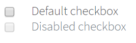 -->

Here is an example with provided Bootstrap v4.3 code:

```java 
// @FindBy(css = "body") public static CheckboxesDefault checkboxesDefault;
@UI("body") public static CheckboxesDefault checkboxesDefault;

public class CheckboxesDefault extends Section {
    // @FindBy(css = "#check1") public Checkbox checkboxOne;
    @UI("#check1") public Checkbox checkboxOne; 
    // @FindBy(css = "#check2") public Checkbox checkboxTwo;
    @UI("#check1") public Checkbox checkboxTwo; 
}

@Test
public void isValidationTests() {
    checkboxesDefault.checkboxOne
            .is()
            .displayed()
            .enabled()
            .core()
            .hasClass("form-check")
            .tag(is("div"));
    checkboxesDefault.checkboxOne.label()
            .is()
            .displayed()
            .enabled()
            .core()
            .hasClass("form-check-label")
            .text(is("Default checkbox"))
            .tag(is("label"));
}

@Test
public void clickableTests() {
    checkboxesDefault.checkboxOne.check();
    checkboxesDefault.checkboxOne.is().selected();
    checkboxesDefault.checkboxOne.uncheck();
    checkboxesDefault.checkboxOne.is().deselected();
}
```

```html
<div class="form-check" id="check1">
    <input class="form-check-input" type="checkbox" value="" id="defaultCheck1">
    <label class="form-check-label" for="defaultCheck1">
        Default checkbox
    </label>
</div>
<div class="form-check" id="check2">
    <input class="form-check-input" type="checkbox" value="" id="defaultCheck2" disabled>
    <label class="form-check-label" for="defaultCheck2">
        Disabled checkbox
    </label>
</div>
```


|Method | Description | Return Type
--- | --- | ---
**assertThat()** | Assert action checkbox | CheckboxAssert
**click()** | Click the checkbox | void
**check(String)** | Set to checked on "true" (case insensitive) or unchecked otherwise | void
**check()** | Set to checked | void
**is()** | Assert action checkbox | CheckboxAssert
**isSelected()** | Verify value | boolean 
**isEnabled()** | Verify state | boolean
**uncheck()** | Set to unchecked | void

<br>

<a href="https://github.com/jdi-testing/jdi-light/blob/bootstrap/jdi-light-bootstrap-tests/src/test/java/io/github/epam/bootstrap/tests/composite/section/form/CheckboxesDefaultTests.java" target="_blank">Test examples in Java</a><br>

Button group is represented by Section class in Java:
 
  [Section](https://jdi-docs.github.io/jdi-light/#section)  

<br>

#### <a href="https://getbootstrap.com/docs/4.3/components/forms/#inline" target="_blank">Checkbox default inline</a>

Checkbox is located in the following classes:
 
  - __Java__: _com.epam.jdi.light.ui.bootstrap.elements.common.Checkbox_
  


Here is an example with provided Bootstrap v4.3 code:

```java 
// @FindBy(css = "body") public static CheckboxesDefaultInline checkboxesDefaultInline;
@UI("body") public static CheckboxesDefaultInline checkboxesDefaultInline;

public class CheckboxesDefaultInline {
    // @FindBy(xpath = "//input[@id='inlineCheckbox1']/..") public Checkbox checkboxOne;
    @UI("//input[@id='inlineCheckbox1']/..") public Checkbox checkboxOne; 
    // @FindBy(xpath = "//input[@id='inlineCheckbox2']/..") public Checkbox checkboxTwo;
    @UI("//input[@id='inlineCheckbox2']/..") public Checkbox checkboxTwo; 
    // @FindBy(xpath = "//input[@id='inlineCheckbox3']/..") public Checkbox checkboxThree;
    @UI("//input[@id='inlineCheckbox3']/..") public Checkbox checkboxThree; 
}

@Test
public void isValidationTests() {
    checkboxesDefaultInline.checkboxOne
            .is()
            .displayed()
            .enabled()
            .core()
            .hasClass("form-check form-check-inline");
    checkboxesDefaultInline.checkboxOne.label()
            .is()
            .displayed()
            .enabled()
            .core()
            .hasClass("form-check-label")
            .text(is("1"));
}
@Test
public void clickableTests() {
    checkboxesDefaultInline.checkboxOne.check();
    checkboxesDefaultInline.checkboxOne
            .is()
            .selected();
    checkboxesDefaultInline.checkboxOne.uncheck();
    checkboxesDefaultInline.checkboxOne
            .is()
            .deselected();
    checkboxesDefaultInline.checkboxOne.label().click();
    checkboxesDefaultInline.checkboxOne
            .is()
            .selected();
}
```

```html
<div class="form-check form-check-inline">
    <input class="form-check-input" type="checkbox" id="inlineCheckbox1" value="option1">
    <label class="form-check-label" for="inlineCheckbox1">1</label>
</div>
<div class="form-check form-check-inline">
    <input class="form-check-input" type="checkbox" id="inlineCheckbox2" value="option2">
    <label class="form-check-label" for="inlineCheckbox2">2</label>
</div>
<div class="form-check form-check-inline">
    <input class="form-check-input" type="checkbox" id="inlineCheckbox3" value="option3"
           disabled>
    <label class="form-check-label" for="inlineCheckbox3">3 (disabled)</label>
</div>
```


|Method | Description | Return Type
--- | --- | ---
**assertThat()** | Assert action checkbox | CheckboxAssert
**click()** | Click the checkbox | void
**check(String)** | Set to checked on "true" (case insensitive) or unchecked otherwise | void
**check()** | Set to checked | void
**is()** | Assert action checkbox | CheckboxAssert
**isEnabled()** | Verify state | boolean
**isSelected()** | Verify value | boolean
**uncheck()** | Set to unchecked | void

<br>

<a href="https://github.com/jdi-testing/jdi-light/blob/bootstrap/jdi-light-bootstrap-tests/src/test/java/io/github/epam/bootstrap/tests/composite/section/form/CheckboxesDefaultInlineTests.java" target="_blank">Test examples in Java</a>
<br>

Button group is represented by Section class in Java:
 
  [Section](https://jdi-docs.github.io/jdi-light/#section)  

<br>

#### <a href="https://getbootstrap.com/docs/4.3/components/forms/#default-stacked" target="_blank">Radio button</a>
Element that can be represented with one or more clickable buttons aiming to choose only one button of the group.

Radio button is located in the following classes:
 
  - __Java__: _com.epam.jdi.light.ui.bootstrap.elements.complex.RadioButtons_
  


Here is an example with provided Bootstrap v4.3 code:

```java 
//@FindBy(css = "#radio-buttons") public static RadioButtonGroup radioButtonGroup;
@UI("#radio-buttons") public static RadioButtonGroup radioButtonGroup;

public class RadioButtonGroup extends Section {
//@FindBy(css = "input[type='radio']")
@UI("input[type='radio']")
public RadioButtons radioButtons;
}

@Test
public void radioButtonByIndexTests() {
    radioButtonGroup.radioButtons.list().get(2).click();
    radioButtonGroup.radioButtons.list().get(2).is().selected();
    radioButtonGroup.radioButtons.list().is().selected(2);
    radioButtonGroup.radioButtons.is().selected(2);
    radioButtonGroup.radioButtons.list().get(1).is().deselected();
    radioButtonGroup.radioButtons.list().get(1).select();
    radioButtonGroup.radioButtons.list().get(1).is().selected();
    radioButtonGroup.radioButtons.list().is().selected(1);
    radioButtonGroup.radioButtons.list().get(2).is().deselected();
    radioButtonGroup.radioButtons.list().select(2);
    radioButtonGroup.radioButtons.list().get(2).is().selected();
}

@Test
public void radioButtonByLabelTests() {
    radioButtonGroup.radioButtons.list().select(labelText1);;
    radioButtonGroup.radioButtons.list().is().selected(labelText1);
    radioButtonGroup.radioButtons.is().selected(labelText1);
    radioButtonGroup.radioButtons.list().get(1).is().text(is(value1));
    radioButtonGroup.radioButtons.list().get(2).is().deselected();
    radioButtonGroup.radioButtons.list().get(2).label().click();
    radioButtonGroup.radioButtons.is().selected(labelText2);
    radioButtonGroup.radioButtons.list().get(2).is().text(is(value2));
    radioButtonGroup.radioButtons.list().get(1).is().deselected();
    radioButtonGroup.radioButtons.select(labelText1);
    radioButtonGroup.radioButtons.is().selected(labelText1);
    radioButtonGroup.radioButtons.list().get(2).is().deselected();
}
```

```html
<div class="btn-group-vertical mb-3" id="radio-buttons" role="group">
     <div class="form-check">
          <input class="form-check-input" type="radio" name="exampleRadios" id="exampleRadios1" value="option1" checked="">
          <label class="form-check-label" for="exampleRadios1">Default radio</label>
     </div>
     <div class="form-check">
          <input class="form-check-input" type="radio" name="exampleRadios" id="exampleRadios2" value="option2">
          <label class="form-check-label" for="exampleRadios2">Second default radio</label>
     </div>
     <div class="form-check">
           <input class="form-check-input" type="radio" name="exampleRadios" id="exampleRadios3" value="option3" disabled="">
           <label class="form-check-label" for="exampleRadios3">Disabled radio</label>
     </div>
</div>
```


|Method | Description | Return Type
--- | --- | ---
**assertThat()** | Assert action | TextAssert
**click()** | Click the button | void
**get()** | Select button by index | action
**getText()** | Get button text | String
**is()** | Assert action | TextAssert 
**select()** | Select button | void
**selected()** | Radio button is selected | TextAssert

<br>

<a href="https://github.com/jdi-testing/jdi-light/blob/master/jdi-light-html-tests/src/test/java/io/github/epam/html/tests/elements/complex/RadioTests.java" target="_blank">Test examples in Java</a>
<br>

Button group is represented by Section class in Java:
 
  [Section](https://jdi-docs.github.io/jdi-light/#section)  

<br>

#### <a href="https://getbootstrap.com/docs/4.3/components/forms/#inline" target="_blank">Radio button inline</a>

Radio button is located in the following classes:
 
  - __Java__: _com.epam.jdi.light.ui.bootstrap.elements.complex.RadioButtons_
  


Here is an example with provided Bootstrap v4.3 code:

```java 
//@FindBy(css = "body") public static RadioButtonsDefaultInline radioButtonsDefaultInline;
@UI("body") public static RadioButtonsDefaultInline radioButtonsDefaultInline;

public class RadioButtonsDefaultInline extends Section {
    //@FindBy(css = "input[name='inlineRadioOptions']")
    @UI("input[name='inlineRadioOptions']")
    public RadioButtons radioButtons;
}

@Test
public void baseInitTest() {
     radioButtonsDefaultInline.radioButtons.is().size(3);
     radioButtonsDefaultInline.radioButtons.list().get(1).is().deselected();
     radioButtonsDefaultInline.radioButtons.list().get(2).is().deselected();
     radioButtonsDefaultInline.radioButtons.list().get(3).is().deselected();
     radioButtonsDefaultInline.radioButtons.list().get(3).is().disabled();

     radioButtonsDefaultInline.radioButtons.list().get(1).label()
                .is()
                .core()
                .hasClass("form-check-label")
                .text(is(label1));
     radioButtonsDefaultInline.radioButtons.list().get(2).label()
                .is()
                .core()
                .hasClass("form-check-label")
                .text(is(label2));
     radioButtonsDefaultInline.radioButtons.list().get(3).label()
                .is()
                .core()
                .hasClass("form-check-label")
                .text(is(label3));
}

@Test
public void radioButtonByIndexTests() {
    radioButtonsDefaultInline.radioButtons.select(2);
    radioButtonsDefaultInline.radioButtons.is().selected(2);
    radioButtonsDefaultInline.radioButtons.is().selected("2");
    radioButtonsDefaultInline.radioButtons.list().get(2).is().selected();
    radioButtonsDefaultInline.radioButtons.list().get(1).is().deselected();
    radioButtonsDefaultInline.radioButtons.select(1);
    radioButtonsDefaultInline.radioButtons.is().selected(1);
    radioButtonsDefaultInline.radioButtons.is().selected("1");
    radioButtonsDefaultInline.radioButtons.list().get(2).is().deselected();
    radioButtonsDefaultInline.radioButtons.list().select("2");
    radioButtonsDefaultInline.radioButtons.list().get(2).is().selected();
}
```

```html 
<div class="form-check form-check-inline">
     <input class="form-check-input" type="radio" name="inlineRadioOptions" id="inlineRadio1" value="option1">
     <label class="form-check-label" for="inlineRadio1">1</label>
</div>
<div class="form-check form-check-inline">
     <input class="form-check-input" type="radio" name="inlineRadioOptions" id="inlineRadio2" value="option2">
     <label class="form-check-label" for="inlineRadio2">2</label>
</div>
<div class="form-check form-check-inline">
     <input class="form-check-input" type="radio" name="inlineRadioOptions" id="inlineRadio3" value="option3" disabled="">
     <label class="form-check-label" for="inlineRadio3">3 (disabled)</label>
</div>
```

|Method | Description | Return Type
--- | --- | ---
**assertThat()** | Assert action | TextAssert
**click()** | Click the button | void
**get()** | Select button by index | action
**getText()** | Get button text | String
**is()** | Assert action | TextAssert 
**select()** | Select button | void
**selected()** | Radio button is selected | TextAssert

<br>

<a href="https://github.com/jdi-testing/jdi-light/blob/master/jdi-light-html-tests/src/test/java/io/github/epam/html/tests/elements/complex/RadioTests.java" target="_blank">Test examples in Java</a>
<br>

Button group is represented by Section class in Java:
 
  [Section](https://jdi-docs.github.io/jdi-light/#section)  

<br>
<br>
<br>

#### <a href="https://getbootstrap.com/docs/4.3/components/forms/#without-labels" target="_blank">Radio button and checkbox without labels</a>

Checkbox and Radio button are located in the following classes:
 
  - __Java__: _com.epam.jdi.light.ui.bootstrap.elements.complex.RadioButtons_
  - __Java__: _com.epam.jdi.light.ui.bootstrap.elements.common.Checkbox_
  


Here is an example with provided Bootstrap v4.3 code:

```java 
//@FindBy(css = "body")
@UI("body") 
public static CheckboxesAndRadiosWithoutLabels checkboxesAndRadiosWithoutLabels;

//@FindBy(xpath = "//input[@id='blankCheckbox']/..")
@UI("//input[@id='blankCheckbox']/..")
public Checkbox checkbox;
//@FindBy(css = "#blankRadio1")
@UI("#blankRadio1")
public RadioButtons radioButtons;
}

@Test
public void isValidationTests() {
    checkboxesAndRadiosWithoutLabels.checkbox
            .is()
            .displayed()
            .enabled()
            .core()
            .hasClass("form-check")
            .tag(is("div"));
    checkboxesAndRadiosWithoutLabels.radioButtons
            .is()
            .displayed()
            .enabled()
            .core()
            .value("option1")
            .attr("type", "radio")
            .attr("aria-label", "...");
}

@Test
public void checkboxClickableTests() {
    checkboxesAndRadiosWithoutLabels.checkbox.check();
    checkboxesAndRadiosWithoutLabels.checkbox
            .is()
            .selected();
    checkboxesAndRadiosWithoutLabels.checkbox.uncheck();
    checkboxesAndRadiosWithoutLabels.checkbox
            .is()
            .deselected();
}

@Test
public void radioButtonTests() {
    checkboxesAndRadiosWithoutLabels.radioButtons.select(1);
    checkboxesAndRadiosWithoutLabels.radioButtons.list()
             .is()
             .selected(1);
    checkboxesAndRadiosWithoutLabels.radioButtons
             .is()
             .selected(1);
}
```

```html
<div class="form-check">
     <input class="form-check-input position-static" type="checkbox" id="blankCheckbox" value="option1" aria-label="...">
</div>
<div class="form-check">
      <input class="form-check-input position-static" type="radio" name="blankRadio" id="blankRadio1" value="option1" aria-label="...">
</div>
``` 

|Method | Description | Return Type
--- | --- | ---
**assertThat()** | Assert action | TextAssert
**check()** | Click the element | void
**click()** | Click the element | void
**is()** | Assert action | TextAssert 

<br>
<a href="https://github.com/jdi-testing/jdi-light/blob/bootstrap/jdi-light-bootstrap-tests/src/test/java/io/github/epam/bootstrap/tests/composite/section/form/CheckboxesAndRadiosWithoutLabelsTests.java" target="_blank">Test examples in Java</a>
<br>

Button group is represented by Section class in Java:
 
  [Section](https://jdi-docs.github.io/jdi-light/#section)  

<br><br><br><br><br><br>
#### <a href="https://getbootstrap.com/docs/4.3/components/forms/#checkboxes" target="_blank">Checkbox custom</a>
Checkbox is located in the following classes:
 
  - __Java__: _com.epam.jdi.light.ui.bootstrap.elements.common.Checkbox_
  

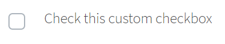

Here is an example with provided Bootstrap v4.3 code:

```java 
// @FindBy(css = "body") public static CheckboxesCustom checkboxesCustom;
@UI("body") public static CheckboxesCustom checkboxesCustom;

public class CheckboxesCustom extends Section {
    // @FindBy(css = "#customCheck1-div") public Checkbox checkbox;
    @UI("#customCheck1-div") public Checkbox checkbox; 
}

@Test
public void isValidationTests() {
    checkboxesCustom.checkbox
            .is()
            .displayed()
            .enabled()
            .core()
            .hasClass("custom-control custom-checkbox")
            .tag(is("div"));
    checkboxesCustom.checkbox.label()
            .is()
            .displayed()
            .enabled()
            .core()
            .hasClass("custom-control-label")
            .text(is("Check this custom checkbox"))
            .tag(is("label"));
}

@Test
public void clickableTests() {
    checkboxesCustom.checkbox.check();
    checkboxesCustom.checkbox.is().selected();
    checkboxesCustom.checkbox.click();
    checkboxesCustom.checkbox.is().deselected();
}
```

```html
<div class="custom-control custom-checkbox" id="customCheck1-div">
    <input type="checkbox" class="custom-control-input" id="customCheck1">
    <label class="custom-control-label" for="customCheck1">Check this custom checkbox</label>
</div>
```


|Method | Description | Return Type
--- | --- | ---
**assertThat()** | Assert action checkbox | CheckboxAssert
**check(String)** | Set to checked on "true" (case insensitive) or unchecked otherwise | void
**check()** | Set to checked | void
**click()** | Click the checkbox | void
**is()** | Assert action checkbox | CheckboxAssert
**isSelected()** | Verify value | boolean 
**isEnabled()** | Verify state | boolean
**uncheck()** | Set to unchecked | void

<br>
<a href="https://github.com/jdi-testing/jdi-light/blob/bootstrap/jdi-light-bootstrap-tests/src/test/java/io/github/epam/bootstrap/tests/common/CustomCheckboxTests.java" target="_blank">Test examples in Java</a>
<br>

Button group is represented by Section class in Java:
 
  [Section](https://jdi-docs.github.io/jdi-light/#section)  

<br>

#### <a href="https://getbootstrap.com/docs/4.3/components/forms/#radios" target="_blank">Radio button custom</a>

Radio button is located in the following classes:
 
  - __Java__: _com.epam.jdi.light.ui.bootstrap.elements.complex.RadioButtons_
  


Here is an example with provided Bootstrap v4.3 code:

```java 
public class RadioButtonsCustom extends Section {
    //@FindBy(css = "[name='customRadio']")
    @UI("[name='customRadio']")
    public RadioButtons radioButtons;
}

@Test
public void radioButtonByIndexTests() {
   radioButtonCustom.radioButtons.list().get(1).select();
   radioButtonCustom.radioButtons.list().get(1).core().waitFor().selected();
   radioButtonCustom.radioButtons.list().get(1).is().selected();
   radioButtonCustom.radioButtons.list().get(2).is().deselected();
   radioButtonCustom.radioButtons.list().get(2).select();
   radioButtonCustom.radioButtons.list().get(2).core().waitFor().selected();
   radioButtonCustom.radioButtons.list().get(2).is().selected();
   radioButtonCustom.radioButtons.list().select(label1);
   radioButtonCustom.radioButtons.list().is().selected(label1);
   radioButtonCustom.radioButtons.list().get(2).is().deselected();
   radioButtonCustom.radioButtons.list().get(1).click();
   radioButtonCustom.radioButtons.list().get(1).is().selected();
   radioButtonCustom.radioButtons.list().get(2).is().deselected();
}

@Test
public void radioButtonByIndexInSelectTests() {
   radioButtonCustom.radioButtons.select(1);
   radioButtonCustom.radioButtons.is().selected(label1);
   radioButtonCustom.radioButtons.select(2);
   radioButtonCustom.radioButtons.is().selected(label2);
   radioButtonCustom.radioButtons.select(label1);
   radioButtonCustom.radioButtons.is().selected(label1);
   radioButtonCustom.radioButtons.is().selected(1);
   radioButtonCustom.radioButtons.select(label2);
   radioButtonCustom.radioButtons.is().selected(2);
}
```

```html
<div class="html-left" id="custom-radio-con">
    <div class="custom-control custom-radio" id="customRadio1-div">
         <input type="radio" id="customRadio1" name="customRadio" class="custom-control-input">
         <label class="custom-control-label" for="customRadio1">Toggle this custom radio</label>
    </div>
    <div class="custom-control custom-radio" id="customRadio2-div">
        <input type="radio" id="customRadio2" name="customRadio" class="custom-control-input">
        <label class="custom-control-label" for="customRadio2">Or toggle this other custom radio</label>
    </div>
</div>
```

|Method | Description | Return Type
--- | --- | ---
**assertThat()** | Assert action | TextAssert
**click()** | Click the button | void
**get()** | Select button by index | action
**getText()** | Get button text | String
**is()** | Assert action | TextAssert 
**select()** | Select button | void
**selected()** | Radio button is selected | TextAssert

<br>
<a href="https://github.com/jdi-testing/jdi-light/blob/bootstrap/jdi-light-bootstrap-tests/src/test/java/io/github/epam/bootstrap/tests/composite/section/form/RadioButtonCustomTests.java" target="_blank">Test examples in Java</a>
<br>

Button group is represented by Section class in Java:
 
  [Section](https://jdi-docs.github.io/jdi-light/#section)  

<br>

#### <a href="https://getbootstrap.com/docs/4.3/components/forms/#inline-1" target="_blank">Radio button custom inline</a>

Radio button is located in the following classes:
 
  - __Java__: _com.epam.jdi.light.ui.bootstrap.elements.complex.RadioButtons_
  


Here is an example with provided Bootstrap v4.3 code:

```java 
// @FindBy(css = "body") public static RadioButtonsCustomInline radioButtonsCustomInline;
@UI("body") public static RadioButtonsCustomInline radioButtonsCustomInline;

public class RadioButtonsCustomInline extends Section {
    //@FindBy(css = ".custom-control-inline .custom-control-input")
    @UI(".custom-control-inline .custom-control-input")
    public RadioButtons radioButtons;
}

@Test
public void radioButtonByIndexTests() {
    radioButtonsCustomInline.radioButtons.select(1);
    radioButtonsCustomInline.radioButtons.is().selected(1);
    radioButtonsCustomInline.radioButtons.list().get(2).select();
    radioButtonsCustomInline.radioButtons.list().is().selected(2);
    radioButtonsCustomInline.radioButtons.list().get(2).is().selected();
    radioButtonsCustomInline.radioButtons.list().get(1).click();
    radioButtonsCustomInline.radioButtons.list().get(1).is().selected();
    radioButtonsCustomInline.radioButtons.list().get(2).is().deselected();
}

@Test
public void radioButtonByLabelTests() {
    radioButtonsCustomInline.radioButtons.list().get(1).label().click();
    radioButtonsCustomInline.radioButtons.is().selected(1);
    radioButtonsCustomInline.radioButtons.list().get(2).label().click();
    radioButtonsCustomInline.radioButtons.is().selected(2);
    radioButtonsCustomInline.radioButtons.list().get(1).label().click();
    radioButtonsCustomInline.radioButtons.is().selected(text1);
    radioButtonsCustomInline.radioButtons.list().is().selected(text1);
    radioButtonsCustomInline.radioButtons.select(text2);
    radioButtonsCustomInline.radioButtons.list().is().selected(text2);
    radioButtonsCustomInline.radioButtons.list().get(1).label().is().text(text1);
    radioButtonsCustomInline.radioButtons.list().get(2).label().is().text(text2);
}
```

```html 
<div class="custom-control custom-radio custom-control-inline" id="customRadioInline1-div">
     <input type="radio" id="customRadioInline1" name="customRadioInline1" class="custom-control-input">
     <label class="custom-control-label" for="customRadioInline1">Toggle this <br> custom
                                    radio</label>
</div>
<div class="custom-control custom-radio custom-control-inline" id="customRadioInline2-div">
      <input type="radio" id="customRadioInline2" name="customRadioInline1" class="custom-control-input">
      <label class="custom-control-label" for="customRadioInline2">Or toggle this <br> custom
                                    radio</label>
</div>
```

|Method | Description | Return Type
--- | --- | ---
**assertThat()** | Assert action | TextAssert
**click()** | Click the button | void
**get()** | Select button by index | action
**getText()** | Get button text | String
**is()** | Assert action | TextAssert 
**select()** | Select button | void
**selected()** | Radio button is selected | TextAssert

<br>
<a href="https://github.com/jdi-testing/jdi-light/blob/bootstrap/jdi-light-bootstrap-tests/src/test/java/io/github/epam/bootstrap/tests/composite/section/form/RadioButtonsCustomInlineTests.java" target="_blank">Test examples in Java</a>
<br>

Button group is represented by Section class in Java:
 
  [Section](https://jdi-docs.github.io/jdi-light/#section)  

<br>

#### <a href="https://getbootstrap.com/docs/4.3/components/forms/#inline-1" target="_blank">Custom disabled</a>

Checkbox and Radio button is located in the following classes:

__Java__:
  - com.epam.jdi.light.ui.bootstrap.elements.complex.RadioButtons_
  - com.epam.jdi.light.ui.bootstrap.elements.common.Checkbox_
  


Here is an example with provided Bootstrap v4.3 code:

```java 
// @FindBy(css = "body") public static CheckboxAndRadioButtonCustomDisabled checkboxAndRadioButtonCustomDisabled;
@UI("body") public static CheckboxAndRadioButtonCustomDisabled checkboxAndRadioButtonCustomDisabled;

    public class CheckboxAndRadioButtonCustomDisabled extends Section {
        //FindBy(css = "#customCheckDisabled1-div")
        @UI("#customCheckDisabled1-div")
        public Checkbox checkbox;
        //FindBy(css = "#customRadioDisabled2")
        @UI("#customRadioDisabled2")
        public RadioButtons radioButtons;
    }

    @Test
    public void radioButtonIsValidationTests() {
        checkboxAndRadioButtonCustomDisabled.radioButtons.list().get(1).is()
            .hidden()
            .disabled()
            .core()
            .attr("type", "radio")
            .attr("name", "radioDisabled")
            .hasClass("custom-control-input")
            .tag(Matchers.is("input"));
    }

    @Test
    public void baseInitTest() {
        checkboxAndRadioButtonCustomDisabled.radioButtons.is().size(1);
        checkboxAndRadioButtonCustomDisabled.radioButtons.list().get(1)
                .is()
                .deselected();
        checkboxAndRadioButtonCustomDisabled.radioButtons.list().get(1).label()
                .is()
                .text(is(label1));
    }
```

```html
<div class="custom-control custom-checkbox" id="customCheckDisabled1-div">
    <input type="checkbox" class="custom-control-input" id="customCheckDisabled1" disabled="">
    <label class="custom-control-label" for="customCheckDisabled1">Check this custom checkbox</label>
</div>
<div class="custom-control custom-radio" id="customRadioDisabled2-div">
    <input type="radio" name="radioDisabled" id="customRadioDisabled2" class="custom-control-input" disabled="">
    <label class="custom-control-label" for="customRadioDisabled2">Toggle this custom radio</label>
</div>
```


|Method | Description | Return Type
--- | --- | ---
**assertThat()** | Assert action | TextAssert
**check()** | Click the element | void
**click()** | Click the element | void
**is()** | Assert action | TextAssert 

<br>
<a href="https://github.com/jdi-testing/jdi-light/tree/bootstrap/jdi-light-bootstrap-tests/src/test/java/io/github/epam/bootstrap/tests/composite/section/form/CheckboxAndRadioButtonCustomDisabledTests.java" target="_blank">Test examples in Java</a>
<br>

Button group is represented by Section class in Java:
 
  [Section](https://jdi-docs.github.io/jdi-light/#section)  

<br>

#### <a href="https://getbootstrap.com/docs/4.3/components/forms/#inline-1" target="_blank">Switches custom</a>

Checkbox is located in the following classes:
 
  - __Java__: _com.epam.jdi.light.ui.bootstrap.elements.common.Checkbox_
  


Here is an example with provided Bootstrap v4.3 code:

```java 
// @FindBy(css = "body") public static Switches switches;
@UI("body") public static Switches switches; 

public class Switches extends Section {
    // @FindBy(css = "#customSwitch1-div") public Checkbox checkbox;
    @UI("#customSwitch1-div") public Checkbox checkbox; 
    // @FindBy(css = "#customSwitch2-div") public Checkbox checkboxDisabled;
    @UI("#customSwitch2-div") public Checkbox checkboxDisabled; 
}

@Test
public void isValidationTests() {
    switches.checkbox
            .is()
            .displayed()
            .enabled()
            .core()
            .hasClass("custom-control custom-switch")
            .tag(is("div"));
    switches.checkbox.label()
            .is()
            .displayed()
            .enabled()
            .core()
            .hasClass("custom-control-label")
            .text(is("Toggle this switch element"))
            .tag(is("label"));
}

@Test
public void clickableTests() {
    switches.checkbox.check();
    switches.checkbox.is().selected();
    switches.checkbox.check();
    switches.checkbox.is().deselected();
}
```

```html
<div class="custom-control custom-switch" id="customSwitch1-div">
    <input type="checkbox" class="custom-control-input" id="customSwitch1">
    <label class="custom-control-label" for="customSwitch1">Toggle this switch
        element</label>
</div>
<div class="custom-control custom-switch" id="customSwitch2-div">
    <input type="checkbox" class="custom-control-input" disabled id="customSwitch2">
    <label class="custom-control-label" for="customSwitch2">Disabled switch element</label>
</div>
```


|Method | Description | Return Type
--- | --- | ---
**assertThat()** | Assert action checkbox | CheckboxAssert
**check(String)** | Set to checked on "true" (case insensitive) or unchecked otherwise | void
**check()** | Set to checked | void
**click()** | Click the checkbox | void
**is()** | Assert action checkbox | CheckboxAssert
**isEnabled()** | Verify state | boolean
**isSelected()** | Verify value | boolean 
**uncheck()** | Set to unchecked | void

<br>
<a href="https://github.com/jdi-testing/jdi-light/tree/bootstrap/jdi-light-bootstrap-tests/src/test/java/io/github/epam/bootstrap/tests/composite/section/form/SwitchesTests.java" target="_blank">Test examples in Java</a>
<br>

Button group is represented by Section class in Java:
 
  [Section](https://jdi-docs.github.io/jdi-light/#section)  

<br>

### Button group

<a href="https://getbootstrap.com/docs/4.3/components/button-group/" target="_blank">Button group</a> – Element that groups a series of buttons together on a single line with the button group, and super-power them with JavaScript.

Button group is located in the following packages:
 
  - __Java__: _io.github.epam.bootstrap.tests.composite.section.buttonGroup_
  - __C#__:

<br>

Button group is represented by Section class in Java:
 
  [Section](https://jdi-docs.github.io/jdi-light/#section)  

#### <a href="https://getbootstrap.com/docs/4.3/components/button-group/#basic-example" target="_blank">Button Group Basic</a> 
Wrap a series of buttons with .btn in .btn-group.


Here is an example with provided Bootstrap v4.3 code:

```java 
// @FindBy(css = "#basic-example") public static ButtonGroupBasic buttonGroupBasic;
@UI("#basic-example") 
public static ButtonGroupBasic buttonGroupBasic;

public class ButtonGroupBasic extends Section {
    @UI("//button[text()='Left']") 
    public Button leftButton;
    
    @UI("//button[text()='Middle']") 
    public Button middleButton;
    
    @UI("//button[text()='Right']") 
    public Button rightButton;
}

@Test
public void leftButtonTests() {
    buttonGroupBasic.leftButton.is()
            .displayed()
            .enabled()
            .core()
            .hasClass("btn btn-secondary")
            .css("font-size", "16px");
    buttonGroupBasic.leftButton.click();
    validateAlert(is(leftButtonClickAlert));
}
```

<br>

<!--  -->
```html
<div id="btn-md-group" class="btn-group mb-3" role="group" aria-label="Default button group">
    <button type="button" class="btn btn-secondary" ondblclick="alert('Left Button Double Clicked!');"
            oncontextmenu="alert('Left Button Right Clicked!');">Left
    </button>
    <button type="button" class="btn btn-secondary" ondblclick="alert('Middle Button Double Clicked!');"
            oncontextmenu="alert('Middle Button Right Clicked!');">Middle
    </button>
    <button type="button" class="btn btn-secondary" ondblclick="alert('Right Button Double Clicked!');"
            oncontextmenu="alert('Right Button Right Clicked!');">Right
    </button>
</div>
```

<br>

Available methods in Java JDI Light:

|Method | Description | Return Type
--- | --- | ---
**assertThat()** | Assert action | TextAssert
**click()** | Click the button | void
**displayed()** | Check that element is displayed | TextAssert
**enabled()** | Check that element is enabled | TextAssert
**getText()** | Get button text | String
**is()** | Assert action | TextAssert 

<br>

<a href="https://github.com/jdi-testing/jdi-light/blob/bootstrap/jdi-light-bootstrap-tests/src/test/java/io/github/epam/bootstrap/tests/composite/section/buttonGroup/BasicTests.java" target="_blank">Button Group Basic Tests Example</a>


#### <a href="https://getbootstrap.com/docs/4.0/components/button-group/#button-toolbar" target="_blank">Button toolbar</a>
Combine sets of button groups into button toolbars for more complex components. Use utility classes as needed to space out groups, buttons, and more.


Here is an example with provided Bootstrap v4.3 code:

```java 
// @FindBy(css = ".btn-toolbar") public static ButtonToolbar buttonToolbar;
@UI(".btn-toolbar") 
public static ButtonToolbar buttonToolbar;

public class ButtonGroupToolbar extends Section {
    @UI("button") 
    public WebList buttonsInToolbar;
    
    @UI("input") 
    public TextField inputAreaInToolbar;

    @Test
    public void buttonsInButtonToolbarTest() {
        buttonToolbar.buttonsInToolbar.forEach(button -> {
            button.is().displayed();
            button.is().enabled();
            button.assertThat().css("background-color", backgroundColorBeforeHovering);
            button.core().hover();
            button.assertThat().css("background-color", backgroundColorAfterHovering);
            button.assertThat().css("border-color", borderColorBeforeClicking);
            button.click();
            validateAlert(containsString("button is clicked"));
            button.assertThat().css("border-color", borderColorAfterClicking);
        });
    }
}
```

<!-- 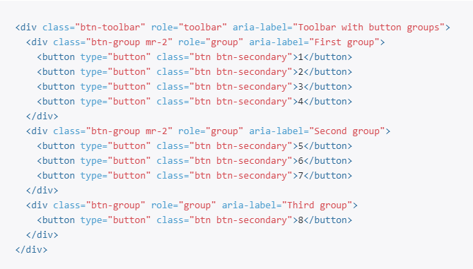 -->

```html

<div class="btn-toolbar" id="buttonToolbar1" role="toolbar" aria-label="Toolbar with button groups">
    <div class="btn-group mr-2" role="group" aria-label="First group">
        <button type="button" class="btn btn-secondary" onclick="alert('1st button is clicked');">1
        </button>
        <button type="button" class="btn btn-secondary" onclick="alert('2nd button is clicked');">2
        </button>
        <button type="button" class="btn btn-secondary" onclick="alert('3rd button is clicked');">3
        </button>
        <button type="button" class="btn btn-secondary" onclick="alert('4th button is clicked');">4
        </button>
    </div>
    <div class="btn-group mr-2" role="group" aria-label="Second group">
        <button type="button" class="btn btn-secondary" onclick="alert('5th button is clicked');">5
        </button>
        <button type="button" class="btn btn-secondary" onclick="alert('6th button is clicked');">6
        </button>
        <button type="button" class="btn btn-secondary" onclick="alert('7th button is clicked');">7
        </button>
    </div>
    <div class="btn-group" role="group" aria-label="Third group">
        <button type="button" class="btn btn-secondary" onclick="alert('8th button is clicked');">8
        </button>
    </div>
</div>

```


It is possible to mix input groups with button groups in your toolbars.


Here is an example with provided Bootstrap v4.3 code:

```java 
    @Test
    public void inputFieldInButtonToolbarTest() {
        buttonToolbar.inputAreaInToolbar.is().displayed();
        buttonToolbar.inputAreaInToolbar.is().enabled();
        buttonToolbar.inputAreaInToolbar.is().core().attr("placeholder", placeholderForInputField);
        buttonToolbar.inputAreaInToolbar.setValue(textForTestingInputField);
        assertEquals(buttonToolbar.inputAreaInToolbar.getValue(), textForTestingInputField);
    }
``` 

```html
<div class="btn-toolbar mb-3" id="buttonToolbar2" role="toolbar"
     aria-label="Toolbar with button groups">
    <div class="btn-group mr-2" role="group" aria-label="First group">
        <button type="button" class="btn btn-secondary"
                onclick="alert('1st button is clicked');">1
        </button>
    </div>
    <div class="input-group">
        <div class="input-group-prepend">
            <div class="input-group-text" id="btnGroupAddon">@</div>
        </div>
        <input type="text" class="form-control" placeholder="Input group example"
               aria-label="Input group example" aria-describedby="btnGroupAddon">
    </div>
</div>
```

Available methods in Java JDI Light:

|Method | Description | Return Type
--- | --- | ---
**assertThat()** | Assert action | TextAssert
**click()** | Click the button | void
**displayed()** | Check that element is displayed | TextAssert
**enabled()** | Check that element is enabled | TextAssert
**getText()** | Get button text | String
**is()** | Assert action | TextAssert 

<br>

<a href="https://github.com/jdi-testing/jdi-light/blob/bootstrap/jdi-light-bootstrap-tests/src/test/java/io/github/epam/bootstrap/tests/composite/section/buttonGroup/ToolbarTests.java" target="_blank">Bootstrap test examples</a>


#### <a href="https://getbootstrap.com/docs/4.0/components/button-group/#sizing" target="_blank">Button Group Sizing</a>

Instead of applying button sizing classes to every button in a group, 
just add ``.btn-group-*`` to each ``.btn-group``, including each one when nesting multiple groups.


```java 
@UI("#btn-lg-group") // @FindBy(id = "btn-lg-group")
public static ButtonGroupSizing largeBtnGroup;

public class ButtonGroupSizing extends Section { 
    @UI("//button[contains(text(), 'Left')]")
    public Button leftBtn;
    
    @UI("//button[contains(text(), 'Middle')]")
    public Button midBtn;
    
    @UI("//button[contains(text(), 'Right')]")
    public Button rightBtn;
    
    String leftBtnText = "Left";
    
    @Test
    public void isValidationTest() {
        largeBtnGroup.highlight();
        largeBtnGroup.is().displayed();
        largeBtnGroup.is().enabled();
        largeBtnGroup.leftBtn.is().text(is(leftBtnText));
        largeBtnGroup.leftBtn.is().text(containsString("Le"));
        assertThat(largeBtnGroup.leftBtn.core().css("font-size"), is("20px"));
        largeBtnGroup.leftBtn.assertThat().displayed()
                .and().text(is(leftBtnText))
                .core()
                .css("font-size", is("20px"))
                .cssClass("btn btn-secondary")
                .attr("type", "button")
                .tag(is("button"));
    }
}
``` 

Here is an example with provided Bootstrap v4.3 code:

```html
<div id="btn-lg-group" class="btn-group btn-group-lg mb-3" role="group"
     aria-label="Large button group">
    <button type="button" class="btn btn-secondary"
            onclick="alert('Lg Left Button Clicked!');"
            ondblclick="alert('Lg Left Button Double Clicked!');"
            oncontextmenu="alert('Lg Left Button Right Clicked!');">Left
    </button>
    <button type="button" class="btn btn-secondary"
            onclick="alert('Lg Middle Button Clicked!');"
            ondblclick="alert('Lg Middle Button Double Clicked!');"
            oncontextmenu="alert('Lg Middle Button Right Clicked!');">Middle
    </button>
    <button type="button" class="btn btn-secondary"
            onclick="alert('Lg Right Button Clicked!');"
            ondblclick="alert('Lg Right Button Double Clicked!');"
            oncontextmenu="alert('Lg Right Button Right Clicked!');">Right
    </button>
</div>
```

Available methods in Java JDI Light:

|Method | Description | Return Type
--- | --- | ---
**assertThat()** | Assert action | TextAssert
**click()** | Click the button | void
**displayed()** | Check that element is displayed | TextAssert
**enabled()** | Check that element is enabled | TextAssert
**getText()** | Get button text | String
**is()** | Assert action | TextAssert 

<br>

<a href="https://github.com/jdi-testing/jdi-light/blob/bootstrap/jdi-light-bootstrap-tests/src/test/java/io/github/epam/bootstrap/tests/composite/section/buttonGroup/SizingTests.java" target="_blank">Bootstrap test examples</a>


#### <a href="https://getbootstrap.com/docs/4.3/components/button-group/#nesting" target="_blank">Button Group Nesting</a>
Place a ``.btn-group`` within another ``.btn-group`` when you want dropdown menus mixed with a series of buttons.


Here is an example with provided Bootstrap v4.3 code:

```java 
// @FindBy(css = "#button-group-nesting") public static ButtonGroupNesting buttonGroupNesting;
@UI("#button-group-nesting") 
public static ButtonGroupNesting buttonGroupNesting;

public class ButtonGroupNesting extends Section {
    @UI("button[onclick*='Button 1']") 
    public Button one;
    
    @UI("button[onclick*='Button 2']") 
    public Button two;
    
    @JDropdown(expand = ".btn-group",
            value = ".dropdown-menu",
            list = ".dropdown-item")
    public Dropdown dropdownMenu;
}

@Test
 public void buttonOneTests() {
     buttonGroupNesting.one.is()
             .displayed()
             .enabled()
             .core()
             .hasClass("btn btn-secondary")
             .css("font-size", "16px");
     buttonGroupNesting.one.click();
     validateAlert(is(buttonOneClickAlert));
}

@Test
public void dropdownMenuTests() {
    buttonGroupNesting.dropdownMenu.expand();
    buttonGroupNesting.dropdownMenu.is().expanded();
    buttonGroupNesting.dropdownMenu.is().size(2);
    buttonGroupNesting.dropdownMenu.list().get(0).is().text(dropdownMenuLinkOne);
    buttonGroupNesting.dropdownMenu.select(dropdownMenuLinkOne);
    newWindowTitleCheck(linkOnePageTitle);
}
```

<br>

```html
<div class="btn-group" id="button-group-nesting" role="group"
     aria-label="Button group with nested dropdown">
    <button type="button" class="btn btn-secondary" onclick="alert('Button 1 Clicked!');">
        1
    </button>
    <button type="button" class="btn btn-secondary" onclick="alert('Button 2 Clicked!');">
        2
    </button>

    <div class="btn-group" role="group">
        <button id="btnGroupDr1" type="button" class="btn btn-secondary dropdown-toggle"
                data-toggle="dropdown" aria-haspopup="true" aria-expanded="false">
            Dropdown
        </button>
        <div class="dropdown-menu" aria-labelledby="btnGroupDr1">
            <a class="dropdown-item" href="https://github.com/jdi-testing/jdi-light"
               target="_blank">JDI Github</a>
            <a class="dropdown-item"
               href="https://jdi-docs.github.io/jdi-light/#jdi-light-framework"
               target="_blank">JDI Docs</a>
        </div>
    </div>
</div>
```
<br>

|Method | Description | Return Type
--- | --- | ---
**assertThat()** | Assert action | TextAssert
**click()** | Click the button | void
**displayed()** | Check that element is displayed | TextAssert
**enabled()** | Check that element is enabled | TextAssert
**expand()** | Dropdown expand | void
**expanded()** | Check that dropdown is expanded | TextAssert
**getText()** | Get button text | String
**getValue()** | Get button value | String
**is()** | Assert action | TextAssert 
**select(String option)** | Select option by text | void
**select(int option)** | Select option by index | void
<br>

Inner elements represented by the following classes:
<ul>
    <li> [Text](https://jdi-docs.github.io/jdi-light/#text) </li>
    <li> [Button](https://jdi-docs.github.io/jdi-light/#button)</li>
    <li> [Dropdown](https://jdi-docs.github.io/jdi-light/#dropdown-2)</li>
</ul>

<a href="https://github.com/jdi-testing/jdi-light/blob/bootstrap/jdi-light-bootstrap-tests/src/test/java/io/github/epam/bootstrap/tests/composite/section/buttonGroup/NestingTests.java" target="_blank">Button Group Nesting Tests Example</a>

<br>


#### <a href="https://getbootstrap.com/docs/4.3/components/button-group/#vertical-variation" target="_blank">Button Group Vertical Variation</a>
Make a set of buttons appear vertically stacked rather than horizontally.


Here is an example with provided Bootstrap v4.3 code:

```java 
// @FindBy(css = "#vertical-variation") public static  ButtonGroupVerticalVariation buttonGroupVerticalVariation;
@UI("#vertical-variation") 
public static  ButtonGroupVerticalVariation buttonGroupVerticalVariation;

public class ButtonGroupVerticalVariation extends Section {
    @UI("button[onclick*='Button One']") 
    public Button buttonOne;
    
    @UI("button[onclick*='Button Two']") 
    public Button buttonTwo;
    
    @JDropdown(expand = ".btn-group",
            value = ".dropdown-menu",
            list = ".dropdown-item")
    public Dropdown dropdownMenu;
}

@Test
public void buttonOneTests() {
    buttonGroupVerticalVariation.buttonOne.is()
            .displayed()
            .enabled()
            .core()
            .hasClass("btn btn-secondary")
            .css("font-size", "16px");
    buttonGroupVerticalVariation.buttonOne.click();
    validateAlert(is(buttonOneClickAlert));

@Test
public void dropdownMenuTests() {
    buttonGroupVerticalVariation.dropdownMenu.expand();
    buttonGroupVerticalVariation.dropdownMenu.is().expanded();
    buttonGroupVerticalVariation.dropdownMenu.is().size(2);
    buttonGroupVerticalVariation.dropdownMenu.list().get(1).is().text(dropdownMenuLinkTwo);
    buttonGroupVerticalVariation.dropdownMenu.select(dropdownMenuLinkTwo);
    newWindowTitleCheck(linkTwoPageTitle);
}
```

<br>

```html 
<div class="btn-group-vertical mb-3" id="vertical-variation" role="group"
     aria-label="Vertical button group">
    <button type="button" class="btn btn-secondary" onclick="alert('Button One Clicked!');">
        Button one
    </button>
    <button type="button" class="btn btn-secondary" onclick="alert('Button Two Clicked!');">
        Button two
    </button>
    <div class="btn-group" role="group">
        <button id="btnGroupVerticalDrop1" type="button"
                class="btn btn-secondary dropdown-toggle" data-toggle="dropdown"
                aria-haspopup="true" aria-expanded="false">
            Dropdown
        </button>
        <div class="dropdown-menu" aria-labelledby="btnGroupVerticalDrop1"
             x-placement="bottom-start"
             style="position: absolute; will-change: transform; top: 0px; left: 0px; transform: translate3d(0px, 38px, 0px);">
            <a class="dropdown-item" href="https://github.com/jdi-testing/jdi-light"
               target="_blank">JDI Light</a>
            <a class="dropdown-item"
               href="https://jdi-docs.github.io/jdi-light/#jdi-light-framework"
               target="_blank">JDI Docs</a>
        </div>
    </div>
</div>
```
<br>

|Method | Description | Return Type
--- | --- | ---
**assertThat()** | Assert action | TextAssert
**click()** | Click the button | void
**displayed()** | Check that element is displayed | TextAssert
**enabled()** | Check that element is enabled | TextAssert
**expand()** | Dropdown expand | void
**expanded()** | Check that dropdown is expanded | TextAssert
**getText()** | Get button text | String
**getValue()** | Get button value | String
**is()** | Assert action | TextAssert 
**select(String option)** | Select option by text | void
**select(int option)** | Select option by index | void
<br>

Inner elements represented by the following classes:
<ul>
    <li> [Text](https://jdi-docs.github.io/jdi-light/#text) </li>
    <li> [Button](https://jdi-docs.github.io/jdi-light/#button)</li>
    <li> [Dropdown](https://jdi-docs.github.io/jdi-light/#dropdown-2)</li>
</ul>
<br>

<a href="https://github.com/jdi-testing/jdi-light/blob/bootstrap/jdi-light-bootstrap-tests/src/test/java/io/github/epam/bootstrap/tests/composite/section/buttonGroup/VerticalVariationTests.java" target="_blank">Button Group Vertical Variation Tests Example</a>
<br><br>

### Alert
Alert is located in the following class: <br>
- __Java__: _com.epam.jdi.light.ui.bootstrap.common.Alert_

**<a href="https://getbootstrap.com/docs/4.3/components/alerts/" target="_blank">Alert</a>** – Element that provides contextual feedback messages for typical user actions with the handful of available and flexible alert messages.

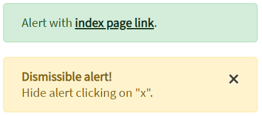

Here is an example with provided Bootstrap v4.3 code:

```java 
// @FindBy(css = "#simple-alert") public static Alert simpleAlert; 
@Css("#simple-alert") 
public static Alert simpleAlert;

// @FindBy(css = "#dismissible-alert") public static Alert dismissibleAlert;
@Css("#dismissible-alert") 
public static Alert dismissibleAlert;

@Test
public void simpleAlertExistingTest() {
    simpleAlert.is().displayed();
    simpleAlert.is().enabled();
    dismissibleAlert.is().displayed();
    dismissibleAlert.is().enabled();
}

@Test
public void simpleAlertLinkClickableTest() {
    simpleAlert.click();
    switchToNewWindow();
    assertEquals(getTitle(), pageTitle);
    closeWindow();
}

@Test
public void dismissibleAlertButtonIsValidationTest() {
    dismissibleAlert.dismissButton().is().displayed()
            .enabled()
            .core()
            .attr("type", "button")
            .attr("data-dismiss", "alert")
            .attr("aria-label", "Close")
            .tag(is("button"));
}

@Test (priority = 1)
public void dismissibleAlertButtonClickTest() {
    dismissibleAlert.dismissButton().click();
    dismissibleAlert.base().waitSec(1);
    dismissibleAlert.is().hidden();
}
```

<br>

```html
<div class="alert alert-success" id="simple-alert" role="alert">
    Alert with <a
        href="https://jdi-testing.github.io/jdi-light/index.html"
        class="alert-link" target="_blank">index page link</a>.
</div>
<div class="alert alert-warning alert-dismissible fade show" id="dismissible-alert"
     role="alert">
    <strong>Dismissible alert!</strong><br> Hide alert clicking on "x".
    <button type="button" class="close" id="dismissible-alert-close-button"
            data-dismiss="alert" aria-label="Close">
        <span aria-hidden="true">&times;</span>
    </button>
</div>
```

Available methods in Java JDI Light:

|Method | Description | Return Type
--- | --- | ---
**assertThat()** | Assert action | TextAssert
**click()** | Click to hide alert | Action
**displayed()** | Check that element is displayed | TextAssert
**hidden()** | Check that element is hidden | TextAssert
**is()** | Assert action | TextAssert 

<br>

<a href="https://github.com/jdi-testing/jdi-light/blob/bootstrap/jdi-light-bootstrap-tests/src/test/java/io/github/epam/bootstrap/tests/common/AlertTests.java" target="_blank">Alert test examples</a>


<br><br><br><br><br><br>
### Badge

**1) <a style="font-weight:bold" href="https://getbootstrap.com/docs/4.3/components/badge/" target="_blank">Badge</a>** - Element that scale to match the size of the immediate parent element by using relative font sizing and em units.<br>

Here is an example badge with provided Bootstrap v4.3 code: 
 


```java 
// @FindBy(css = "#badge-secondary")
@UI("#badge-secondary") public static Text badgeSecondary;
// @FindBy(css = "#btn-primary")
@UI("#btn-primary") public static ButtonWithBadge buttonWithBadge;

@Test
public void getTextTest() {
    assertEquals(badgeSecondary.getText(), badgeSecondaryText);
    assertEquals(badgeSecondary.getValue(), badgeSecondaryText);
}

@Test
public void simpleVisibilityTest() {
    assertTrue(badgeSecondary.isDisplayed());
}

@Test
public void checkBadgeInButton(){
    buttonWithBadge.badge.is().displayed();
    buttonWithBadge.badge.is().text(badgeInButtonText);
}
```

```html
<h1>Heading 
    <span class="badge badge-secondary" id="badge-secondary">Badge</span>
</h1>
``` 

An example nested badge in button with provided Bootstrap v4.3 code:  


```html 
<button type="button" class="btn btn-primary" id="btn-primary" onclick="alert('Button with badge');">
    Profile
    <span class="badge badge-light">9</span> 
    <span class="sr-only">unread messages</span>
</button>
```

In this case Badge is represented by the following class: 

  [Text](https://jdi-docs.github.io/jdi-light/#text)
  
Available methods in Java JDI Light:

|Method | Description | Return Type
--- | --- | ---
**assertThat()** | Assert action | TextAssert
**displayed()** | Check that element is displayed | TextAssert
**getText()** | Get button text | String
**is()** | Assert action | TextAssert 
<br>
**2) <a style="font-weight:bold" href="https://getbootstrap.com/docs/4.3/components/badge/#links" target="_blank">Badge</a>** - .badge-* classes on an link element quickly provide actionable badges with hover and focus states.<br>


Here is an example with provided Bootstrap v4.3 code:  

```java 
// @FindBy(css = "#badge-success")
@UI("#badge-success") public static Link badgeSuccess;

@Test
public void getTextTest() {
    assertEquals(badgeSuccess.getText(), badgeSuccessText);
    assertEquals(badgeSuccess.getValue(), badgeSuccessText);
}

@Test
public void simpleVisibilityTest() {
    assertTrue(badgeSuccess.isDisplayed());
}
```

```html 
<a href="https://github.com/jdi-testing" style="font-size: 16px;"class="badge badge-success" id="badge-success" alt="Github JDI Link">Github JDI</a>
```

In this case Badge is represented by Text class in Java:
 
  [Link](https://jdi-docs.github.io/jdi-light/#link)
  
Available methods in Java JDI Light:

|Method | Description | Return Type
--- | --- | ---
**alt()** |Returns the alternate text | String
**assertThat()** | Returns object for work with assertions | LinkAssert
**click()** |Follow the link | void
**getText()** |Returns the link text  | String
**is()** | Returns object for work with assertions | LinkAssert
**ref()** |Returns the reference  | String
**url()** |Returns the URL  | URL

<a href="https://github.com/jdi-testing/jdi-light/blob/bootstrap/jdi-light-bootstrap-tests/src/test/java/io/github/epam/bootstrap/tests/common/BadgeTests.java" target="_blank">Bootstrap badge test examples</a><br>
<br><br>

### Breadcrumb


<a href="https://getbootstrap.com/docs/4.3/components/breadcrumb/" target="_blank">Breadcrumb</a> is a control element  used for navigational on web pages


```java 

// @FindBy(css = "#breadcrumb")
@UI("#breadcrumb") public static Breadcrumb breadcrumb;

@Test
public void getTextTest() {
    breadcrumb.items.has().size(3);
    breadcrumb.items
              .assertThat()
              .values(TEXT, hasItems(ITEMS_VALUES));
}
    
@Test
public void getCurrectItemTest() {
    breadcrumb.items.last().has().value(BOOTSTRAP);
    breadcrumb.items.last().has().text(BOOTSTRAP);
}
```

Here is an example with provided Bootstrap v4.3 code:
  
```html
<nav aria-label="breadcrumb">
    <ol class="breadcrumb" id="breadcrumb">
        <li class="breadcrumb-item"><a
                href="https://jdi-testing.github.io/jdi-light/index.html" target="_blank">Home</a>
        </li>
        <li class="breadcrumb-item"><a
                href="https://jdi-testing.github.io/jdi-light/html5.html" target="_blank">HTML
            5</a></li>
        <li class="breadcrumb-item active" aria-current="page">Bootstrap</li>
    </ol>
</nav>
```

Breadcrumb is represented  by the following class: <br>
- [UIBaseElement](https://jdi-docs.github.io/jdi-light/#uibaseelement) 

Inner elements are represented  by the following class: <br>
- [Weblist](https://jdi-docs.github.io/jdi-light/#weblist) 

Available methods in Java JDI Light:

|Method/Property | Description | Return Type
--- | --- | ---
**assertThat()**	 |  Assert action	| UIAssert
**click()** | Click the item  | void
**first()**|Get first item |UIElement
**getText()** |Get item text  |  String
**getValue()** |Get item value  |  String
**get(String option)**|Get item by text|UIElement 
**get(int index)**|Get item by index| UIElement
**is()**	 |  Assert action	| UIAssert
**last()**|Get last item |UIElement
**shouldBe()**	 |  Assert action	| UIAssert


<a href="https://github.com/jdi-testing/jdi-light/blob/bootstrap/jdi-light-bootstrap-tests/src/test/java/io/github/epam/bootstrap/tests/common/BreadcrumbTests.java" target="_blank">Breadcrumb Tests Example</a>

<br><br>

### Navbar

#### <a href="https://getbootstrap.com/docs/4.3/components/navbar/#supported-content" target="_blank">Supported content</a>
Navbars come with built-in support for a handful of sub-components. 

Choose from the following as needed:

+ ``.navbar-brand`` for your company, product, or project name.
+ ``.navbar-nav`` for a full-height and lightweight navigation (including support for dropdowns).
+ ``.navbar-toggler`` for use with our collapse plugin and other navigation toggling behaviors.
+ ``.form-inline`` for any form controls and actions.
+ ``.navbar-text`` for adding vertically centered strings of text.
+ ``.collapse.navbar-collapse`` for grouping and hiding navbar contents by a parent breakpoint.

Here’s an example of all the sub-components included in a responsive light-themed navbar 
that automatically collapses at the lg (large) breakpoint.
<br>

1. Navbar with content <br>
<br>
2. Collapsed navbar <br> 
<br>
3. Expanded navbar <br>


```java 
// @FindBy(id = "navbar-supported-content")
@UI("#navbar-supported-content")
public static NavbarSupportedContent navbarSupportedContent

// @FindBy(tagName = "button[data-toggle=collapse]")
@UI("button[data-toggle=collapse]")
public Button navExpand;

@JDropdown(root = ".navbar-nav",
        list = "a")
public Collapse nav;

private static final String bootstrapNavPageUrl = "https://getbootstrap.com/docs/4.3/components/navbar/#nav";
private static final String jdiPageUrl = "https://github.com/jdi-testing/jdi-light/";
private static final String jdiBootstrapPageUrl = "https://jdi-testing.github.io/jdi-light/bootstrap.html#";
private static final String activeLinkText = "Active link";
private static final String jdiLinkText = "JDI Light";
private static final String dropdownLinkText = "Dropdown";
private static final String dropdownAction = "Action";
private static final String dropdownAnotherAction = "Another action";
private static final String dropdownSmthElse = "Something else here";
private static final String disabledLinkText = "Disabled link";

@Test(dataProvider = "navbarLinkData")
public void navLinkContentsTest(String elementName,
                                String elementText,
                                String elementUrl) {
    navbarSupportedContent.nav.show();
    navbarSupportedContent.nav.list().get(elementName)
            .is()
            .text(elementText)
            .and()
            .attr("href", elementUrl);
}

@Test(dataProvider = "collapseLinkTextData")
public void collapseLinkTextTest(String linkText) {
    WindowsManager.resizeWindow(900, 600);

    navbarSupportedContent.navExpand.show();
    navbarSupportedContent.navExpand.click();

    navbarSupportedContent.nav.is().expanded();

    assertTrue(navbarSupportedContent.nav.list().values().contains(linkText));
}
```

```html
<nav id="navbar-nav-with-disabled" class="navbar navbar-expand-lg navbar-light bg-light">
    <a class="navbar-brand" href="https://getbootstrap.com/docs/4.3/components/navbar/#nav"
       target="_blank">Navbar</a>
    <button class="navbar-toggler" type="button" data-toggle="collapse"
            data-target="#navbarNavAltMarkup" aria-controls="navbarNavAltMarkup"
            aria-expanded="false" aria-label="Toggle navigation">
        <span class="navbar-toggler-icon"></span>
    </button>
    <div class="collapse navbar-collapse" id="navbarNavAltMarkup">
        <div class="navbar-nav">
            <a class="nav-item nav-link active"
               href="https://jdi-testing.github.io/jdi-light/index.html" target="_blank">Home
                <span class="sr-only">(current)</span></a>
            <a class="nav-item nav-link"
               href="https://jdi-testing.github.io/jdi-light/html5.html" target="_blank">HTML
                5</a>
            <a class="nav-item nav-link"
               href="https://jdi-testing.github.io/jdi-light/bootstrap.html" target="_blank">Bootstrap</a>
            <a class="nav-item nav-link disabled"
               href="https://jdi-testing.github.io/jdi-light/bootstrap.html" tabindex="-1"
               aria-disabled="true" target="_blank">Disabled</a>
        </div>
    </div>
</nav>
```

Navbar is represented by Section class in Java:
 
  [Section](https://jdi-docs.github.io/jdi-light/#section)

Inner elements of jumbotron can be represented by the following classes:

  - [TextField](https://jdi-docs.github.io/jdi-light/#textfield)
  
  - [Button](https://jdi-docs.github.io/jdi-light/#button)
  
  - [Link](https://jdi-docs.github.io/jdi-light/#link)
  
  - [Collapse](https://jdi-docs.github.io/jdi-light/#collapse)

Available methods in Java JDI Light:

|Method | Description | Return Type
--- | --- | ---
**attr()** | Check whether an element has attribute of specified name and with given value  | IsAssert 
**click()** | Click on element  | void   
**displayed()** | Asserts element is displayed  | UIAssert 
**expanded()** | Check whether a dropdown is expanded  | void 
**getValue()** | Get value from input group  | String 
**hasClass()** | Checks whether element has class  | boolean 
**is()** | Asserts element  | UIAssert
**select()** | Select a dropdown element  | void 
**setValue()** | Set a value for input group  | void 
**text()** | Check whether a text matches a pattern  | IsAssert 
**toggle()** | Toggle collapse  | void 

<a href="https://github.com/jdi-testing/jdi-light/blob/bootstrap/jdi-light-bootstrap-tests/src/test/java/io/github/epam/bootstrap/tests/composite/section/navbar/NavbarSupportedContentTests.java" target="_blank">Bootstrap Test Examples</a>
<br><br>

#### <a href="https://getbootstrap.com/docs/4.3/components/navbar/#brand" target="_blank">Brand</a>
The ``.navbar-brand`` can be applied to most elements, but an anchor works best as some elements might require utility classes or custom styles.
<br>

Navbar brand as a link <br>
<br>
Navbar brand as heading <br> 
<br>
<br>

Adding images to the ```.navbar-brand``` will likely always require custom styles or utilities to properly size. Here are some examples to demonstrate.<br>

<br>
<br>

```java 
       //FindBy(css = "#brand-heading")
        @UI("#brand-heading")
        public UIElement navbarBrandHeading; 
  
        //FindBy(css = "#brand-link")
        @UI("#brand-link")
        public UIElement navbarBrandLink;
    
        //FindBy(css = "#brand-as-image")
        @UI("#brand-as-image")
        public UIElement navbarBrandAsImage;
    
        //FindBy(css = "#brand-as-image-and-link")
        @UI("#brand-as-image-and-link")
        public UIElement navbarBrandAsImageAndLink;

        @Test (dataProvider = "navbarBrandsWithLink")
        public void  checkNavbarLink(UIElement brandAsLink) {
            brandAsLink.is().core().hasAttr("href");
            brandAsLink.highlight("blue");
            brandAsLink.unhighlight();
            int winNumber = WindowsManager.windowsCount();
            brandAsLink.click();           
            WindowsManager.switchToWindow(winNumber + 1);
            assertThat(getUrl(), is(navbarUrl));
            WindowsManager.closeWindow();
            WindowsManager.switchToWindow(winNumber);
         }
    
        @Test(dataProvider = "navbarBrands")
        public void checkNavbarText(UIElement uiBaseElement, String navbarText) {
             uiBaseElement.highlight();
             uiBaseElement.is().core().text(navbarText);
             uiBaseElement.unhighlight();
        }

        @Test(dataProvider = "navbarBrandsWithImage")
        public void checkNavbarImage(UIElement brandWithImage) {
            UIElement imgFromNavbar = brandWithImage.children().get(1);
            imgFromNavbar.highlight("blue");
            imgFromNavbar.is().core().tag("img").attr("src", containsString(imgPath));
            imgFromNavbar.unhighlight();
            int winNumber = WindowsManager.windowsCount();
            imgFromNavbar.click();          
            WindowsManager.switchToWindow(winNumber + 1);
            assertThat(getUrl(), is(navbarUrl));
            WindowsManager.closeWindow();
            WindowsManager.switchToWindow(winNumber);
    }
```

```html 

<div id="navbar-base-for-brand">
     <p>Navbar - Brand as link</p>
     <nav class="navbar navbar-light bg-light">
         <a class="navbar-brand" id="brand-link" href="https://getbootstrap.com/docs/4.3/components/navbar/#nav" target="_blank">Brand link</a>
     </nav>
     <br>
     <p>Navbar - Brand as heading</p>
     <nav class="navbar navbar-light bg-light">
         <span class="navbar-brand mb-0 h1" id="brand-heading">Brand heading</span>
     </nav>
     <br>
     <p>Navbar - Brand as image</p>
     <nav class="navbar navbar-light bg-light">
         <a class="navbar-brand" id="brand-as-image" href="https://getbootstrap.com/docs/4.3/components/navbar/#nav" target="_blank">
             
         </a>
     </nav>
     <br>
     <p>Navbar - Brand as image and link</p>
     <nav class="navbar navbar-light bg-light mb-3">
         <a class="navbar-brand" id="brand-as-image-and-link" href="https://getbootstrap.com/docs/4.3/components/navbar/#nav" target="_blank">
             Brand link</a>
     </nav>
</div>
``` 

Available methods in Java JDI Light:

|Method | Description | Return Type
--- | --- | ---
**assertThat()** | Assert action | UIAssert
**is()** | Assert action | UIAssert 
**hasAttr()** | Assert action | UIAssert

<a href="https://github.com/jdi-testing/jdi-light/blob/bootstrap/jdi-light-bootstrap-tests/src/test/java/io/github/epam/bootstrap/tests/composite/section/navbar/NavbarBrandTests.java" target="_blank">Bootstrap test examples</a>

<br><br><br><br><br><br><br><br>

#### [Nav](https://getbootstrap.com/docs/4.3/components/navbar/#nav)
Navbar navigation links build on our ``.nav`` options with their own modifier class and require the use of toggler classes for proper responsive styling.

```java 

public class NavbarNav extends Section {
    @UI("#navbar-nav-with-disabled") public NavbarSimpleLinks navLinks1;
    @UI("#navbar-nav-with-dropdown") public NavbarComplexLinks navbarComplexLinks;
}
public class NavbarSimpleLinks extends Section {
    @UI(".navbar-brand") public Link brand;
    @UI(".navbar-nav a") public ListGroup listPages;
}
public class NavbarComplexLinks extends Section {
    @UI(".navbar-brand")
    public Link brand;
    @UI("ul li")
    public ListGroup listPages;

    @JDropdown(root = ".dropdown",
            expand = "#navbarDropdownMenuLink",
            list = "a")
    public Dropdown dropdown;

    public void selectMenu(String item) {
        dropdown.list().select(item);
    }
}

@Test
public void isDisabledItemNavWithDisabled(){
   navbarNav.navLinks1.listPages.get(4)
            .is()
            .displayed();
   navbarNav.navLinks1.listPages.get(4)
            .is()
            .disabled();
}
   


@Test
public void clickNavbarNavWithDropdownLinksTest() {
        navbarNav.navbarComplexLinks.listPages.get(4)
                .is()
                .displayed();
        UIElement dropdown = navbarNav.navbarComplexLinks.listPages.get(4);
        dropdown.click();
        navbarNav.navbarComplexLinks.selectMenu(ITEM_BRAND);
        newWindowTitleCheck(NAVBAR_BOOTSTRAP);
        dropdown.click();
        navbarNav.navbarComplexLinks.selectMenu(ITEM_NAV);
        newWindowTitleCheck(NAVBAR_BOOTSTRAP);
        dropdown.click();
        navbarNav.navbarComplexLinks.selectMenu(ITEM_FORMS);
        newWindowTitleCheck(NAVBAR_BOOTSTRAP);
}


```


Here is an example with provided Bootstrap v4.3 code:
  
```html
<nav id="navbar-nav-with-disabled" class="navbar navbar-expand-lg navbar-light bg-light">
    <a class="navbar-brand" href="https://getbootstrap.com/docs/4.3/components/navbar/#nav"
       target="_blank">Navbar</a>
    <button class="navbar-toggler" type="button" data-toggle="collapse"
            data-target="#navbarNavAltMarkup" aria-controls="navbarNavAltMarkup"
            aria-expanded="false" aria-label="Toggle navigation">
        <span class="navbar-toggler-icon"></span>
    </button>
    <div class="collapse navbar-collapse" id="navbarNavAltMarkup">
        <div class="navbar-nav">
            <a class="nav-item nav-link active"
               href="https://jdi-testing.github.io/jdi-light/index.html" target="_blank">Home
                <span class="sr-only">(current)</span></a>
            <a class="nav-item nav-link"
               href="https://jdi-testing.github.io/jdi-light/html5.html" target="_blank">HTML
                5</a>
            <a class="nav-item nav-link"
               href="https://jdi-testing.github.io/jdi-light/bootstrap.html" target="_blank">Bootstrap</a>
            <a class="nav-item nav-link disabled"
               href="https://jdi-testing.github.io/jdi-light/bootstrap.html" tabindex="-1"
               aria-disabled="true" target="_blank">Disabled</a>
        </div>
    </div>
</nav>
```

With dropdown


Here is an example with provided Bootstrap v4.3 code:
  
```html
<nav id="navbar-nav-with-dropdown" class="navbar navbar-expand-lg navbar-light bg-light">
    <a class="navbar-brand" href="https://getbootstrap.com/docs/4.3/components/navbar/#nav"
       target="_blank">Navbar</a>
    <button class="navbar-toggler" type="button" data-toggle="collapse"
            data-target="#navbarNavDropdown" aria-controls="navbarNavDropdown"
            aria-expanded="false" aria-label="Toggle navigation">
        <span class="navbar-toggler-icon"></span>
    </button>
    <div class="collapse navbar-collapse" id="navbarNavDropdown">
        <ul class="navbar-nav">
            <li class="nav-item active">
                <a class="nav-link" href="https://jdi-testing.github.io/jdi-light/index.html"
                   target="_blank">Home <span class="sr-only">(current)</span></a>
            </li>
            <li class="nav-item">
                <a class="nav-link" href="https://jdi-testing.github.io/jdi-light/html5.html"
                   target="_blank">HTML 5</a>
            </li>
            <li class="nav-item">
                <a class="nav-link"
                   href="https://jdi-testing.github.io/jdi-light/bootstrap.html"
                   target="_blank">Bootstrap</a>
            </li>
            <li class="nav-item dropdown">
                <a class="nav-link dropdown-toggle"
                   href="https://getbootstrap.com/docs/4.3/components/navbar/"
                   id="navbarDropdownMenuLink" role="button" data-toggle="dropdown"
                   aria-haspopup="true" aria-expanded="false" target="_blank">
                    Navbar
                </a>
                <div class="dropdown-menu" aria-labelledby="navbarDropdownMenuLink">
                    <a class="dropdown-item"
                       href="https://getbootstrap.com/docs/4.3/components/navbar/#brand"
                       target="_blank">Brand</a>
                    <a class="dropdown-item"
                       href="https://getbootstrap.com/docs/4.3/components/navbar/#nav"
                       target="_blank">Nav</a>
                    <a class="dropdown-item"
                       href="https://getbootstrap.com/docs/4.3/components/navbar/#forms"
                       target="_blank">Forms</a>
                </div>
            </li>
        </ul>
    </div>
</nav>
``` 

Nav is represented by Section class in Java:
 
  [Section](https://jdi-docs.github.io/jdi-light/#section)

Inner elements of media object can be represented by the following classes:
<ul>
    <li> [Link](https://jdi-docs.github.io/jdi-light/#link)  </li>
    <li> [Collapse](https://jdi-docs.github.io/jdi-light/#collapse)  </li>
    <li> [DropDown](https://jdi-docs.github.io/jdi-light/#dropdown-2)  </li>
    <li> [See more elements](https://jdi-docs.github.io/jdi-light/#bootstrap-common-elements) </li>
</ul>

Available methods in Java JDI Light:

|Method | Description | Return Type
--- | --- | ---
**click()** | Click the item| void
**is()** | Assert action | TextAssert 

<a style="font-weight: bold;" target="_blank" href="https://github.com/jdi-testing/jdi-light/blob/bootstrap/jdi-light-bootstrap-tests/src/test/java/io/github/epam/bootstrap/tests/composite/section/navbar/NavbarNavsTests.java">Bootstrap test examples</a>

<br>

#### [Forms](https://getbootstrap.com/docs/4.3/components/navbar/#forms)

Place various form controls and components within a navbar with ``.form-inline``.

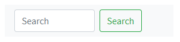

```java 

//FindBy(id = "#navbar-form-2")
@UI("#navbar-form-2")
public static NavbarForm navbarFormWithText;
//FindBy(id = "#navbar-form-3")
@UI("#navbar-form-3")
public static NavbarWithInputGroupForm navbarFormWithInputGroup;

@Test
public void checkSetValueInputGroup() {
    navbarFormWithInputGroup.inputGroup.input.setValue(inputText);
    navbarFormWithInputGroup.inputGroup.input.assertThat().text(is(inputText));
}

@Test
public void checkFormElements() {
    UIElement input = navbarFormWithText.form.core().find((By.tagName("input")));
    UIElement button = navbarFormWithText.form.core().find((By.tagName("button")));
    input.shouldBe().enabled();
    button.shouldBe().enabled().text(is(buttonText));
    navbarFormWithText.form.click();
}

```

Here is an example with provided Bootstrap v4.3 code:
  
```html
<nav class="navbar navbar-light bg-light" id="navbar-form-1">
    <form class="form-inline">
        <input class="form-control mr-sm-2" type="search" placeholder="Search"
               aria-label="Search" style="width: 135px">
        <button class="btn btn-outline-success my-2 my-sm-0"
                type="submit"
                onclick="alert('Search Main Button Clicked!');">Search
        </button>
    </form>
</nav>
```

Immediate children elements in .navbar use flex layout and will default to justify-content: between.


Here is an example with provided Bootstrap v4.3 code:
  
```html
<nav class="navbar navbar-light bg-light" id="navbar-form-2">
    <a class="navbar-brand">Navbar</a>
    <form class="form-inline">
        <input class="form-control mr-sm-2" type="search" placeholder="Search"
               aria-label="Search" style="width: 135px">
        <button class="btn btn-sm btn-outline-secondary my-2 my-sm-0"
                type="submit"
                onclick="alert('Search Smaller Button Clicked!');">Search
        </button>
    </form>
</nav>
```

Input groups work, too:


Here is an example with provided Bootstrap v4.3 code:
  
```html
<nav class="navbar navbar-light bg-light" id="navbar-form-3">
    <form class="form-inline">
        <div class="input-group">
            <div class="input-group-prepend">
                <span class="input-group-text" id="basic-addon1">@</span>
            </div>
            <input type="text" class="form-control" placeholder="Username"
                   aria-label="Username" aria-describedby="basic-addon1">
        </div>
    </form>
</nav>
```

Media object is represented by Section class in Java:
 
  [Section](https://jdi-docs.github.io/jdi-light/#section)

Inner elements of media object can be represented by the following classes:

  + [Form](https://jdi-docs.github.io/jdi-light/#form)     
  + [TextField](https://jdi-docs.github.io/jdi-light/#textfield)    
  + [Button](https://jdi-docs.github.io/jdi-light/#button)      
  + [Link](https://jdi-docs.github.io/jdi-light/#link)      
  + [See more elements](https://jdi-docs.github.io/jdi-light/#html5-common-elements) 

<a style="font-weight: bold;" target="_blank" href="https://github.com/jdi-testing/jdi-light/blob/bootstrap/jdi-light-bootstrap-tests/src/test/java/io/github/epam/bootstrap/tests/composite/section/navbar/NavbarFormsTests.java">Bootstrap test examples</a>
<br><br>

#### [Text](https://getbootstrap.com/docs/4.3/components/navbar/#text)
Navbars may contain bits of text with the help of ``.navbar-text``. 
This class adjusts vertical alignment and horizontal spacing for strings of text.

<br>


Here is an example with provided Bootstrap v4.3 code:

```java 
//@FindBy(xpath = "//h4[.='Navbar - Text']/../..") public static NavbarText navbarText;
@UI("//h4[.='Navbar - Text']/../..") public static NavbarText navbarText;

public class NavbarText extends Section {
    @UI("nav:nth-child(1)") public Text simpleText;
    @UI("nav.navbar.navbar-expand-lg.navbar-light.bg-light") public NavbarTextLinks complexNavbar;
}

@Test
public void verifySimpleNavbarTextTest() {
    navbarText.simpleText
        .is()
        .text(is(inlineElement));
}
```

  
```html
<nav class="navbar navbar-light bg-light">
   <span class="navbar-text">
	   Navbar text with an inline element
	</span>
</nav>
```

Mix and match with other components and utilities as needed.


Here is an example with provided Bootstrap v4.3 code:

```java 
public class NavbarTextLinks extends Section {
    @UI(".navbar-brand") public Link brand;
    @UI("ul li") public ListGroup listPages;
    @UI(".navbar-text") public Text simpleText;
}

@Test
public void verifyComplexNavbarHomeTest() {
    navbarText.complexNavbar.listPages.get(1)
        .is()
        .text(is(linkName1));
    navbarText.complexNavbar.listPages.get(1).click();
    newWindowTitleCheck(page1);
    navbarText.complexNavbar.listPages.get(2)
        .is()
        .text(is(linkName2));
    navbarText.complexNavbar.listPages.get(2).click();
    newWindowTitleCheck(page2);
    navbarText.complexNavbar.listPages.get(3)
        .is()
        .text(is(linkName3));
    navbarText.complexNavbar.listPages.get(3).click();
    newWindowTitleCheck(page3);
}
```

  
```html
<nav class="navbar navbar-expand-lg navbar-light bg-light">
    <a class="navbar-brand" href="https://getbootstrap.com/docs/4.3/components/navbar/#nav"
       target="_blank">Navbar w/ text</a>
    <button class="navbar-toggler" type="button" data-toggle="collapse"
            data-target="#navbarText"
            aria-controls="navbarText" aria-expanded="false" aria-label="Toggle navigation">
        <span class="navbar-toggler-icon"></span>
    </button>
    <div class="collapse navbar-collapse" id="navbarText">
        <ul class="navbar-nav mr-auto">
            <li class="nav-item active">
                <a class="nav-link" href="https://jdi-testing.github.io/jdi-light/index.html"
                   target="_blank">Home <span class="sr-only">(current)</span></a>
            </li>
            <li class="nav-item">
                <a class="nav-link" href="https://jdi-testing.github.io/jdi-light/html5.html"
                   target="_blank">HTML 5</a>
            </li>
            <li class="nav-item">
                <a class="nav-link"
                   href="https://jdi-testing.github.io/jdi-light/bootstrap.html"
                   target="_blank">Bootstrap</a>
            </li>
        </ul>
        <span class="navbar-text">
		  Navbar text with an inline element
		</span>
    </div>
</nav>
```

Available methods in Java JDI Light:

|Method | Description | Return Type
--- | --- | ---
**assertThat()** | Assert action | TextAssert
**click()** | Click the button | void
**get()** | Select button by index | action
**getText()** | Get button text | String
**is()** | Assert action | TextAssert 

<br><br> 

[Navbar-text test example](https://github.com/jdi-testing/jdi-light/blob/bootstrap/jdi-light-bootstrap-tests/src/test/java/io/github/epam/bootstrap/tests/composite/section/navbar/NavBarTextTests.java) <br>
<br>

Available methods and properties in C# JDI Light:

|Method/Property | Description | Return Type
--- | --- | ---
 |  | 
 |  | 
 |  |
 |  | 
<br><br>

#### [Color schemes](https://getbootstrap.com/docs/4.3/components/navbar/#color-schemes)

Theming the navbar has never been easier thanks to the combination of theming classes and ``background-color`` utilities
Choose from ``.navbar-light`` for use with light background colors, or ``.navbar-dark`` for dark background colors. Then, customize with ``.bg-*`` utilities.


Here is an example with provided Bootstrap v4.3 code:

```java 
public class NavbarColorScheme extends Navbar {

    //@FindBy(className = "navbar-brand")
    @UI(".navbar-brand")
    public Link navbarLink;

    //@FindBy(linkText = "Home\n(current)")
    @ByText("Home")
    public Link homeLink;

    //@FindBy(linkText = "Contact form")
    @ByText("Contact form")
    public Link contactFormLink;

    //@FindBy(linkText = "Metals & Colors")
    @ByText("Metals & Colors")
    public Link metalsAndColorsLink;

    //@FindBy(xpath = "//form/button")
    @UI("form button")
    public Button searchButton;
}

@Test(dataProvider = "navbarColorSchemesWithColors")
public void colorSchemeAccordanceTest(NavbarColorScheme navbarColorScheme, String bgColor, 
String navbarAndHomeColor, String contactAndMetalsColor, String searchColor) {
    navbarColorScheme.core().is()
            .css("background-color", bgColor);
    checkColorOfElement(navbarColorScheme.navbarLink, navbarAndHomeColor);
    checkColorOfElement(navbarColorScheme.homeLink, navbarAndHomeColor);
    checkColorOfElement(navbarColorScheme.contactFormLink, contactAndMetalsColor);
    checkColorOfElement(navbarColorScheme.metalsAndColorsLink, contactAndMetalsColor);
    checkColorOfElement(navbarColorScheme.searchButton, 
String.format("rgba%s, 1)", searchColor));
    navbarColorScheme.searchButton.core().is()
            .css("border-color", String.format("rgb%s)", searchColor));
}

private void checkColorOfElement(ICoreElement elem, String color) {
    elem.core().is()
            .css("color", color);
}
```
  
```html
<nav id="navbar-dark-colorscheme" class="navbar navbar-expand-lg navbar-dark bg-dark mb-1">
    <a class="navbar-brand"
       href="https://getbootstrap.com/docs/4.0/components/navbar/#color-schemes"
       target="_blank">Navbar</a>
    <button class="navbar-toggler collapsed" type="button" data-toggle="collapse"
            data-target="#navbarColor01" aria-controls="navbarColor01" aria-expanded="false"
            aria-label="Toggle navigation">
        <span class="navbar-toggler-icon"></span>
    </button>
    <div class="navbar-collapse collapse" id="navbarColor01" style="">
        <ul class="navbar-nav mr-auto">
            <li class="nav-item active">
                <a class="nav-link" href="https://jdi-testing.github.io/jdi-light/index.html"
                   target="_blank">Home <span class="sr-only">(current)</span></a>
            </li>
            <li class="nav-item">
                <a class="nav-link" href="https://jdi-testing.github.io/jdi-light/contacts.html"
                   target="_blank">Contact form</a>
            </li>
            <li class="nav-item">
                <a class="nav-link"
                   href="https://jdi-testing.github.io/jdi-light/metals-colors.html"
                   target="_blank">Metals & Colors</a>
            </li>
        </ul>
        <form class="form-inline">
            <input class="form-control mr-sm-2" type="search" placeholder="Search"
                   aria-label="Search">
            <button class="btn btn-outline-info my-2 my-sm-0" type="button"
                    onclick="alert('Search');">Search
            </button>
        </form>
    </div>
</nav>
```

Available methods in Java JDI Light:

|Method | Description | Return Type
--- | --- | ---
**assertThat()** | Assert action | TextAssert
**click()** | Click the button | void
**getText()** | Get button text | String
**is()** | Assert action | TextAssert 

<a href="https://github.com/jdi-testing/jdi-light/blob/bootstrap/jdi-light-bootstrap-tests/src/test/java/io/github/epam/bootstrap/tests/composite/section/navbar/NavbarColorSchemeTests.java">Bootstrap test examples</a>

<br><br>

#### [Containers](https://getbootstrap.com/docs/4.3/components/navbar/#containers)
Although it’s not required, you can wrap a navbar in a ``.container`` to center it on a page or add one within to only center the contents of a fixed or static top navbar.

```java 
public class NavbarContainer extends Section {
//@FindBy(id = "navbar-containers-centred")
    @UI("#navbar-containers-centred") public NavbarSimpleLinks navLinks1;
//@FindBy(id = "navbar-containers-expanded")
    @UI("#navbar-containers-expanded") public NavbarComplexLinks navbarComplexLinks;
}

@Test
  public void getNameNavbarContainerBrandTest() {
        navbarContainers.navLinks1.brand.is().text(textNavbarCentredContainer);
        navbarContainers.navbarComplexLinks.brand.is().text(textNavbarExpandedConteiner);
  }


@Test
public void clickNavbarCentredContainerLinksTest() {
     navbarContainers.navLinks1.brand.click();
     assertThat(WindowsManager.windowsCount(), is(2));
     WindowsManager.switchToWindow(2);
     assertThat(getUrl(), is(url));
     WindowsManager.closeWindow();
}


```


Here is an example with provided Bootstrap v4.3 code:
  
```html
<div class="container" id="navbar-containers-centred">
    <nav class="navbar navbar-expand-lg navbar-light bg-light mb-1">
        <a class="navbar-brand"
           href="https://getbootstrap.com/docs/4.3/components/navbar/#containers"
           target="_blank">Navbar</a>
    </nav>
</div>
```

When the container is within your navbar, its horizontal padding is removed at breakpoints lower than your specified ``.navbar-expand{-sm|-md|-lg|-xl}`` class.
This ensures we’re not doubling up on padding unnecessarily on lower viewports when your navbar is collapsed.
 
```html
<nav class="navbar navbar-expand-lg navbar-light bg-light mb-3"
     id="navbar-containers-expanded">
    <div class="container">
        <a class="navbar-brand"
           href="https://getbootstrap.com/docs/4.3/components/navbar/#containers"
           target="_blank">Navbar</a>
    </div>
</nav>
```

Container is represented by Section class in Java:
 
  [Section](https://jdi-docs.github.io/jdi-light/#section)  

Inner elements of media object can be represented by the following classes:
<ul>
    <li> [Collapse](https://jdi-docs.github.io/jdi-light/#collapse)  </li>
    <li> [DropDown](https://jdi-docs.github.io/jdi-light/#dropdown-2)  </li>
    <li> [See more elements](https://jdi-docs.github.io/jdi-light/#bootstrap-common-elements) </li>
</ul>

[Bootstrap test examples](https://github.com/jdi-testing/jdi-light/blob/bootstrap/jdi-light-bootstrap-tests/src/test/java/io/github/epam/bootstrap/tests/composite/section/NavbarContainersTest.java)

#### [Placement](https://getbootstrap.com/docs/4.3/components/navbar/#placement)
Use our position utilities to place navbars in non-static positions. Choose from fixed to the top, fixed to the bottom, or stickied to the top (scrolls with the page until it reaches the top, then stays there). Fixed navbars use position: fixed, meaning they’re pulled from the normal flow of the DOM and may require custom CSS (e.g., ``padding-top`` on the ``<body>``) to prevent overlap with other elements.

Also note that ``.sticky-top`` uses position: sticky, which isn’t fully supported in every browser.


Here is an example with provided Bootstrap v4.3 code:

```java 
//@FindBy(id = "navbar-sticky-top")
@UI("#navbar-sticky-top")
public static NavbarPlacement navbarPlacementStickyTop;

@Test
public void navbarPositionTest() {
    navbarPlacementStickyTop.show();
    navbarPlacementStickyTop.core()
            .is()
            .css("position", "sticky")
            .css("top", "0px");
}


```
    
```html
<nav class="navbar navbar-expand-lg sticky-top navbar-light bg-light" id="navbar-sticky-top">
    <a class="navbar-brand" href="https://getbootstrap.com/docs/4.3/components/navbar/#placement">Sticky Top</a>
    <button class="navbar-toggler" type="button" data-toggle="collapse" data-target="#navbarNav"
            aria-controls="navbarNav" aria-expanded="false" aria-label="Toggle navigation">
        <span class="navbar-toggler-icon"></span>
    </button>
    <div class="collapse navbar-collapse" id="navbarNav">
        <ul class="navbar-nav">
            <li class="nav-item active">
                <a class="nav-link" href="javascript: void();"> <span class="sr-only"></span>Home</a>
            </li>
            <li class="nav-item">
                <a class="nav-link" href="javascript: void();">Features</a>
            </li>
            <li class="nav-item">
                <a class="nav-link" href="javascript: void();">Pricing</a>
            </li>
            <li class="nav-item">
                <a class="nav-link disabled" href="javascript: void();" tabindex="-1" aria-disabled="true">Disabled</a>
            </li>
        </ul>
    </div>
</nav>
```

Available methods in Java JDI Light:

|Method | Description | Return Type
--- | --- | ---
**click()** | Click a link | void
**css()** | Match passed value with the element css | isAssert
**getRect()** | Get element rectangle | Rectangle
**is()** | Assertelement | isAssert 
**jsExecute()** | Execute javascript | String
**text()** | Check whether a text matches a pattern | isAssert

<a href="https://github.com/jdi-testing/jdi-light/blob/bootstrap/jdi-light-bootstrap-tests/src/test/java/io/github/epam/bootstrap/tests/composite/section/navbar/NavbarPlacementTests.java">Bootstrap test examples</a>

<br><br>

#### [Responsive behaviors](https://getbootstrap.com/docs/4.3/components/navbar/#responsive-behaviors)

Navbars can utilize ``.navbar-toggler``, ``.navbar-collapse``, and ``.navbar-expand{-sm|-md|-lg|-xl}`` classes to change when their content collapses behind a button. 
In combination with other utilities, you can easily choose when to show or hide particular elements.

For navbars that never collapse, add the ``.navbar-expand`` class on the navbar. 
For navbars that always collapse, don’t add any ``.navbar-expand`` class.

##### [Navbar Toggler](https://getbootstrap.com/docs/4.3/components/navbar/#toggler)

Navbar togglers are left-aligned by default, but should they follow a sibling element like a ``.navbar-brand``, they’ll automatically be aligned to the far right. 
Reversing your markup will reverse the placement of the toggler. 
Below are examples of different toggle styles.

**1. With no ``.navbar-brand`` shown in lowest breakpoint**

``FullScreen``


``Collapsed``


``Expanded``
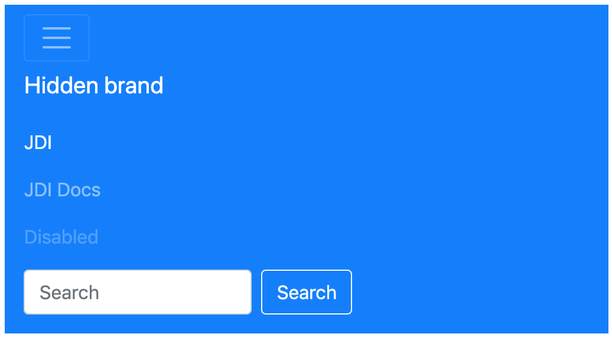

Here is an example with provided Bootstrap v4.3 code:
  
```html
<nav class="navbar navbar-expand-lg navbar-dark bg-primary mb-2">
    <button class="navbar-toggler collapsed" type="button" data-toggle="collapse"
            data-target="#navbarTogglerDemo01" aria-controls="navbarTogglerDemo01"
            aria-expanded="false" aria-label="Toggle navigation">
        <span class="navbar-toggler-icon"></span>
    </button>
    <div class="navbar-collapse collapse" id="navbarTogglerDemo01" style="">
        <a class="navbar-brand" href="javascript:void();">Hidden brand</a>
        <ul class="navbar-nav mr-auto mt-2 mt-lg-0">
            <li class="nav-item active">
                <a class="nav-link" href="https://github.com/jdi-testing/jdi-light"
                   target="_blank">JDI <span class="sr-only">(current)</span></a>
            </li>
            <li class="nav-item">
                <a class="nav-link" href="https://jdi-docs.github.io/jdi-light/#navbar"
                   target="_blank">JDI Docs</a>
            </li>
            <li class="nav-item">
                <a class="nav-link disabled" href="#" tabindex="-1"
                   aria-disabled="true">Disabled</a>
            </li>
        </ul>
        <form class="form-inline my-2 my-lg-0">
            <input class="form-control mr-sm-2" type="search" placeholder="Search"
                   aria-label="Search">
            <button class="btn btn-outline-light my-2 my-sm-0" type="submit"
                    onclick="alert('Search Button Clicked!');">Search
            </button>
        </form>
    </div>
</nav>
```

**2. With a brand name shown on the left and toggler on the right**

``FullScreen``


``Collapsed``


``Expanded``
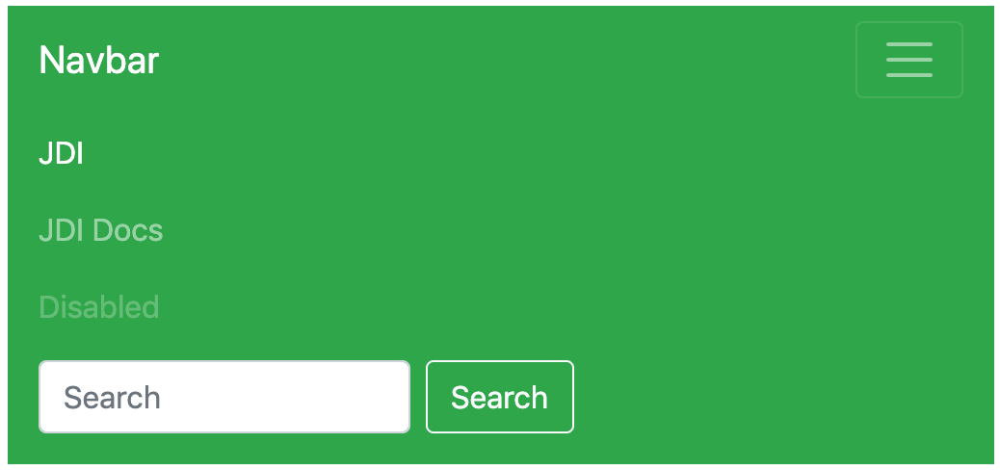

Here is an example with provided Bootstrap v4.3 code:
  
```html
<nav class="navbar navbar-expand-lg navbar-dark bg-success mb-2">
    <a class="navbar-brand" href="javascript:void();">Navbar</a>
    <button class="navbar-toggler" type="button" data-toggle="collapse"
            data-target="#navbarTogglerDemo02" aria-controls="navbarTogglerDemo02"
            aria-expanded="false" aria-label="Toggle navigation">
        <span class="navbar-toggler-icon"></span>
    </button>

    <div class="collapse navbar-collapse" id="navbarTogglerDemo02">
        <ul class="navbar-nav mr-auto mt-2 mt-lg-0">
            <li class="nav-item active">
                <a class="nav-link" href="https://github.com/jdi-testing/jdi-light"
                   target="_blank">JDI <span class="sr-only">(current)</span></a>
            </li>
            <li class="nav-item">
                <a class="nav-link" href="https://jdi-docs.github.io/jdi-light/#navbar"
                   target="_blank">JDI Docs</a>
            </li>
            <li class="nav-item">
                <a class="nav-link disabled" href="#" tabindex="-1"
                   aria-disabled="true">Disabled</a>
            </li>
        </ul>
        <form class="form-inline my-2 my-lg-0">
            <input class="form-control mr-sm-2" type="search" placeholder="Search">
            <button class="btn btn-outline-light my-2 my-sm-0" type="submit"
                    onclick="alert('Search Button Clicked!');">Search
            </button>
        </form>
    </div>
</nav>
```

**3. With a toggler on the left and brand name on the right**

``FullScreen``


``Collapsed``


``Expanded``


Here is an example with provided Bootstrap v4.3 code:
  
```html
<nav class="navbar navbar-expand-lg navbar-dark mb-3 bg-dark">
    <button class="navbar-toggler collapsed" type="button" data-toggle="collapse"
            data-target="#navbarTogglerDemo03" aria-controls="navbarTogglerDemo03"
            aria-expanded="false" aria-label="Toggle navigation">
        <span class="navbar-toggler-icon"></span>
    </button>
    <a class="navbar-brand" href="javascript:void();">Navbar</a>

    <div class="navbar-collapse collapse" id="navbarTogglerDemo03" style="">
        <ul class="navbar-nav mr-auto mt-2 mt-lg-0">
            <li class="nav-item active">
                <a class="nav-link" href="https://github.com/jdi-testing/jdi-light"
                   target="_blank">JDI <span class="sr-only">(current)</span></a>
            </li>
            <li class="nav-item">
                <a class="nav-link" href="https://jdi-docs.github.io/jdi-light/#navbar"
                   target="_blank">JDI Docs</a>
            </li>
            <li class="nav-item">
                <a class="nav-link disabled" href="#" tabindex="-1"
                   aria-disabled="true">Disabled</a>
            </li>
        </ul>
        <form class="form-inline my-2 my-lg-0">
            <input class="form-control mr-sm-2" type="search" placeholder="Search"
                   aria-label="Search">
            <button class="btn btn-outline-light my-2 my-sm-0" type="submit"
                    onclick="alert('Search Button Clicked!');">Search
            </button>
        </form>
    </div>
</nav>
```

<br>

##### [External content](https://getbootstrap.com/docs/4.3/components/navbar/#external-content)
Plugin to trigger hidden content elsewhere on the page.


Here is an example with provided Bootstrap v4.3 code:

```java 
@UI("#navbar-external-content") //FindBy(css = "#navbar-external-content")
public static NavbarExternalContent navbarExternalContent;

@Test
public void expandingTest() {
    navbarExternalContent.toggler.expander().is().core().attr(ariaExpanded, "false");
    navbarExternalContent.toggler.expand();
    navbarExternalContent.toggler.expander().is().core().attr(ariaExpanded, "true");
    navbarExternalContent.toggler.collapse();
    navbarExternalContent.toggler.expander().is().core().attr(ariaExpanded, "false");
}

@Test
public void getTextTest() {
    navbarExternalContent.toggler.expand();
    navbarExternalContent.toggler.value().children().get(1).is()
            .displayed()
            .text(text);
    navbarExternalContent.toggler.value().children().get(2).is()
            .displayed()
            .text(mutedText);
    navbarExternalContent.toggler.collapse();
}

```

```html
<div class="pos-f-t" id="navbar-external-content">
    <div class="collapse" id="navbarToggleExternalContent">
        <div class="bg-dark p-4">
            <h5 class="text-white h4">Collapsed content</h5>
            <span class="text-muted">Toggleable via the navbar brand.</span>
        </div>
    </div>
    <nav class="navbar navbar-dark bg-dark">
        <button class="navbar-toggler" type="button" data-toggle="collapse"
                data-target="#navbarToggleExternalContent"
                aria-controls="navbarToggleExternalContent" aria-expanded="false"
                aria-label="Toggle navigation">
            <span class="navbar-toggler-icon"></span>
        </button>
    </nav>
</div>
```

Navbar - External content is represented by Section class in Java:
 
  [Section](https://jdi-docs.github.io/jdi-light/#section)

Inner elements of Navbar - External content can be represented by the following classes:

  + [Collapse](https://jdi-docs.github.io/jdi-light/#collapse)   
    
  + [Text](https://jdi-docs.github.io/jdi-light/#text)       

Available methods in Java JDI Light:

|Method/Property | Description | Return Type
--- | --- | ---
**assertThat()** | Assert action | TextAssert
**collapse()** | Collapses element  | void
**expand()** | Expands element  | void
**getText()** | Get current value | String 
**is()** | Assert action | TextAssert 

<a href="https://github.com/jdi-testing/jdi-light/blob/bootstrap/jdi-light-bootstrap-tests/src/test/java/io/github/epam/bootstrap/tests/composite/section/navbar/ExternalContentTests.java" target=a_blank> Bootstrap test examples </a>
<br>


###Progress
Progress is located in the following class:

  - __Java__: _com.epam.jdi.light.ui.bootstrap.elements.common.Progress_
  
<a style="font-weight: bold;" target="_blank" href="https://getbootstrap.com/docs/4.3/components/progress/">Progress</a> is custom progress bar featuring support for stacked bars, animated backgrounds, and text labels.

There is also a complex element <a style="font-weight: bold;" href="https://jdi-docs.github.io/jdi-light/?java#multiple-progress-bars">MultiplebarsProgress</a> which may consist of several progress bars.


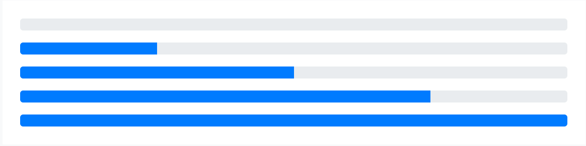

Here is an example with provided Bootstrap v4.3 code:_

```java 
//FindBy(css = "#progress-bar-base-width-25 .progress-bar"
@UI("#progress-bar-base-width-25 .progress-bar")  
public static Progress progressBaseWidth25;

@Test(dataProvider = "progressWidth")
public void getWidthTest(Progress progress, String width) {
   progress.is().value(width);
}

@Test(dataProvider = "progressColor")
public void getColorTest(Progress progress, String color) {
   progress.is().color(color);
}
```
  
```html 
<div id="progress-base">
    <p>base</p>
    <div class="progress" id="progress-bar-base-width-0">
        <div class="progress-bar" role="progressbar" aria-valuenow="0" aria-valuemin="0" aria-valuemax="100"></div>
    </div>
    <div class="progress" id="progress-bar-base-width-25">
        <div class="progress-bar" role="progressbar" style="width: 25%" aria-valuenow="25" aria-valuemin="0" aria-valuemax="100"></div>
    </div>
    <div class="progress" id="progress-bar-base-width-50">
        <div class="progress-bar" role="progressbar" style="width: 50%" aria-valuenow="50" aria-valuemin="0" aria-valuemax="100"></div>
    </div>
    <div class="progress" id="progress-bar-base-width-75">
        <div class="progress-bar" role="progressbar" style="width: 75%" aria-valuenow="75" aria-valuemin="0" aria-valuemax="100"></div>
    </div>
    <div class="progress" id="progress-bar-base-width-100">
        <div class="progress-bar" role="progressbar" style="width: 100%" aria-valuenow="100" aria-valuemin="0" aria-valuemax="100"></div>
    </div>
</div>
```

Available methods in Java JDI Light:

|Method/Property | Description | Return Type
--- | --- | ---
**animated()** | Match passed value with the progress css _'animation-name'_ | ProgressAssert
**color()** | Match passed value with the progress css _'background-color'_ | ProgressAssert
**getValue()** | Get aria value of the bar | String
**getMaxValue()** | Get max value of the bar  | String
**getMinValue()** | Get min value of the bar  | String
**getColor()** | Get color of the bar  | String
**getStyle()** | Get style of the bar | String
**height()** | Match passed value with the progress height | ProgressAssert
**is()** | Various assert actions for Progress | ProgressAssert 
**maxValue()** | Match passed value with the progress value _'aria-valuemax'_ | ProgressAssert
**minValue()** | Match passed value with the progress value _'aria-valuemin'_ | ProgressAssert
**value()** | Match passed value with the progress value _'aria-valuenow'_ | ProgressAssert

<a href="https://github.com/jdi-testing/jdi-light/blob/bootstrap/jdi-light-bootstrap-tests/src/test/java/io/github/epam/bootstrap/tests/common/progress/ProgressBaseTests.java" target=a_blank> Bootstrap test examples </a>

<br><br><br><br><br>

####Labels

Add <a style="font-weight: bold;" target="_blank" href="https://getbootstrap.com/docs/4.3/components/progress/#labels">labels</a> to your progress bars by placing text within the `.progress-bar`.


Here is an example with provided Bootstrap v4.3 code:

```java 
//@FindBy(css = "#progress-with-labels")
@UI("#progress-with-labels") 
public static Progress progressWithLabels; 

@Test
public void getDefaultPercentTest() {
   assertThat(progressWithLabels.core().getText(), is(defaultPercent));
}
 
@Test
public void getPercentTest() {
   progressWithLabels.core().is().text(defaultPercent);
   minus.click();
   progressWithLabels.core().is().text("20%");
   for (int i = 0; i < 10; i++) {
       minus.click();
   }
   progressWithLabels.core().is().text(minPercent);
   plus.click();
   progressWithLabels.core().is().text("5%");
   for (int i = 0; i < 30; i++) {
       plus.click();
   }
   progressWithLabels.core().is().text(maxPercent);
}
```
  
```html 
<div class="progress">
    <div id="progress-with-labels" class="progress-bar" role="progressbar" style="width: 25%;" aria-valuenow="25" aria-valuemin="0" aria-valuemax="100">25%</div>
</div>
```

<a href="https://github.com/jdi-testing/jdi-light/tree/bootstrap/jdi-light-bootstrap-tests/src/test/java/io/github/epam/bootstrap/tests/common/progress/ProgressWithLabelsTests.java" target=a_blank> Bootstrap test examples </a>

<br><br><br><br><br><br><br><br><br><br><br><br><br><br>

####Height

We only set a <a style="font-weight: bold;" target="_blank" href="https://getbootstrap.com/docs/4.3/components/progress/#height">height</a>
 value on the .progress, so if you change that value the inner .progress-bar will automatically resize accordingly.


Here is an example with provided Bootstrap v4.3 code:

```java 
//@FindBy(css = "#progress-height .progress")
@UI("#progress-height .progress")
public static JList<ProgressSection> progressHeightSections;

@Test
public void heightOfSectionShouldBeValid() {
   for (ProgressSection section : progressHeightSections) {
       int actualHeight = section.core().getSize().getHeight();
       int expectedHeight = section.getProgressSectionHeightValueInPx();
       assertEquals(actualHeight, expectedHeight);
   }
}

@Test
public void heightOfBarShouldBeValid() {
   for (ProgressSection section : progressHeightSections) {
       int expectedBarHeight = section.getProgressSectionHeightValueInPx();
       section.progress.is().height(expectedBarHeight);
   }
}

```
  
```html 
<div id="progress-height">
    <p>various heights</p>
          <div class="progress" id="progress-height-20px" style="height: 20px;">
              <div class="progress-bar bg-success" role="progressbar" style="width: 25%" aria-valuenow="25" aria-valuemin="0" aria-valuemax="100"></div>
          </div>
          <div class="progress" id="progress-height-40px" style="height: 40px;">
              <div class="progress-bar bg-info" role="progressbar" style="width: 50%" aria-valuenow="50" aria-valuemin="0" aria-valuemax="100"></div>
          </div>
          <div class="progress" id="progress-height-60px" style="height: 60px;">
              <div class="progress-bar bg-warning" role="progressbar" style="width: 75%" aria-valuenow="75" aria-valuemin="0" aria-valuemax="100"></div>
          </div>
          <div class="progress" id="progress-height-80px" style="height: 80px;">
              <div class="progress-bar bg-danger" role="progressbar" style="width: 100%" aria-valuenow="100" aria-valuemin="0" aria-valuemax="100"></div>
          </div>
      </div>
```  

<a href="https://github.com/jdi-testing/jdi-light/tree/bootstrap/jdi-light-bootstrap-tests/src/test/java/io/github/epam/bootstrap/tests/common/progress/ProgressHeightTests.java" target=a_blank> Bootstrap test examples </a>

<br><br><br><br><br>

####Backgrounds

Use <a style="font-weight: bold;" target="_blank" href="https://getbootstrap.com/docs/4.3/components/progress/#backgrounds">background</a> utility classes to change the appearance of individual progress bars.

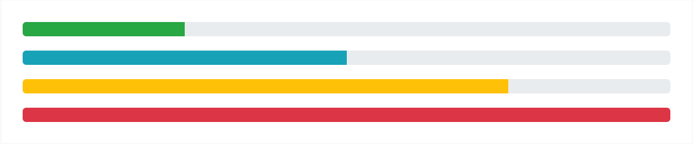

Here is an example with provided Bootstrap v4.3 code:
  
```java 
//@FindBy(css = "#progress-background-green")
@UI("#progress-backgrounds-green") public static Progress progressBackgroundGreen;
//@FindBy(css = "#progress-background-blue")
@UI("#progress-backgrounds-blue") public static Progress progressBackgroundBlue;
//@FindBy(css = "#progress-background-yellow")
@UI("#progress-backgrounds-yellow") public static Progress progressBackgroundYellow;
//@FindBy(css = "#progress-background-red")
@UI("#progress-backgrounds-red") public static Progress progressBackgroundRed;

@DataProvider(name = "progressBackgroundsWithAttributes")
public static Object[][] progressBackgroundsWithAttributes() {
   return new Object[][]{
           {progressBackgroundGreen, 25, "rgba(40, 167, 69, 1)"},
           {progressBackgroundBlue, 50, "rgba(23, 162, 184, 1)"},
           {progressBackgroundYellow, 75, "rgba(255, 193, 7, 1)"},
           {progressBackgroundRed, 100, "rgba(220, 53, 69, 1)"}
   };
}

@Test(dataProvider = "progressBackgroundsWithAttributes")
public void isValidationTest(ICoreElement progressBackground, int widthNumber, String color) {
   progressBackground.core().is()
           .tag(is("div"))
           .attr("role", "progressbar")
           .attr("style", String.format("width: %s%%;", widthNumber))
           .attr("aria-valuenow", widthNumber + "")
           .attr("aria-valuemin", "0")
           .attr("aria-valuemax", "100")
           .css("background-color", color);
}

```
  
```html 
<div class="progress">
    <div id="progress-backgrounds-green" class="progress-bar bg-success" role="progressbar" style="width: 25%" aria-valuenow="25" aria-valuemin="0" aria-valuemax="100"></div>
</div>
<div class="progress">
    <div id="progress-backgrounds-blue" class="progress-bar bg-info" role="progressbar" style="width: 50%" aria-valuenow="50" aria-valuemin="0" aria-valuemax="100"></div>
</div>
<div class="progress">
    <div id="progress-backgrounds-yellow" class="progress-bar bg-warning" role="progressbar" style="width: 75%" aria-valuenow="75" aria-valuemin="0" aria-valuemax="100"></div>
</div>
<div class="progress">
    <div id="progress-backgrounds-red" class="progress-bar bg-danger" role="progressbar" style="width: 100%" aria-valuenow="100" aria-valuemin="0" aria-valuemax="100"></div>
</div>
```

<a href="https://github.com/jdi-testing/jdi-light/blob/bootstrap/jdi-light-bootstrap-tests/src/test/java/io/github/epam/bootstrap/tests/common/progress/ProgressBackgroundTests.java" target=a_blank> Bootstrap test examples </a>

<br><br><br><br><br><br><br><br><br><br><br><br><br><br><br>

####Striped

Add <a style="font-weight: bold;" target="_blank" href="https://getbootstrap.com/docs/4.3/components/progress/#striped">.progress-bar-striped</a> to any `.progress-bar to apply` a stripe via CSS gradient over the progress bar’s background color.


Here is an example with provided Bootstrap v4.3 code:

```java 
//@FindBy(css = "#striped-base .progress")    
@UI("#striped-base .progress") 
public static JList<ProgressSection> progressSections;
   
@Test(dataProvider = "progressData")
public void checkProgressData(String progressId, String value, String color,
                              String min, String max, String classStriped
    progressSections.stream().filter(progressSection ->
            progressSection.progress.attr("id").equals(progressId)).forEach(
            progressSection -> {
                progressSection.progress.is().core().hasClass(classStriped);
                progressSection.progress.is().value(value)
                        .color(color)
                        .minValue(min)
                        .maxValue(max);
            });
}

```

```html 
<div id="striped-base">
    <br>
    <p>striped</p>

    <div class="progress">
        <div class="progress-bar progress-bar-striped" id="striped_ordinary" role="progressbar" style="width: 10%" aria-valuenow="10" aria-valuemin="0" aria-valuemax="100"></div>
    </div>
    <div class="progress">
        <div class="progress-bar progress-bar-striped bg-success" id="striped_success" role="progressbar" style="width: 25%" aria-valuenow="25" aria-valuemin="0" aria-valuemax="100"></div>
    </div>
    <div class="progress">
        <div class="progress-bar progress-bar-striped bg-info" id="striped_info" role="progressbar" style="width: 50%" aria-valuenow="50" aria-valuemin="0" aria-valuemax="100"></div>
    </div>
    <div class="progress">
        <div class="progress-bar progress-bar-striped bg-warning" id="striped_warning" role="progressbar" style="width: 75%" aria-valuenow="75" aria-valuemin="0" aria-valuemax="100"></div>
    </div>
    <div class="progress">
        <div class="progress-bar progress-bar-striped bg-danger" id="striped_danger" role="progressbar" style="width: 100%" aria-valuenow="100" aria-valuemin="0" aria-valuemax="100"></div>
    </div>
</div>
```

<a href="https://github.com/jdi-testing/jdi-light/blob/bootstrap/jdi-light-bootstrap-tests/src/test/java/io/github/epam/bootstrap/tests/common/progress/ProgressBarsListTests.java" target=a_blank> Bootstrap test examples </a>

<br><br><br><br><br><br>


####Animated stripes

The striped gradient can also be <a style="font-weight: bold;" target="_blank" href="https://getbootstrap.com/docs/4.3/components/progress/#animated-stripes">animated</a>.
Add .progress-bar-animated to .progress-bar to animate the stripes right to left via CSS3 animations.

Here is an example with provided Bootstrap v4.3 code:

```java 
//FindBy(css = "#progress-animated")
@UI("#progress-animated") 
public static Progress progressAnimated;

@Test
public void isValidationTest() {
   progressAnimated.is()
           .animated("progress-bar-stripes")
           .color("rgba(0, 123, 255, 1)")
           .value("75");
}
```
  
```html 
<div class="progress">
    <div class="progress-bar progress-bar-striped progress-bar-animated" id="progress-animated" role="progressbar" aria-valuenow="75" aria-valuemin="0" aria-valuemax="100" style="width: 75%"></div>
</div>
```

<a href="https://github.com/jdi-testing/jdi-light/blob/bootstrap/jdi-light-bootstrap-tests/src/test/java/io/github/epam/bootstrap/tests/common/progress/ProgressAnimatedStripesTests.java" target=a_blank> Bootstrap test examples </a>
<br><br><br><br><br><br><br><br>

###Spinners

Bootstrap “spinners” can be used to show the loading state in your projects. 
They’re built only with HTML and CSS, meaning you don’t need any JavaScript to create them. 
You will, however, need some custom JavaScript to toggle their visibility. 
Their appearance, alignment, and sizing can be easily customized with Bootstrap utility classes.

For accessibility purposes, each loader in the examples below includes ``role="status"`` and a nested ``<span class="sr-only">Loading...</span>``.

Spinners are represented by the following class in JDI:
 
  - __Java__: <a href="https://github.com/jdi-testing/jdi-light/blob/bootstrap/jdi-light-bootstrap/src/main/java/com/epam/jdi/light/ui/bootstrap/elements/common/Spinner.java">Spinner</a>
  - __C#__: TBD
  
  
 Available methods in Java JDI Light:
  
|Method/Property | Description | Return Type
--- | --- | ---
**color()**	 |  Assert action	| SpinnerAssert
**disappearAfter(int sec)**|Wait when spinner disappear | Spinner
**getColor()** |Get item color | String
**is()**	 |  Assert action	| SpinnerAssert
 

**Border Spinner**

```java 

// @FindBy(id = "button-show-spinner-border")
@UI("#button-show-spinner-border") 
public static Button buttonSpinnerBorder; 
// @FindBy(css = "#spinner-border")
@UI("#spinner-border") public static Spinner spinnerBorder; 

@Test()
public void checkSpinnerClass() {
  spinnerBorder.assertThat().core().hasClass("spinner-border");
}

@Test(priority = 1)
public void checkSpinnerAppearAndThenDisappear() {
  buttonSpinnerBorder.click();
  spinnerBorder.disappearAfter(4);
}

```

<a style="font-weight:bold" href="https://getbootstrap.com/docs/4.3/components/spinners/#border-spinner" target="_blank">Border Spinner</a> - use the border spinners for a lightweight loading indicator.


Here is an example with provided Bootstrap v4.3 code:

```html
<div class="spinner-border" role="status">
    <span class="sr-only">Loading...</span>
</div>
```

[Bootstrap test examples](https://github.com/jdi-testing/jdi-light/tree/bootstrap/jdi-light-bootstrap-tests/src/test/java/io/github/epam/bootstrap/tests/common/spinner/SpinnerBorderTests.java)


#### Colors
 ```java 
 // @FindBy(id = "spinner-text-primary")
 @UI("#spinner-text-primary") 
 public static Spinner spinnerWithTextPrimary; 
 // @FindBy(css = "#spinner-text-light")
 @UI("#spinner-text-light") 
 public static Spinner spinnerWithTextLight; 
 
 @Test(dataProvider = "Color Spinners")
 public void assertColorTests(Spinner colorSpinner, String color)
 {
     colorSpinner.is().color(color);
  }
 
 @Test(dataProvider = "Color Spinners")
 public void assertSpinnerColorTests(Spinner colorSpinner,
                                             String color){
     colorSpinner.is()
         .core()
         .cssClass(containsString(color));
  }
 
 @Test(dataProvider = "Color Spinners")
 public void assertColorByHasClassTests(Spinner colorSpinner,
                                                String color){
     colorSpinner.core().hasClass("spinner-border" + color);
  }
 
 @Test(dataProvider = "Color Spinners")
 public void isValidationTest(Spinner colorSpinner, String __){
     colorSpinner.is()
         .displayed()
         .core()
         .css("font-size", is("14px"))
         .cssClass(containsString("spinner-border"))
         .attr("role", "status");
  }
 ```

The border spinner uses <a style="font-weight:bold" href="https://getbootstrap.com/docs/4.3/components/spinners/#colors" target="_blank">currentColor</a>
 for its border-color, 
meaning you can customize the color with <a href="https://getbootstrap.com/docs/4.3/utilities/colors/" target="_blank">text color utilities</a>. 
You can use any of our text color utilities on the standard spinner.


Here is an example with provided Bootstrap v4.3 code:

```html
<div class="spinner-border text-primary" role="status" id="spinner-text-primary">
    <span class="sr-only">Loading...</span>
</div>
<div class="spinner-border text-secondary" role="status" id="spinner-text-secondary">
    <span class="sr-only">Loading...</span>
</div>
<div class="spinner-border text-success" role="status" id="spinner-text-success">
    <span class="sr-only">Loading...</span>
</div>
<div class="spinner-border text-danger" role="status" id="spinner-text-danger">
    <span class="sr-only">Loading...</span>
</div>
<div class="spinner-border text-warning" role="status" id="spinner-text-warning">
    <span class="sr-only">Loading...</span>
</div>
<div class="spinner-border text-info" role="status" id="spinner-text-info">
    <span class="sr-only">Loading...</span>
</div>
<div class="spinner-border text-light" role="status" id="spinner-text-light">
    <span class="sr-only">Loading...</span>
</div>
<div class="spinner-border text-dark" role="status" id="spinner-text-dark">
    <span class="sr-only">Loading...</span>
</div>
```

<a href="https://github.com/jdi-testing/jdi-light/blob/bootstrap/jdi-light-bootstrap-tests/src/test/java/io/github/epam/bootstrap/tests/common/spinner/SpinnerColorTests.java" target="_blank">Bootstrap test example with colored spinners</a>

<br><br>

#### Growing Spinners

```java 

// @FindBy(id = "growing-spinners")
@UI("#growing-spinners")
public static GrowingSpinnersSection growingSpinners;

// @FindBy(css = ".text-primary")
@UI(".text-primary")
public Spinner primarySpinner;

// @FindBy(css = ".text-secondary")
@UI(".text-secondary")
public Spinner secondarySpinner;

// @FindBy(css = ".text-success")
@UI(".text-success")
public Spinner successSpinner;

// @FindBy(css = ".text-danger")
@UI(".text-danger")
public Spinner dangerSpinner;

private static final String spinnerGrowClass = "spinner-grow";

@DataProvider
public Object[][] spinnerData() {
    return new Object[][] {
            {growingSpinners.primarySpinner},
            {growingSpinners.secondarySpinner},
            {growingSpinners.successSpinner},
            {growingSpinners.dangerSpinner}
    };
}

@Test(dataProvider = "spinnerData")
public void spinnerHasGrowClassTest(Spinner spinner) {
    spinner.highlight();
    spinner.is().core().hasClass(spinnerGrowClass);
}

@Test(dataProvider = "spinnerData")
public void isValidationTest(Spinner spinner) {
    spinner.highlight();
    spinner
            .is()
            .displayed()
            .and()
            .enabled();
}
```

If you don’t fancy a border spinner, switch to the <a style="font-weight: bold;" href="https://getbootstrap.com/docs/4.3/components/spinners/#growing-spinner" target="_blank">grow spinner</a>.

Once again, this spinner is built with currentColor, so you can easily change its appearance with <a href="https://getbootstrap.com/docs/4.3/utilities/colors/" target="_blank">text color utilities</a>. 
Below it is in blue, along with the supported variants.


Here is an example with provided Bootstrap v4.3 code:

```html
<div id="growing-spinners">
    <div class="spinner-grow text-primary" role="status">
        <span class="sr-only">Loading...</span>
    </div>
    <div class="spinner-grow text-secondary" role="status">
        <span class="sr-only">Loading...</span>
    </div>
    <div class="spinner-grow text-success" role="status">
        <span class="sr-only">Loading...</span>
    </div>
    <div class="spinner-grow text-danger" role="status">
        <span class="sr-only">Loading...</span>
    </div>
    <div class="spinner-grow text-warning" role="status">
        <span class="sr-only">Loading...</span>
    </div>
    <div class="spinner-grow text-info" role="status">
        <span class="sr-only">Loading...</span>
    </div>
    <div class="spinner-grow text-light" role="status">
        <span class="sr-only">Loading...</span>
    </div>
    <div class="spinner-grow text-dark" role="status">
        <span class="sr-only">Loading...</span>
    </div>
</div>
```

<a href="https://github.com/jdi-testing/jdi-light/blob/bootstrap/jdi-light-bootstrap-tests/src/test/java/io/github/epam/bootstrap/tests/common/spinner/GrowingSpinnersTests.java" target="_blank">Bootstrap Test Examples</a>

<br><br><br><br><br><br>

#### Spinner Alignment

Spinners in Bootstrap are built with ``rem``s, ``currentColor``, and ``display: inline-flex``. 
This means they can easily be resized, recolored, and <a style="font-weight: bold;" href="https://getbootstrap.com/docs/4.3/components/spinners/#alignment" target="_blank">quickly aligned</a>.


**Spinner Margin**

```java 

// @FindBy(id = "spinner-alignment")
@UI("#spinner-alignment") 
public static SpinnerAlignmentSection spinnerAlignment

@Test(dataProvider = "spinnerData")
public void isValidationTest(Spinner spinner) {
    spinner.children().get(0).highlight();
    spinner
            .is()
            .enabled()
            .and()
            .displayed();
}

@Test(dataProvider = "spinnerStyleData")
public void spinnerAlignmentStyleTest(Spinner spinner,
                                       String style) {
    spinner.is().core().hasClass(style);
}
```

Use margin utilities like ``.m-5`` for easy spacing.


Here is an example with provided Bootstrap v4.3 code:

```html
<div class="border mb-3 p-3">
    <div class="spinner-border" role="status">
        <span class="sr-only">Loading...</span>
    </div>
</div>
```

**Spinner Placement**

Use <a href="https://getbootstrap.com/docs/4.3/utilities/flex/" target="_blank">flexbox utilities</a>,
<a href="https://getbootstrap.com/docs/4.3/utilities/float/" target="_blank">float utilities</a>, or <a href="https://getbootstrap.com/docs/4.3/content/typography/" target="_blank">text alignment</a> utilities
to place spinners exactly where you need them in any situation.


**Spinner Flex**


Here are the examples with provided Bootstrap v4.3 code:

```html
<div class="d-flex justify-content-center border mb-3 p-3">
    <div class="spinner-border" role="status">
        <span class="sr-only">Loading...</span>
    </div>
</div>
```

```html
<div class="d-flex align-items-center border mb-3 p-3">
    <div class="spinner-border ml-auto" role="status" 
        aria-hidden="true"></div>
</div>
```


**Spinner Floats**


Here is an example with provided Bootstrap v4.3 code:

```html
<div class="clearfix border mb-3 p-3">
    <div class="spinner-border float-right" role="status">
        <span class="sr-only">Loading...</span>
    </div>
</div>
```


**Spinner Text Align**


Here is an example with provided Bootstrap v4.3 code:

```html
<div class="text-center mb-3 border p-3">
    <div class="spinner-border" role="status">
        <span class="sr-only">Loading...</span>
    </div>
</div>
```

<a href="https://github.com/jdi-testing/jdi-light/blob/bootstrap/jdi-light-bootstrap-tests/src/test/java/io/github/epam/bootstrap/tests/common/spinner/SpinnerAlignmentTests.java" target="_blank">Bootstrap Test Examples</a>

#### Spinner Size

```java 

// @FindBy(id = "spinner-size")
@UI("#spinner-size") 
public static SpinnerSizeSection spinnerSize;

// @FindBy(css = ".spinner-border-sm")
@UI(".spinner-border-sm")
public Spinner smallSpinner;

// @FindBy(css = ".spinner-grow-sm")
@UI(".spinner-grow-sm")
public Spinner smallGrowingSpinner;

// @FindBy(id = "spinBorder")
@UI("#spinBorder")
public Spinner spinner;

// @FindBy(id = "spinGrow")
@UI("#spinGrow")
public Spinner growingSpinner;

private static final String smallSpinnerClass =
                                     "spinner-border-sm";
private static final String smallGrowingSpinnerClass =
                                     "spinner-grow-sm";
private static final String spinnerStyleValue = 
        "width: 3rem; height: 3rem; border: 3px dashed red";

@DataProvider
public Object[][] spinnerData() {
    return new Object[][] {
            {spinnerSize.smallSpinner},
            {spinnerSize.smallGrowingSpinner},
            {spinnerSize.spinner},
            {spinnerSize.growingSpinner}
    };
}

@Test(dataProvider = "spinnerData")
public void isValidationTest(Spinner spinner) {
    spinner.highlight();
    spinner.is().enabled().and().displayed();
}

@Test
public void spinnerClassTest() {
    spinnerSize.smallSpinner.is().core().
    hasClass(smallSpinnerClass);
    spinnerSize.smallGrowingSpinner.
    is().
    core().
    hasClass(smallGrowingSpinnerClass);
}

@Test
public void spinnerStylingTest() {
    spinnerSize.spinner.
    is().core().
    attr("style", spinnerStyleValue);
    spinnerSize.growingSpinner.is().core().
    attr("style", spinnerStyleValue);
}
```

Add ``.spinner-border-sm`` and ``.spinner-grow-sm`` 
to make a <a href="https://getbootstrap.com/docs/4.3/components/spinners/#size" target="_blank">smaller spinner</a> 
that can quickly be used within other components.


<br>
Here is an example with provided Bootstrap v4.3 code:

```html
<div class="border mb-3 p-3 text-center">
    <div class="spinner-border spinner-border-sm" role="status">
        <span class="sr-only">Loading...</span>
    </div>
    <div class="spinner-grow spinner-grow-sm" role="status">
        <span class="sr-only">Loading...</span>
    </div>
</div>
```
<br>
Or, use custom CSS or inline styles to change the dimensions as needed.


<br>
Here is an example with provided Bootstrap v4.3 code:

```html
<div id="spinner-size">
    <div class="border mb-3 p-3 text-center">
        <div class="spinner-border" id="spinBorder"
             style="width: 3rem; height: 3rem;"
             role="status">
            <span class="sr-only">Loading...</span>
        </div>
        <div class="spinner-grow" id="spinGrow"
             style="width: 3rem; height: 3rem;"
             role="status">
            <span class="sr-only">Loading...</span>
        </div>
    </div>
</div>
```
<br>
<a href="https://github.com/jdi-testing/jdi-light/blob/bootstrap/jdi-light-bootstrap-tests/src/test/java/io/github/epam/bootstrap/tests/common/spinner/SpinnerSizeTests.java" target="_blank">Bootstrap Test Examples</a>

<br><br><br><br><br><br><br>

### Spinner Buttons

Use <a href="https://getbootstrap.com/docs/4.3/components/spinners/#buttons" target="_blank">spinners within buttons</a> to indicate an action is currently processing or taking place. 
You may also swap the text out of the spinner element and utilize button text as needed.


Buttons with spinner are represented by ButtonWithSpinner class in Java:
 
 - __Java__: <a href="https://github.com/jdi-testing/jdi-light/blob/bootstrap/jdi-light-bootstrap/src/main/java/com/epam/jdi/light/ui/bootstrap/elements/complex/ButtonWithSpinner.java">ButtonWithSpinner</a>
 - __C#__: TBD

Available methods in Java JDI Light for ButtonWithSpinner:

|Method | Description | Return Type
--- | --- | ---
**click()** | Click the button  | void
**getText()** | Get button text | String
**is()** | Assert action | TextAssert 

The inner element is  [Spinner](https://jdi-docs.github.io/jdi-light/#spinners)

<br>

<a href="https://github.com/jdi-testing/jdi-light/blob/bootstrap/jdi-light-bootstrap-tests/src/test/java/io/github/epam/bootstrap/tests/common/spinner/SpinnerButtonsTests.java" target="_blank">Bootstrap Test Examples</a>


```java 

public class ButtonWithSpinner extends Button{
    // @FindBy(css = "[class*='spinner']")
    public @UI("[class*='spinner']") Spinner spinner;
}

// @FindBy(id = "#button-with-spinner-and-text")
@UI("#button-with-spinner-and-text") 
public static ButtonWithSpinner buttonWithSpinnerAndText;

private final String spinnerClassName = "spinner-border";

@Test()
public void checkButtonText() {
    assertTrue(buttonWithSpinnerAndText.isDisplayed());
    buttonWithSpinnerAndText.assertThat().text(is(buttonText));
}

@Test()
public void checkSpinnerInButtonWithText() {
    buttonWithSpinnerAndText.spinner.is().core()
    .hasClass(spinnerClassName);
    buttonWithSpinnerAndText.spinner
        .is()
        .displayed()
        .and()
        .enabled();
}

```
<br>
Here is an example with provided Bootstrap v4.3 code:

```html
 <div class="border text-center p-3 mb-3">
     <button class="btn btn-primary" type="button" 
            disabled="" id="button-with-spinner">
         <span class="spinner-border spinner-border-sm"
               role="status"
               id=spinner-in-button" aria-hidden="true">
               
        </span>
         <span class="sr-only">Loading...</span>
     </button>
     <button class="btn btn-primary"
             type="button" disabled=""
             id="button-with-spinner-and-text">
         <span class="spinner-border spinner-border-sm"
               role="status"
               id=spinner-in-button-with-text"
               aria-hidden="true"></span>
         Loading...
     </button>
 </div>

 <div class="border text-center p-3 mb-3">
     <button class="btn btn-primary" 
            type="button" disabled=""
             id="button-with-growing-spinner">
         <span class="spinner-grow spinner-grow-sm"
                role="status"
               id=growing-spinner-in-button" 
               aria-hidden="true">             
        </span>
         <span class="sr-only">Loading...</span>
     </button>
     <button class="btn btn-primary" 
             type="button" disabled=""
             id="button-with-growing-spinner-and-text">
         <span class="spinner-grow spinner-grow-sm"
               role="status"
               id=growing-spinner-in-button-with-text"
                aria-hidden="true"></span>
         Loading...
     </button>
 </div>
```


### Tooltip
<a style="font-weight:bold" href="https://getbootstrap.com/docs/4.3/components/tooltips/" target="_blank">Tooltip</a> is a hint that used in conjuction with a pointer.


```java 

@UI("#tooltipOnTop") public static Tooltip tooltipOnTopButton; //@FindBy(css = "#tooltipOnTop")
@UI("#tooltipOnLeft") public static Tooltip tooltipOnLeftButton; //@FindBy(css = "#tooltipOnLeft")

@Test(dataProvider = "Tooltips")
public void getTooltipTextTests(Tooltip tooltip, String tooltipText) {
    assertEquals(tooltip.getTooltipText(), tooltipText);
}

@Test(dataProvider = "TooltipsPlacements")
public void tooltipPlacementTests(Tooltip tooltip, String placement) {
    assertEquals(tooltip.getTooltipPlacement(), placement);
}

@Test(dataProvider = "Tooltips")
public void tooltipIsVisibleByHoverTests(Tooltip tooltip, String __)
    tooltip.core().hover();
    tooltip.assertThat().isVisible();
}

@Test(dataProvider = "Tooltips")
public void tooltipIsInvisibleTests(Tooltip tooltip, String __) {
    tooltip.is().hidden();
}

@Test
public void tooltipWithHtmlTest() {
    assertTrue(tooltipWithHTML.isTooltipWithHTML());
}
```

Here is an example with provided Bootstrap v4.3 code:
  
```html
<button type="button" class="btn btn-info btn-block" id="tooltipOnTop" data-toggle="tooltip"
        data-placement="top" title="Tooltip on top">Tooltip on top
</button>
<hr>
<button type="button" class="btn btn-info btn-block" id="tooltipOnRight" data-toggle="tooltip"
        data-placement="right" title="Tooltip on right">Tooltip on right
</button>
<hr>
<button type="button" class="btn btn-info btn-block" id="tooltipOnBottom" data-toggle="tooltip"
        data-placement="bottom" title="Tooltip on bottom">Tooltip on bottom
</button>
<hr>
<button type="button" class="btn btn-info btn-block" id="tooltipOnLeft" data-toggle="tooltip"
        data-placement="left" title="Tooltip on left">Tooltip on left
</button>
<hr>
<button type="button" class="btn btn-info btn-block" id="tooltipWithHTML" data-toggle="tooltip"
        data-html="true" title="<em>Tooltip</em> <u>with</u> <b>HTML</b>">Tooltip with HTML
</button>
<hr>
<span class="d-inline-block" id="wrapperForDisabledButton" tabindex="0" data-toggle="tooltip"
      title="Disabled tooltip">
		<button class="btn btn-info btn-block" id="tooltipOnDisabledButton"
                style="pointer-events: none;" type="button" disabled>Disabled button</button>
</span>
```

Available methods in Java JDI Light:

|Method/Property | Description | Return Type
--- | --- | ---
assertThat()	 |  Assert action	| TooltipAssert
click() | Click the item  | void
getText() |Get item text  |  String
getValue() |Get item value  |  String
getTooltipText() |Get tooltip text |String 
getTooltipPlacement() |Get tooltip placement| String
isTooltipWithHTML() |Check that tooltip contains html text |boolean
is()	 |  Assert action	| UIAssert

<a href="https://github.com/jdi-testing/jdi-light/blob/bootstrap/jdi-light-bootstrap-tests/src/test/java/io/github/epam/bootstrap/tests/common/TooltipTests.java" target="_blank">Bootstrap test example with tooltips</a>
 
<br>

###Image

<a style="font-weight:bold" href="https://getbootstrap.com/docs/4.3/content/images/" target="_blank">Images</a> is a hint that used in conjuction with a pointer.

```java 
    //@FindBy(css = "#card-image")
    @UI("#card-image")
    public static CardImage cardImage;

    public class CardImage extends Card {
        @UI(".card-text") public Text text;
        @UI("#bs-card-image") public Image image;
    }

    @Test
    public void availabilityTest() {
        cardImage.image.is()
                .displayed()
                .enabled();
    }

    @Test
    public void getAltTest() {
        assertEquals(cardImage.image.alt(), ALT_ATTR_EXPECTED);
    }

    @Test
    public void isValidationTest() {
        cardImage.image.is().src(is(SRC_ATTR_EXPECTED));
        cardImage.image.is().alt(is(ALT_ATTR_EXPECTED));
        cardImage.image.unhighlight();
        cardImage.image.assertThat().width(is(WIDTH));
        cardImage.image.assertThat().height(is(HEIGHT));
    }

    @Test
    public void imageClassTest() {
        cardImage.image.is().core().hasClass(IMAGE_TOP_CLASS);
        cardImage.image.assertThat().core().hasClass(IMAGE_TOP_CLASS);
    }
```

Here is an example with provided Bootstrap v4.3 code:
  
```html
<div class="card mb-3" id="card-image-caps-1" style="width: 18rem;">
  
</div>
```

Available methods in Java JDI Light:

|Method/Property | Description | Return Type
--- | --- | ---
alt() | Assert alt image attribute  | ImageAssert
assertThat()	 |  Assert action	| ImageAssert
getText() | Get item text | String
getValue() |Get item value  |  String
height() | Assert image height | ImageAssert
is()	 |  Assert action	| UIAssert
width() | Assert image width | ImageAssert

<a href="https://github.com/jdi-testing/jdi-light/blob/bootstrap/jdi-light-bootstrap-tests/src/test/java/io/github/epam/bootstrap/tests/common/ImageTests.java" target="_blank">Bootstrap test example with tooltips</a>
 
<br>


## Bootstrap Complex elements

###Collapse

The <a style="font-weight: bold;" href="https://getbootstrap.com/docs/4.3/components/collapse/" target="_blank">collapse</a> is used to show and hide content. 
Buttons or anchors are used as triggers that are mapped to specific elements you toggle.

``Collapse`` extends JDI Light's ``DropdownExpand``, thus inheriting its methods.<br>
You can use a ``@JDropdown`` annotation to declare a Collapse within your Page Object.


Here is an example with provided Bootstrap v4.3 code:

```java 
@JDropdown(expand = "#bs-group-toggle-one",
            value = "#bs-group-one",
            list = "#bs-group-one-body")
public static Collapse collapseGroupOne;

String groupOneText = "You probably haven't heard of them accusamus labore sustainable VHS.";

@Test
public void collapseGroupOneTest() {
    collapseGroupOne.highlight();
    collapseGroupOne.expand();

    collapseGroupOne.is().expanded();
    collapseGroupOne.value().is().text(groupOneText);

    collapseGroupOne.collapse();
    collapseGroupOne.is().collapsed();
}

@Test
public void collapseGroupOneListTest() {
    collapseGroupOne.highlight();
    collapseGroupOne.expand();

    collapseGroupOne.is().expanded();
    collapseGroupOne.list().is().size(1);
    collapseGroupOne.list().get(1).is().text(groupOneText);

    collapseGroupOne.collapse();
    collapseGroupOne.is().collapsed();
}
```

```html
<div class="accordion mb-3" id="accordionExample">
    <div class="card">
        <div class="card-header" id="headingOne">
            <h2 class="mb-0">
                <button id="bs-group-toggle-one" class="btn btn-link" type="button"
                        data-toggle="collapse" data-target="#bs-group-one"
                        aria-expanded="true" aria-controls="collapseOne">
                    Collapsible Group Item #1
                </button>
            </h2>
        </div>

        <div class="collapse"
             aria-labelledby="headingOne" data-parent="#accordionExample" id="bs-group-one">
            <div class="card-body" id="bs-group-one-body">You probably haven't heard of
                them accusamus labore sustainable VHS.
            </div>
        </div>
    </div>
</div>
```

Available methods in Java JDI Light:

|Method | Description | Return Type
--- | --- | ---
**assertThat()** | Assert action | UISelectAssert 
**collapse()** | Collapses element  | void
**expand()** | Expands element  | void
**is()** | Various assert actions | UISelectAssert
**list()** | Returns collapse ``list()`` property | WebList
**value()** | Returns collapse ``value()`` property | UIElement

[Bootstrap test examples](https://github.com/jdi-testing/jdi-light/tree/bootstrap/jdi-light-bootstrap-tests/src/test/java/io/github/epam/bootstrap/tests/complex/CollapseTests.java)

###Carousel
<a style="font-weight:bold" href="https://getbootstrap.com/docs/4.3/components/carousel/" target="_blank">Carousel</a> - a slideshow component for cycling through elements—images or slides of text—like a carousel.<br>

**Slides only**<br>
Here’s a carousel with slides only. Note the presence of the .d-block and .w-100 on carousel images to prevent browser default image alignment.


Here is an example with provided Bootstrap v4.3 code:
 
```java 

@UI("#carousel-example-slides-only")
public static Carousel carouselWithSlidesOnly;

@Test
public void getSlidesTextTest() {
    carouselWithSlidesOnly.is().text(firstSlideText);
    carouselWithSlidesOnly.is().text(secondSlideText);
}

``` 
 
```html 
<div id="carousel-example-slides-only" class="carousel slide mb-2" data-ride="carousel">
    <div class="carousel-inner">
        <div class="carousel-item active">
            <svg class="bd-placeholder-img bd-placeholder-img-lg d-block w-100" width="800"
                 height="400" xmlns="http://www.w3.org/2000/svg"
                 preserveAspectRatio="xMidYMid slice" focusable="false" role="img"
                 aria-label="Placeholder: First slide"><title>Placeholder</title>
                <rect width="100%" height="100%" fill="#777"></rect>
                <text x="34%" y="27%" fill="#555" dy=".3em" style="font-size:25px;">First
                    slide
                </text>
            </svg>
        </div>
        <div class="carousel-item">
            <svg class="bd-placeholder-img bd-placeholder-img-lg d-block w-100" width="800"
                 height="400" xmlns="http://www.w3.org/2000/svg"
                 preserveAspectRatio="xMidYMid slice" focusable="false" role="img"
                 aria-label="Placeholder: First slide"><title>Placeholder</title>
                <rect width="100%" height="100%" fill="#33AAFF"></rect>
                <text x="27%" y="27%" fill="#555" dy=".3em" style="font-size:25px;">Second
                    slide
                </text>
            </svg>
        </div>
        <div class="carousel-item">
            <svg class="bd-placeholder-img bd-placeholder-img-lg d-block w-100" width="800"
                 height="400" xmlns="http://www.w3.org/2000/svg"
                 preserveAspectRatio="xMidYMid slice" focusable="false" role="img"
                 aria-label="Placeholder: First slide"><title>Placeholder</title>
                <rect width="100%" height="100%" fill="#20AD1E"></rect>
                <text x="31%" y="27%" fill="#555" dy=".3em" style="font-size:25px;">Third
                    slide
                </text>
            </svg>
        </div>
    </div>
</div>
```

**With controls**<br>
Adding in the previous and next controls:


Here is an example with provided Bootstrap v4.3 code:

```java 
@UI("#carousel-example-controls") // @FindBy(css = "#carousel-example-controls")
public static Carousel carouselWithControls;

@Test
public void prevTest() {
	carouselWithControls.prev();	
	carouselWithControls.is().text(firstSlideText);
	carouselWithControls.prevControl().is().text(prevText);
	
	carouselWithControls.next();	
	carouselWithControls.is().text(secondSlideText);
	carouselWithControls.nextControl().is().text(prevText);
}

@Test
public void getTextTest() {
    assertEquals(carouselWithControls.getText(), thirdSlideText);
}

```
  
```html 
<div id="carousel-example-controls" class="carousel slide mb-2" data-ride="carousel">
    <div class="carousel-inner">
        <div class="carousel-item">
            <svg class="bd-placeholder-img bd-placeholder-img-lg d-block w-100" width="800"
                 height="400" xmlns="http://www.w3.org/2000/svg"
                 preserveAspectRatio="xMidYMid slice" focusable="false" role="img"
                 aria-label="Placeholder: First slide"><title>Placeholder</title>
                <rect width="100%" height="100%" fill="#777"></rect>
                <text x="34%" y="27%" fill="#555" dy=".3em" style="font-size:25px;">First
                    slide
                </text>
            </svg>
        </div>
        <div class="carousel-item">
            <svg class="bd-placeholder-img bd-placeholder-img-lg d-block w-100" width="800"
                 height="400" xmlns="http://www.w3.org/2000/svg"
                 preserveAspectRatio="xMidYMid slice" focusable="false" role="img"
                 aria-label="Placeholder: First slide"><title>Placeholder</title>
                <rect width="100%" height="100%" fill="#33AAFF"></rect>
                <text x="27%" y="27%" fill="#555" dy=".3em" style="font-size:25px;">Second
                    slide
                </text>
            </svg>
        </div>
        <div class="carousel-item active">
            <svg class="bd-placeholder-img bd-placeholder-img-lg d-block w-100" width="800"
                 height="400" xmlns="http://www.w3.org/2000/svg"
                 preserveAspectRatio="xMidYMid slice" focusable="false" role="img"
                 aria-label="Placeholder: First slide"><title>Placeholder</title>
                <rect width="100%" height="100%" fill="#20AD1E"></rect>
                <text x="31%" y="27%" fill="#555" dy=".3em" style="font-size:25px;">Third
                    slide
                </text>
            </svg>
        </div>
    </div>
    <a class="carousel-control-prev" href="#carousel-example-controls" role="button"
       data-slide="prev">
        <span class="carousel-control-prev-icon" aria-hidden="true"></span>
        <span class="sr-only">Previous</span>
    </a>
    <a class="carousel-control-next" href="#carousel-example-controls" role="button"
       data-slide="next">
        <span class="carousel-control-next-icon" aria-hidden="true"></span>
        <span class="sr-only">Next</span>
    </a>
</div>
```

**With indicators**<br>
You can also add the indicators to the carousel, alongside the controls, too.


Here is an example with provided Bootstrap v4.3 code:
  
```java 
@UI("#carousel-example-indicators")
public static Carousel carouselWithIndicators;

@Test
public void selectTest() {
	carouselWithIndicators.select(1);
	carouselWithIndicators.is().text(firstSlideFullText);
	carouselWithIndicators.get(1).is().selected();
	carouselWithIndicators.get(2).is().deselected();
}

```
  
```html 
<div id="carousel-example-indicators" class="carousel slide mb-2" data-ride="carousel">
    <ol class="carousel-indicators">
        <li data-target="#carousel-example-indicators" data-slide-to="0"
            class="active"></li>
        <li data-target="#carousel-example-indicators" data-slide-to="1" class=""></li>
        <li data-target="#carousel-example-indicators" data-slide-to="2" class=""></li>
    </ol>
    <div class="carousel-inner">
        <div class="carousel-item active">
            <svg class="bd-placeholder-img bd-placeholder-img-lg d-block w-100" width="800"
                 height="400" xmlns="http://www.w3.org/2000/svg"
                 preserveAspectRatio="xMidYMid slice" focusable="false" role="img"
                 aria-label="Placeholder: First slide"><title>Placeholder</title>
                <rect width="100%" height="100%" fill="#777"></rect>
                <text x="34%" y="27%" fill="#555" dy=".3em" style="font-size:25px;">First
                    slide
                </text>
            </svg>
        </div>
        <div class="carousel-item">
            <svg class="bd-placeholder-img bd-placeholder-img-lg d-block w-100" width="800"
                 height="400" xmlns="http://www.w3.org/2000/svg"
                 preserveAspectRatio="xMidYMid slice" focusable="false" role="img"
                 aria-label="Placeholder: First slide"><title>Placeholder</title>
                <rect width="100%" height="100%" fill="#33AAFF"></rect>
                <text x="27%" y="27%" fill="#555" dy=".3em" style="font-size:25px;">Second
                    slide
                </text>
            </svg>
        </div>
        <div class="carousel-item">
            <svg class="bd-placeholder-img bd-placeholder-img-lg d-block w-100" width="800"
                 height="400" xmlns="http://www.w3.org/2000/svg"
                 preserveAspectRatio="xMidYMid slice" focusable="false" role="img"
                 aria-label="Placeholder: First slide"><title>Placeholder</title>
                <rect width="100%" height="100%" fill="#20AD1E"></rect>
                <text x="31%" y="27%" fill="#555" dy=".3em" style="font-size:25px;">Third
                    slide
                </text>
            </svg>
        </div>
    </div>
    <a class="carousel-control-prev" href="#carousel-example-indicators" role="button"
       data-slide="prev">
        <span class="carousel-control-prev-icon" aria-hidden="true"></span>
        <span class="sr-only">Previous</span>
    </a>
    <a class="carousel-control-next" href="#carousel-example-indicators" role="button"
       data-slide="next">
        <span class="carousel-control-next-icon" aria-hidden="true"></span>
        <span class="sr-only">Next</span>
    </a>
</div>
```

**With captions**<br>
Add captions to your slides easily with the .carousel-caption element within any .carousel-item.
They can be easily hidden on smaller viewports, as shown below, with optional display utilities.
We hide them initially with .d-none and bring them back on medium-sized devices with .d-md-block.


Here is an example with provided Bootstrap v4.3 code:
  
```java 

@UI("#carousel-example-captions")
public static Carousel carouselWithCaptions;

@Test
public void captionTest() {
	carouselWithCaptions.select(1);
	carouselWithCaptions.is().text(firstSlideWithLabelText);

	carouselWithCaptions.select(2);
	carouselWithCaptions.is().text(secondSlideWithLabelText);

	carouselWithCaptions.select(3);
	carouselWithCaptions.is().text(thirdSlideWithLabelText);
}

```
  
```html 
<div id="carousel-example-captions" class="carousel slide mb-2" data-ride="carousel">
    <ol class="carousel-indicators">
        <li data-target="#carousel-example-captions" data-slide-to="0" class=""></li>
        <li data-target="#carousel-example-captions" data-slide-to="1" class="active"></li>
        <li data-target="#carousel-example-captions" data-slide-to="2" class=""></li>
    </ol>
    <div class="carousel-inner">
        <div class="carousel-item">
            <svg class="bd-placeholder-img bd-placeholder-img-lg d-block w-100" width="800"
                 height="400" xmlns="http://www.w3.org/2000/svg"
                 preserveAspectRatio="xMidYMid slice" focusable="false" role="img"
                 aria-label="Placeholder: First slide"><title>Placeholder</title>
                <rect width="100%" height="100%" fill="#777"></rect>
                <text x="34%" y="12%" fill="#555" dy=".3em" style="font-size:25px;">First
                    slide
                </text>
            </svg>
            <div class="carousel-caption d-none d-md-block">
                <h5>First slide label</h5>
                <p>Nulla vitae elit libero, a pharetra augue mollis interdum.</p>
            </div>
        </div>
        <div class="carousel-item active">
            <svg class="bd-placeholder-img bd-placeholder-img-lg d-block w-100" width="800"
                 height="400" xmlns="http://www.w3.org/2000/svg"
                 preserveAspectRatio="xMidYMid slice" focusable="false" role="img"
                 aria-label="Placeholder: First slide"><title>Placeholder</title>
                <rect width="100%" height="100%" fill="#33AAFF"></rect>
                <text x="27%" y="12%" fill="#555" dy=".3em" style="font-size:25px;">Second
                    slide
                </text>
            </svg>
            <div class="carousel-caption d-none d-md-block">
                <h5>Second slide label</h5>
                <p>Lorem ipsum dolor sit amet, consectetur adipiscing elit.</p>
            </div>
        </div>
        <div class="carousel-item">
            <svg class="bd-placeholder-img bd-placeholder-img-lg d-block w-100" width="800"
                 height="400" xmlns="http://www.w3.org/2000/svg"
                 preserveAspectRatio="xMidYMid slice" focusable="false" role="img"
                 aria-label="Placeholder: First slide"><title>Placeholder</title>
                <rect width="100%" height="100%" fill="#20AD1E"></rect>
                <text x="31%" y="12%" fill="#555" dy=".3em" style="font-size:25px;">Third
                    slide
                </text>
            </svg>
            <div class="carousel-caption d-none d-md-block">
                <h5>Third slide label</h5>
                <p>Praesent commodo cursus magna, vel scelerisque nisl consectetur.</p>
            </div>
        </div>
    </div>
    <a class="carousel-control-prev" href="#carousel-example-captions" role="button"
       data-slide="prev">
        <span class="carousel-control-prev-icon" aria-hidden="true"></span>
        <span class="sr-only">Previous</span>
    </a>
    <a class="carousel-control-next" href="#carousel-example-captions" role="button"
       data-slide="next">
        <span class="carousel-control-next-icon" aria-hidden="true"></span>
        <span class="sr-only">Next</span>
    </a>
</div>
```

**Crossfade**<br>
Add .carousel-fade to your carousel to animate slides with a fade transition instead of a slide.

Here is an example with provided Bootstrap v4.3 code:
  
```java 

@UI("#carousel-example-fade")
public static Carousel carouselWithFadeTransition;

@Test
public void fadePrevTest() {
	carouselWithFadeTransition.prev();
	carouselWithFadeTransition.is().text(thirdSlideFullText);

	carouselWithFadeTransition.prev();
	carouselWithFadeTransition.is().text(secondSlideFullText);

	carouselWithFadeTransition.prevControl().is().text(prevText);
}

```
  
```html 
<div id="carousel-example-fade" class="carousel slide mb-2 carousel-fade"
     data-ride="carousel">
    <div class="carousel-inner">
        <div class="carousel-item active">
            <svg class="bd-placeholder-img bd-placeholder-img-lg d-block w-100" width="800"
                 height="400" xmlns="http://www.w3.org/2000/svg"
                 preserveAspectRatio="xMidYMid slice" focusable="false" role="img"
                 aria-label="Placeholder: First slide"><title>Placeholder</title>
                <rect width="100%" height="100%" fill="#777"></rect>
                <text x="34%" y="27%" fill="#555" dy=".3em" style="font-size:25px;">First
                    slide
                </text>
            </svg>
        </div>
        <div class="carousel-item">
            <svg class="bd-placeholder-img bd-placeholder-img-lg d-block w-100" width="800"
                 height="400" xmlns="http://www.w3.org/2000/svg"
                 preserveAspectRatio="xMidYMid slice" focusable="false" role="img"
                 aria-label="Placeholder: First slide"><title>Placeholder</title>
                <rect width="100%" height="100%" fill="#33AAFF"></rect>
                <text x="27%" y="27%" fill="#555" dy=".3em" style="font-size:25px;">Second
                    slide
                </text>
            </svg>
        </div>
        <div class="carousel-item">
            <svg class="bd-placeholder-img bd-placeholder-img-lg d-block w-100" width="800"
                 height="400" xmlns="http://www.w3.org/2000/svg"
                 preserveAspectRatio="xMidYMid slice" focusable="false" role="img"
                 aria-label="Placeholder: First slide"><title>Placeholder</title>
                <rect width="100%" height="100%" fill="#20AD1E"></rect>
                <text x="31%" y="27%" fill="#555" dy=".3em" style="font-size:25px;">Third
                    slide
                </text>
            </svg>
        </div>
    </div>
    <a class="carousel-control-prev" href="#carousel-example-fade" role="button"
       data-slide="prev">
        <span class="carousel-control-prev-icon" aria-hidden="true"></span>
        <span class="sr-only">Previous</span>
    </a>
    <a class="carousel-control-next" href="#carousel-example-fade" role="button"
       data-slide="next">
        <span class="carousel-control-next-icon" aria-hidden="true"></span>
        <span class="sr-only">Next</span>
    </a>
</div>
```

**Individual .carousel-item interval**<br>
Add data-interval="" to a .carousel-item to change the amount of time to delay between automatically cycling to the next item.

Here is an example with provided Bootstrap v4.3 code:

```java 

@Test
public void intervalTest() {
	int customInterval = 1;
	WebPage.reload();
	durationMoreThan(interval, () -> carouselWithCustomInterval.is().text(secondSlideFullText));
	customInterval = carouselWithCustomInterval.interval() / 1000;
	durationMoreThan(customInterval, () -> carouselWithCustomInterval.is().text(thirdSlideFullText));
}

```
  
```html 
<div id="carousel-example-interval" class="carousel slide mb-3" data-ride="carousel">
    <div class="carousel-inner">
        <div class="carousel-item active" data-interval="3000">
            <svg class="bd-placeholder-img bd-placeholder-img-lg d-block w-100" width="800"
                 height="400" xmlns="http://www.w3.org/2000/svg"
                 preserveAspectRatio="xMidYMid slice" focusable="false" role="img"
                 aria-label="Placeholder: First slide"><title>Placeholder</title>
                <rect width="100%" height="100%" fill="#777"></rect>
                <text x="34%" y="27%" fill="#555" dy=".3em" style="font-size:25px;">First
                    slide
                </text>
            </svg>
        </div>
        <div class="carousel-item" data-interval="3000">
            <svg class="bd-placeholder-img bd-placeholder-img-lg d-block w-100" width="800"
                 height="400" xmlns="http://www.w3.org/2000/svg"
                 preserveAspectRatio="xMidYMid slice" focusable="false" role="img"
                 aria-label="Placeholder: First slide"><title>Placeholder</title>
                <rect width="100%" height="100%" fill="#33AAFF"></rect>
                <text x="27%" y="27%" fill="#555" dy=".3em" style="font-size:25px;">Second
                    slide
                </text>
            </svg>
        </div>
        <div class="carousel-item" data-interval="3000">
            <svg class="bd-placeholder-img bd-placeholder-img-lg d-block w-100" width="800"
                 height="400" xmlns="http://www.w3.org/2000/svg"
                 preserveAspectRatio="xMidYMid slice" focusable="false" role="img"
                 aria-label="Placeholder: First slide"><title>Placeholder</title>
                <rect width="100%" height="100%" fill="#20AD1E"></rect>
                <text x="31%" y="27%" fill="#555" dy=".3em" style="font-size:25px;">Third
                    slide
                </text>
            </svg>
        </div>
    </div>
    <a class="carousel-control-prev" href="#carousel-example-interval" role="button"
       data-slide="prev">
        <span class="carousel-control-prev-icon" aria-hidden="true"></span>
        <span class="sr-only">Previous</span>
    </a>
    <a class="carousel-control-next" href="#carousel-example-interval" role="button"
       data-slide="next">
        <span class="carousel-control-next-icon" aria-hidden="true"></span>
        <span class="sr-only">Next</span>
    </a>
</div>
```

Carousel is located in the following classes:
 
  - __Java__: _com.epam.jdi.light.ui.bootstrap.elements.complex.Carousel_

Available methods in Java JDI Light:

|Method/Property | Description | Return Type
--- | --- | ---
assertThat() | Assert action | TextAssert
currentSlide() | Return current slide | UIElement
get(int i) | Return slide by index  | UIElement  
getText() | Get carousel text  | String 
indicators() | Return list of carousel indicators | WebList
interval() | Return current slide interval | int
isDisplayed() | Check that carousel is displayed | boolean
is() | Assert action | TextAssert
next() | Move to the next slide | void
nextControl() | Return 'next' control | UIElement
prev() | Move to the previous slide | void
prevControl() | Return 'previous' control | UIElement
select(int i) | Select slide by index  | void  

<a href="https://github.com/jdi-testing/jdi-light/tree/bootstrap/jdi-light-bootstrap-tests/src/test/java/io/github/epam/bootstrap/tests/complex/CarouselTests.java" target="_blank">Bootstrap test examples</a>

<br>
<br>
<br>

###Multiple progress bars

Include <a style="font-weight: bold;" target="_blank" href="https://getbootstrap.com/docs/4.3/components/progress/#multiple-bars">multiple progress bars</a>  in a progress component if you need.

There is a common element <a style="font-weight: bold;" target="_blank" href="https://jdi-docs.github.io/jdi-light/#progress">Progress</a> which includes only one progress bar.


Here is an example with provided Bootstrap v4.3 code:

```java 
@UI("#progress-multiple-bars")  //FindBy(css = "#progress-multiple-bars")
public static MultipleProgressBars multipleProgressBars;

@Test(dataProvider = "multipleProgressBarsData")
public void separateBarTest(Progress progress, String color, String value, String minValue, String maxValue) {
    progress.is()
            .displayed()
            .enabled()
            .color(color)
            .value(value)
            .minValue(minValue)
            .maxValue(maxValue);
}

@Test
public void entireMultipleProgressBarsTest() {
    multipleProgressBars.getProgresses().is().size(3);
    multipleProgressBars.is()
            .displayed()
            .enabled();
    assertThat(multipleProgressBars.core().css("background-color"), is("rgba(233, 236, 239, 1)"));
    baseValidation(multipleProgressBars);
}

@Test
public void getValuesTest() {
    assertThat(multipleProgressBars.getValues(), is(multipleprogressValues));
    assertThat(multipleProgressBars.getValues().get(1), is("30"));
}
```

```html 
<div id="progress-multiple-bars" class="progress">
    <div id="progress-multiple-ordinary" class="progress-bar" role="progressbar" style="width: 15%" aria-valuenow="15" aria-valuemin="0" aria-valuemax="100"></div>
    <div id="progress-multiple-success" class="progress-bar bg-success" role="progressbar" style="width: 30%" aria-valuenow="30" aria-valuemin="0" aria-valuemax="100"></div>
    <div id="progress-multiple-info" class="progress-bar bg-info" role="progressbar" style="width: 20%" aria-valuenow="20" aria-valuemin="0" aria-valuemax="100"></div>
</div>
```

Available methods in Java JDI Light:

|Method | Description | Return Type
--- | --- | ---
**assertThat()** | Assert action | UIAssert
**getProgress(int Index)** |	Returns progressbar by index |	Progress
**getProgresses()** | Returns list of progressbars |	JList`<Progress>`
**getValues()** |	Returns list of values of each progressbar |	List`<String>`
**is()** | Various assert actions | UIAssert 

[Bootstrap test examples](https://github.com/jdi-testing/jdi-light/tree/bootstrap/jdi-light-bootstrap-tests/src/test/java/io/github/epam/bootstrap/tests/complex/MultipleProgressBarsTests.java)
<br><br><br>

### Navs

***[Navs](https://getbootstrap.com/docs/4.3/components/navs/)*** - Different types of combination of navigation components.

#### Base
**[Base nav](https://getbootstrap.com/docs/4.3/components/navs/#base-nav)** 


Here is an example with provided Bootstrap v4.3 code:

```java 
// @FindBy(css = "#nav-base-li") public static NavsBaseLi navsBaseLi;
@UI("#nav-base-li") public static NavsBaseLi navsBaseLi;

public class NavsBaseLi extends Section {
    // @FindBy(css = "li") public ListGroup navItem;
    @UI("li") public ListGroup navItem;
    // @FindBy(css = "li a")  public ListGroup navItemLink;
    @UI("li a") public ListGroup navItemLink;
}

@Test(dataProvider = "clickValidate")
public void linkClickableLiTests(int index, String pageTitle) {
    navsBaseLi.navItem.get(index).highlight();
    navsBaseLi.navItem.get(index).click();
    newWindowTitleCheck(pageTitle);
    navsBaseLi.navItem.get(index).unhighlight();
}

@Test(dataProvider = "listData")
public void itemsIsValidationTests(int index, String linkText) {
    navsBaseLi.navItemLink.get(index).is()
            .core()
            .hasClass("nav-link")
            .text(is(linkText));
}

@Test
public void isValidationTests() {
    navsBaseLi.navItem.is()
            .size(4);
    navsBaseLi.navItemLink.get(1)
            .is()
            .core()
            .hasClass("active");
    navsBaseLi.navItemLink.get(4)
            .is()
            .core()
            .hasClass("disabled");
}
```

```html
<ul class="nav" id="nav-base-li">
    <li class="nav-item">
        <a class="nav-link active" href="https://jdi-testing.github.io/jdi-light/index.html"
           target="_blank">Active</a>
    </li>
    <li class="nav-item">
        <a class="nav-link" href="https://github.com/jdi-docs" target="_blank">JDI Docs</a>
    </li>
    <li class="nav-item">
        <a class="nav-link" href="https://github.com/jdi-testing" target="_blank">JDI -
            testing tool</a>
    </li>
    <li class="nav-item">
        <a class="nav-link disabled" href="https://getbootstrap.com" tabindex="-1"
           aria-disabled="true" target="_blank">Disabled</a>
    </li>
</ul>
```

```html
<nav class="nav" id="nav-base-a">
    <a class="nav-link active" href="https://jdi-testing.github.io/jdi-light/index.html"
       target="_blank">Active</a>
    <a class="nav-link" href="https://github.com/jdi-docs" target="_blank">JDI Docs</a>
    <a class="nav-link" href="https://github.com/jdi-testing" target="_blank">JDI - testing
        tool</a>
    <a class="nav-link disabled" href="https://getbootstrap.com" tabindex="-1"
       aria-disabled="true" target="_blank">Disabled</a>
</nav>
```

Available methods in Java JDI Light:

All methods are inherited from base element -  [UIElement](https://jdi-docs.github.io/jdi-light/#uielement)

Most applicable methods:

|Method | Description | Return Type
--- | --- | ---
**assertThat()** | Assert action | TextAssert
**click()** | Get button text | void
**get()** | Select button by index | UIElement
**getText()** | Get button text | String
**highlight()** | Get button text | void
**is()** | Assert action | TextAssert 
**unhighlight()** | Get button text | void

<br>

[Java test examples](https://github.com/jdi-testing/jdi-light/blob/bootstrap/jdi-light-bootstrap-tests/src/test/java/io/github/epam/bootstrap/tests/composite/section/navs/BaseTests.java)<br>

Nav group is represented by Section class in Java:
 
  [Section](https://jdi-docs.github.io/jdi-light/#section)  

<br>

#### Horizontal alignment
**[Nav horizontal alignmen](https://getbootstrap.com/docs/4.3/components/navs/#horizontal-alignment)** 


Here is an example with provided Bootstrap v4.3 code:

```java 
// @FindBy(css = "#nav-center") public static NavsAlignmentCenter navsAlignmentCenter;
@UI("#nav-center") public static NavsAlignmentCenter navsAlignmentCenter;

public class NavsAlignmentCenter extends Section {
    // @FindBy(css = "li") public ListGroup navItem;
    @UI("li") public ListGroup navItem;
    // @FindBy(css = "li a")  public ListGroup navItemLink;
    @UI("li a") public ListGroup navItemLink;
}

@Test
public void isValidationTests() {
    navsAlignmentCenter.navItem.is()
            .size(4);
    navsAlignmentCenter.is()
            .displayed()
            .enabled()
            .core()
            .hasClass("nav justify-content-center");
    navsAlignmentCenter.navItemLink.get(1)
            .is()
            .core()
            .hasClass("active");
}

@Test(dataProvider = "listData")
public void itemsIsValidationTests(int index, String linkText) {
    navsAlignmentCenter.navItem.get(index)
            .is()
            .core()
            .hasClass("nav-item")
            .text(is(linkText));
}

@Test(dataProvider = "clickValidate")
public void linkClickableLiTests(int index, String pageTitle) {
    navsAlignmentCenter.navItem.get(index).highlight();
    navsAlignmentCenter.navItem.get(index).click();
    newWindowTitleCheck(pageTitle);
    navsAlignmentCenter.navItem.get(index).unhighlight();
}
```

```html
<ul class="nav justify-content-center" id="nav-center">
    <li class="nav-item">
        <a class="nav-link active" href="https://jdi-testing.github.io/jdi-light/index.html"
           target="_blank">Active</a>
    </li>
    <li class="nav-item">
        <a class="nav-link" href="https://github.com/jdi-docs" target="_blank">JDI Docs</a>
    </li>
    <li class="nav-item">
        <a class="nav-link" href="https://github.com/jdi-testing" target="_blank">JDI -
            testing tool</a>
    </li>
    <li class="nav-item">
        <a class="nav-link disabled" href="https://getbootstrap.com" tabindex="-1"
           aria-disabled="true" target="_blank">Disabled</a>
    </li>
</ul>
```

```html
<ul class="nav justify-content-end" id="nav-end">
    <li class="nav-item">
        <a class="nav-link active" href="https://jdi-testing.github.io/jdi-light/index.html"
           target="_blank">Active</a>
    </li>
    <li class="nav-item">
        <a class="nav-link" href="https://github.com/jdi-docs" target="_blank">JDI Docs</a>
    </li>
    <li class="nav-item">
        <a class="nav-link" href="https://github.com/jdi-testing" target="_blank">JDI -
            testing tool</a>
    </li>
    <li class="nav-item">
        <a class="nav-link disabled" href="https://getbootstrap.com" tabindex="-1"
           aria-disabled="true" target="_blank">Disabled</a>
    </li>
</ul>
```

Available methods in Java JDI Light:

All methods are inherited from base element -  [UIElement](https://jdi-docs.github.io/jdi-light/#uielement)

Most applicable methods:

|Method | Description | Return Type
--- | --- | ---
**assertThat()** | Assert action | TextAssert
**click()** | Get button text | void
**get()** | Select button by index | UIElement
**getText()** | Get button text | String
**highlight()** | Get button text | void
**is()** | Assert action | TextAssert 
**unhighlight()** | Get button text | void

<br>

[Java test examples](https://github.com/jdi-testing/jdi-light/blob/bootstrap/jdi-light-bootstrap-tests/src/test/java/io/github/epam/bootstrap/tests/composite/section/navs/AlignmentTests.java)<br>

Nav group is represented by Section class in Java:
 
  [Section](https://jdi-docs.github.io/jdi-light/#section)  

<br>

#### Vertical alignment
**[Nav vertical alignmen](https://getbootstrap.com/docs/4.3/components/navs/#vertical)** 

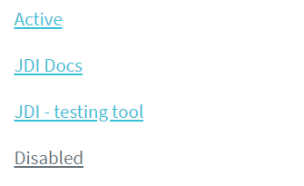

Here is an example with provided Bootstrap v4.3 code:

```java 
// @FindBy(css = "#nav-vert-li") public static NavsVerticalLi navsVerticalLi;
@UI("#nav-vert-li") public static NavsVerticalLi navsVerticalLi;

public class NavsVerticalLi extends Section {
    // @FindBy(css = "li") public ListGroup navItem;
    @UI("li") public ListGroup navItem;
    // @FindBy(css = "li a")  public ListGroup navItemLink;
    @UI("li a") public ListGroup navItemLink;
}

@Test
public void isValidationTests() {
    navsVerticalLi.navItem.is()
            .size(4);
    navsVerticalLi.is()
            .displayed()
            .enabled()
            .core()
            .hasClass("nav flex-column");
    navsVerticalLi.navItemLink.get(1)
            .is()
            .core()
            .hasClass("active");
    navsVerticalLi.navItemLink.get(4)
            .is()
            .core()
            .hasClass("disabled");
}

@Test(dataProvider = "clickValidate")
public void linkClickableLiTests(int index, String pageTitle) {
    navsVerticalLi.navItem.get(index).highlight();
    navsVerticalLi.navItem.get(index).click();
    newWindowTitleCheck(pageTitle);
    navsVerticalLi.navItem.get(index).unhighlight();
}
```

```html
<ul class="nav flex-column" id="nav-vert-li">
    <li class="nav-item">
        <a class="nav-link active" href="https://jdi-testing.github.io/jdi-light/index.html"
           target="_blank">Active</a>
    </li>
    <li class="nav-item">
        <a class="nav-link" href="https://github.com/jdi-docs" target="_blank">JDI Docs</a>
    </li>
    <li class="nav-item">
        <a class="nav-link" href="https://github.com/jdi-testing" target="_blank">JDI -
            testing tool</a>
    </li>
    <li class="nav-item">
        <a class="nav-link disabled" href="https://getbootstrap.com" tabindex="-1"
           aria-disabled="true" target="_blank">Disabled</a>
    </li>
</ul>
```

```html
<nav class="nav flex-column" id="nav-vert-a">
    <a class="nav-link active" href="https://jdi-testing.github.io/jdi-light/index.html"
       target="_blank">Active</a>
    <a class="nav-link" href="https://github.com/jdi-docs" target="_blank">JDI Docs</a>
    <a class="nav-link" href="https://github.com/jdi-testing" target="_blank">JDI - testing
        tool</a>
    <a class="nav-link disabled" href="https://getbootstrap.com" tabindex="-1"
       aria-disabled="true" target="_blank">Disabled</a>
</nav>
```


Available methods in Java JDI Light:

All methods are inherited from base element -  [UIElement](https://jdi-docs.github.io/jdi-light/#uielement)

Most applicable methods:

|Method | Description | Return Type
--- | --- | ---
**assertThat()** | Assert action | TextAssert
**click()** | Get button text | void
**get()** | Select button by index | UIElement
**getText()** | Get button text | String
**highlight()** | Get button text | void
**is()** | Assert action | TextAssert 
**unhighlight()** | Get button text | void

<br>

[Java test examples](https://github.com/jdi-testing/jdi-light/blob/bootstrap/jdi-light-bootstrap-tests/src/test/java/io/github/epam/bootstrap/tests/composite/section/navs/VerticalTests.java)<br>

Nav group is represented by Section class in Java:
 
  [Section](https://jdi-docs.github.io/jdi-light/#section)  

<br>

#### Tabs
**[Nav tabs](https://getbootstrap.com/docs/4.3/components/navs/#tabs)** 


Here is an example with provided Bootstrap v4.3 code:

```java 
// @FindBy(css = "#nav-tabs") public static NavsTabs navsTabs;
@UI("#nav-tabs") public static NavsTabs navsTabs;

public class NavsTabs extends Section {
    // @FindBy(css = "li") public ListGroup navItem;
    @UI("li") public ListGroup navItem;
    // @FindBy(css = "li a")  public ListGroup navItemLink;
    @UI("li a") public ListGroup navItemLink;
}

@Test
public void isValidationTests() {
    navsTabs.navItem.is()
            .size(4);
    navsTabs.is()
            .displayed()
            .enabled()
            .core()
            .hasClass("nav nav-tabs");
    navsTabs.navItemLink.get(1)
            .is()
            .core()
            .hasClass("active");
    navsTabs.navItemLink.get(4)
            .is()
            .core()
            .hasClass("disabled");
}

@Test(dataProvider = "clickValidate")
public void linkClickableLiTests(int index, String pageTitle) {
    navsTabs.navItem.get(index).highlight();
    navsTabs.navItem.get(index).click();
    newWindowTitleCheck(pageTitle);
    navsTabs.navItem.get(index).unhighlight();
}
```

```html
<ul class="nav nav-tabs" id="nav-tabs">
    <li class="nav-item">
        <a class="nav-link active" href="https://jdi-testing.github.io/jdi-light/index.html"
           target="_blank">Active</a>
    </li>
    <li class="nav-item">
        <a class="nav-link" href="https://github.com/jdi-docs" target="_blank">JDI Docs</a>
    </li>
    <li class="nav-item">
        <a class="nav-link" href="https://github.com/jdi-testing" target="_blank">JDI -
            testing tool</a>
    </li>
    <li class="nav-item">
        <a class="nav-link disabled" href="https://getbootstrap.com" tabindex="-1"
           aria-disabled="true" target="_blank">Disabled</a>
    </li>
</ul>
```


Available methods in Java JDI Light:

All methods are inherited from base element -  [UIElement](https://jdi-docs.github.io/jdi-light/#uielement)

Most applicable methods:

|Method | Description | Return Type
--- | --- | ---
**assertThat()** | Assert action | TextAssert
**click()** | Get button text | void
**get()** | Select button by index | UIElement
**getText()** | Get button text | String
**highlight()** | Get button text | void
**is()** | Assert action | TextAssert 
**unhighlight()** | Get button text | void

<br>

[Java test examples](https://github.com/jdi-testing/jdi-light/blob/bootstrap/jdi-light-bootstrap-tests/src/test/java/io/github/epam/bootstrap/tests/composite/section/navs/TabsTests.java)<br>

Nav group is represented by Section class in Java:
 
  [Section](https://jdi-docs.github.io/jdi-light/#section)  

<br>

#### Pills
**[Nav pills](https://getbootstrap.com/docs/4.3/components/navs/#pills)** 


Here is an example with provided Bootstrap v4.3 code:

```java 
// @FindBy(css = "#nav-pills") public static NavsPills navsPills;
@UI("#nav-pills") public static NavsPills navsPills;

public class NavsPills extends Section {
    // @FindBy(css = "li") public ListGroup navItem;
    @UI("li") public ListGroup navItem;
    // @FindBy(css = "li a")  public ListGroup navItemLink;
    @UI("li a") public ListGroup navItemLink;
}

@Test(dataProvider = "listData")
public void itemsIsValidationTests(int index, String linkText) {
    navsPills.navItem.get(index)
            .is()
            .core()
            .hasClass("nav-item")
            .text(is(linkText));
    navsPills.navItemLink.get(index)
            .is()
            .core()
            .hasClass("nav-link")
            .text(is(linkText));
}

@Test(dataProvider = "clickValidate")
public void linkClickableLiTests(int index, String pageTitle) {
    navsPills.navItem.get(index).highlight();
    navsPills.navItem.get(index).click();
    newWindowTitleCheck(pageTitle);
    navsPills.navItem.get(index).unhighlight();
}
```

```html
<ul class="nav nav-pills" id="nav-pills">
    <li class="nav-item">
        <a class="nav-link active" href="https://jdi-testing.github.io/jdi-light/index.html"
           target="_blank">Active</a>
    </li>
    <li class="nav-item">
        <a class="nav-link" href="https://github.com/jdi-docs" target="_blank">JDI Docs</a>
    </li>
    <li class="nav-item">
        <a class="nav-link" href="https://github.com/jdi-testing" target="_blank">JDI -
            testing tool</a>
    </li>
    <li class="nav-item">
        <a class="nav-link disabled" href="https://getbootstrap.com" tabindex="-1"
           aria-disabled="true" target="_blank">Disabled</a>
    </li>
</ul>
```


Available methods in Java JDI Light:

All methods are inherited from base element -  [UIElement](https://jdi-docs.github.io/jdi-light/#uielement)

Most applicable methods:

|Method | Description | Return Type
--- | --- | ---
**assertThat()** | Assert action | TextAssert
**click()** | Get button text | void
**get()** | Select button by index | UIElement
**getText()** | Get button text | String
**highlight()** | Get button text | void
**is()** | Assert action | TextAssert 
**unhighlight()** | Get button text | void

<br>

[Java test examples](https://github.com/jdi-testing/jdi-light/blob/bootstrap/jdi-light-bootstrap-tests/src/test/java/io/github/epam/bootstrap/tests/composite/section/navs/PillsTests.java)<br>

Nav group is represented by Section class in Java:
 
  [Section](https://jdi-docs.github.io/jdi-light/#section)  

<br>

#### Fill and justify
**[Nav fill and justify](https://getbootstrap.com/docs/4.3/components/navs/#fill-and-justify)** 


Here is an example with provided Bootstrap v4.3 code:

```java 
// @FindBy(css = "#nav-justify") public static NavsJustify navsJustify;
@UI("#nav-justify") public static NavsJustify navsJustify;

public class NavsJustify extends Section {
    // @FindBy(css = "li") public ListGroup navItem;
    @UI("li") public ListGroup navItem;
    // @FindBy(css = "li a")  public ListGroup navItemLink;
    @UI("li a") public ListGroup navItemLink;
}

@Test(dataProvider = "listData")
public void itemsIsValidationTests(int index, String linkText) {
    navsJustify.navItem.get(index)
            .is()
            .core()
            .hasClass("nav-item")
            .text(is(linkText));
    navsJustify.navItemLink.get(index)
            .is()
            .core()
            .hasClass("nav-link")
            .text(is(linkText));
}

@Test(dataProvider = "clickValidate")
public void linkClickableLiTests(int index, String pageTitle) {
    navsJustify.navItem.get(index).highlight();
    navsJustify.navItem.get(index).click();
    newWindowTitleCheck(pageTitle);
    navsJustify.navItem.get(index).unhighlight();
}
```

```html
<ul class="nav nav-pills nav-fill" id="nav-justify">
    <li class="nav-item">
        <a class="nav-link active" href="https://jdi-testing.github.io/jdi-light/index.html"
           target="_blank">Active</a>
    </li>
    <li class="nav-item">
        <a class="nav-link" href="https://github.com/jdi-docs" target="_blank">JDI Docs</a>
    </li>
    <li class="nav-item">
        <a class="nav-link" href="https://github.com/jdi-testing" target="_blank">JDI - testing
            tool</a>
    </li>
    <li class="nav-item">
        <a class="nav-link disabled" href="https://getbootstrap.com" tabindex="-1"
           aria-disabled="true" target="_blank">Disabled</a>
    </li>
</ul>
```


Available methods in Java JDI Light:

All methods are inherited from base element -  [UIElement](https://jdi-docs.github.io/jdi-light/#uielement)

Most applicable methods:

|Method | Description | Return Type
--- | --- | ---
**assertThat()** | Assert action | TextAssert
**click()** | Get button text | void
**get()** | Select button by index | UIElement
**getText()** | Get button text | String
**highlight()** | Get button text | void
**is()** | Assert action | TextAssert 
**unhighlight()** | Get button text | void

<br>

[Java test examples](https://github.com/jdi-testing/jdi-light/blob/bootstrap/jdi-light-bootstrap-tests/src/test/java/io/github/epam/bootstrap/tests/composite/section/navs/FillAndJustifyTests.java)<br>

Nav group is represented by Section class in Java:
 
  [Section](https://jdi-docs.github.io/jdi-light/#section)  

<br>

#### Tabs with dropdowns
**[Nav tabs with dropdowns](https://getbootstrap.com/docs/4.3/components/navs/#tabs-with-dropdowns)** 


Here is an example with provided Bootstrap v4.3 code:

```java 
// @FindBy(css = "#nav-with-dropdown") public static NavsTabsWithDropdown navsTabsWithDropdown;
@UI("#nav-with-dropdown") public static NavsTabsWithDropdown navsTabsWithDropdown;

public class NavsTabsWithDropdown extends Section {
    // @FindBy(css = "li") public ListGroup navItem;
    @UI("li") public ListGroup navItem;
    // @FindBy(css = "a.nav-link") public ListGroup navItemLink;
    @UI("a.nav-link") public ListGroup navItemLink;
    @JDropdown(expand = ".dropdown-toggle",
            value = ".dropdown-toggle",
            list = ".dropdown-item")
    public Dropdown dropdownMenu;
}

@Test
public void isValidationTests() {
    navsTabsWithDropdown.navItem.is()
            .size(4);
    navsTabsWithDropdown.is()
            .displayed()
            .enabled()
            .core()
            .hasClass("nav nav-tabs");
    navsTabsWithDropdown.navItemLink.get(1)
            .is()
            .core()
            .hasClass("active");
    navsTabsWithDropdown.navItemLink.get(4)
            .is()
            .core()
            .hasClass("disabled");
}

@Test
public void dropdownIsValidationTests() {
    navsTabsWithDropdown.dropdownMenu.expand();
    navsTabsWithDropdown.dropdownMenu
            .is()
            .displayed()
            .expanded()
            .enabled()
            .size(4);
    navsTabsWithDropdown.dropdownMenu
            .is()
            .core()
            .attr("data-toggle", "dropdown")
            .attr("aria-haspopup", "true")
            .attr("aria-expanded", "true")
            .attr("role", "button")
            .tag("a");
}
```

```html
<ul class="nav nav-tabs" id="nav-with-dropdown">
    <li class="nav-item">
        <a class="nav-link active" href="https://jdi-testing.github.io/jdi-light/index.html"
           target="_blank">Active</a>
    </li>
    <li class="nav-item dropdown">
        <a class="nav-link dropdown-toggle" data-toggle="dropdown" href="#" role="button"
           aria-haspopup="true" aria-expanded="false">Dropdown</a>
        <div class="dropdown-menu">
            <a class="dropdown-item"
               href="https://jdi-testing.github.io/jdi-light/index.html" target="_blank">JDI
                home</a>
            <a class="dropdown-item" href="https://github.com/jdi-docs" target="_blank">JDI
                Docs</a>
            <a class="dropdown-item" href="https://github.com/jdi-testing" target="_blank">JDI
                - testing tool</a>
            <div class="dropdown-divider"></div>
            <a class="dropdown-item" href="https://getbootstrap.com" target="_blank">Bootstrap</a>
        </div>
    </li>
    <li class="nav-item">
        <a class="nav-link" href="https://github.com/jdi-testing" target="_blank">JDI -
            testing tool</a>
    </li>
    <li class="nav-item">
        <a class="nav-link disabled" href="https://getbootstrap.com" tabindex="-1"
           aria-disabled="true" target="_blank">Disabled</a>
    </li>
</ul>
```


Available methods in Java JDI Light:

All methods are inherited from base element -  [UIElement](https://jdi-docs.github.io/jdi-light/#uielement)

Most applicable methods:

|Method | Description | Return Type
--- | --- | ---
**assertThat()** | Assert action | TextAssert
**click()** | Get button text | void
**expand()** | Get button text | void
**expanded()** | Get button text | TextAssert
**get()** | Select button by index | UIElement
**getText()** | Get button text | String
**highlight()** | Get button text | void
**is()** | Assert action | TextAssert 
**unhighlight()** | Get button text | void

<br>

[Java test examples](https://github.com/jdi-testing/jdi-light/blob/bootstrap/jdi-light-bootstrap-tests/src/test/java/io/github/epam/bootstrap/tests/composite/section/navs/TabsWithDropdownTests.java)<br>

Nav group is represented by Section class in Java:
 
[Section](https://jdi-docs.github.io/jdi-light/#section)  

#### Pills with dropdowns
**[Nav pills with dropdowns](https://getbootstrap.com/docs/4.3/components/navs/#pills-with-dropdowns)** 


Here is an example with provided Bootstrap v4.3 code:

```java 
// @FindBy(css = "#nav-pills-drop") public static NavsPillsWithDropdown navsPillsWithDropdown;
@UI("#nav-pills-drop") public static NavsPillsWithDropdown navsPillsWithDropdown;

public class NavsPillsWithDropdown extends Section {
    // @FindBy(css = "li") public ListGroup navItem;
    @UI("li") public ListGroup navItem;
    // @FindBy(css = "a.nav-link") public ListGroup navItemLink;
    @UI("a.nav-link") public ListGroup navItemLink;
    @JDropdown(expand = ".dropdown-toggle",
            value = ".dropdown-toggle",
            list = ".dropdown-item")
    public Dropdown dropdownMenu;
}

@Test
public void dropdownIsValidationTests() {
    navsPillsWithDropdown.dropdownMenu.expand();
    navsPillsWithDropdown.dropdownMenu
            .is()
            .expanded()
            .size(4)
            .core()
            .attr("data-toggle", "dropdown")
            .attr("aria-haspopup", "true")
            .attr("aria-expanded", "true")
            .attr("role", "button")
            .tag("a");
    navsPillsWithDropdown.dropdownMenu.expand();
}

@Test
public void dropdownClickableTests() {
    navsPillsWithDropdown.dropdownMenu.select(linkDrop1);
    newWindowTitleCheck(pageTitle1);
    navsPillsWithDropdown.dropdownMenu.select(linkDrop2);
    newWindowTitleCheck(pageTitle2);
    navsPillsWithDropdown.dropdownMenu.select(linkDrop3);
    newWindowTitleCheck(pageTitle3);
    navsPillsWithDropdown.dropdownMenu.select(linkDrop4);
    newWindowTitleCheck(pageTitle4);
}
```

```html
<ul class="nav nav-pills" id="nav-pills-drop">
    <li class="nav-item">
        <a class="nav-link active" href="https://jdi-testing.github.io/jdi-light/index.html"
           target="_blank">Active</a>
    </li>
    <li class="nav-item dropdown">
        <a class="nav-link dropdown-toggle" data-toggle="dropdown" href="#" role="button"
           aria-haspopup="true" aria-expanded="false">Dropdown</a>
        <div class="dropdown-menu">
            <a class="dropdown-item"
               href="https://jdi-testing.github.io/jdi-light/index.html" target="_blank">JDI
                home</a>
            <a class="dropdown-item" href="https://github.com/jdi-docs" target="_blank">JDI
                Docs</a>
            <a class="dropdown-item" href="https://github.com/jdi-testing" target="_blank">JDI
                - testing tool</a>
            <div class="dropdown-divider"></div>
            <a class="dropdown-item" href="https://getbootstrap.com" target="_blank">Bootstrap</a>
        </div>
    </li>
    <li class="nav-item">
        <a class="nav-link" href="https://github.com/jdi-testing" target="_blank">JDI -
            testing tool</a>
    </li>
    <li class="nav-item">
        <a class="nav-link disabled" href="https://getbootstrap.com" tabindex="-1"
           aria-disabled="true" target="_blank">Disabled</a>
    </li>
</ul>
```

Available methods in Java JDI Light:

All methods are inherited from base element -  [UIElement](https://jdi-docs.github.io/jdi-light/#uielement)

Most applicable methods:

|Method | Description | Return Type
--- | --- | ---
**assertThat()** | Assert action | TextAssert
**click()** | Get button text | void
**expand()** | Get button text | void
**expanded()** | Get button text | TextAssert
**get()** | Select button by index | UIElement
**getText()** | Get button text | String
**highlight()** | Get button text | void
**is()** | Assert action | TextAssert 
**unhighlight()** | Get button text | void

<br>

[Java test examples](https://github.com/jdi-testing/jdi-light/blob/bootstrap/jdi-light-bootstrap-tests/src/test/java/io/github/epam/bootstrap/tests/composite/section/navs/PillsWithDropdownTests.java)<br>

Nav group is represented by Section class in Java:
 
  [Section](https://jdi-docs.github.io/jdi-light/#section)  

<br>


### RadioButtons

  **RadioButtons** – extends from <a href="https://jdi-docs.github.io/jdi-light/#radiobuttons">HTML 5 RadioButtons</a> class.
  
  Bootstrap RadioButtons class is represented by the following class:
   
    - __Java__: _com.epam.jdi.light.ui.bootstrap.elements.complex.RadioButtons_
    
  Is similar to the parent class but overrides its list() method and adds list(JFunc1<WebElement, Boolean> searchRule, ElementArea elementArea) method.
  
  <br>


## Bootstrap Composite elements
### Forms
<a style="font-weight:bold" href="https://getbootstrap.com/docs/4.3/components/forms/" target="_blank">Forms</a> – logical part of a web page that represents an HTML form.
Form can consists of:
<ul>
<li>Textual form controls(inputs, selects, and textareas)</li>
<li>File inputs</li>
<li>Range inputs</li>
<li>Checkboxes and Radiobuttons</li>
<li>Help text</li>
<li>Fieldsets(which can disable all the controls within)</li>
</ul>

Available methods in Java JDI Light:

|Method | Description | Return Type
--- | --- | ---
**add(T entity)** | Fills all settable elements and clicks “add” Button or ”addButton” | void
**back(T entity)** | Fills all settable elements and clicks “back” Button or ”backButton” | void
**cancel(T entity)** | Fills all settable elements and clicks “cancel” Button or ”cancelButton” | void
**check(T entity)** | Verifies that form has been filled correctly. If not, throws an exception | void
**close(T entity)** | Fills all settable elements and clicks “close” Button or ”closeButton” | void
**fill(T entity)** | Fills all settable elements of the form that can be matched with fields of the input entity | void
**fillAction(Field field, Object element, Object parent, String setValue)** | Defines the specifics of how form elements will be filled | void
**getAction(Field field, Object element, Object parent)** | Defines the specifics of how form elements will be obtained for verification and checks | String
**is()** | Asserts element  | UIAssert
**login()** | Clicks "login" Button or "loginButton"| void
**login(T entity)** | Fills all settable elements and clicks “login” Button or ”loginButton” | void
**loginAs(T entity)** | Fills all settable elements and clicks “login” Button or ”loginButton” | void
**next(T entity)** | Fills all settable elements and clicks “next” Button or ”nextButton” | void
**onlyMandatory()** | Sets form filter option to **MANDATORY**, meaning that only mandatory form elements are filled/submitted or verified/checked for the duration of a single form action | void
**onlyOptional()** | Sets form filter option to **OPTIONAL**, meaning that only optional form elements are filled/submitted or verified/checked for the duration of a single form action | void
**pressButton(String buttonName)** | Clicks “buttonName” Button or "buttonNamebutton". Allows different buttons to send one form, e.g. save/publish/cancel/search/update/... | void
**publish(T entity)** | Fills all settable elements and clicks “publish” Button or ”publishButton” | void
**save(T entity)** | Fills all settable elements and clicks “save” Button or ”saveButton” | void
**search(T entity)** | Fills all settable elements and clicks “search” Button or ”searchButton” | void
**select(T entity)** | Fills all settable elements and clicks “select” Button or ”selectButton” | void
**send()** | Sends the form by clicking “send” Button or "sendButton" | void
**send(T entity)** | Fills all settable elements and clicks “send” Button or ”sendButton” | void
**submit()** | Sends the form by clicking "submit" Button or "submitButton" | void
**submit(String text)** | Fills first settable form field with value and clicks "submit" Button or "submitButton"  | void
**submit(T entity)** | Fills all settable elements and clicks "submit" Button or "submitButton"  | void
**submit(String text, String buttonName)** | Fills first settable field with value and clicks “buttonName” Button or "buttonNamebutton"| void
**submit(T entity, String buttonName)** | Fills all settable elements and clicks “buttonName” Button or "buttonNamebutton" | void
**update(T entity)** | Fills all settable elements and clicks “update” Button or ”updateButton” | void
**verify(T entity)** | Verifies that form has been filled correctly. If not, returns a list of keys where verification has failed | List<String>

#### Simple form
This is an example of simple form consisting of some basic elements.


Here is an example with provided Bootstrap v4.3 code:

```java 
     public class BootstrapFormsPage extends WebPage {
         // FindBy(css = "#support-form")
         @UI("#support-form")      
         public static SupportMessageForm supportMessageForm;
     }
    
    @Test
    public void submitButtonTest() {
        supportMessageForm.supportButtonSubmit.click();
        lastLogEntry.has().text(containsString(logLineSubmit));
    }

    @Test
    public void clearButtonTest() {
        supportMessageForm.supportButtonClear.click();
        lastLogEntry.has().text(containsString(logLineClear));
    }

    @Test
    public void submitFormTest() {
        setDefaultValues();
        supportMessageForm.submit(EXAMPLE_MESSAGE);
        lastLogEntry.has().text(containsString(logLineSubmit));
        supportMessageForm.check(EXAMPLE_MESSAGE);
    }

    @Test
    public void fillFormTest() {
        setDefaultValues();
        supportMessageForm.fill(EXAMPLE_MESSAGE);
        supportMessageForm.supportEmail.has().text(EXAMPLE_MESSAGE.supportEmail);
        supportMessageForm.supportMessage.has().text(EXAMPLE_MESSAGE.supportMessage);
        supportMessageForm.check(EXAMPLE_MESSAGE);
    }

    @Test
    public void clearFormTest() {
        setDefaultValues();
        supportMessageForm.clear(EXAMPLE_MESSAGE);
        lastLogEntry.has().text(containsString(logLineClear));
        supportMessageForm.check(TEMPLATE_MESSAGE);
    }
```

```html 
<form id="support-form">
    <div class="form-group">
        <label for="support-email">Please enter your email address at which
            our manager can contact you</label>
        <input type="email" class="form-control" id="support-email" aria-describedby="emailHelp" placeholder="Enter email">
        <small id="emailHelp" class="form-text text-muted">We'll never share your email with anyone
            else.</small>
    </div>
    <div class="form-group">
        <label for="support-message">Your message</label>
        <textarea class="form-control" id="support-message" rows="3"></textarea>
    </div>
    <button type="submit" class="btn btn-primary" id="support-button-submit">Submit</button>
    <button type="reset" class="btn btn-danger" id="support-button-clear">Clear</button>
</form>
```

[Bootstrap test examples](https://github.com/jdi-testing/jdi-light/tree/bootstrap/jdi-light-bootstrap-tests/src/test/java/io/github/epam/bootstrap/tests/composite/section/form/SimpleFormTests.java)
<br><br><br><br><br><br><br><br><br><br><br>

#### Complicated form
This is an example of complicated form consisting of various specific elements.


Here is an example with provided Bootstrap v4.3 code:

```java 
    public class BootstrapFormsPage extends WebPage {
        // @FindBy(css = "#superhero-creation-form")
        @UI("#superhero-creation-form") 
        public static SuperheroForm superheroForm;
        // @FindBy(css = ".logs  li:first-child")        
        @UI(".logs  li:first-child") 
        public static Text lastLogEntry;
    }
    
    @Test
    public void submitButtonTest() {
        superheroForm.superheroButtonSubmit.click();
        lastLogEntry.has().text(containsString(logLineSubmit));
    }
    
    @Test
    public void clearButtonTest() {
        superheroForm.superheroButtonClear.click();
        lastLogEntry.has().text(containsString(logLineClear));
    }
    
    @Test
    public void submitFormTest() {
        superheroForm.submit(EXAMPLE_HERO);
        lastLogEntry.has().text(containsString(logLineSubmit));
        superheroForm.check(EXAMPLE_HERO);
    }
    
    @Test
    public void clearFormTest() {
        superheroForm.clear(EXAMPLE_HERO);
        lastLogEntry.has().text(containsString(logLineClear));
        superheroForm.check(TEMPLATE_HERO);
    }
``` 

```html 
<form id="superhero-creation-form">
    <div class="form-group">
        <label for="current-alias">Enter your alias</label>
        <input type="text" class="form-control" id="current-alias" aria-describedby="emailHelp" placeholder="Enter alias">
    </div>
    <div class="form-group">
        <label for="alter-ego">Enter your alter ego</label>
        <input type="text" class="form-control" id="alter-ego" aria-describedby="emailHelp" placeholder="Enter alter ego">
    </div>
    <!-- Radios start -->
    <fieldset class="form-group">
        <div class="row">
            <legend class="col-form-label col-sm-2 pt-0">Species</legend>
            <div class="col-sm-10">
                <div class="form-check">
                    <input class="form-check-input" type="radio" name="superheroSpecies" id="human" value="option1" checked="">
                    <label class="form-check-label" for="human">
                        Human
                    </label>
                </div>
                <div class="form-check">
                    <input class="form-check-input" type="radio" name="superheroSpecies" id="symbiote" value="option2">
                    <label class="form-check-label" for="symbiote">
                        Symbiote
                    </label>
                </div>
                <div class="form-check">
                    <input class="form-check-input" type="radio" name="superheroSpecies" id="skrulls" value="option3">
                    <label class="form-check-label" for="skrulls">
                        Skrulls
                    </label>
                </div>
                <div class="form-check">
                    <input class="form-check-input" type="radio" name="superheroSpecies" id="kryptonian" value="option4">
                    <label class="form-check-label" for="kryptonian">
                        Kryptonian
                    </label>
                </div>
            </div>
        </div>
    </fieldset>
    <!-- Radios end -->
    <div>
        <label for="superhero-range">Power scale:</label>
        <input type="range" class="custom-range mb-3" min="0" max="100" id="superhero-range">
    </div>
    <label for="select-universe">Universe:</label>
    <select class="custom-select mb-3" id="select-universe">
        <option selected="">Select character's universe</option>
        <option value="1">DC</option>
        <option value="2">Marvel Earth-616</option>
        <option value="3">Marvel Cinematic Universe</option>
    </select>
    <div class="custom-control custom-switch mb-3" id="superhero-switch-div">
        <input type="checkbox" class="custom-control-input" id="superhero-switch">
        <label class="custom-control-label" for="superhero-switch">I'm not going to destroy all living beings</label>
    </div>
    <button type="submit" class="btn btn-primary" id="superhero-button-submit">Submit</button>
    <button type="reset" class="btn btn-danger" id="superhero-button-clear">Clear</button>
</form>
```

[Bootstrap test examples](https://github.com/jdi-testing/jdi-light/tree/bootstrap/jdi-light-bootstrap-tests/src/test/java/io/github/epam/bootstrap/tests/composite/section/form/ComplicatedFormTests.java)

####Sizing
<a style="font-weight:bold" href="https://getbootstrap.com/docs/4.0/components/forms/#sizing" target="_blank">Set</a> heights using classes like .form-control-lg and .form-control-sm.


Here is an example with provided Bootstrap v4.3 code:

```java 
@UI("#forms-sizing")  //@FindBy(css = "#forms-sizing")
public static FormsSizing formsSizing;

@UI("#form-sizing-lg")  //@FindBy(css = "#form-sizing-lg")
public TextField largeTextField;

@UI("#form-sizing-select-lg")  //@FindBy(css = "#form-sizing-select-lg")
public DropdownSelect largeSelect;

private String text = "TextField";
private String placeholderLarge = ".form-control-lg";
private String placeholderDefault = "Default input";
private String placeholderSmall = ".form-control-sm";

@Test
public void sendKeysTest() {
    formsSizing.largeTextField.sendKeys("Test");
    assertEquals(formsSizing.largeTextField.getText(), text+"Test");
}

@Test
public void selectOptionTest() {
    formsSizing.largeSelect.select("Large select");
    assertEquals(formsSizing.largeSelect.getValue(), "Large select");
}

@Test
public void isValidationTest() {
    formsSizing.largeTextField.is()
                    .enabled()
                    .text(is(text));
    formsSizing.largeSelect.is()
                    .displayed()
                    .selected("Large option");
    formsSizing.largeTextField.is()
                    .enabled()
                    .placeholder(placeholderLarge);
}

```

````html
<div class="html-left" id="forms-sizing">
    <div class="mb-3">
        <input class="form-control form-control-lg mb-3" id="form-sizing-lg" type="text"
               placeholder=".form-control-lg">
        <input class="form-control mb-3" id="form-sizing-default" type="text"
               placeholder="Default input">
        <input class="form-control form-control-sm mb-3" id="form-sizing-sm" type="text"
               placeholder=".form-control-sm">
    </div>

    <div class="mb-3">
        <select class="form-control form-control-lg mb-3" id="form-sizing-select-lg">
            <option>Large select</option>
            <option>Large option</option>
        </select>
        <select class="form-control mb-3" id="form-sizing-select-default">
            <option>Default select</option>
            <option>Default option</option>
        </select>
        <select class="form-control form-control-sm mb-3" id="form-sizing-select-sm">
            <option>Small select</option>
            <option>Small option</option>
        </select>
    </div>
</div>
````

Form group is represented by Section class in Java:

  [Section](https://jdi-docs.github.io/jdi-light/#section)

Inner elements of Forms - Sizing are represented by the following classes:

+ [TextField](https://jdi-docs.github.io/jdi-light/#textfield)

+ DropdownSelect    TBD 

|Method / Property | Description | Return Type
--- | --- | ---
**AssertThat** | Assert action | TextAssert
**GetText()** | returns text from the text field  | String
**GetValue()** | returns text from the text field| String
**Is** | Assert action | TextAssert
**select(string/int)** | Select data by value/index| void
**SendKeys(string value)** | adds text to the field | void
**SetText(String value)** | sets new text | void

[Bootstrap test examples](https://github.com/jdi-testing/jdi-light/blob/bootstrap/jdi-light-bootstrap-tests/src/test/java/io/github/epam/bootstrap/tests/composite/section/form/FormReadOnlyTests.java)

<br><br>
**Readonly**

Add the <a style="font-weight: bold;" target="_blank" href="https://getbootstrap.com/docs/4.3/components/forms/#readonly">readonly</a> boolean attribute on an input to prevent modification of the input’s value. Read-only inputs appear lighter (just like disabled inputs), but retain the standard cursor.


Here is an example with provided Bootstrap v4.3 code:

```java 
//@FindBy(css = "#forms-readonly-input")
@UI("#forms-readonly-input")
public static TextField readonlyInput;


@Test
public void checkReadonlyAttribute() {
    assertTrue(readonlyInput.attrs().has("readonly"));
    readonlyInput.highlight();
    readonlyInput.is()
            .displayed()
            .enabled();
}

@Test(expectedExceptions = {InvalidElementStateException.class})
public void check() {
    readonlyInput.setValue(text);
    readonlyInput.sendKeys(text);
}


```

```html
<input class="form-control mb-3" id="forms-readonly-input" type="text"
                                   placeholder="Readonly input here..." readonly>
```

Available methods in Java JDI Light:

|Method / Property | Description | Return Type
--- | --- | ---
**AssertThat()** | property that returns object for work with assertions| TextAssert
**Focus()** | places cursor within the text field | void
**GetText()** | returns text from the text field  | String
**GetValue()** | returns text from the text field| String
**Is()** | property that returns object for work with assertions| TextAssert
**Input(string text)** | sets new text  | void
**Placeholder** | returns value of the placeholder attribute | String
**SendKeys(string value)** | adds text to the field | void
**SetText(String value)** | sets new text | void


<a href="https://github.com/jdi-testing/jdi-light/tree/bootstrap/jdi-light-bootstrap-tests/src/test/java/io/github/epam/bootstrap/tests/composite.section.form.FormReadOnlyTests.java" target=a_blank> Bootstrap test examples </a>


<br><br>
####Readonly plain text

If you want to have input readonly elements in your form styled as 
<a style="font-weight: bold;" target="_blank" href="https://getbootstrap.com/docs/4.3/components/forms/#readonly-plain-text">plain text</a>,
 use the <b>.form-control-plaintext</b> class to remove the default form field styling and preserve the correct margin and padding.
Compare items with plaintext mark (upper) and without it (lower):


Here is an example with provided Bootstrap v4.3 code:

```java 
//@FindBy(css = "#readonlyPlainText1")
@UI("#readonlyPlainText1")
public static ReadonlyPlainText readonlyPlainText1;

@Test
public void isValidationTest() {
    readonlyPlainText1.is().core().hasClass("form-control-plaintext");
    assertTrue(readonlyPlainText1.hasAttribute("readonly"));
    readonlyPlainText1.is().core().attr("type", "text");

@Test
public void textValidationTest() {
    readonlyPlainText1.is().text("email@example.com");
}

@Test
public void labelTest() {
    readonlyPlainText1.label().is().text("Email");
}
```

```html
<div class="form-group row">
    <label for="readonlyPlainText1" class="col-sm-2 col-form-label">Email</label>
    <div class="col-sm-10">
        <input type="text" readonly class="form-control-plaintext" id="readonlyPlainText1"
               value="email@example.com">
    </div>
</div>
```


Available methods in Java JDI Light:

|Method/Property | Description | Return Type
--- | --- | ---
**assertThat()** | Assert action | TextAssert
**attr()** | Match passed value with element attribute | ICoreElement
**getValue()** | Get item value | String
**hasClass()** | Match passed value with element class | ICoreElement
**is()** | Various assert actions for Progress | ProgressAssert 
**label()** | Get label associated with an item | Label
**labelText()** | Get text of a label associated with an item | String

<a href="https://github.com/jdi-testing/jdi-light/tree/bootstrap/jdi-light-bootstrap-tests/src/test/java/io/github/epam/bootstrap/tests/mposite.section.form.ReadonlyPlainTextTests.java" target=a_blank> Bootstrap test examples </a>

<br><br>

####Range input

Set horizontally scrollable <a style="font-weight: bold;" target="_blank" href="https://getbootstrap.com/docs/4.3/components/forms/#range-inputs">range inputs</a>
using .form-control-range.


Here is an example with provided Bootstrap v4.3 code:

```java 
//@FindBy(css = "#formControlRange")
@UI("#formControlRange")
public static RangeInput rangeInput;

 @Test
 public void itemHasProperClass() {
    rangeInput.is().core().hasClass("form-control-range");
 }

 @Test
 public void itemHasProperType() {
    rangeInput.is().core().attr("type", "range");
 }

 @Test
 public void labelValidationTest() {
    rangeInput.label().is().text("Example Range input");
 }
```

```html
<form class="mb-3">
    <div class="form-group">
        <label for="formControlRange">Example Range input</label>
        <input type="range" class="form-control-range" id="formControlRange">
    </div>
</form>
```

Available methods in Java JDI Light:

|Method/Property | Description | Return Type
--- | --- | ---
**assertThat()** | Assert action | UIAssert
**attr()** | Match passed value with element attribute | String
**hasClass()** | Match passed value with element class | boolean
**is()** | Various assert actions for Progress | UIAssert 
**label()** | Get label associated with an item | Label
**labelText()** | Get text of a label associated with an item | String

<a href="https://github.com/jdi-testing/jdi-light/tree/bootstrap/jdi-light-bootstrap-tests/src/test/java/io/github/epam/bootstrap/tests/composite/section/form/RangeInputTests.java" target=a_blank> Bootstrap test examples </a>

####Select menu

```java 
public class SelectMenu extends Form implements ISelector {
    //FindBy(css = "option")
    @UI("option") public WebList optionsSelectMenu;
    //FindBy(css = "option[selected]")
    @UI("option[selected]") public UIElement selectedOptionsSelectMenu;
    @Override
    public WebList list() { return optionsSelectMenu; }
}

//FindBy(id = "forms-select-menu")
@UI("#forms-select-menu")
public static SelectMenu formsSelectMenu;

@Test
public void getSelectedOptionFormsSelectMenuTest() {
  formsSelectMenu.selectedOptionsSelectMenu.is().text("Open this select menu");
}

//FindBy(id = "forms-select-menu-large")
@UI("#forms-select-menu-large")
public static SelectMenu formsSelectMenuLarge;
 
@Test(dataProvider = "optionFormSelectMenuTest")
public void getTextFormsSelectMenuTest(int i, String optionText, String value) {
  formsSelectMenuLarge.optionsSelectMenu.get(i).is().text(optionText);
  formsSelectMenuLarge.optionsSelectMenu.get(i).assertThat().attr("value", value);
}


//FindBy(id = "forms-select-menu-small")
@UI("#forms-select-menu-small")
public static SelectMenu formsSelectMenuSmall;


//FindBy(id = "forms-select-menu-multiple")
@UI("#forms-select-menu-multiple")
public static SelectMenu formsSelectMenuMultiple;


//FindBy(id = "forms-select-menu-size")
@UI("#forms-select-menu-size")
public static SelectMenu formsSelectMenuSize;


@Test
public void selectOptionFormsSelectMenuTest() {
  formsSelectMenuSize.optionsSelectMenu.get(4).click();
  assertEquals(formsSelectMenuSize.getValue(), "Three");
}


```

You can use custom <a href = "https://getbootstrap.com/docs/4.3/components/forms/#select-menu" target = "a_blank">select menus</a>.

Select menu is located in the following classes:

  - __Java__: _com.epam.jdi.light.ui.bootstrap.elements.common.SelectMenu*_
  

 <br>
Here is an example with provided Bootstrap v4.3 code:

```html
<select class="custom-select mb-3" id="forms-select-menu">
    <option selected>Open this select menu</option>
    <option value="1">One</option>
    <option value="2">Two</option>
    <option value="3">Three</option>
</select>
``` 
<br>

**Large select menu**
 <br>
Here is an example with provided Bootstrap v4.3 code:

```html
<select class="custom-select custom-select-lg mb-3" id="forms-select-menu-large">
    <option selected>Open this select menu</option>
    <option value="1">One</option>
    <option value="2">Two</option>
    <option value="3">Three</option>
</select>
```
 <br>

**Small select menu**
 <br>
Here is an example with provided Bootstrap v4.3 code:

```html
<select class="custom-select custom-select-sm mb-3" id="forms-select-menu-small">
    <option selected>Open this select menu</option>
    <option value="1">One</option>
    <option value="2">Two</option>
    <option value="3">Three</option>
</select>
```
<br>

**Select menu multiple**
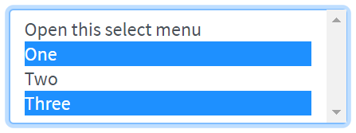 <br>
Here is an example with provided Bootstrap v4.3 code:

```html
<select class="custom-select mb-3" multiple id="forms-select-menu-multiple">
    <option selected>Open this select menu</option>
    <option value="1">One</option>
    <option value="2">Two</option>
    <option value="3">Three</option>
</select>
```
<br>

**Select menu size**
 <br>
Here is an example with provided Bootstrap v4.3 code:

```html
<select class="custom-select mb-3" size="3" id="forms-select-menu-size">
    <option selected>Open this select menu</option>
    <option value="1">One</option>
    <option value="2">Two</option>
    <option value="3">Three</option>
</select>
```
<br>

Available methods in Java JDI Light:
<br>

|Method | Description | Return Type
--- | --- | ---
**assertThat()** | Assert action | TextAssert
**click()** | Click the button | void
**is()** | Assert action | TextAssert 
<br>

<a href="https://github.com/jdi-testing/jdi-light/blob/bootstrap/jdi-light-bootstrap-tests/src/test/java/io/github/epam/bootstrap/tests/composite/section/form/FormsSelectMenuTests.java" target=a_blank> Bootstrap test examples </a>

####Range

Create custom <a style="font-weight: bold;" target="_blank" href="https://getbootstrap.com/docs/4.3/components/forms/#range">range</a>
 controls (`<input type="range">`) with .custom-range. The track (the background) and thumb (the value) are both styled to appear the same across browsers. 
Range inputs have implicit values for min and max: 0 and 100, respectively. You may specify new values for those using the min and max attributes.
  

 
Here is an example with provided Bootstrap v4.3 code:
 
```java 
//@FindBy(css = "#customRange3")
@UI("#customRange3")
public static Range range;

@Test
public void labelTest() {\
    range.label().is().text(labelText);
 }

@Test
public void validateThumbMinMaxAndStepValuesTest() {
    range.is().thumbValue(2.5);
    range.is().minValue(0);
    range.is().maxValue(5);
    range.is().step(0.5);
}
 
@Test
public void setThumbValueTest() {
    range3.setThumbValue(5);
    range3.is().thumbValue(5);
}
```

```html
<div class="html-left">
    <label for="customRange1">Example range</label>
    <input type="range" class="custom-range" id="customRange1">

    <label for="customRange2">Example range</label>
    <input type="range" class="custom-range" min="0" max="5" id="customRange2">

    <label for="customRange3">Example range</label>
    <input type="range" class="custom-range" min="0" max="5" step="0.5" id="customRange3">
</div>
```

Available methods in Java JDI Light:

|Method/Property | Description | Return Type
--- | --- | ---
**assertThat()** | Assert action | UIAssert
**getValue()** | Get thumb value as String | String
**is()** | Various assert actions for Progress | RangeAssert 
**label()** | Get label associated with an item | Label
**labelText()** | Get text of a label associated with an item | String
**max()** | Get maximal limit of range | double
**min()** | Get minimal limit of range | double
**step()** | Get incremental step of range | double
**setThumbValue()** | Set thumb value with a "double" parameter | void
**setValue()** | Set thumb value with a String parameter | void
**thumbValue()** | Get thumb value | double


<a href="https://github.com/jdi-testing/jdi-light/tree/bootstrap/jdi-light-bootstrap-tests/src/test/java/io/github/epam/bootstrap/tests/common/RangeTests.java" target=a_blank> Bootstrap test examples </a>

<br><br>
 
#### Form Validation

##### Custom style
You can use custom <a href = "https://getbootstrap.com/docs/4.3/components/forms/#custom-styles" target = "a_blank">Bootstrap form validation</a> messages.


Here is an example with provided Bootstrap v4.3 code:

```java 
@UI("#validated-form")
public FormValidationForm form;

@Test
public void bootstrapValidationTest() {
    String name = "ValidName";
    String email = "InvalidEmail";
    String phone = "InvalidPhone";

    SimpleContact entity = new SimpleContact(name, email, phone);

    form.fill(entity);
    form.submit();

    Map<String, String> validFeedback = form.getValidFeedback();
    MatcherAssert.assertThat("Number of valid feedbacks not equals 1", validFeedback.size() == 1);
    MatcherAssert.assertThat(validFeedback.keySet(), Matchers.hasItems("Name"));
    MatcherAssert.assertThat(validFeedback.values(), Matchers.hasItem("Hi, " + name + "!"));

    Map<String, String> invalidFeedback = form.getInvalidFeedback();
    MatcherAssert.assertThat("Number of invalid feedbacks not equals 2", invalidFeedback.size() == 2);
    MatcherAssert.assertThat(invalidFeedback.keySet(), 
        Matchers.hasItems("Email", "Phone"));
    MatcherAssert.assertThat(invalidFeedback.values(), 
        Matchers.hasItems("Enter valid email!", "It doesn't look like a valid phone number"));
}
```

 ```html 
<form id="validated-form" class="" novalidate="">
    <div class="row">
        <div class="col">
            <div class="form-group">
                <input id="validated-form-name-field" type="text" class="form-control" placeholder="Enter name" required="">
                <div id="name-valid-feedback" class="valid-feedback">Hi, Valid Name!</div>
                <div class="invalid-feedback">Enter your name!</div>
            </div>
        </div>
        <div class="col">
            <div class="form-group">
                <input type="email" class="form-control" id="validated-form-email" placeholder="Enter email" required="">
                <div class="valid-feedback">Looks good!</div>
                <div class="invalid-feedback">Enter valid email!</div>
            </div>
        </div>
        <div class="col">
            <div class="form-group">
                <input type="text" class="form-control" id="validated-form-phone" placeholder="Enter phone" pattern="^[-+0-9()\s]+$">
                <div class="valid-feedback">Looks good!</div>
                <div class="invalid-feedback">It doesn't look like a valid phone number</div>
            </div>
        </div>
    </div>
    <div class="row">
        <div class="col">
        <button type="submit" class="btn btn-primary" id="validated-form-submit">Send</button>
        <button type="reset" class="btn btn-danger" id="validated-form-reset">Clear</button>
        </div>
    </div>
</form>
```

Additional JavaScript code to use Bootstrap validation:


##### Browser default

Also you can use <a href = "https://getbootstrap.com/docs/4.3/components/forms/#browser-defaults" target = "a_blank">browser default validation</a>.

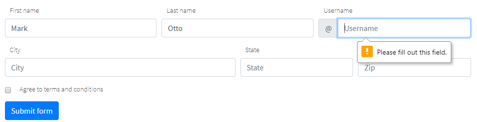

Here is an example with provided Bootstrap v4.3 code:

```java 
@UI("#validated-form")
public FormValidationForm form;

@Test
public void browserValidationTest() {
    String name = "ValidName";
    String email = "InvalidEmail";
    String phone = "InvalidPhone";

    SimpleContact entity = new SimpleContact(name, email, phone);

    form.fill(entity);
    form.submit();

    Map<String, String> validFeedback = form.getValidationMessages();

    MatcherAssert.assertThat("", validFeedback.get("Email"),
        Matchers.is("Please include an '@' in the email address. 'InvalidEmail' is missing an '@'.")); //Browser dependent message
    MatcherAssert.assertThat("", validFeedback.get("Phone"),
        Matchers.is("Please match the requested format.")); //Browser dependent message
    MatcherAssert.assertThat("", validFeedback.get("Name"), Matchers.is(""));
}
```

 ```html 
<form id="validated-form"">
    <div class="row">
        <div class="col">
            <div class="form-group">
                <input id="validated-form-name-field" type="text" class="form-control" placeholder="Enter name" required="">
            </div>
        </div>
        <div class="col">
            <div class="form-group">
                <input type="email" class="form-control" id="validated-form-email" placeholder="Enter email" required="">
            </div>
        </div>
        <div class="col">
            <div class="form-group">
                <input type="text" class="form-control" id="validated-form-phone" placeholder="Enter phone" pattern="^[-+0-9()\s]+$">
            </div>
        </div>
    </div>
    <div class="row">
        <div class="col">
        <button type="submit" class="btn btn-primary" id="validated-form-submit">Send</button>
        <button type="reset" class="btn btn-danger" id="validated-form-reset">Clear</button>
        </div>
    </div>
</form>
```
 
Available methods for form validation in Java JDI Light:

|Method/Property | Description | Return Type
--- | --- | ---
**isValid()** | Return if form valid | boolean 
**getValidationMessages()** | Return map field names to browser validation messages | Map<String, String>
**getValidFeedback()** |  Return map field names to visible valid bootstrap feedback text | Map<String, String>
**getInvalidFeedback()** |  Return map field names to visible invalid bootstrap feedback text | Map<String, String>
**getFeedbackElements()** |  Return map field names to visible bootstrap feedback elements | Map<String, UIElement>

 <a href="https://github.com/jdi-testing/jdi-light/tree/bootstrap/jdi-light-bootstrap-tests/src/test/java/io/github/epam/bootstrap/tests/composite/section/form/BootstrapValidationTest.java" target="_blank">Bootstrap Test Examples</a>
 
 
 
### Scrollspy
**[Scrollspy](https://getbootstrap.com/docs/4.3/components/scrollspy/#example-in-navbar)** – automatically update Bootstrap navigation or list group components based on scroll position to indicate which link is currently active in the viewport.
<br><br>
- [Scrollspy in navbar] (https://getbootstrap.com/docs/4.3/components/scrollspy/#example-in-navbar) 
<br>


<br>

```java 
    // @FindBy(css = "#navbar-example2")
    @UI("#navbar-example2") public static NavbarWithDropdown navbarWithDropdown;
    // @FindBy(css = "#navbar-example2~div")
    @UI("#navbar-example2~div") public static ScrollSpyNav scrollSpyInNavbar;
    
    public class NavbarWithDropdown extends Section {
        // @FindBy(css = "ul>li")
        @UI("ul>li") 
        public ListGroup navGroup;
        // @FindBy(css ="ul>li>a")
        @UI("ul>li>a") 
        public ListGroup navItemLink;
        @JDropdown(expand = ".dropdown-toggle",
                value = ".dropdown-toggle",
                list = ".dropdown-item")
        public Dropdown dropdownMenu;
        // @FindBy(css = ".navbar-brand")
        @UI(".navbar-brand") 
        public Link navbarLink;
    }
  
    public class ScrollSpyNav extends Section {
        // @FindBy(xpath = ".//h4 | .//h5")
        @UI(".//h4 | .//h5") public ListGroup header;
        // @FindBy(css = "p")
        @UI("p") public ListGroup mainText;          
    
        public void scrollParagraph(ListGroup listGroup, int index, String className){
            mainText.get(index).show();
    
            if (!listGroup.get(index).core().hasClass(className) &&
                    index < header.size()) {
                header.get(index + 1).show();
            }
        }
    }

    private String itemLink = "https://jdi-testing.github.io/jdi-light/bootstrap.html#";
    
    @DataProvider
    public Object[][] dropdownCheck() {
        return new Object[][]{
                {3, itemLink + "one", "one"},
                {4, itemLink + "two", "two"},
                {5, itemLink + "three", "three"}
        };
    }

    @Test(dataProvider = "dropdownCheck", priority = 1)
    public void dropdownCheckTests(int _index, String link, String header) {
        navbarWithDropdown.dropdownMenu.expand();
        navbarWithDropdown.dropdownMenu.list().get(header).is()
                .core()
                .displayed()
                .enabled()
                .text(is(header))
                .value(is(header))
                .attr(ATTR_NAME_HREF, is(link));
    }

    @Test
    public void navbarLinkClickableTests() {
        navbarWithDropdown.navbarLink.click();
        newWindowTitleCheck(pageTitle);
    }

    @Test
    public void isValidationTests() {
        navbarWithDropdown.navItemLink.get(3).is().text(dropdown);
        navbarWithDropdown.navItemLink.get(3).is().value(dropdown);
        navbarWithDropdown.navItemLink.is().size(3);
        navbarWithDropdown.navGroup.is().size(3);

        navbarWithDropdown.dropdownMenu.expand();
        navbarWithDropdown.dropdownMenu.is().size(3);

        navbarWithDropdown.find(By.className("dropdown-divider")).is()
                .core()
                .displayed()
                .enabled()
                .attr("role", "separator");
    }
      
```

```html
<nav id="navbar-example2" class="navbar navbar-light bg-light">
    <a class="navbar-brand"
       href="https://getbootstrap.com/docs/4.3/components/scrollspy/#example-in-navbar"
       target="_blank">Navbar</a>
    <ul class="nav nav-pills">
        <li class="nav-item"><a class="nav-link" href="#fat">@fat</a>
        </li>
        <li class="nav-item"><a class="nav-link" href="#mdo">@mdo</a>
        </li>
        <li class="nav-item dropdown"><a
                class="nav-link dropdown-toggle" data-toggle="dropdown"
                href="#" role="button" aria-haspopup="true"
                aria-expanded="false">Dropdown</a>
            <div class="dropdown-menu">
                <a class="dropdown-item" href="#one">one</a> <a
                    class="dropdown-item" href="#two">two</a>
                <div role="separator" class="dropdown-divider"></div>
                <a class="dropdown-item" href="#three">three</a>
            </div>
        </li>
    </ul>
</nav>
<div data-spy="scroll" data-target="#navbar-example2"
     data-offset="0" class="scrollspy-example">
    <h4 id="fat">@fat</h4>
    <p>...</p>
    <h4 id="mdo">@mdo</h4>
    <p>...</p>
    <h4 id="one">one</h4>
    <p>...</p>
    <h4 id="two">two</h4>
    <p>...</p>
    <h4 id="three">three</h4>
    <p>...</p>
</div>
```
<br>
<br>


- [Scrollspy with nested nav] (https://getbootstrap.com/docs/4.3/components/scrollspy/#example-with-nested-nav)
<br> 

<br>

```java 
// @FindBy(css = "#navbar-example3")
@UI("#navbar-example3") public static NestedNav nestedNav;
// @FindBy(css = "#navbar-example3~div")
@UI("#navbar-example3~div") public static ScrollSpyNav scrollSpyWithNestedNav;
  
public class NestedNav extends Section {
    // @FindBy(css = "nav")
    @UI("nav") public ListGroup navGroup;          
    // @FindBy(css = "nav nav a")
    @UI("nav nav a") public ListGroup navItemLink; 
    // @FindBy(css = ".navbar-brand")
    @UI(".navbar-brand") public Link navbarLink;   
}

public class ScrollSpyNav extends Section {
    // @FindBy(xpath = ".//h4 | .//h5")
    @UI(".//h4 | .//h5") public ListGroup header;
    // @FindBy(css = "p")
    @UI("p") public ListGroup mainText;          

    public void scrollParagraph(ListGroup listGroup, int index, String className){
        mainText.get(index).show();

        if (!listGroup.get(index).core().hasClass(className) &&
                index < header.size()) {
            header.get(index + 1).show();
        }
    }
}

@DataProvider
public Object[][] itemsCheck() {
    return new Object[][]{
            {1}, {2}, {3}, {4}, {5}, {6}, {7}
    };
}

@Test(dataProvider = "itemsCheck")
public void paragraphClickableTests(int index) {
    scrollSpyWithNestedNav.mainText.get(index).highlight();

    scrollSpyWithNestedNav.scrollParagraph(nestedNav.navItemLink, index, CLASS_NAME_ACTIVE);

    assertTrue(nestedNav.navItemLink.get(index).hasClass(CLASS_NAME_ACTIVE));
    nestedNav.navItemLink.get(index).unhighlight();
}


@Test
public void isValidationTests() {
    nestedNav.navItemLink.is().size(7);
    nestedNav.navGroup.is().size(3);
    scrollSpyWithNestedNav.mainText.is().size(7);
    scrollSpyWithNestedNav.header.is().size(7);
}
```

```html
<nav id="navbar-example3" class="navbar navbar-light bg-light">
    <a class="navbar-brand"
       href="https://getbootstrap.com/docs/4.3/components/scrollspy/#example-with-nested-nav"
       target="_blank">Navbar</a>
    <nav class="nav nav-pills flex-column">
        <a class="nav-link" href="#item-1">Item 1</a>
        <nav class="nav nav-pills flex-column">
            <a class="nav-link ml-3 my-1" href="#item-1-1">Item 1-1</a> <a
                class="nav-link ml-3 my-1" href="#item-1-2">Item 1-2</a>
        </nav>
        <a class="nav-link" href="#item-2">Item 2</a> <a
            class="nav-link" href="#item-3">Item 3</a>
        <nav class="nav nav-pills flex-column">
            <a class="nav-link ml-3 my-1" href="#item-3-1">Item 3-1</a> <a
                class="nav-link ml-3 my-1" href="#item-3-2">Item 3-2</a>
        </nav>
    </nav>
</nav>

<div data-spy="scroll" data-target="#navbar-example3"
     data-offset="0" class="scrollspy-example-2">
    <h4 id="item-1">Item 1</h4>
    <p>...</p>
    <h5 id="item-1-1">Item 1-1</h5>
    <p>...</p>
    <h5 id="item-1-2">Item 1-2</h5>
    <p>...</p>
    <h4 id="item-2">Item 2</h4>
    <p>...</p>
    <h4 id="item-3">Item 3</h4>
    <p>...</p>
    <h5 id="item-3-1">Item 3-1</h5>
    <p>...</p>
    <h5 id="item-3-2">Item 3-2</h5>
    <p>...</p>
</div>
```
<br>
<br>

- [Scrollspy with list-group] (https://getbootstrap.com/docs/4.3/components/scrollspy/#example-with-list-group)
<br>

<br>

```java 
// @FindBy(css = "#list-example>a")
@UI("#list-example>a") public static ListGroup listGroupForScrollSpy;
// @FindBy(css = "#list-example~div")
@UI("#list-example~div") public static ScrollSpyNav scrollSpyWithListGroup;

public class ScrollSpyNav extends Section {
    // @FindBy(xpath = ".//h4 | .//h5")
    @UI(".//h4 | .//h5") public ListGroup header;
    // @FindBy(css = "p")
    @UI("p") public ListGroup mainText;          

    public void scrollParagraph(ListGroup listGroup, int index, String className){
        mainText.get(index).show();

        if (!listGroup.get(index).core().hasClass(className) &&
                index < header.size()) {
            header.get(index + 1).show();
        }
    }
}

@DataProvider
public Object[][] itemsCheck() {
    return new Object[][]{
            {1}, {2}, {3}, {4}
    };
}   

@Test(dataProvider = "itemsCheck")
public void paragraphClickableTests(int index) {
    scrollSpyWithListGroup.mainText.get(index).highlight();

    scrollSpyWithListGroup.scrollParagraph(listGroupForScrollSpy, index, CLASS_NAME_ACTIVE);

    listGroupForScrollSpy.get(index)
            .is()
            .core()
            .displayed()
            .enabled()
            .cssClass(CLASS_NAME_LIST_GROUP_ITEM_LIST_GROUP_ITEM_ACTION_ACTIVE)
            .css(CSS_NAME_BACKGROUND_COLOR, "rgba(0, 123, 255, 1)")//#007bff Color Hex
            .css(CSS_NAME_BORDER_COLOR, "rgb(0, 123, 255)");//#007bff Color Hex

    listGroupForScrollSpy.get(index).unhighlight();
}

@Test
public void isValidationTests() {
    scrollSpyWithListGroup.header.is().size(4);
    scrollSpyWithListGroup.mainText.is().size(4);
    listGroupForScrollSpy.is().size(4);
}
```

```html
<div id="list-example" class="list-group">
    <a class="list-group-item list-group-item-action"
       href="#list-item-1">Item 1</a> <a
        class="list-group-item list-group-item-action"
        href="#list-item-2">Item 2</a> <a
        class="list-group-item list-group-item-action"
        href="#list-item-3">Item 3</a> <a
        class="list-group-item list-group-item-action"
        href="#list-item-4">Item 4</a>
</div>
<div data-spy="scroll" data-target="#list-example"
     data-offset="0" class="scrollspy-example">
    <h4 id="list-item-1">Item 1</h4>
    <p>...</p>
    <h4 id="list-item-2">Item 2</h4>
    <p>...</p>
    <h4 id="list-item-3">Item 3</h4>
    <p>...</p>
    <h4 id="list-item-4">Item 4</h4>
    <p>...</p>
</div>
```

Available methods in Java JDI Light:

|Method | Description | Return Type
--- | --- | ---
**assertThat()**	|  Assert action	| TextAssert
**click()**	| Click element | void
**expand()**| Expand dropdown|void  
**get(int)**	| Select element by index	 | UIElement
**get(String)**	| Select element by text	 | UIElement
**getText()**|Get text	  | String
**getValue()**| Get value | String
**is()**		|  Assert action	| TextAssert
**list()**| Get list of dropdown | WebList
**show ()**| Scroll to element| void
**size()**| Get WebList size| int

In these java test cases examples next classes have been used:

 - Java: com.epam.jdi.light.elements.composite.Section

 - Java: com.epam.jdi.light.elements.complex.ListGroup

 - Java: com.epam.jdi.light.ui.bootstrap.elements.common.Link

 - Java: com.epam.jdi.light.elements.complex.dropdown.Dropdown

[Scrollspy in navbar Tests Example](https://github.com/jdi-testing/jdi-light/blob/bootstrap/jdi-light-bootstrap-tests/src/test/java/io/github/epam/bootstrap/tests/composite/section/scrollspy/ScrollspyInNavbarTests.java)

[Scrollspy with nested nav Tests Example](https://github.com/jdi-testing/jdi-light/blob/bootstrap/jdi-light-bootstrap-tests/src/test/java/io/github/epam/bootstrap/tests/composite/section/scrollspy/ScrollspyWithNestedNavTests.java)

[Scrollspy with list-group Tests Example](https://github.com/jdi-testing/jdi-light/blob/bootstrap/jdi-light-bootstrap-tests/src/test/java/io/github/epam/bootstrap/tests/composite/section/scrollspy/ScrollspyWithListGroupTests.java)

<br><br>

### Media object

```java 
public class MediaObject extends Section {
}
```

<a href="https://getbootstrap.com/docs/4.3/components/media-object" target=a_blank> Media object</a> helps build complex and repetitive components where some media is positioned alongside content that doesn’t wrap around said media.

**Media object sample**


Here is an example with provided Bootstrap v4.3 code:
  
  ```java 
  // @FindBy(css = "#media-object-sample")
  @UI("#media-object-sample") public static MediaObjectSample mediaObjectSample; 
  
  public class MediaObjectSample extends MediaObject {
  @UI("img") public Image imageOfMediaObject;
  
  @Title
  @UI("h5") public Text headingOfMediaObject;
  
  @UI(".media-body") public Text bodyOfMediaObject;
  }
  
  @Test
  public void isValidationTestSample() {
      mediaObjectSample.is().displayed();
      mediaObjectSample.is().enabled();
      mediaObjectSample.bodyOfMediaObject.is().text(is(bodyTextOfMediaObjectSample));
      mediaObjectSample.bodyOfMediaObject.is().text(containsString("American comic books"));
      assertThat(mediaObjectSample.headingOfMediaObject.core().css("font-size"), is("20px"));
      assertThat(mediaObjectSample.bodyOfMediaObject.core().css("font-size"), is("14px"));
      mediaObjectSample.bodyOfMediaObject.assertThat().displayed()
              .and().text(is(bodyTextOfMediaObjectSample))
              .core()
              .css("font-size", is("14px"))
              .cssClass("media-body")
      ;
  }
  ```

```html
<div class="media" id="media-object-sample">
    
    <div class="media-body">
        <h5 class="mt-0">WOLVERINE</h5>
        Wolverine is a fictional character appearing in American comic books published by Marvel
        Comics, mostly in association with the X-Men. He is a mutant who possesses animal-keen
        senses, enhanced physical capabilities, powerful regenerative ability known as a healing
        factor, and three retractable claws in each hand.
    </div>
</div>
```


**Media object nesting**


Here is an example with provided Bootstrap v4.3 code:
  
  ```java 
  // @FindBy(css = "#media-object-nesting")
  @UI("#media-object-nesting") public static MediaObjectNesting mediaObjectNesting; 
  
  public class MediaObjectNesting extends MediaObject {
  @UI("img") public Image imageOfMediaObject;
  
  @Title
  @UI("h5") public Text headingOfMediaObject;
  
  @UI(".media-body") public Text bodyOfMediaObject;
  
  @UI("div.media div.media") public MediaObjectSample  nestingMediaObject;
  }
  
  @Test
  public void isValidationTestNesting() {
      mediaObjectNesting.is().displayed();
      mediaObjectNesting.is().enabled();
      mediaObjectNesting.nestingMediaObject.bodyOfMediaObject.is().text(is(bodyTextOfMediaObjectNesting));
      mediaObjectNesting.nestingMediaObject.bodyOfMediaObject.is().text(containsString("vel eu leo"));
      assertThat(mediaObjectNesting.nestingMediaObject.headingOfMediaObject.core().css("font-size"), is("20px"));
      assertThat(mediaObjectNesting.nestingMediaObject.bodyOfMediaObject.core().css("font-size"), is("14px"));
      mediaObjectNesting.nestingMediaObject.bodyOfMediaObject.assertThat().displayed()
              .and().text(is(bodyTextOfMediaObjectNesting))
              .core()
              .css("font-size", is("14px"))
              .cssClass("media-body")
      ;
  
  }
  
  ```
  
```html
<div class="media" id="media-object-nesting">
    
    <div class="media-body">
        <h5 class="mt-0">Media heading</h5>
        Cras sit amet nibh libero, in gravida nulla. Nulla vel metus scelerisque ante
        sollicitudin.
        <div class="media mt-3">
            <a class="mr-3" href="https://jdi-testing.github.io/jdi-light/index.html"
               target="_blank">
                
            </a>
            <div class="media-body">
                <h5 class="mt-0">IRON MAN</h5>
                Donec sed odio dui. Nullam quis risus eget urna mollis ornare vel eu leo.
            </div>
        </div>
    </div>
</div>
```


**Media object list**


Here is an example with provided Bootstrap v4.3 code:

```java 
    // @FindBy(css = "#media-object-list")
    @UI("#media-object-list") public static JList<MediaObjectSample> mediaObjectList; 
    
    @Test
    public void isValidationTestListMediaObject() {
        mediaObjectList.is().displayed();
        mediaObjectList.is().enabled();
        mediaObjectList.get(1).headingOfMediaObject.is().text(is(listOfHeading.get(0)));
        mediaObjectList.get(2).bodyOfMediaObject.is().text(containsString("Stark requires"));
        assertThat(mediaObjectList.get(2).headingOfMediaObject.core().css("font-size"), is("20px"));
        assertThat(mediaObjectList.get(1).bodyOfMediaObject.core().css("font-size"), is("14px"));
        mediaObjectList.assertThat().displayed()
                .core()
                .css("font-size", is("14px"));
    }

```
  
```html
<ul class="list-unstyled" id="media-object-list">
    <li class="media">
        
        <div class="media-body">
            <h5 class="mt-0 mb-1">WOLVERINE first</h5>
            Wolverine is a fictional character appearing in American comic books published by
            Marvel Comics
        </div>
    </li>
    <li class="media my-4">
        
        <div class="media-body">
            <h5 class="mt-0 mb-1">IRON MAN second</h5>
            I do anything and everything that Mr. Stark requires — including occasionally taking
            out the trash
        </div>
    </li>
    <li class="media">
        
        <div class="media-body">
            <h5 class="mt-0 mb-1">SPIDER MAN third</h5>
            Spider-Man is a fictional superhero created by writer-editor Stan Lee and
            writer-artist Steve Ditko.
        </div>
    </li>
</ul>
```

Media object is represented by MediaObject class: 

  <a href="https://github.com/jdi-testing/jdi-light/tree/bootstrap/jdi-light-bootstrap/src/main/java/com/epam/jdi/light/ui/bootstrap/elements/composite/MediaObject.java">MediaObject</a>  

MediaObject class is inherited from Section class:
 
  [Section](https://jdi-docs.github.io/jdi-light/#section)
  
Inner elements of media object can be represented by the following classes:
<ul>
    <li> [Text](https://jdi-docs.github.io/jdi-light/#text) </li>
    <li> [Label](https://jdi-docs.github.io/jdi-light/#label) </li>
    <li> [Link](https://jdi-docs.github.io/jdi-light/#link)  </li>
    <li> [Image](https://jdi-docs.github.io/jdi-light/#image)  </li>
    <li> [See more elements](https://jdi-docs.github.io/jdi-light/#html5-common-elements) </li>
</ul>
     
   <a href="https://github.com/jdi-testing/jdi-light/tree/bootstrap/jdi-light-bootstrap-tests/src/test/java/io/github/epam/bootstrap/tests/composite/section/mediaObject/MediaObjectTests.java" target=a_blank> Bootstrap test examples </a>


### Modal
[Modal](https://getbootstrap.com/docs/4.3/components/modal/) is a dialog box/popup window that is displayed on page.

#### [Modal Live demo](https://getbootstrap.com/docs/4.3/components/modal/#live-demo)
Toggle a working modal demo by clicking the button below. It will slide down and fade in from the top of the page.


Here is an example with provided Bootstrap v4.3 code:

```java 
//FindBy(css = "#modal-live-demo .bd-example .btn")
@UI("#modal-live-demo .bd-example .btn") 
public static Button modalLiveDemoLaunchButton;

//FindBy(css = "#exampleModalLive")
@UI("#exampleModalLive") 
public static ModalLiveDemo modalLiveDemo;

public class ModalLiveDemo extends Modal {
    @UI(".modal-body") public Text body;
    @UI("//div[@class='modal-footer']//button[1]") public Button closeButton;
    @UI("//div[@class='modal-footer']//button[2]") public Button saveButton;
    @UI(".modal-header .close") public Button closeX;
}

@Test
public void modalContentTextTest() {
    modalLiveDemoLaunchButton.is().text(is(launchButtonText));
    modalLiveDemoLaunchButton.click();
    modalLiveDemo.title.is().text(is(titleText));
    modalLiveDemo.body.is().text(is(bodyText));
    modalLiveDemo.saveButton.is().text(is(saveButtonText));
    modalLiveDemo.closeButton.is().text(is(closeButtonText));
    modalLiveDemo.close();
}

@Test
public void saveAndCloseButtonsTest() {
    modalLiveDemoLaunchButton.click();
    modalLiveDemo.is().displayed();
    modalLiveDemo.saveButton.click();
    modalLiveDemo.is().displayed();
    modalLiveDemo.closeButton.click();
    modalLiveDemo.is().hidden();
}
```

```html
<div id="exampleModalLive" class="modal fade" tabindex="-1" role="dialog"
     aria-labelledby="exampleModalLiveLabel" aria-hidden="true">
    <div class="modal-dialog" role="document">
        <div class="modal-content">
            <div class="modal-header">
                <h5 class="modal-title" id="exampleModalLiveLabel">Modal title</h5>
                <button type="button" class="close" data-dismiss="modal" aria-label="Close">
                    <span aria-hidden="true">&times;</span>
                </button>
            </div>
            <div class="modal-body">
                <p>Woohoo, you're reading this text in a modal!</p>
            </div>
            <div class="modal-footer">
                <button type="button" class="btn btn-secondary" data-dismiss="modal">Close
                </button>
                <button type="button" class="btn btn-primary">Save changes</button>
            </div>
        </div>
    </div>
</div>
```

Modal is represented by Section class in Java:
 
+ Section #BS

Inner elements of Modal - Live demo are represented by the following classes:

+ [Text](https://jdi-docs.github.io/jdi-light/#text)
+ [Button](https://jdi-docs.github.io/jdi-light/#button)

Available methods in Java JDI Light:

|Method | Description | Return Type
--- | --- | ---
**close()** | Close modal | void
**click()** | Click the button | void
**getText()** | Returns text | String
**is()** | Asserts element  | UIAssert

[Bootstrap test examples](https://github.com/jdi-testing/jdi-light/tree/bootstrap/jdi-light-bootstrap-tests/src/test/java/io/github/epam/bootstrap/tests/composite/section/modal/ModalLiveDemoTests.java)

#### [Scrolling Long Content Modal](https://getbootstrap.com/docs/4.3/components/modal/#scrolling-long-content)

When modals become too long for the user’s viewport or device, they scroll independent of the page itself.


Here is an example with provided Bootstrap v4.3 code:

```java 
// @FindBy(id = "modal-scroll-long")
@UI("#modal-scroll-long")
public static SectionModalLongScrolling sectionModalLongScrolling;

// @FindBy(id = "exampleModalLong")
@UI("#exampleModalLong")
public ModalWithButtons modalLong;

// @FindBy(id = "exampleModalScrollable")
@UI("#exampleModalScrollable")
public ModalWithButtons modalScrollable;

// @FindBy(css = "#modal-scroll-long div:nth-child(2) button")
@UI("div:nth-child(2) button")
public Button buttonLongScroll;

// @FindBy(css = "#modal-scroll-long div:nth-child(4) button")
@UI("div:nth-child(4) button")
public Button buttonLongScrollable;

@DataProvider
public Object[][] listData() {
    return new Object[][]{
            {sectionModalLongScrolling.buttonLongScroll, sectionModalLongScrolling.modalLong},
            {sectionModalLongScrolling.buttonLongScrollable, sectionModalLongScrolling.modalScrollable}
    };
}

@Test(dataProvider = "listData")
public void bottomButtonsTest(Button showModal, ModalWithButtons modal) {
    showModal.click();
    modal.is().displayed();
    modal.bottomSave();
    modal.bottomClose();
    modal.is().disappear();
}
```

```html 
<!-- Button trigger modal -->
<button type="button" class="btn btn-primary" data-toggle="modal" data-target="#exampleModalLong">
  Launch demo modal
</button>

<!-- Modal -->
<div class="modal fade" id="exampleModalLong" tabindex="-1" role="dialog" aria-labelledby="exampleModalLongTitle" aria-hidden="true">
  <div class="modal-dialog" role="document">
    <div class="modal-content">
      <div class="modal-header">
        <h5 class="modal-title" id="exampleModalLongTitle">Modal title</h5>
        <button type="button" class="close" data-dismiss="modal" aria-label="Close">
          <span aria-hidden="true">&times;</span>
        </button>
      </div>
      <div class="modal-body">
        ...
      </div>
      <div class="modal-footer">
        <button type="button" class="btn btn-secondary" data-dismiss="modal">Close</button>
        <button type="button" class="btn btn-primary">Save changes</button>
      </div>
    </div>
  </div>
</div>
```


Here is an example with provided Bootstrap v4.3 code:

```html 
<!-- Button trigger modal -->
<button type="button" class="btn btn-primary" data-toggle="modal" data-target="#exampleModalScrollable">
  Launch demo modal
</button>

<!-- Modal -->
<div class="modal fade" id="exampleModalScrollable" tabindex="-1" role="dialog" aria-labelledby="exampleModalScrollableTitle" aria-hidden="true">
  <div class="modal-dialog modal-dialog-scrollable" role="document">
    <div class="modal-content">
      <div class="modal-header">
        <h5 class="modal-title" id="exampleModalScrollableTitle">Modal title</h5>
        <button type="button" class="close" data-dismiss="modal" aria-label="Close">
          <span aria-hidden="true">&times;</span>
        </button>
      </div>
      <div class="modal-body">
        ...
      </div>
      <div class="modal-footer">
        <button type="button" class="btn btn-secondary" data-dismiss="modal">Close</button>
        <button type="button" class="btn btn-primary">Save changes</button>
      </div>
    </div>
  </div>
</div>
```

Modal is represented by Section class in Java:
 
+ Section #BS

Available methods in Java JDI Light:

|Method | Description | Return Type
--- | --- | ---
**close()** | Close modal | void
**displayed()** | Asserts element is displayed  | UIAssert
**is()** | Asserts element  | UIAssert
**hidden()** | Asserts element is hidden | UIAssert

[Bootstrap test examples](https://github.com/jdi-testing/jdi-light/tree/bootstrap/jdi-light-bootstrap-tests/src/test/java/io/github/epam/bootstrap/tests/composite/section/modal/ModalScrollingLongContentTests.java)

#### [Vertically Centered Modal](https://getbootstrap.com/docs/4.3/components/modal/#vertically-centered)

Add ``.modal-dialog-centered`` to ``.modal-dialog`` to vertically center the modal.


```java 

// @FindBy(id = "modal-vertically-centered")
@UI("#modal-vertically-centered")
public static ModalVerticallyCentered modalVerticallyCentered;

@Test(dataProvider = "modalBasicData")
public void modalBasicFunctionalityTest(Button showButton,
                                        Button dismissButton,
                                        Modal modal,
                                        String modalId) {
    WebDriverWait wait = new WebDriverWait(WebDriverFactory.getDriver(), 5);

    showButton.show();
    showButton.click();

    wait.until(ExpectedConditions.visibilityOfElementLocated(By.id(modalId)));

    modal.is().displayed();

    dismissButton.show();
    dismissButton.click();

    modal.is().hidden();
}
```

Here is an example with provided Bootstrap v4.3 code:

```html
<div id="exModalCenter" class="modal fade" tabindex="-1" role="dialog"
     aria-labelledby="exampleModalCenterTitle" aria-hidden="true">
    <div class="modal-dialog modal-dialog-centered" role="document">
        <div id="modal-vertical-content-1" class="modal-content">
            <div class="modal-header">
                <h5 class="modal-title" id="exModalCenterTitle">Modal title</h5>
                <button type="button" class="close" data-dismiss="modal" aria-label="Close">
                    <span aria-hidden="true">&times;</span>
                </button>
            </div>
            <div class="modal-body">
                <p>Cras mattis consectetur purus sit amet fermentum. Cras justo odio, dapibus ac
                    facilisis in, egestas eget quam. Morbi leo risus, porta ac consectetur ac,
                    vestibulum at eros.</p>
            </div>
            <div class="modal-footer">
                <button type="button" class="btn btn-secondary" data-dismiss="modal">Close
                </button>
                <button type="button" class="btn btn-primary">Save changes</button>
            </div>
        </div>
    </div>
</div>
```

Modal is represented by Section class in Java:
 
+ Section #BS

Available methods in Java JDI Light:

|Method | Description | Return Type
--- | --- | ---
**close()** | Close modal | void 
**displayed()** | Asserts element is displayed  | UIAssert
**hidden()** | Asserts element is hidden | UIAssert 
**is()** | Asserts element  | UIAssert

<a href="https://github.com/jdi-testing/jdi-light/blob/bootstrap/jdi-light-bootstrap-tests/src/test/java/io/github/epam/bootstrap/tests/composite/section/modal/ModalVerticallyCenteredTests.java" target="_blank">Bootstrap Test Examples</a>

#### Modal - Tooltips and popovers

**Modal - Tooltips and popovers**

Tooltips and popovers can be placed within modals as needed. When modals are closed, any tooltips and popovers within are also automatically dismissed.


Here is an example with provided Bootstrap v4.3 code:

```java 
//@Findby(xpath="//h4[.='Modal - Tooltips and popovers']/../..")
@UI("//h4[.='Modal - Tooltips and popovers']/../..")
public static ModalTooltipsAndPopovers modalTooltipsAndPopovers;

public class ModalTooltipsAndPopovers extends Section {
//@Findby(xpath="//button")
    @UI("//button") public Button demoModalButton;
    public ModalTooltipsAndPopoversDialog modalDlg;
}

public class ModalTooltipsAndPopoversDialog extends Modal {
//@Findby(css=".modal-body")
    @UI(".modal-body")
    public ModalTooltipsAndPopoversBody body;
    @UI("//div[@class='modal-footer']//button[1]")
    public Button closeButton;
    @UI("//div[@class='modal-footer']//button[2]")
    public Button saveButton;
}

public class ModalTooltipsAndPopoversBody extends Section {
//@Findby(css="h5:nth-child(1)")
    @UI("h5:nth-child(1)") public Text title1;
    public Popover popover;
    @UI("h5:nth-child(4)") public Text title2;
    @UI("p:nth-child(5) > a:nth-child(1)") public Link thisLink;
    public Tooltip tooltipOnLink;
    @UI("p:nth-child(5) > a:nth-child(2)") public Link thatLink;
}

@Test
public void verifyOpenModalDialogTooltips() {
    modalTooltipsAndPopovers.demoModalButton.click();
    modalTooltipsAndPopovers.modalDlg.title.is().text(is(TITLE));
    modalTooltipsAndPopovers.modalDlg.body.title1.is().text(is(BODY_TITLE1));
    modalTooltipsAndPopovers.modalDlg.body.title2.is().text(is(BODY_TITLE2));
    modalTooltipsAndPopovers.modalDlg.body.thisLink.is().text(is(THIS_LINK));
    modalTooltipsAndPopovers.modalDlg.body.thatLink.is().text(is(THAT_LINK));
    modalTooltipsAndPopovers.modalDlg.saveButton.is().text(is(SAVE_BUTTON));
    modalTooltipsAndPopovers.modalDlg.closeButton.is().text(is(CLOSE_BUTTON));
    modalTooltipsAndPopovers.modalDlg.closeButton.click();
}

```

```html
<div id="exampleModalPopovers" class="modal fade" tabindex="-1" role="dialog"
     aria-labelledby="exampleModalPopoversLabel" aria-hidden="true">
    <div class="modal-dialog" role="document">
        <div class="modal-content">
            <div class="modal-header">
                <h5 class="modal-title" id="exampleModalPopoversLabel">Modal title</h5>
                <button type="button" class="close" data-dismiss="modal" aria-label="Close">
                    <span aria-hidden="true">&times;</span>
                </button>
            </div>
            <div class="modal-body">
                <h5>Popover in a modal</h5>
                <p>This <a href="#exampleModalPopovers" role="button" class="btn btn-secondary popover-test"
                           title="Popover title" data-toggle="popover"
                           data-content="Popover body content is set in this attribute."
                           data-container="#exampleModalPopovers">button</a> triggers a popover on click.
                </p>
                <hr/>
                <h5>Tooltips in a modal</h5>
                <p><a href="#exampleModalPopovers" class="tooltip-test" title="Tooltip" data-toggle="tooltip"
                      data-container="#exampleModalPopovers">This link</a> and
                    <a href="#exampleModalPopovers" class="tooltip-test" title="Tooltip" data-toggle="tooltip"
                       data-container="#exampleModalPopovers">that link</a> have tooltips on hover.
                </p>
            </div>
            <div class="modal-footer">
                <button type="button" class="btn btn-secondary" data-dismiss="modal">Close
                </button>
                <button type="button" class="btn btn-primary">Save changes</button>
            </div>
        </div>
    </div>
</div>
```

Modal is represented by Section class in Java:
 
+ Section #BS

Available methods in Java JDI Light:

|Method | Description | Return Type
--- | --- | ---
**close()** | Close modal | void 
**displayed()** | Asserts element is displayed  | UIAssert
**hidden()** | Asserts element is hidden | UIAssert 
**is()** | Asserts element  | UIAssert


<a href="https://github.com/jdi-testing/jdi-light/blob/bootstrap/jdi-light-bootstrap-tests/src/test/java/io/github/epam/bootstrap/tests/composite/section/modal/ModalTooltipsAndPopoversTests.java" target="_blank">Bootstrap Test Examples</a>

<br><br>

**Modal using grid**

<a style="font-weight: bold;" target="_blank" href="https://getbootstrap.com/docs/4.3/components/modal/#using-the-grid">Modal using grid</a>


Here is an example with provided Bootstrap v4.3 code:

```java 
public class GridModalBody extends Section {
//FindBy(css = ".row")
@UI(".row")
private JList<GridRow> allGridRows;

//FindBy(css = '[class*='col']')
@UI("[class*='col']")
private JList<GridCell> allGridCells;

public JList<GridCell> getAllCells() {
   return allGridCells;
}

public JList<GridRow> getAllRows() {
   return allGridRows;
}

public GridRow getGridRow(int rowN) {
   return allGridRows.get(rowN);
}

public GridCell getCellInRow(int rowN, int cellN) {
    return getGridRow(rowN).getCell(cellN);
}

public String getTextFromCellInRow(int rowN, int cellN) {
        return getCellInRow(rowN, cellN).getText();
    }
}

@Test(dataProvider = "gridData")
public void checkTextInCell(int rowN, int cellN, String textExpected, String max_width) {
GridCell cell = gridModalSection.getGridModalWindow().getBody()
    .getCellInRow(rowN, cellN);
    cell.highlight("blue");
    cell.is().core()
             .text(textExpected)
             .and()
             .css("max-width", startsWith(max_width));
    cell.unhighlight();
    }

@Test
public void checkCloseXModalButton() {
     gridModalSection.getGridModalWindow().getBtnCloseX().highlight("red");
     gridModalSection.getGridModalWindow().close();
     gridModalSection.getGridModalWindow().is().disappear();
    }

@Test
public void checkCloseByEscapeButton() {
     gridModalSection.getGridModalWindow().core().sendKeys(Keys.ESCAPE);
     gridModalSection.getGridModalWindow().is().disappear();
    }
```

```html
<div id="grid-modal-base" class="html-left mb-3">
    <div id="gridSystemModal" class="modal fade" tabindex="-1" role="dialog"
         aria-labelledby="gridModalLabel" aria-hidden="true">
        <div class="modal-dialog" role="document">
            <div class="modal-content">
                <div class="modal-header">
                    <h5 class="modal-title" id="gridModalLabel">Grids in modals</h5>
                    <button id="close-modal-cross" type="button" class="close" data-dismiss="modal"
                            aria-label="Close"><span aria-hidden="true">&times;</span></button>
                </div>
                <div class="modal-body">
                    <div class="container-fluid bd-example-row">
                        <div class="row">
                            <div class="col-md-4">.col-md-4</div>
                            <div class="col-md-4 ml-auto">.col-md-4 .ml-auto</div>
                        </div>
                        <div class="row">
                            <div class="col-md-3 ml-auto">.col-md-3 .ml-auto</div>
                            <div class="col-md-2 ml-auto">.col-md-2 .ml-auto</div>
                        </div>
                        <div class="row">
                            <div class="col-md-6 ml-auto">.col-md-6 .ml-auto</div>
                        </div>
                        <div class="row">
                            <div class="col-sm-9">
                                Level 1: .col-sm-9
                                <div class="row">
                                    <div class="col-8 col-sm-6">
                                        Level 2: .col-8 .col-sm-6
                                    </div>
                                    <div class="col-4 col-sm-6">
                                        Level 2: .col-4 .col-sm-6
                                    </div>
                                </div>
                            </div>
                        </div>
                    </div>
                </div>
                <div class="modal-footer">
                    <button id="close-modal" type="button" class="btn btn-secondary"
                            data-dismiss="modal">Close
                    </button>
                    <button id="save-modal" type="button" class="btn btn-primary">Save changes
                    </button>
                </div>
            </div>
        </div>
    </div>

    <div class="bd-example">
        <button id="btn-modal-using-grid" type="button" class="btn btn-primary" data-toggle="modal"
                data-target="#gridSystemModal">Launch demo modal
        </button>
    </div>
</div>
```

Available methods in Java JDI Light:

|Method/Property | Description | Return Type
--- | --- | ---
**close()** | Close Modal Window using X control | void
**clickBtnClose()** | Close Modal Window  | void
**displayed()** | Asserts element is displayed  | UIAssert
**disappear()** | Asserts element is not displayed | UIAssert 
**getCellInRow(int rowN, int cellN)** | Get cellN from rowN | GridCell
**getGridRow(int rowN)** | Get rowN  | GridRow
**getTitle()** | Get Modal Window Title | Text

[Bootstrap test examples](https://github.com/jdi-testing/jdi-light/tree/bootstrap/jdi-light-bootstrap-tests/src/test/java/io/github/epam/bootstrap/tests/composite/section/modal/GridModalTests.java)

<br><br><br><br><br><br><br><br><br><br><br><br><br><br><br>

**Varying modal content**

Have a bunch of buttons that all trigger the same modal with slightly different contents? Use event.relatedTarget and HTML data-* attributes (possibly via jQuery) to <a href="https://getbootstrap.com/docs/4.3/components/modal/#varying-modal-content">vary the contents</a> of the modal depending on which button was clicked.


Here is an example with provided Bootstrap v4.3 code:

```java 
    public class Modal extends Section {
        //@FindBy(xpath = "div/h5[@class='modal-title']")
        @UI(".modal-header .modal-title")
        public Text title;
    }

    public class ModalVaryingContent extends Modal {
        //@FindBy(xpath = "div/button[@class='close']")
        @UI(".modal-header .close")
        public Button closeX;
    }

    @Test(dataProvider = "modalVaryingContentButtonsWithRecipients")
    public void modalButtonsTest(Button modalButton, String recipient) {
        checkButton(modalButton, String.format("Open modal for @%s", recipient), 
        whiteColor, blueColorBackground, blueColorBorder);
    }

    @Test(dataProvider = "modalVaryingContentButtonsWithRecipients")
    public void headerValidationTest(Button modalButton, String recipient) {
        modalButton.click();
        modalVaryingContentWindow.is().displayed();
        modalVaryingContentWindow.title.core().is()
                .text(String.format("NEW MESSAGE TO @%s", recipient.toUpperCase()));
        modalVaryingContentWindow.closeX.click();
        modalVaryingContentWindow.is().hidden();
    }

    private void checkButton(Button button, String text, String color, 
    String backgroundColor, String borderColor) {
        button.is().core()
                .text(text)
                .tag("button")
                .css("color", color)
                .css("background-color", backgroundColor)
                .css("border-color", borderColor);
    }
```

```html
<div class="modal fade" id="exampleModal" tabindex="-1" role="dialog"
     aria-labelledby="exampleModalLabel" aria-hidden="true">
    <div class="modal-dialog" role="document">
        <div id="modalVaryingContentWindow" class="modal-content">
            <div class="modal-header">
                <h5 class="modal-title" id="exampleModalLabel">New message</h5>
                <button type="button" class="close" data-dismiss="modal" aria-label="Close">
                    <span aria-hidden="true">&times;</span>
                </button>
            </div>
            <div class="modal-body">
                <form>
                    <div class="form-group">
                        <label for="recipient-name"
                               class="col-form-label">Recipient:</label>
                        <input type="text" class="form-control" id="recipient-name"/>
                    </div>
                    <div class="form-group">
                        <label for="message-text" class="col-form-label">Message:</label>
                        <textarea class="form-control" id="message-text"></textarea>
                    </div>
                </form>
            </div>
            <div class="modal-footer">
                <button type="button" class="btn btn-secondary" data-dismiss="modal">Close
                </button>
                <button type="button" class="btn btn-primary">Send message</button>
            </div>
        </div>
    </div>
</div>
```

Available methods in Java JDI Light:

|Method/Property | Description | Return Type
--- | --- | ---
**assertThat()** | Assert action  | TextAssert
**click()** | Click button  | void
**displayed()** | Assert is displayed  | void
**getTitle()** | Get Modal Window Title | Text 
**getText()** | Get text value of the element | String


[Bootstrap test examples](https://github.com/jdi-testing/jdi-light/blob/bootstrap/jdi-light-bootstrap-tests/src/test/java/io/github/epam/bootstrap/tests/composite/section/modal/ModalVaryingContentTests.java)

<br><br>

**Embedding YouTube videos**

Embedding YouTube videos in modals requires additional JavaScript not in Bootstrap to automatically stop playback and more. See <a href="https://stackoverflow.com/questions/18622508/bootstrap-3-and-youtube-in-modal">this helpful Stack Overflow post</a> for more information.


Here is an example with provided Bootstrap v4.3 code:

```java  
@UI("#modal-youtube button.btn-primary")
public static Button modalEmbeddedVideoButton;
@UI("#youTubeModalLabel")
public static EmbeddedVideoModal embeddedVideoModal;

private final static String VIDEO_TITLE = "Forget about Selenium. May the JDI Light force be with you";
private final static String VIDEO_URL = "https://www.youtube.com/watch?v=lw4g9ItC7Sc";

@Test
public void videoTitleTest() {
    modalEmbeddedVideoButton.click();
    embeddedVideoModal.getVideoModalFrame().getVideoTitle().is()
        .displayed()
        .enabled()
        .ref(VIDEO_URL)
        .text(VIDEO_TITLE);
    embeddedVideoModal.close();
}

@Test
public void playVideoTest() {
    modalEmbeddedVideoButton.click();
    embeddedVideoModal.getVideoModalFrame().getPlayButton().click();
    embeddedVideoModal.getVideoModalFrame().getProgressBar().assertThat()
        .displayed()
        .attr("aria-valuenow", Matchers.matchesPattern("[1-9]{1}[0-9]*"));
    embeddedVideoModal.close();
}
```

```html
<div id="modal-youtube" class="html-left mb-3">
    <div class="bd-example">
        <button type="button" class="btn btn-primary mb-3" data-toggle="modal"
                data-target="#youTubeModalLabel">Embedding YouTube video
        </button>
    </div>
    <div class="modal fade" tabindex="-1" role="dialog" aria-labelledby="youTubeModalLabel"
         id="youTubeModalLabel" aria-hidden="true">
        <div class="modal-dialog modal-xl">
            <div class="modal-content">

                <div class="modal-header">
                    <h5 class="modal-title h4">Embedding YouTube video</h5>
                    <button type="button" class="close" data-dismiss="modal" aria-label="Close">
                        <span aria-hidden="true">×</span>
                    </button>
                </div>
                <div class="modal-body">
                    <iframe allow="accelerometer; autoplay; encrypted-media; gyroscope; picture-in-picture"
                            allowfullscreen="" src="https://www.youtube.com/embed/lw4g9ItC7Sc"
                            width="1120" height="630" frameborder="0"></iframe>
                </div>
            </div>
        </div>
    </div>
</div>
```

Available methods in Java JDI Light:

|Method/Property | Description | Return Type
--- | --- | ---
**close()** | Close Modal Window using X control | void
**displayed()** | Asserts element is displayed  | UIAssert
**disappear()** | Asserts element is not displayed | UIAssert
**waitFor()** | Assert action | UIAssert 

[Bootstrap test examples](https://github.com/jdi-testing/jdi-light/blob/bootstrap/jdi-light-bootstrap-tests/src/test/java/io/github/epam/bootstrap/tests/composite/section/modal/ModalEmbeddingVideoTests.java)

<br><br>

**Optional Sizes**

Modals have three <a style="font-weight: bold;" href="https://getbootstrap.com/docs/4.3/components/modal/#optional-sizes" target="_blank">optional sizes</a>, available via modifier classes to be placed on a ``.modal-dialog``. 
These sizes kick in at certain breakpoints to avoid horizontal scrollbars on narrower viewports.


```java  
// @FindBy(id = "modal-optional-sizes")
@UI("#modal-optional-sizes")
public static ModalOptionalSizes modalOptionalSizes;

// @FindBy(css = "button:nth-of-type(1)")
@UI("button:nth-of-type(1)")
public Button xlButton;

// @FindBy(css = "button:nth-of-type(2)")
@UI("button:nth-of-type(2)")
public Button lgButton;

// @FindBy(css = "button:nth-of-type(3)")
@UI("button:nth-of-type(3)")
public Button smButton;

@Test(dataProvider = "modalCssData")
public void modalCssTest(Button button, Modal modal, String modalCss) {
    button.show();
    button.click();

    modal.is().displayed();

    modal.children().get(1).core().is().hasClass(modalCss);

    modal.close();
}

@Test(dataProvider = "modalSizeData")
public void modalSizeTest(Button button,
                          Modal modal,
                          int modalWidth) {
    button.show();
    button.click();

    modal.is().displayed();

    assertThat(modal.children().get(2).core().getRect().width, equalTo(modalWidth));

    modal.close();
}
```

Here is an example with provided Bootstrap v4.3 code:

```html
<div class="modal fade bd-example-modal-xl" tabindex="-1" role="dialog"
     aria-labelledby="myExtraLargeModalLabel" aria-hidden="true">
    <div class="modal-dialog modal-xl">
        <div class="modal-content">

            <div class="modal-header">
                <h5 class="modal-title h4" id="myExtraLargeModalLabel">Extra large modal</h5>
                <button type="button" class="close" data-dismiss="modal" aria-label="Close">
                    <span aria-hidden="true">&times;</span>
                </button>
            </div>
            <div class="modal-body">
                ...
            </div>
        </div>
    </div>
</div>
```

Modal is represented by Section class in Java:
 
+ Section #BS

Available methods in Java JDI Light:

|Method | Description | Return Type
--- | --- | ---
**close()** | Close modal | void 
**displayed()** | Asserts element is displayed  | UIAssert
**hidden()** | Asserts element is hidden | UIAssert 
**hasClass()** | Matches passed value with the element class | IsAssert 
**is()** | Asserts element  | UIAssert

<a href="https://github.com/jdi-testing/jdi-light/blob/bootstrap/jdi-light-bootstrap-tests/src/test/java/io/github/epam/bootstrap/tests/composite/section/modal/ModalOptionalSizesTests.java" target="_blank">Bootstrap Test Examples</a>

### Popovers

***[Popovers](https://getbootstrap.com/docs/4.3/components/popovers/)***

#### Example
**[Popover example](https://getbootstrap.com/docs/4.3/components/popovers/#example)** 


Here is an example with provided Bootstrap v4.3 code:

```java 
// @FindBy(css = "body") public static Popover popover;
@UI("body") public static Popover popover;

@Test
public void isValidationTests() {
    popover.getPopover(locator);
    popover.popoverButton.is()
            .displayed()
            .enabled()
            .core()
            .attr("data-toggle", "popover")
            .attr("data-content", popoverBody)
            .attr("data-original-title", popoverHeader)
            .text(is(buttonText));
    popover.container
            .is()
            .enabled()
            .core()
            .hasClass("popover fade bs-popover-right show")
            .attr("role", "tooltip")
            .attr("x-placement", "right");
    popover.body
            .is()
            .enabled()
            .core()
            .hasClass("popover-body")
            .text(is(popoverBody));
    popover.header
            .is()
            .core()
            .hasClass("popover-header")
            .text(is(popoverHeader.toUpperCase()));
    popover.popoverButton.click();
}

@Test()
public void clickableTests() {
    popover.getPopover(locator);
    popover.popoverButton.click();
    popover.popoverButton
            .is()
            .core()
            .attr("aria-describedby", containsString("popover"));
    popover.container
            .is()
            .enabled();
    popover.container.click();
    popover.popoverButton
            .is()
            .core()
            .attr("aria-describedby", "");
    assertFalse(popover.container.isDisplayed());
}
```

```html
<button type="button" class="btn btn-lg btn-danger btn-block mb-3" id="popover-title"
        data-toggle="popover" title="Popover title"
        data-content="And here's some amazing content. It's very engaging. Right?">Click to
    toggle popover
</button>
```

```html 
<div class="popover fade bs-popover-right show" role="tooltip" id="popover757247" style="will-change: 
    transform; position: absolute; transform: translate3d(542px, 39291px, 0px); top: 0px; left: 0px;" x-placement=
    "right">
    <div class="arrow" style="top: 35px;"></div>
    <h3 class="popover-header">Popover title</h3><div class="popover-body">And here's some amazing content. It's very engaging. Right?</div>
</div>
```


|Method | Description | Return Type
--- | --- | ---
 **assertThat()** | Assert action | TextAssert
 **click()** | Get button text | void
 **disabled()** | assert is disabled | TextAssert
 **displayed()** | assert is displayed | TextAssert
 **get()** | Select button by index | UIElement
 **getText()** | Get button text | String
 **getPopover(String locator)** | Get the popover click  | void
 **getBody()** | Get body of popover  |  String
 **getContainer()** | Get container of popover  |  String
 **getHeader()** | Get header of popover  |  String
 **enabled()** | assert is enabled | TextAssert
 **highlight()** | Get button text | void
 **is()** | Assert action | TextAssert 
 **unhighlight()** | Get button text | void

<br>

[Java test examples](https://github.com/jdi-testing/jdi-light/blob/bootstrap/jdi-light-bootstrap-tests/src/test/java/io/github/epam/bootstrap/tests/composite/section/popover/PopoverTests.java)<br>

Popover group is represented by Section class in Java:
 
  [Section](https://jdi-docs.github.io/jdi-light/#section)  

<br>

Inner elements of input group can be represented by following classes:
 <ul>
  <li> [Text](https://jdi-docs.github.io/jdi-light/#text) </li>
  
  <li> [Button](https://jdi-docs.github.io/jdi-light/#button-2) </li> 
  
  <li> [MediaObject](https://jdi-docs.github.io/jdi-light/#media-object) </li>
 </ul>
 

#### Four directions popovers
**[Four directions popovers](https://getbootstrap.com/docs/4.3/components/popovers/#four-directions)** 

Popover top


Here is an example with provided Bootstrap v4.3 code:

```java 
// @FindBy(css = "body") public static Popover popover;
@UI("body") public static Popover popover;

@Test
public void isValidationTests() {
    popover.getPopover(locator);
    popover.popoverButton.is()
            .displayed()
            .enabled()
            .core()
            .attr("data-toggle", "popover")
            .attr("data-content", popoverBody)
            .attr("data-original-title", popoverHeader)
            .text(is(buttonText));
    popover.container
            .is()
            .enabled()
            .core()
            .hasClass("popover fade bs-popover-right show")
            .attr("role", "tooltip")
            .attr("x-placement", "right");
    popover.body
            .is()
            .enabled()
            .core()
            .hasClass("popover-body")
            .text(is(popoverBody));
    popover.header
            .is()
            .core()
            .hasClass("popover-header")
            .text(is(popoverHeader.toUpperCase()));
    popover.popoverButton.click();
}

@Test()
public void clickableTests() {
    popover.getPopover(locator);
    popover.popoverButton.click();
    popover.popoverButton
            .is()
            .core()
            .attr("aria-describedby", containsString("popover"));
    popover.container
            .is()
            .enabled();
    popover.container.click();
    popover.popoverButton
            .is()
            .core()
            .attr("aria-describedby", "");
    assertFalse(popover.container.isDisplayed());
}
```

```html
<button type="button" class="btn btn-secondary btn-block mb-3" id="popover-top"
        data-container="body" data-toggle="popover" data-placement="top"
        data-content="Top popover is visible.">
    Popover on top
</button>
```

```html 
<div class="popover fade show bs-popover-top" role="tooltip" id="popover561586" x-placement="top" 
    style="position: absolute; transform: translate3d(320px, 39051px, 0px); top: 0px; left: 0px; will-change: 
    transform;">
    <div class="arrow" style="left: 68px;"></div>
    <h3 class="popover-header"></h3><div class="popover-body">Top popover is visible.</div>
</div>
```

<br><br>

Popover right


Here is an example with provided Bootstrap v4.3 code:

```html
<button type="button" class="btn btn-secondary btn-block mb-3" id="popover-right"
        data-container="body" data-toggle="popover" data-placement="right"
        data-content="Right popover is visible.">
    Popover on right
</button>
```

```html 
<div class="popover fade bs-popover-right show" role="tooltip" id="popover525348" x-placement="right" 
    style="position: absolute; transform: translate3d(542px, 39152px, 0px); top: 0px; left: 0px; will-change: 
    transform;">
    <div class="arrow" style="top: 7px;"></div>
    <h3 class="popover-header"></h3>
    <div class="popover-body">Right popover is visible.</div>
</div>
```

<br><br>

Popover bottom


Here is an example with provided Bootstrap v4.3 code:

```html
<button type="button" class="btn btn-secondary btn-block mb-3" id="popover-bottom"
        data-container="body" data-toggle="popover" data-placement="bottom"
        data-content="Bottom popover is visible.">
    Popover on bottom
</button>
```

```html 
<div class="popover fade show bs-popover-bottom" role="tooltip" id="popover24015" x-placement="bottom" 
    style="position: absolute; transform: translate3d(308px, 39244px, 0px); top: 0px; left: 0px; will-change: 
    transform;">
    <div class="arrow" style="left: 80px;"></div>
    <h3 class="popover-header"></h3>
    <div class="popover-body">Bottom popover is visible.</div>
</div>
```
<br><br>

Popover left


Here is an example with provided Bootstrap v4.3 code:

```html
<button type="button" class="btn btn-secondary btn-block mb-3" id="popover-left"
        data-container="body" data-toggle="popover" data-placement="left"
        data-content="Left popover is visible.">
    Popover on left
</button>
```

```html 
<div class="popover fade bs-popover-left show" role="tooltip" id="popover587895" x-placement="left" 
    style="position: absolute; transform: translate3d(88px, 39260px, 0px); top: 0px; left: 0px; will-change: 
    transform;">
    <div class="arrow" style="top: 7px;"></div>
    <h3 class="popover-header"></h3>
    <div class="popover-body">Left popover is visible.</div>
</div>
```
<br><br>


|Method | Description | Return Type
--- | --- | ---
 **assertThat()** | Assert action | TextAssert
 **click()** | Get button text | void
 **enabled()** | assert is enabled | TextAssert
 **disabled()** | assert is disabled | TextAssert
 **displayed()** | assert is displayed | TextAssert
 **get()** | Select button by index | UIElement
 **getText()** | Get button text | String
 **highlight()** | Get button text | void
 **is()** | Assert action | TextAssert 
 **unhighlight()** | Get button text | void

<br>

[Java test examples](https://github.com/jdi-testing/jdi-light/blob/bootstrap/jdi-light-bootstrap-tests/src/test/java/io/github/epam/bootstrap/tests/composite/section/popover/PopoverTests.java)<br>

Popover group is represented by Section class in Java:
 
  [Section](https://jdi-docs.github.io/jdi-light/#section)  

<br>

Inner elements of input group can be represented by following classes:
 <ul>
  <li> [Text](https://jdi-docs.github.io/jdi-light/#text) </li>
  
  <li> [Button](https://jdi-docs.github.io/jdi-light/#button-2) </li> 
  
  <li> [MediaObject](https://jdi-docs.github.io/jdi-light/#media-object) </li>
 </ul>


#### Dismissible
**[Dismissible popover](https://getbootstrap.com/docs/4.3/components/popovers/#dismiss-on-next-click)** 


Here is an example with provided Bootstrap v4.3 code:

```java 
// @FindBy(css = "body") public static Popover popover;
@UI("body") public static Popover popover;

@Test
public void isValidationTests() {
    popover.getPopover(locator);
    popover.popoverButton.is()
            .displayed()
            .enabled()
            .core()
            .attr("data-toggle", "popover")
            .attr("data-content", popoverBody)
            .attr("data-original-title", popoverHeader)
            .text(is(buttonText));
    popover.container
            .is()
            .enabled()
            .core()
            .hasClass("popover fade bs-popover-right show")
            .attr("role", "tooltip")
            .attr("x-placement", "right");
    popover.body
            .is()
            .enabled()
            .core()
            .hasClass("popover-body")
            .text(is(popoverBody));
    popover.header
            .is()
            .core()
            .hasClass("popover-header")
            .text(is(popoverHeader.toUpperCase()));
    popover.popoverButton.click();
}

@Test()
public void clickableTests() {
    popover.getPopover(locator);
    popover.popoverButton.click();
    popover.popoverButton
            .is()
            .core()
            .attr("aria-describedby", containsString("popover"));
    popover.container
            .is()
            .enabled();
    popover.container.click();
    popover.popoverButton
            .is()
            .core()
            .attr("aria-describedby", "");
    assertFalse(popover.container.isDisplayed());
}
```

```html
<a tabindex="0" class="btn btn-lg btn-danger btn-block mb-3" role="button"
   id="popover-dismissible" data-toggle="popover" data-trigger="focus"
   title="Dismissible popover"
   data-content="And here's some amazing content. It's very engaging. Right?">Dismissible
    popover</a>
```

```html 
<div class="popover fade bs-popover-right" role="tooltip" id="popover278744" 
    style="will-change: transform; position: absolute; transform: translate3d(542px, 39355px, 0px); top: 0px; left: 0px;" 
    x-placement="right">
    <div class="arrow" style="top: 35px;"></div>
    <h3 class="popover-header">Dismissible popover</h3>
    <div class="popover-body">And here's some amazing content. It's very engaging. Right?</div>
</div>
```

|Method | Description | Return Type
--- | --- | ---
 **assertThat()** | Assert action | TextAssert
 **click()** | Get button text | void
 **disabled()** | assert is disabled | TextAssert
 **displayed()** | assert is displayed | TextAssert
 **enabled()** | assert is enabled | TextAssert
 **get()** | Select button by index | UIElement
 **getText()** | Get button text | String
 **highlight()** | Get button text | void
 **is()** | Assert action | TextAssert 
 **unhighlight()** | Get button text | void

<br>

[Java test examples](https://github.com/jdi-testing/jdi-light/blob/bootstrap/jdi-light-bootstrap-tests/src/test/java/io/github/epam/bootstrap/tests/composite/section/popover/PopoverTests.java)<br>

Popover group is represented by Section class in Java:
 
  [Section](https://jdi-docs.github.io/jdi-light/#section)  

<br>

Inner elements of input group can be represented by following classes:
 <ul>
  <li> [Text](https://jdi-docs.github.io/jdi-light/#text) </li>
  
  <li> [Button](https://jdi-docs.github.io/jdi-light/#button-2) </li> 
  
  <li> [MediaObject](https://jdi-docs.github.io/jdi-light/#media-object) </li>
 </ul>


 
#### Disabled elements popover
 
**[Disabled elements popover](https://getbootstrap.com/docs/4.3/components/popovers/#disabled-elements)** 
 

 
Here is an example with provided Bootstrap v4.3 code:
 
 ```java 
 // @FindBy(css = "body") public static Popover popover;
 @UI("body") public static Popover popover;
 
 @Test
 public void isValidationTests() {
     popover.getPopover(locator);
     popover.popoverButton.is()
             .displayed()
             .enabled()
             .core()
             .attr("data-toggle", "popover")
             .attr("data-content", popoverBody)
             .attr("data-original-title", popoverHeader)
             .text(is(buttonText));
     popover.container
             .is()
             .enabled()
             .core()
             .hasClass("popover fade bs-popover-right show")
             .attr("role", "tooltip")
             .attr("x-placement", "right");
     popover.body
             .is()
             .enabled()
             .core()
             .hasClass("popover-body")
             .text(is(popoverBody));
     popover.header
             .is()
             .core()
             .hasClass("popover-header")
             .text(is(popoverHeader.toUpperCase()));
     popover.popoverButton.click();
 }
 
 @Test()
 public void clickableTests() {
     popover.getPopover(locator);
     popover.popoverButton.click();
     popover.popoverButton
             .is()
             .core()
             .attr("aria-describedby", containsString("popover"));
     popover.container
             .is()
             .enabled();
     popover.container.click();
     popover.popoverButton
             .is()
             .core()
             .attr("aria-describedby", "");
     assertFalse(popover.container.isDisplayed());
 }
 ```
 
```html
<span class="d-inline-block mb-3" style="width:100%;" data-toggle="popover"
      id="popover-disabled" data-content="Disabled popover">
        <button class="btn btn-primary btn-block" style="pointer-events: none;" type="button"
                disabled>Disabled button</button>
</span>
```
 
```html 
<div class="popover fade show bs-popover-right" role="tooltip" id="popover180279" x-placement="right" 
    style="will-change: transform; position: absolute; transform: translate3d(542px, 39442px, 0px); top: 0px; left: 0px;">
    <div class="arrow" style="top: 7px;"></div>
    <h3 class="popover-header"></h3>
    <div class="popover-body">Disabled popover</div>
</div>
```
 


|Method | Description | Return Type
--- | --- | ---
 **assertThat()** | Assert action | TextAssert
 **click()** | Get button text | void
 **disabled()** | assert is disabled | TextAssert
 **displayed()** | assert is displayed | TextAssert
 **enabled()** | assert is enabled | TextAssert
 **get()** | Select button by index | UIElement
 **getText()** | Get button text | String
 **highlight()** | Get button text | void
 **is()** | Assert action | TextAssert 
 **unhighlight()** | Get button text | void

<br>
 
 [Java test examples](https://github.com/jdi-testing/jdi-light/blob/bootstrap/jdi-light-bootstrap-tests/src/test/java/io/github/epam/bootstrap/tests/composite/section/popover/PopoverTests.java)<br>
 
Popover group is represented by Section class in Java:
  
  [Section](https://jdi-docs.github.io/jdi-light/#section)  
 
<br>
 
Inner elements of input group can be represented by following classes:
<ul>
    <li> [Text](https://jdi-docs.github.io/jdi-light/#text) </li>
    <li> [Button](https://jdi-docs.github.io/jdi-light/#button-2) </li> 
    <li> [MediaObject](https://jdi-docs.github.io/jdi-light/#media-object) </li>
</ul>

### List group

***[List groups](https://getbootstrap.com/docs/4.3/components/list-group/)*** are a flexible and powerful component for displaying a series of content. Modify and extend them to support just about any content within.


#### Basic Example

***[List group basic example](https://getbootstrap.com/docs/4.3/components/list-group/#basic-example)*** - an unordered list with list items and the proper classes.

List Group is located in the following classes:
 
  - __Java__: _com.epam.jdi.light.ui.bootstrap.elements.complex.ListGroup_
  


Here is an example with provided Bootstrap v4.3 code:

```java 
@UI("#list-group-basic-example") public static ListGroupBasicExample listGroupBasicExample;
// @FindBy(css = "#list-group-basic-example") public static ListGroupBasicExample listGroupBasicExample;

public class ListGroupBasicExample extends Section {
    @UI("li") public ListGroup listGroup;
}

public void listGroupIsValidationTest() {
    listGroupBasicExample.listGroup.is()
            .size(5);
}

@Test(dataProvider = "listData")
public void listGroupTests(int num, String text) {
    listGroupBasicExample.listGroup.get(num).is()
            .text(is(text))
            .css("font-size", is("14px"));
}
```

```html
<ul class="list-group mb-3" id="list-group-basic-example">
    <li class="list-group-item">Cras justo odio</li>
    <li class="list-group-item">Dapibus ac facilisis in</li>
    <li class="list-group-item">Morbi leo risus</li>
    <li class="list-group-item">Porta ac consectetur ac</li>
    <li class="list-group-item">Vestibulum at eros</li>
</ul>
```


|Method | Description | Return Type
--- | --- | ---
**assertThat()** | Assert action | TextAssert
**get()** | Select button by index | action
**getText()** | Get button text | String
**is()** | Assert action | TextAssert 

<br>

[Java test examples](https://github.com/jdi-testing/jdi-light/blob/bootstrap/jdi-light-bootstrap-tests/src/test/java/io/github/epam/bootstrap/tests/composite/section/listGroup/BasicExampleTests.java)
<br>

Button group is represented by Section class in Java:
 
  [Section](https://jdi-docs.github.io/jdi-light/#section)  

<br>

#### Active Items

***[List group active Items](https://getbootstrap.com/docs/4.3/components/list-group/#active-items)***

List Group is located in the following classes:
 
  - __Java__: _com.epam.jdi.light.ui.bootstrap.elements.complex.ListGroup_
  


Here is an example with provided Bootstrap v4.3 code:

```java 
@UI("#list-group-active-items") public static ListGroupActiveItems listGroupActiveItems;
// @FindBy(css = "#list-group-active-items") public static ListGroupActiveItems listGroupActiveItems;)

public class ListGroupActiveItems extends Section {
    @UI("li") public ListGroup listGroup;
}

@Test(dataProvider = "listData")
public void listGroupTextTests(int num, String text) {
    listGroupActiveItems.listGroup.get(num).is()
            .text(text)
            .css("font-size", is("14px"));
}

@Test
public void isValidationTests() {
    listGroupActiveItems.listGroup.is()
            .size(5);
    listGroupActiveItems.is()
            .displayed()
            .enabled()
            .core()
            .hasClass("list-group");
    listGroupActiveItems.listGroup.get(1).is()
            .hasClass(listClass + " active");
}
```

```html
<ul class="list-group mb-3" id="list-group-active-items">
    <li class="list-group-item active">Cras justo odio</li>
    <li class="list-group-item">Dapibus ac facilisis in</li>
    <li class="list-group-item">Morbi leo risus</li>
    <li class="list-group-item">Porta ac consectetur ac</li>
    <li class="list-group-item">Vestibulum at eros</li>
</ul>
```


|Method | Description | Return Type
--- | --- | ---
**assertThat()** | Assert action | TextAssert
**get()** | Select button by index | action
**getText()** | Get button text | String
**is()** | Assert action | TextAssert 

<br>

[Java test examples](https://github.com/jdi-testing/jdi-light/blob/bootstrap/jdi-light-bootstrap-tests/src/test/java/io/github/epam/bootstrap/tests/composite/section/listGroup/ActiveItemsTests.java)
<br>

Button group is represented by Section class in Java:
 
  [Section](https://jdi-docs.github.io/jdi-light/#section)  

<br>

#### Disabled Items

***[List group disabled Items](https://getbootstrap.com/docs/4.3/components/list-group/#disabled-items)***

List Group is located in the following classes:
 
  - __Java__: _com.epam.jdi.light.ui.bootstrap.elements.complex.ListGroup_
  


Here is an example with provided Bootstrap v4.3 code:

```java 
@UI("#disabled-items") public static ListGroupDisabledItems listGroupDisabledItems;
// @FindBy(css = "#disabled-items") public static ListGroupDisabledItems listGroupDisabledItems;

public class ListGroupDisabledItems extends Section {
    @UI("li") public ListGroup listGroup;
}

@Test
public void isValidationTests() {
    listGroupDisabledItems.listGroup.is()
            .size(5);
    listGroupDisabledItems.is()
            .displayed()
            .enabled()
            .core()
            .hasClass("list-group");
    listGroupDisabledItems.listGroup.get(1).is()
            .hasClass(listClass + " disabled")
            .attr("aria-disabled", "true");
}

@Test(dataProvider = "listData")
public void listGroupTextTests(int num, String text) {
    listGroupDisabledItems.listGroup.get(num).is()
            .text(text)
            .css("font-size", is("14px"));
}
```

```html
<ul class="list-group mb-3" id="disabled-items">
    <li class="list-group-item disabled" aria-disabled="true">Cras justo odio</li>
    <li class="list-group-item">Dapibus ac facilisis in</li>
    <li class="list-group-item">Morbi leo risus</li>
    <li class="list-group-item">Porta ac consectetur ac</li>
    <li class="list-group-item">Vestibulum at eros</li>
</ul>
```


|Method | Description | Return Type
--- | --- | ---
**assertThat()** | Assert action | TextAssert
**get()** | Select button by index | action
**getText()** | Get button text | String
**is()** | Assert action | TextAssert 

<br>

[Java test examples](https://github.com/jdi-testing/jdi-light/blob/bootstrap/jdi-light-bootstrap-tests/src/test/java/io/github/epam/bootstrap/tests/composite/section/listGroup/DisabledItemsTests.java)
<br>

Button group is represented by Section class in Java:
 
  [Section](https://jdi-docs.github.io/jdi-light/#section)  

<br>

#### Links

***[List group links and buttons](https://getbootstrap.com/docs/4.3/components/list-group/#links-and-buttons)***

List Group is located in the following classes:
 
  - __Java__: _com.epam.jdi.light.ui.bootstrap.elements.complex.ListGroup_
  


Here is an example with provided Bootstrap v4.3 code:

```java 
@UI("#list-group-links") public static ListGroupLinks listGroupLinks;
// @FindBy(css = "#list-group-links") public static ListGroupLinks listGroupLinks;

public class ListGroupLinks extends Section {
    @UI("a") public ListGroup listGroup;
}

@Test(dataProvider = "clickValidate")
public void linkClickableTests(int index, String pageTitle) {
    listGroupLinks.listGroup.get(index).highlight();
    listGroupLinks.listGroup.get(index).click();
    newWindowTitleCheck(pageTitle);
    listGroupLinks.listGroup.get(index).unhighlight();
}

@Test
public void isValidationTests() {
    listGroupLinks.listGroup.is()
            .size(5);
    listGroupLinks.is()
            .displayed()
            .enabled()
            .core()
            .hasClass("list-group");
    listGroupLinks.listGroup.get(1).is()
            .hasClass(listClass + " active");
    listGroupLinks.listGroup.get(5).is()
            .hasClass(listClass + " disabled");
    assertFalse(listGroupLinks.listGroup.get(5).isClickable());
}
```

```html
<div class="list-group mb-3" id="list-group-links">
    <a href="https://github.com/jdi-docs"
       class="list-group-item list-group-item-action active" target="_blank">
        JDI Docs
    </a>
    <a href="https://github.com/jdi-testing" class="list-group-item list-group-item-action"
       target="_blank">JDI - testing tool</a>
    <a href="https://jdi-testing.github.io/jdi-light/index.html"
       class="list-group-item list-group-item-action" target="_blank">JDI website</a>
    <a href="https://getbootstrap.com/docs/4.3/components/list-group/#links-and-buttons"
       class="list-group-item list-group-item-action" target="_blank">Bootstrap</a>
    <a href="https://github.com/jdi-docs"
       class="list-group-item list-group-item-action disabled" tabindex="-1"
       aria-disabled="true" target="_blank">JDI Docs</a>
</div>
```


|Method | Description | Return Type
--- | --- | ---
**assertThat()** | Assert action | TextAssert
**click()** | Click the button | void
**get()** | Select button by index | action
**getText()** | Get button text | String
**is()** | Assert action | TextAssert 

<br>

[Java test examples](https://github.com/jdi-testing/jdi-light/blob/bootstrap/jdi-light-bootstrap-tests/src/test/java/io/github/epam/bootstrap/tests/composite/section/listGroup/LinksTests.java)
<br>

Button group is represented by Section class in Java:
 
  [Section](https://jdi-docs.github.io/jdi-light/#section)  

<br>

#### Buttons

***[List group links and buttons](https://getbootstrap.com/docs/4.3/components/list-group/#links-and-buttons)***

List Group is located in the following classes:
 
  - __Java__: _com.epam.jdi.light.ui.bootstrap.elements.complex.ListGroup_
  


Here is an example with provided Bootstrap v4.3 code:

```java 
@UI("#list-group-buttons") public static ListGroupButtons listGroupButtons;
// @FindBy(css = "#list-group-buttons") public static ListGroupButtons listGroupButtons;

public class ListGroupButtons extends Section {
    @UI("button") public ListGroup listGroup;
}

@Test
public void isValidationTests() {
    listGroupButtons.listGroup.is()
            .size(5);
    listGroupButtons.is()
            .displayed()
            .enabled()
            .core()
            .hasClass("list-group");
    listGroupButtons.listGroup.get(1).is()
            .hasClass(listClass + " active");
    listGroupButtons.listGroup.get(5).is()
            .disabled();
}

@Test(dataProvider = "clickValidate")
public void buttonClickableTests(int index, String text) {
    listGroupButtons.listGroup.get(index).highlight();
    listGroupButtons.listGroup.get(index).click();
    validateAlert(is(text));
    listGroupButtons.listGroup.get(index).unhighlight();
}
```

```html
<div class="list-group mb-3" id="list-group-buttons">
    <button type="button" class="list-group-item list-group-item-action active"
            onclick="alert('Cras justo odio');">Cras justo odio
    </button>
    <button type="button" class="list-group-item list-group-item-action"
            onclick="alert('Dapibus ac facilisis in');">Dapibus ac facilisis in
    </button>
    <button type="button" class="list-group-item list-group-item-action"
            onclick="alert('Morbi leo risus');">Morbi leo risus
    </button>
    <button type="button" class="list-group-item list-group-item-action"
            onclick="alert('Porta ac consectetur ac');">Porta ac consectetur ac
    </button>
    <button type="button" class="list-group-item list-group-item-action"
            onclick="alert('Vestibulum at eros');" disabled>Vestibulum at eros
    </button>
</div>
```


|Method | Description | Return Type
--- | --- | ---
**assertThat()** | Assert action | TextAssert
**click()** | Click the button | void
**get()** | Select button by index | action
**getText()** | Get button text | String
**is()** | Assert action | TextAssert 

<br>

[Java test examples](https://github.com/jdi-testing/jdi-light/blob/bootstrap/jdi-light-bootstrap-tests/src/test/java/io/github/epam/bootstrap/tests/composite/section/listGroup/Buttons.java)
<br>

Button group is represented by Section class in Java:
 
  [Section](https://jdi-docs.github.io/jdi-light/#section)  

<br>

#### Flush

***[List group flush](https://getbootstrap.com/docs/4.3/components/list-group/#flush)***

List Group is located in the following classes:
 
  - __Java__: _com.epam.jdi.light.ui.bootstrap.elements.complex.ListGroup_
  


Here is an example with provided Bootstrap v4.3 code:

```java 
@UI("#list-group-flush") public static ListGroupFlush listGroupFlush;
// @FindBy(css = "#list-group-flush") public static ListGroupFlush listGroupFlush;

public class ListGroupFlush extends Section {
    @UI("li") public ListGroup listGroup;
}

@Test(dataProvider = "listData")
public void listGroupTests(int num, String text) {
    listGroupFlush.listGroup.get(num).is()
            .text(text)
            .css("font-size", is("14px"));
}

@Test
public void initTests() {
    listGroupFlush.listGroup.is().size(5);
    listGroupFlush.is()
            .displayed()
            .enabled()
            .core()
            .hasClass("list-group list-group-flush");
}
```

```html  
<div class="html-left">
    <ul class="list-group list-group-flush mb-3" id="list-group-flush">
        <li class="list-group-item">Cras justo odio</li>
        <li class="list-group-item">Dapibus ac facilisis in</li>
        <li class="list-group-item">Morbi leo risus</li>
        <li class="list-group-item">Porta ac consectetur ac</li>
        <li class="list-group-item">Vestibulum at eros</li>
    </ul>
</div>
```


|Method | Description | Return Type
--- | --- | ---
**assertThat()** | Assert action | TextAssert
**get()** | Select button by index | action
**getText()** | Get button text | String
**is()** | Assert action | TextAssert 

<br>

[Java test examples](https://github.com/jdi-testing/jdi-light/blob/bootstrap/jdi-light-bootstrap-tests/src/test/java/io/github/epam/bootstrap/tests/composite/section/listGroup/FlushTests.java)
<br>

Button group is represented by Section class in Java:
 
  [Section](https://jdi-docs.github.io/jdi-light/#section)  

<br>

#### Horizontal

***[List group horizontal](https://getbootstrap.com/docs/4.3/components/list-group/#horizontal)***

List Group is located in the following classes:
 
  - __Java__: _com.epam.jdi.light.ui.bootstrap.elements.complex.ListGroup_
  


Here is an example with provided Bootstrap v4.3 code:

```java 
@UI("#list-group-horizontal") public static ListGroupHorizontal listGroupHorizontal;
// @FindBy(css = "#list-group-horizontal") public static ListGroupHorizontal listGroupHorizontal;

public class ListGroupHorizontal extends Section {
    @UI("li") public ListGroup listGroup;
}

@Test
public void initTests() {
    listGroupHorizontal.listGroup.is()
            .size(3);
}

@Test(dataProvider = "listData")
public void listGroupTests(int num, String text) {
    listGroupHorizontal.listGroup.get(num).is()
            .text(text)
            .css("font-size", is("14px"));
}
```

```html
<ul class="list-group list-group-horizontal mb-3" id="list-group-horizontal">
    <li class="list-group-item">Cras justo odio</li>
    <li class="list-group-item">Dapibus ac facilisis in</li>
    <li class="list-group-item">Morbi leo risus</li>
</ul>
```


|Method | Description | Return Type
--- | --- | ---
**assertThat()** | Assert action | TextAssert
**get()** | Select button by index | action
**getText()** | Get button text | String
**is()** | Assert action | TextAssert 

<br>

[Java test examples](https://github.com/jdi-testing/jdi-light/blob/bootstrap/jdi-light-bootstrap-tests/src/test/java/io/github/epam/bootstrap/tests/composite/section/listGroup/Horizontal.java)
<br>

Button group is represented by Section class in Java:
 
  [Section](https://jdi-docs.github.io/jdi-light/#section)  

<br>

#### With Badges

***[List group with badges](https://getbootstrap.com/docs/4.3/components/list-group/#with-badges)***

List Group is located in the following classes:
 
  - __Java__: _com.epam.jdi.light.ui.bootstrap.elements.complex.ListGroup_
  


Here is an example with provided Bootstrap v4.3 code:

```java 
@UI("#list-group-with-badges") public static ListGroupWithBadges listGroupWithBadges;
// @FindBy(css = "#list-group-with-badges") public static ListGroupWithBadges listGroupWithBadges;

public class ListGroupWithBadges extends Section {
    @UI("li") public ListGroup listGroup;
    @UI("li span") public ListGroup badge;
}

@Test
public void initTests() {
    listGroupWithBadges.listGroup.is()
            .size(3);
    listGroupWithBadges.badge.is()
            .size(3);
}

@Test(dataProvider = "listData")
public void listGroupTests(int num, String text) {
    listGroupWithBadges.listGroup.get(num).is()
            .text(containsString(text))
            .css("font-size", is("14px"))
            .hasClass("list-group-item d-flex justify-content-between align-items-center");
}
```

```html
<ul class="list-group mb-3" id="list-group-with-badges">
    <li class="list-group-item d-flex justify-content-between align-items-center">
        Cras justo odio
        <span class="badge badge-primary badge-pill">14</span>
    </li>
    <li class="list-group-item d-flex justify-content-between align-items-center">
        Dapibus ac facilisis in
        <span class="badge badge-primary badge-pill">2</span>
    </li>
    <li class="list-group-item d-flex justify-content-between align-items-center">
        Morbi leo risus
        <span class="badge badge-primary badge-pill">1</span>
    </li>
</ul>
```


|Method | Description | Return Type
--- | --- | ---
**assertThat()** | Assert action | TextAssert
**get()** | Select button by index | action
**getText()** | Get button text | String
**is()** | Assert action | TextAssert 

<br>

[Java test examples](https://github.com/jdi-testing/jdi-light/blob/bootstrap/jdi-light-bootstrap-tests/src/test/java/io/github/epam/bootstrap/tests/composite/section/listGroup/WithBadgesTests.java)
<br>

Button group is represented by Section class in Java:
 
  [Section](https://jdi-docs.github.io/jdi-light/#section)  

<br>

#### Custom Content

***[List group custom content](https://getbootstrap.com/docs/4.3/components/list-group/#custom-content)***

List Group is located in the following classes:
 
  - __Java__: _com.epam.jdi.light.ui.bootstrap.elements.complex.ListGroup_
  


Here is an example with provided Bootstrap v4.3 code:

```java 
@UI("#list-group-custom-content") public static ListGroupCustomContent listGroupCustomContent;
// @FindBy(css = "#list-group-custom-content") public static ListGroupCustomContent listGroupCustomContent;

public class ListGroupCustomContent extends Section {
    @UI("a") public ListGroup listGroup;
    @UI("a div h5") public ListGroup header;
    @UI("a div small") public ListGroup dateText;
    @UI("a p") public ListGroup mainText;
    @UI("small.footer") public ListGroup footer;
    @UI("a div") public ListGroup container;
}

@Test
 public void isValidationTests() {
     listGroupCustomContent.listGroup.is()
             .size(3);
     listGroupCustomContent.container.is()
             .size(3);
}

@Test(dataProvider = "clickValidate")
public void linkClickableTests(int index, String pageTitle) {
    listGroupCustomContent.listGroup.get(index).highlight();
    listGroupCustomContent.listGroup.get(index).click();
    newWindowTitleCheck(pageTitle);
    listGroupCustomContent.listGroup.get(index).unhighlight();
}
```

```html
<div class="list-group mb-3" id="list-group-custom-content">
    <a href="https://jdi-testing.github.io/jdi-light/index.html"
       class="list-group-item list-group-item-action active" target="_blank">
        <div class="d-flex w-100 justify-content-between">
            <h5 class="mb-1">List group item heading one</h5>
            <small>3 days ago</small>
        </div>
        <p class="mb-1">Some simple text for first section of custom list group.</p>
        <small class="footer">JDI website</small>
    </a>
    <a href="https://github.com/jdi-testing" class="list-group-item list-group-item-action"
       target="_blank">
        <div class="d-flex w-100 justify-content-between">
            <h5 class="mb-1">List group item heading two</h5>
            <small class="text-muted">3 days ago</small>
        </div>
        <p class="mb-1">Some simple text for second section of custom list group.</p>
        <small class="text-muted footer">JDI - testing tool</small>
    </a>
    <a href="https://github.com/jdi-docs" class="list-group-item list-group-item-action"
       target="_blank">
        <div class="d-flex w-100 justify-content-between">
            <h5 class="mb-1">List group item heading three</h5>
            <small class="text-muted">3 days ago</small>
        </div>
        <p class="mb-1">Some simple text for third section of custom list group.</p>
        <small class="text-muted footer">JDI Docs</small>
    </a>
</div>
```


|Method | Description | Return Type
--- | --- | ---
**assertThat()** | Assert action | TextAssert
**click()** | Click the button | void
**get()** | Select button by index | action
**getText()** | Get button text | String
**is()** | Assert action | TextAssert 
**select()** | Select button | void
**selected()** | Radio button is selected | TextAssert

<br>

[Java test examples](https://github.com/jdi-testing/jdi-light/blob/bootstrap/jdi-light-bootstrap-tests/src/test/java/io/github/epam/bootstrap/tests/composite/section/listGroup/CustomContentTests.java)
<br>

Button group is represented by Section class in Java:
 
  [Section](https://jdi-docs.github.io/jdi-light/#section)  

<br>

### Toast
<a style="font-weight:bold" href="https://getbootstrap.com/docs/4.3/components/toasts/" target="_blank">Toast</a> - Toasts are lightweight notifications designed to mimic the push notifications.
<br />
__Options for toasts:__
<br />
 - _Animation<br/>_
 - _Autohide <br/>_
 - _Delay <br/>_
 <br/>
__Events for toasts:__
<br>
  - _show.bs.toast_ - this event fires immediately when the show instance method is called.<br/>
  - _shown.bs.toast_ - this event is fired when the toast has been made visible to the user<br/>
  - _hide.bs.toast_ - this event is fired immediately when the hide instance method has been called.<br/>
  - _hidden.bs.toast_ - this event is fired when the toast has finished being hidden from the user<br/>
 <br /> 

<a style="font-weight:bold" href="https://getbootstrap.com/docs/4.3/components/toasts/#basic" target="_blank">**Simple Toast**</a>
<br />


Here is an example with provided Bootstrap v4.3 code:
  
```java 
//@FindBy(id="simpleToast")
@UI("#simpleToast") public static Toast simpleToast; 

@Test
public void simpleToastValidationTest() {
    simpleToastButton.click();
    simpleToast.is().displayed();
    simpleToast.headerText.is().text(toastHeaderText);
    simpleToast.body.is().text(toastBodyText);
}

```
  
```html
<div class="toast" role="alert" data-animation="false" aria-live="assertive"
     aria-atomic="true" id="simpleToast">
    <div class="toast-header">
        
        <strong class="mr-auto">Bootstrap</strong>
        <small class="text-muted">11 mins ago</small>
        <button type="button" class="ml-2 mb-1 close" data-dismiss="toast"
                aria-label="Close">
            <span aria-hidden="true">&times;</span>
        </button>
    </div>
    <div class="toast-body">
        Hello, world! This is a toast message.
    </div>
</div>
```

<br>

<a style="font-weight:bold" href="https://getbootstrap.com/docs/4.3/components/toasts/#translucent" target="_blank">**Translucent Toast**</a>


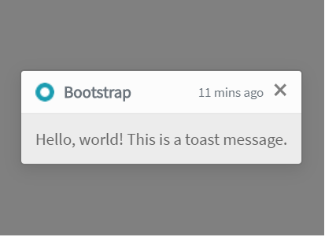

Here is an example with provided Bootstrap v4.3 code:

```java 
//@FindBy(id="translucentToast")
@UI("#translucentToast") public static Toast translucentToast; 

@Test
public void translucentToastValidationTest() {
    translucentToastButton.click();
    translucentToast.is().displayed();
    translucentToast.headerText.is().text(toastHeaderText);
    translucentToast.body.is().text(toastBodyText);
}

```
  
```html
<div aria-live="polite" aria-atomic="true"
     style="min-height: 200px;background-color: grey;">
    <div class="toast" role="alert" data-animation="false" aria-live="assertive"
         aria-atomic="true" id="translucentToast">
        <div class="toast-header">
            
            <strong class="mr-auto">Bootstrap</strong>
            <small class="text-muted">11 mins ago</small>
            <button type="button" class="ml-2 mb-1 close" data-dismiss="toast"
                    aria-label="Close">
                <span aria-hidden="true">&times;</span>
            </button>
        </div>
        <div class="toast-body">
            Hello, world! This is a toast message.
        </div>
    </div>
</div>
```

<a style="font-weight:bold" href="https://getbootstrap.com/docs/4.3/components/toasts/#stacking" target="_blank">**Stacking**</a>

When you have multiple toasts, we default to vertically stacking them in a readable manner


Here is an example with provided Bootstrap v4.3 code:
  
```java 
//@FindBy(id="firstMultipleToast")
@UI("#firstMultipleToast") public static Toast firstStackToast; 
//@FindBy(id="secondMultipleToast")
@UI("#secondMultipleToast") public static Toast secondStackToast; 

@Test
public void stackOfToastsValidationTest() {
    stackOfToastsButton.click();
    firstStackToast.is().displayed();
    secondStackToast.is().displayed();
    firstStackToast.headerText.is().text(toastHeaderText);
    firstStackToast.body.is().text(stackToastBodyText);
    secondStackToast.headerText.is().text(toastHeaderText);
    secondStackToast.body.is().text(secondStackToastBodyText);
}

```
  
```html
<div aria-live="polite" aria-atomic="true"
     style="min-height: 200px;background-color: grey;">
    <div class="toast several" role="alert" aria-live="assertive" id="firstMultipleToast"
         aria-atomic="true">
        <div class="toast-header">
            
            <strong class="mr-auto">Bootstrap</strong>
            <small class="text-muted">just now</small>
            <button type="button" class="ml-2 mb-1 close" data-dismiss="toast"
                    aria-label="Close">
                <span aria-hidden="true">&times;</span>
            </button>
        </div>
        <div class="toast-body">
            See? Just like this.
        </div>
    </div>
    <div class="toast several" role="alert" aria-live="assertive" id="secondMultipleToast"
         aria-atomic="true">
        <div class="toast-header">
            
            <strong class="mr-auto">Bootstrap</strong>
            <small class="text-muted">2 seconds ago</small>
            <button type="button" class="ml-2 mb-1 close" data-dismiss="toast"
                    aria-label="Close">
                <span aria-hidden="true">&times;</span>
            </button>
        </div>
        <div class="toast-body">
            Heads up, toasts will stack automatically
        </div>
    </div>
</div>
```


<a style="font-weight:bold" href="https://getbootstrap.com/docs/4.3/components/toasts/#stacking" target="_blank">**Placement**</a>

Place toasts with custom CSS as you need them. The top right is often used for notifications, as is the top middle.
<br /><br />
Example with top right align:


Here is an example with provided Bootstrap v4.3 code:

```java 
//@FindBy(id="toastRightTop")
@UI("#toastRightTop") public static Toast toastWithTopAlign; 

@Test
public void toastWithTopAlignValidationTest() {
    toastWithTopAlignButton.click();
    toastWithTopAlign.is().displayed();
    toastWithTopAlign.headerText.is().text(toastHeaderText);
    toastWithTopAlign.body.is().text(toastBodyText);
    toastWithTopAlign.closeButton.click();
    toastWithTopAlign.base().waitSec(1);
    toastWithTopAlign.is().hidden();
}

```
  
```html
<div aria-live="polite" aria-atomic="true"
     style="position: relative; min-height: 200px;background-color: grey;">
    <div class="toast" id="toastRightTop" style="position: absolute; top: 0; right: 0;"
         data-autohide="false">
        <div class="toast-header">
            
            <strong class="mr-auto">Bootstrap</strong>
            <small>11 mins ago</small>
            <button type="button" class="ml-2 mb-1 close" data-dismiss="toast"
                    aria-label="Close">
                <span aria-hidden="true">&times;</span>
            </button>
        </div>
        <div class="toast-body">
            Hello, world! This is a toast message.
        </div>
    </div>
</div>
```

Example with top right align stack of toasts:


Here is an example with provided Bootstrap v4.3 code:

```java  
//@FindBy(id="firstStackToast")
@UI("#firstStackToast") public static Toast firstTopAlignStackToast; 
//@FindBy(id="secondStackToast")
@UI("#secondStackToast") public static Toast secondTopAlignStackToast; 

@Test
 public void stackOfTopAlignToastsValidationTest() {
    stackOfToastsWithTopAlignButton.click();
    firstTopAlignStackToast.headerText.is().text(toastHeaderText);
    firstTopAlignStackToast.body.is().text(stackToastBodyText);
    secondTopAlignStackToast.headerText.is().text(toastHeaderText);
    secondTopAlignStackToast.body.is().text(secondStackToastBodyText);
    firstTopAlignStackToast.is().displayed();
    secondTopAlignStackToast.is().displayed();
}

``` 
  
```html
<div aria-live="polite" aria-atomic="true"
     style="position: relative; min-height: 200px; background-color: grey;">
    <!-- Position it -->
    <div style="position: absolute; top: 0; right: 0;">

        <!-- Then put toasts within -->
        <div class="toast severalWithPosition" role="alert" aria-live="assertive"
             id="firstStackToast" aria-atomic="true">
            <div class="toast-header">
                
                <strong class="mr-auto">Bootstrap</strong>
                <small class="text-muted">just now</small>
                <button type="button" class="ml-2 mb-1 close" data-dismiss="toast"
                        aria-label="Close">
                    <span aria-hidden="true">&times;</span>
                </button>
            </div>
            <div class="toast-body">
                See? Just like this.
            </div>
        </div>

        <div class="toast severalWithPosition" role="alert" aria-live="assertive"
             id="secondStackToast" aria-atomic="true">
            <div class="toast-header">
                
                <strong class="mr-auto">Bootstrap</strong>
                <small class="text-muted">2 seconds ago</small>
                <button type="button" class="ml-2 mb-1 close" data-dismiss="toast"
                        aria-label="Close">
                    <span aria-hidden="true">&times;</span>
                </button>
            </div>
            <div class="toast-body">
                Heads up, toasts will stack automatically
            </div>
        </div>
    </div>
</div>
```

Example with center align toast:


Here is an example with provided Bootstrap v4.3 code:
  
```java 
//@FindBy(id="toastCenterTop")
@UI("#toastCenterTop") public static Toast toastWithCenterAlign; 
//@FindBy(id="toastRightTop")
@UI("#toastRightTop") public static Toast toastWithTopAlign; 

@Test
public void toastWithCenterAlignValidationTest() {
    toastWithCenterAlignButton.click();
    toastWithCenterAlign.is().displayed();
    toastWithCenterAlign.headerText.is().text(toastHeaderText);
    toastWithCenterAlign.body.is().text(toastBodyText);
    toastWithCenterAlign.closeButton.click();
    toastWithCenterAlign.base().waitSec(1);
    toastWithCenterAlign.is().hidden();
}

```
  
```html
<div aria-live="polite" aria-atomic="true"
     class="d-flex justify-content-center align-items-center"
     style="min-height: 200px;background-color: grey;">

    <!-- Then put toasts within -->
    <div class="toast" role="alert" id="toastCenterTop" aria-live="assertive"
         aria-atomic="true" data-delay="3000">
        <div class="toast-header">
            
            <strong class="mr-auto">Bootstrap</strong>
            <small>11 mins ago</small>
            <button type="button" class="ml-2 mb-1 close" data-dismiss="toast"
                    aria-label="Close">
                <span aria-hidden="true">&times;</span>
            </button>
        </div>
        <div class="toast-body">
            Hello, world! This is a toast message.
        </div>
    </div>
</div>
```

Available methods in Java JDI Light:

|Method | Description | Return Type
--- | --- | ---
**assertThat()** |	Assert action |	TextAssert
**close()** |	Close toast |	void
**getText()** |	Get toast text |	String
**getTitle()** |	Get toast title |	String
**is()** |	Assert action |	TextAssert
**isDisplayed()** | Show\wait that toast element displayed on the screen | Boolean

[Toast test examples](https://github.com/jdi-testing/jdi-light/tree/bootstrap/jdi-light-bootstrap-tests/src/test/java/io/github/epam/bootstrap/tests/common/)
 
<br>

### Pagination

#### Overview

***[Pagination overview](https://getbootstrap.com/docs/4.3/components/pagination/#overview)***

Pagination is located in the following classes:
 
  - __Java__: _com.epam.jdi.light.ui.bootstrap.elements.complex.Pagination_
  


Here is an example with provided Bootstrap v4.3 code:

```java 
// @FindBy(css = "#pagination-overview") public static PaginationOverview paginationOverview;
@UI("#pagination-overview") public static PaginationOverview paginationOverview;

public class PaginationOverview extends Section {
    @UI("li") public Pagination paginationItems; // @FindBy(css = "li") public Pagination paginationItems;
}

@Test
 public void isValidationTests() {
     paginationOverview.paginationItems.is()
             .size(5);
     paginationOverview.is()
             .core()
             .hasClass("pagination");
 }

 @Test(dataProvider = "listData")
 public void linkTextTests(int index, String linkText) {
     paginationOverview.paginationItems.get(index).is()
             .displayed()
             .enabled()
             .css("font-size", is("14px"))
             .hasClass("page-item")
             .text(is(linkText));
 }

 @Test(dataProvider = "listPageTitles")
 public void linkClickableTests(int index, String pageTitle) {
     paginationOverview.paginationItems.get(index).hover();
     paginationOverview.paginationItems.get(index).highlight();
     paginationOverview.paginationItems.get(index).click();
     newWindowTitleCheck(pageTitle);
     paginationOverview.paginationItems.get(index).unhighlight();
 }
```

```html
<nav aria-label="Page navigation example">
    <ul class="pagination" id="pagination-overview">
        <li class="page-item"><a class="page-link" href="https://github.com/jdi-docs"
                                 target="_blank">Previous</a></li>
        <li class="page-item"><a class="page-link" href="https://github.com/jdi-testing"
                                 target="_blank">1</a></li>
        <li class="page-item"><a class="page-link"
                                 href="https://jdi-testing.github.io/jdi-light/index.html"
                                 target="_blank">2</a></li>
        <li class="page-item"><a class="page-link" href="https://getbootstrap.com"
                                 target="_blank">3</a></li>
        <li class="page-item"><a class="page-link"
                                 href="https://jdi-docs.github.io/jdi-light/"
                                 target="_blank">Next</a></li>
    </ul>
</nav>
```


|Method | Description | Return Type
--- | --- | ---
**assertThat()** | Assert action | TextAssert
**click()** | Click the element | void
**get()** | Select button by index | UIElement
**getText()** | Get button text | String
**highlight()** | Highlight element | void
**hover()** | Hover on the element | void
**is()** | Assert action | TextAssert 
**unhighlight()** | Unhighlight element | void

<br>

[Java test examples](https://github.com/jdi-testing/jdi-light/blob/bootstrap/jdi-light-bootstrap-tests/src/test/java/io/github/epam/bootstrap/tests/composite/section/pagination/OverviewTests.java)
<br>

Button group is represented by Section class in Java:
 
  [Section](https://jdi-docs.github.io/jdi-light/#section)  

<br>

#### Working with icons

***[Pagination working with icons](https://getbootstrap.com/docs/4.3/components/pagination/#working-with-icons)***

Pagination is located in the following classes:
 
  - __Java__: _com.epam.jdi.light.ui.bootstrap.elements.complex.Pagination_
  


Here is an example with provided Bootstrap v4.3 code:

```java 
// @FindBy(css = "#pagination-icons") public static PaginationIcons paginationIcons;
@UI("#pagination-icons") public static PaginationIcons paginationIcons;

public class PaginationIcons extends Section {
    @UI("li") public Pagination paginationItems; // @FindBy(css = "li") public Pagination paginationItems;
}

@Test
public void isValidationTests() {
    paginationIcons.paginationItems.is()
            .size(5);
    paginationIcons.is()
            .core()
            .hasClass("pagination");
}

@Test(dataProvider = "listPageTitles")
public void linkClickableTests(int index, String pageTitle) {
    paginationIcons.paginationItems.get(index).hover();
    paginationIcons.paginationItems.get(index).highlight();
    paginationIcons.paginationItems.get(index).click();
    newWindowTitleCheck(pageTitle);
    paginationIcons.paginationItems.get(index).unhighlight();
}
```

```html
<nav aria-label="Page navigation example">
    <ul class="pagination" id="pagination-icons">
        <li class="page-item">
            <a class="page-link" href="https://github.com/jdi-docs" target="_blank"
               aria-label="Previous">
                <span aria-hidden="true">&laquo;</span>
            </a>
        </li>
        <li class="page-item"><a class="page-link" href="https://github.com/jdi-testing"
                                 target="_blank">1</a></li>
        <li class="page-item"><a class="page-link"
                                 href="https://jdi-testing.github.io/jdi-light/index.html"
                                 target="_blank">2</a></li>
        <li class="page-item"><a class="page-link" href="https://getbootstrap.com"
                                 target="_blank">3</a></li>
        <li class="page-item">
            <a class="page-link" href="https://jdi-docs.github.io/jdi-light/"
               target="_blank" aria-label="Next">
                <span aria-hidden="true">&raquo;</span>
            </a>
        </li>
    </ul>
</nav>
```


|Method | Description | Return Type
--- | --- | ---
**assertThat()** | Assert action | TextAssert
**click()** | Click the element | void
**get()** | Select button by index | UIElement
**getText()** | Get button text | String
**highlight()** | Highlight element | void
**hover()** | Hover on the element | void
**is()** | Assert action | TextAssert 
**unhighlight()** | Unhighlight element | void

<br>

[Java test examples](https://github.com/jdi-testing/jdi-light/blob/bootstrap/jdi-light-bootstrap-tests/src/test/java/io/github/epam/bootstrap/tests/composite/section/pagination/IconsTests.java)
<br>

Button group is represented by Section class in Java:
 
  [Section](https://jdi-docs.github.io/jdi-light/#section)  

<br>

#### Disabled and active states

***[Pagination disabled and active states](https://getbootstrap.com/docs/4.3/components/pagination/#disabled-and-active-states)***

Pagination is located in the following classes:
 
  - __Java__: _com.epam.jdi.light.ui.bootstrap.elements.complex.Pagination_
  


Here is an example with provided Bootstrap v4.3 code:

```java 
// @FindBy(css = "#pagination-states") public static PaginationStates paginationStates;
@UI("#pagination-states") public static PaginationStates paginationStates;

public class PaginationStates extends Section {
    @UI("li") public Pagination paginationItems; // @FindBy(css = "li") public Pagination paginationItems;
}

@Test
public void isValidationTests() {
    paginationStates.paginationItems.is()
            .size(5);
    paginationStates.is()
            .core()
            .hasClass("pagination");
    paginationStates.paginationItems.get(1).is()
            .core()
            .hasClass("disabled");
    paginationStates.paginationItems.get(3).is()
            .core()
            .hasClass("active");
}

@Test(dataProvider = "listPageTitles")
public void linkClickableTests(int index, String pageTitle) {
    paginationStates.paginationItems.get(index).hover();
    paginationStates.paginationItems.get(index).highlight();
    paginationStates.paginationItems.get(index).click();
    newWindowTitleCheck(pageTitle);
    paginationStates.paginationItems.get(index).unhighlight();
}
```

```html
<nav aria-label="disabled-and-active-states">
    <ul class="pagination" id="pagination-states">
        <li class="page-item disabled">
            <a class="page-link" href="https://github.com/jdi-docs" target="_blank"
               tabindex="-1" aria-disabled="true">Previous</a>
        </li>
        <li class="page-item"><a class="page-link" href="https://github.com/jdi-testing"
                                 target="_blank">1</a></li>
        <li class="page-item active" aria-current="page">
            <a class="page-link" href="https://jdi-testing.github.io/jdi-light/index.html"
               target="_blank">2 <span class="sr-only">(current)</span></a>
        </li>
        <li class="page-item"><a class="page-link" href="https://getbootstrap.com"
                                 target="_blank">3</a></li>
        <li class="page-item">
            <a class="page-link" href="https://jdi-docs.github.io/jdi-light/"
               target="_blank">Next</a>
        </li>
    </ul>
</nav>
```


|Method | Description | Return Type
--- | --- | ---
**assertThat()** | Assert action | TextAssert
**click()** | Click the element | void
**get()** | Select button by index | UIElement
**getText()** | Get button text | String
**highlight()** | Highlight element | void
**hover()** | Hover on the element | void
**is()** | Assert action | TextAssert 
**unhighlight()** | Unhighlight element | void

<br>

[Java test examples](https://github.com/jdi-testing/jdi-light/blob/bootstrap/jdi-light-bootstrap-tests/src/test/java/io/github/epam/bootstrap/tests/composite/section/pagination/StatesTests.java)
<br>

Button group is represented by Section class in Java:
 
  [Section](https://jdi-docs.github.io/jdi-light/#section)  

<br>

#### Sizing

***[Pagination sizing](https://getbootstrap.com/docs/4.3/components/pagination/#sizing)***

Pagination is located in the following classes:
 
  - __Java__: _com.epam.jdi.light.ui.bootstrap.elements.complex.Pagination_
  


Here is an example with provided Bootstrap v4.3 code:

```java 
// @FindBy(css = "#pagination-big") public static PaginationSizeBig paginationSizeBig;
// @FindBy(css = "#pagination-small") public static PaginationSizeSmall paginationSizeSmall;
@UI("#pagination-big") public static PaginationSizeBig paginationSizeBig;
@UI("#pagination-small") public static PaginationSizeSmall paginationSizeSmall;

public class PaginationSizeBig extends Section {
    @UI("li") public Pagination paginationItems; // @FindBy(css = "li") public Pagination paginationItems;
    @UI(".page-link") public Pagination paginationItemsText; // @FindBy(css = ".page-link") public Pagination paginationItemsText;
}

public class PaginationSizeSmall extends Section {
    @UI("li") public Pagination paginationItems; // @FindBy(css = "li") public Pagination paginationItems;
    @UI(".page-link") public Pagination paginationItemsText; // @FindBy(css = ".page-link") public Pagination paginationItemsText;
}

@Test
public void isValidationTests() {
    paginationSizeBig.paginationItems.is()
            .size(3);
    paginationSizeBig.is()
            .core()
            .hasClass("pagination pagination-lg");
    paginationSizeSmall.paginationItems.is()
            .size(3);
    paginationSizeSmall.is()
            .core()
            .hasClass("pagination pagination-sm");
}

@Test(dataProvider = "listData")
public void linkTextTests(int index, String linkText) {
    paginationSizeBig.paginationItemsText.get(index).is()
            .core()
            .css("font-size", is("20px"));
    paginationSizeSmall.paginationItemsText.get(index).is()
            .core()
            .css("font-size", is("14px"));
}
```

```html
<nav aria-label="sizing-big">
    <ul class="pagination pagination-lg" id="pagination-big">
        <li class="page-item active" aria-current="page">
            <span class="page-link">1<span class="sr-only">(current)</span></span>
        </li>
        <li class="page-item"><a class="page-link"
                                 href="https://jdi-testing.github.io/jdi-light/index.html"
                                 target="_blank">2</a></li>
        <li class="page-item"><a class="page-link" href="https://getbootstrap.com"
                                 target="_blank">3</a></li>
    </ul>
</nav>

<nav aria-label="sizing-small">
    <ul class="pagination pagination-sm" id="pagination-small">
        <li class="page-item active" aria-current="page">
            <span class="page-link">1<span class="sr-only">(current)</span></span>
        </li>
        <li class="page-item"><a class="page-link"
                                 href="https://jdi-testing.github.io/jdi-light/index.html"
                                 target="_blank">2</a></li>
        <li class="page-item"><a class="page-link" href="https://getbootstrap.com"
                                 target="_blank">3</a></li>
    </ul>
</nav>
```


|Method | Description | Return Type
--- | --- | ---
**assertThat()** | Assert action | TextAssert
**click()** | Click the element | void
**get()** | Select button by index | UIElement
**getText()** | Get button text | String
**highlight()** | Highlight element | void
**hover()** | Hover on the element | void
**is()** | Assert action | TextAssert 
**unhighlight()** | Unhighlight element | void

<br>

[Java test examples](https://github.com/jdi-testing/jdi-light/blob/bootstrap/jdi-light-bootstrap-tests/src/test/java/io/github/epam/bootstrap/tests/composite/section/pagination/SizingTests.java)
<br>

Button group is represented by Section class in Java:
 
  [Section](https://jdi-docs.github.io/jdi-light/#section)  

<br>

#### Alignment

***[Pagination alignment](https://getbootstrap.com/docs/4.3/components/pagination/#alignment)***

Pagination is located in the following classes:
 
  - __Java__: _com.epam.jdi.light.ui.bootstrap.elements.complex.Pagination_
  


Here is an example with provided Bootstrap v4.3 code:

```java 
// @FindBy(css = "#pagination-center") public static PaginationAlignCenter paginationAlignCenter;
// @FindBy(css = "#pagination-end") public static PaginationAlignEnd paginationAlignEnd; 
@UI("#pagination-center") public static PaginationAlignCenter paginationAlignCenter;
@UI("#pagination-end") public static PaginationAlignEnd paginationAlignEnd;

public class PaginationAlignCenter extends Section {
    @UI("li") public Pagination paginationItems; // @FindBy(css = "li") public Pagination paginationItems;
}

public class PaginationAlignEnd extends Section {
    @UI("li") public Pagination paginationItems; // @FindBy(css = "li") public Pagination paginationItems;
}

@Test
public void isValidationTests() {
    paginationAlignCenter.paginationItems.is()
            .size(5);
    paginationAlignCenter.is()
            .core()
            .hasClass("pagination justify-content-center");
    paginationAlignCenter.paginationItems.get(1).is()
            .core()
            .hasClass("disabled");
    paginationAlignEnd.paginationItems.is()
            .size(5);
    paginationAlignEnd.is()
            .core()
            .hasClass("pagination justify-content-end");
    paginationAlignEnd.paginationItems.get(1).is()
            .core()
            .hasClass("disabled");
}

@Test(dataProvider = "listPageTitles")
public void linkClickableCenterTests(int index, String pageTitle) {
    paginationAlignCenter.paginationItems.get(index).hover();
    paginationAlignCenter.paginationItems.get(index).highlight();
    paginationAlignCenter.paginationItems.get(index).click();
    newWindowTitleCheck(pageTitle);
    paginationAlignCenter.paginationItems.get(index).unhighlight();
}
```

```html
<nav aria-label="Page navigation example">
    <ul class="pagination justify-content-center" id="pagination-center">
        <li class="page-item disabled">
            <a class="page-link" href="https://github.com/jdi-docs" target="_blank"
               tabindex="-1" aria-disabled="true">Previous</a>
        </li>
        <li class="page-item"><a class="page-link" href="https://github.com/jdi-testing"
                                 target="_blank">1</a></li>
        <li class="page-item"><a class="page-link"
                                 href="https://jdi-testing.github.io/jdi-light/index.html"
                                 target="_blank">2</a></li>
        <li class="page-item"><a class="page-link" href="https://getbootstrap.com"
                                 target="_blank">3</a></li>
        <li class="page-item">
            <a class="page-link" href="https://jdi-docs.github.io/jdi-light/"
               target="_blank">Next</a>
        </li>
    </ul>
</nav>
<nav aria-label="Page navigation example">
    <ul class="pagination justify-content-end" id="pagination-end">
        <li class="page-item disabled">
            <a class="page-link" href="https://github.com/jdi-docs" target="_blank"
               tabindex="-1" aria-disabled="true">Previous</a>
        </li>
        <li class="page-item"><a class="page-link" href="https://github.com/jdi-testing"
                                 target="_blank">1</a></li>
        <li class="page-item"><a class="page-link"
                                 href="https://jdi-testing.github.io/jdi-light/index.html"
                                 target="_blank">2</a></li>
        <li class="page-item"><a class="page-link" href="https://getbootstrap.com"
                                 target="_blank">3</a></li>
        <li class="page-item">
            <a class="page-link" href="https://jdi-docs.github.io/jdi-light/"
               target="_blank">Next</a>
        </li>
    </ul>
</nav>
```


|Method | Description | Return Type
--- | --- | ---
**assertThat()** | Assert action | TextAssert
**click()** | Click the element | void
**get()** | Select button by index | UIElement
**getText()** | Get button text | String
**highlight()** | Highlight element | void
**hover()** | Hover on the element | void
**is()** | Assert action | TextAssert 
**unhighlight()** | Unhighlight element | void

<br>

[Java test examples](https://github.com/jdi-testing/jdi-light/blob/bootstrap/jdi-light-bootstrap-tests/src/test/java/io/github/epam/bootstrap/tests/composite/section/pagination/AlignTests.java)
<br>

Button group is represented by Section class in Java:
 
  [Section](https://jdi-docs.github.io/jdi-light/#section)  

<br>


### Input group
#### Basic Example
**<a style="font-weight:bold" href="https://getbootstrap.com/docs/4.3/components/input-group/#basic-example" target="_blank">Input group</a>** – Place one add-on or button on either side of an input. You may also place one on both sides of an input.
<br />

```java 

    //@FindBy(css = "#input-group-basic-example1")
   @UI("#input-group-basic-example1") public static InputGroupInputWithText inputGroupBasicExample1;

   public class InputGroupInputWithText extends Section{
       @UI(".input-group-text") public Text text;
       @UI(".form-control") public TextField input;
   }

   @Test(priority = 1)
   public void setTextTestExample1() {
        inputGroupBasicExample1.input.setText(textExample1);
        inputGroupBasicExample1.input.is().text(is(textExample1));
   }

```
**1.Input group example - Input + left span**


Here is an example with provided Bootstrap v4.3 code:


```html
<div class="input-group mb-3" id="input-group-basic-example1">
    <div class="input-group-prepend">
        <span class="input-group-text" id="basic-addon">@</span>
    </div>
    <input type="text" class="form-control" placeholder="Username" aria-label="Username"
           aria-describedby="basic-addon1">
</div>
```

```java 

    //@FindBy(css = "#input-group-basic-example2")
   @UI("#input-group-basic-example2") public static InputGroupInputWithText inputGroupBasicExample2;

   public class InputGroupInputWithText extends Section{
       @UI(".input-group-text") public Text text;
       @UI(".form-control") public TextField input;
   }

    @Test(priority = 4)
    public void checkAddonConsistTextTestExample2() {
       inputGroupBasicExample2.text.is().text(containsString(partOfAddonExample2));
    }

```
<br /><br /><br /><br /><br /><br />
**2.Input group example - Input + right span** 


Here is an example with provided Bootstrap v4.3 code:


```html
<div class="input-group mb-3" id="input-group-basic-example2">
    <input type="text" class="form-control" placeholder="Recipient's username"
           aria-label="Recipient's username" aria-describedby="basic-addon2">
    <div class="input-group-append">
        <span class="input-group-text" id="basic-addon2">@example.com</span>
    </div>
</div>
``` 

```java 

    //@FindBy(css = "#input-group-basic-example3")
   @UI("#input-group-basic-example3") public static InputGroupInputWithLabelAndText inputGroupBasicExample3;

   public class InputGroupInputWithLabelAndText extends Section{
       @UI(".input-group-text") public Text text;
       @UI("#basic-url") public TextField input;
   }

   @Test(priority = 6)
   public void checkLabelExample3() {
       assertEquals(inputGroupBasicExample3.input.core().label().getText(), labelExample3);
   }

```
<br /><br /><br /><br />
**3.Input group example - Input + label + left span**


Here is an example with provided Bootstrap v4.3 code:

```html
<div class="input-group mb-3" id="input-group-basic-example3">
    <div class="input-group-prepend">
        <span class="input-group-text" id="basic-addon3">https://example.com/users/</span>
    </div>
    <input type="text" class="form-control" id="basic-url" aria-describedby="basic-addon3">
</div>
```


```java 

   //@FindBy(css = "#input-group-basic-example4")
  @UI("#input-group-basic-example4") public static InputGroupInputWithTwoText inputGroupBasicExample4;

  public class InputGroupInputWithTwoText extends Section{
      @UI(".input-group-prepend .input-group-text") public Text text_pretend;
      @UI(".input-group-append .input-group-text") public Text text_append;
      @UI(".form-control") public TextField input;
  }

  @Test(priority = 7)
  public void checkAddonsExample4() {
      inputGroupBasicExample4.text_append.is().enabled();
      inputGroupBasicExample4.text_append.is().text(is(addonAppendExample4));
      inputGroupBasicExample4.text_pretend.is().enabled();
      inputGroupBasicExample4.text_pretend.is().text(is(addonPretendExample4));
  }

``` 
<br /><br />
**4.Input group example - Input + left and right span**


Here is an example with provided Bootstrap v4.3 code:

```html
<div class="input-group mb-3" id="input-group-basic-example4">
    <div class="input-group-prepend">
        <span class="input-group-text">$</span>
    </div>
    <input type="text" class="form-control" aria-label="Amount (to the nearest dollar)">
    <div class="input-group-append">
        <span class="input-group-text">.00</span>
    </div>
</div>
```

```java 

   //@FindBy(css = "#input-group-basic-example5")
  @UI("#input-group-basic-example5") public static InputGroupTextareaWithText inputGroupBasicExample5;

  public class InputGroupTextareaWithText extends Section{
      @UI(".input-group-text") public Text text;
      @UI(".form-control") public TextArea area;
  }

  @Test(priority = 9)
  public void getLinesTestExample5() {
      inputGroupBasicExample5.area.setLines(linesTextArea);
      assertEquals(inputGroupBasicExample5.area.getLines(), asList(linesTextArea));
  }

```

<br /><br /><br /><br/><br />
**5.Input group example - Input + textarea**


Here is an example with provided Bootstrap v4.3 code:

```html
<div class="input-group" id="input-group-basic-example5">
    <div class="input-group-prepend">
        <span class="input-group-text">With textarea</span>
    </div>
    <textarea class="form-control" aria-label="With textarea"></textarea>
</div>
```

Input group are represented by Section class in Java:
 
  [Section](https://jdi-docs.github.io/jdi-light/#section)  
  
Inner elements of input group can be represented by following classes:
 <ul>
  <li> [Text](https://jdi-docs.github.io/jdi-light/#text) </li>
  
  <li> [TextField](https://jdi-docs.github.io/jdi-light/#textfield) </li> 
  
  <li> [TextArea](https://jdi-docs.github.io/jdi-light/#textarea) </li>
 
  
 <li>  [See more elements](https://jdi-docs.github.io/jdi-light/#html5-common-elements) </li> 
 </ul>

[Bootstrap test example ](https://github.com/jdi-testing/jdi-light/tree/bootstrap/jdi-light-bootstrap-tests/src/test/java/io/github/epam/bootstrap/tests/composite/section/inputGroup)

#### Sizing
<a style="font-weight:bold" href="https://getbootstrap.com/docs/4.3/components/input-group/#sizing" target="_blank">Sizing</a> – Add the relative form sizing classes to the .input-group itself and contents within will automatically resize—no need for repeating the form control size classes on each element.
<br>
<br>
<br>
<br>
<br>
<br>
<br>
<br>
<br>
<br>

```java 
    @UI("#input-group-default") public static InputGroupSizing inputGroupDefaultSizing;
    @UI("#input-group-small") public static InputGroupSizing inputGroupSmallSizing;
    @UI("#input-group-large") public static InputGroupSizing inputGroupLargeSizing;
    //@FindBy(css = "#input-group-default")
    //@FindBy(css = "#input-group-small")
    //@FindBy(css = "#input-group-large")

    @Test
    public void getTextFromSizingTest() {
        assertEquals(inputGroupDefaultSizing.input.getText(), text);
        assertEquals(inputGroupSmallSizing.input.getText(), text);
        assertEquals(inputGroupLargeSizing.input.getText(), text);
    }

    @Test
    public void clearSizingTest() {
        inputGroupDefaultSizing.input.clear();
        assertEquals(inputGroupDefaultSizing.input.getText(), "");
        inputGroupSmallSizing.input.clear();
        assertEquals(inputGroupDefaultSizing.input.getText(), "");
        inputGroupLargeSizing.input.clear();
        assertEquals(inputGroupDefaultSizing.input.getText(), "");
    }
```


**Sizing on the individual input group elements isn’t supported.**


Here is an example with provided Bootstrap v4.3 code:
  
```html
<div class="input-group input-group-sm mb-3" id="input-group-small">
    <div class="input-group-prepend">
        <span class="input-group-text" id="inputGroup-sizing-sm">Small</span>
    </div>
    <input type="text" class="form-control" aria-label="Sizing example input"
           aria-describedby="inputGroup-sizing-sm">
</div>

<div class="input-group mb-3" id="input-group-default">
    <div class="input-group-prepend">
        <span class="input-group-text" id="inputGroup-sizing-default">Default</span>
    </div>
    <input type="text" class="form-control" aria-label="Sizing example input"
           aria-describedby="inputGroup-sizing-default">
</div>

<div class="input-group input-group-lg" id="input-group-large">
    <div class="input-group-prepend">
        <span class="input-group-text" id="inputGroup-sizing-lg">Large</span>
    </div>
    <input type="text" class="form-control" aria-label="Sizing example input"
           aria-describedby="inputGroup-sizing-lg">
</div>
```

And here are methods available in Java:
    
|Method / Property | Description | Return Type
--- | --- | ---
**assertThat()** | property that returns object for work with assertions| TextAssert
**clear()** | clears the text field | void
**focus()** | places cursor within the text field | void
**getText()** | returns text from the text field  | String
**getValue()** | returns text from the text field| String
**is()** | property that returns object for work with assertions| TextAssert
**setText(String value)** | adds text to the field | void


#### Wrapping
```java 
   public static UIElement inputGroupWrap,inputGroupNowrap;//@FindBy(css = "#input-group-wrap")

   @Test
   public void checkWrapping() {
       assertFalse(inputGroupWrap.hasClass("flex-nowrap"));
       inputGroupWrap.assertThat().core().css("flex-wrap", "wrap");
   }
 
   @Test
   public void checkNoWrapping() {
       assertTrue(inputGroupNowrap.hasClass("flex-nowrap"));
       inputGroupNowrap.assertThat().core().css("flex-wrap", "nowrap");
   } 
```

 
**<a style="font-weight:bold" href="https://getbootstrap.com/docs/4.3/components/input-group/#wrapping" target="_blank">Wrapping</a>** – Input groups wrap by default via flex-wrap: wrap in order to accommodate custom form field validation within an input group. You may disable this with .flex-nowrap.


Here is an example with provided Bootstrap v4.3 code:
  
```html
<div class="input-group flex-nowrap" id="input-group-nowrap">
    <div class="input-group-prepend">
        <span class="input-group-text" id="addon-wrapping1">@</span>
    </div>
    <input type="text" class="form-control" placeholder="Input group with nowrap"
           aria-label="Username" aria-describedby="addon-wrapping">
</div>
```

Wrapping property can be checked by using following class:
 
  - _com.epam.jdi.light.elements.common.UIElement_
  
<a  href="https://github.com/jdi-testing/jdi-light/blob/bootstrap/jdi-light-bootstrap-tests/src/test/java/io/github/epam/bootstrap/tests/composite/section/inputGroup/InputGroupWrapping.java" target="_blank">Bootstrap test example wrapping</a>


#### Checkboxes and radios

<a style="font-weight:bold" href="https://getbootstrap.com/docs/4.3/components/input-group/#checkboxes-and-radios" target="_blank">Checkboxes and radios</a> – Place any checkbox or radio option within an input group’s addon instead of text.

__Example with radio__

```java 
  @UI("#input-group-radio") public static InputGroupInputWithRadio inputGroupRadio;// @FindBy(css = "#input-group-radio")

  public class InputGroupInputWithRadio extends Section{
      @Css("[type=\"radio\"]") public RadioButtons radio;
      @Css(".form-control") public TextField input;
  }
  
  @Test
  public void getSizeRadioButtons() {
      inputGroupRadio.radio.is().size(1);
  }

   @Test
   public void inputTest() {
       inputGroupRadio.input.input(new_text);
       inputGroupRadio.input.assertThat().text(is(new_text));
   }

 
```


Here is an example with provided Bootstrap v4.3 code:
  
```html
<div class="input-group" id="input-group-radio">
    <div class="input-group-prepend">
        <div class="input-group-text">
            <input type="radio" name="radio-button" id="radio-button"
                   aria-label="Radio button for following text input">
        </div>
    </div>
    <input type="text" class="form-control" aria-label="Text input with radio button">
</div>
```

This input group example is represented by the following classes in Java:
 
+ [Section](https://jdi-docs.github.io/jdi-light/#section)    
+ [RadioButtons](https://jdi-docs.github.io/jdi-light/#radiobuttons)   
   
  <a  href="https://github.com/jdi-testing/jdi-light/blob/bootstrap/jdi-light-bootstrap-tests/src/test/java/io/github/epam/bootstrap/tests/composite/section/inputGroup/InputGroupRadioTests.java" target="_blank">Bootstrap test example with radio</a>

<br />

```java 
 @UI("#input-group-checkbox") public static InputGroupInputWithCheckBox inputGroupCheckBox;// @FindBy(css = "#input-group-checkbox")

 public class InputGroupInputWithCheckBox extends Section{
     @Css("[type=\"checkbox\"]") public Checkbox checkbox;
     @Css(".form-control") public TextField input;
 }
  
 @Test
 public void checkCheckboxTest() {
     inputGroupCheckBox.checkbox.check();
     inputGroupCheckBox.checkbox.isSelected();
 }

   @Test
   public void inputTest() {
       inputGroupRadio.input.input(new_text);
       inputGroupRadio.input.assertThat().text(is(new_text));
   }

 
```
__Example with checkbox__


Here is an example with provided Bootstrap v4.3 code:
  
```html
<div class="input-group mb-3" id="input-group-checkbox">
    <div class="input-group-prepend">
        <div class="input-group-text">
            <input type="checkbox" aria-label="Checkbox for following text input">
        </div>
    </div>
    <input type="text" class="form-control" aria-label="Text input with checkbox">
</div>
```

This input group example is represented by the following classes in Java:
 
+ [Section](https://jdi-docs.github.io/jdi-light/#section)   
+ [CheckBox](https://jdi-docs.github.io/jdi-light/#checkbox)

  <a href="https://github.com/jdi-testing/jdi-light/blob/bootstrap/jdi-light-bootstrap-tests/src/test/java/io/github/epam/bootstrap/tests/composite/section/inputGroup/InputGroupCheckboxesTests.java" target="_blank">Bootstrap test example with checkbox</a>

<br /><br /><br /><br /><br />
 
#### Multiple inputs 
<a style="font-weight:bold" href="https://getbootstrap.com/docs/4.3/components/input-group/" target="_blank">Multiple inputs</a> – While multiple inputs are supported visually, validation styles are only available for input groups with a single input.


```java 
//FindBy(css = "#multiple-inputs"")
@UI("#multiple-inputs") public static MultipleInputs multipleInputs;

@Test
public void getTextTest() {
     int index = 1;

     String name = multipleInputs.getText(index);
     assertEquals(name, inputData.get(index));

     String surname = multipleInputs.getText("#mi-i-2");
     assertEquals(surname, inputData.get(2));

     String text = multipleInputs.getText();
     assertEquals(text, inputData.get(1));
}

@Test
public void getTextAllTest() {
    assertEquals(multipleInputs.getAllTexts(), inputDataList);
}

@Test
public void setValueTest() {
    multipleInputs.clearAll();

    String value = inputData.get(1);
    multipleInputs.setValue(value);
    multipleInputs.is().text(value, 1);

    int index = 2;
    String name = inputData.get(index);
    multipleInputs.setValue(name, index);
    multipleInputs.is().text(name, index);

    String locator = "#mi-i-2";
    String surname = inputData.get(2);
    multipleInputs.clear(locator);
    multipleInputs.setValue(surname, locator);
    multipleInputs.is().text(surname, locator);
}

@Test
public void setAllValuesTest() {
    multipleInputs.clearAll();
    multipleInputs.setAllValues(inputDataList);
    multipleInputs.is().texts(inputDataList);
}
```

Here is an example with provided Bootstrap v4.3 code:
  
```html
<div class="input-group" id="multiple-inputs">
    <div class="input-group-prepend">
        <span class="input-group-text">First and last name</span>
    </div>
    <input type="text" aria-label="First name" class="form-control" id="mi-i-1">
    <input type="text" aria-label="Last name" class="form-control" id="mi-i-2">
</div>
```

And here are methods available in Java:
    
|Method | Description | Return Type
--- | --- | ---
 **assertThat()**| Property that returns object for work with assertions | MultipleInputsAssert
 **clear()**| Clear first input within element | void
 **clear(String locator)**| Clear input within element with *locator* | void
 **clear(int index)**| Clear input within element with *index* | void
 **clearAll()**| Clear all inputs within element | void
 **focus()**| Focus on first input within element | void
 **focus(String locator)**| Focus on input within element with *locator* | void
 **focus(int index)**| Focus on input within element with *index* | void
 **getAllText()**| Return texts for all inputs within element | List\<String>
 **getAllValue()**| Return values for all inputs within element | List\<String>
 **getText()**| Return text for first input within element | String
 **getText(String locator)**| Return text for input within element with *locator* | String
 **getText(int index)**| Return text for input within element with *index* | String
 **getValue()**| Return value for first input within element | String
 **getValue(String locator)**| Return value for input within element with *locator* | String
 **getValue(int index)**| Return value for input within element with *index* | String
 **input(String value)**| Set text for first input within element | void
 **input(String value, String locator)**| Set text for input within element with *locator* | void
 **input(String value, int index)**| Set text for input within element with *index* | void
 **inputAll()**| Set texts for all inputs within element | void
 **is()**| Property that returns object for work with assertions | MultipleInputsAssert
 **placeholder()**| Return placeholder from first input within element | String
 **placeholder(String locator)**| Return placeholder from input within element with *locator* | String
 **placeholder(int index)**| Return placeholder from input within element with *index* | String
 **placeholderAll()**| Return placeholders for all inputs within element | List\<String>
 **sendKeys(String value)**| Send text to first input within element | void
 **sendKeys(String value, String locator)**| Send text to input within element with *locator* | void
 **sendKeys(String value, int index)**| Send text to input within element with *index* | void
 **sendKeysAll(List\<String> values)**| Send texts to all inputs within element | void
 **setAllValue(List\<String> values)**| Set values for all inputs within element | void 
 **setValue(String value)**| Set value for first input within element | void
 **setValue(String value, String locator)**| Set value for input within element with *locator* | void
 **setValue(String value, int index)**| Set value for input within element with *index* | void
 
 <a href="https://github.com/jdi-testing/jdi-light/blob/bootstrap/jdi-light-bootstrap-tests/src/test/java/io/github/epam/bootstrap/tests/complex/MultipleInputsTests.java" target="_blank">Bootstrap test example with multiple inputs</a>
 
 
#### Multiple addons 
<a style="font-weight:bold" href="https://getbootstrap.com/docs/4.3/components/input-group/#multiple-addons" target="_blank">Multiple addons</a> are supported and can be mixed with checkbox and radio input versions.


```java 
 @UI("#multiple-addons-1")  public static InputGroupMultipleAddonsUpper multipleAddonUpper; //@FindBy(css = "#multiple-addons-1")
 @UI("#multiple-addons-2")  public static InputGroupMultipleAddonsLower multipleAddonLower; //@FindBy(css = "#multiple-addons-2")
 
 public class InputGroupMultipleAddonsUpper extends Section {
     @UI("#left-sign") public Label firstLabel; //@FindBy(css = "#left-sign")
     @UI("#left-nil") public Label secondLabel; //@FindBy(css = "#left-nil")
     @UI(".form-control") public TextField textField; //@FindBy(css = ".form-control")
 }

 @Test(dataProvider = "InputGroupMultipleAddonsLabels")
 public void assertTextFromValueTest(Label multipleAddonsLabel, String labelValue) {
    multipleAddonsLabel.is().text(labelValue);
 }
 
 @Test(dataProvider = "InputGroupMultipleAddonsLabels")
 public void isValidationTest(Label multipleAddonsLabel, String labelValue) {
     multipleAddonsLabel.is()
        .displayed()
        .core()
        .hasClass("input-group-text")
        .text(labelValue);
 }
 
 @Test(dataProvider = "InputGroupMultipleAddonsTextFields")
 public void inputTest(TextField textField) {
     textField.input(text);
     textField.assertThat().text(is(text));
 }
 
 @Test(dataProvider = "InputGroupMultipleAddonsTextFields")
 public void textFieldTests(TextField textField) {
     textField.setText(text);
     textField.is().text(text);
     textField.is().text(containsString(partOfText));
     textField.clear();
     textField.is().text(emptyText);
 }
```
Here is an example with provided Bootstrap v4.3 code:
  
```html
<div class="input-group mb-3" id="multiple-addons-1">
    <div class="input-group-prepend">
        <span class="input-group-text" id="left-sign">$</span>
        <span class="input-group-text" id="left-nil">0.00</span>
    </div>
    <input type="text" class="form-control"
           aria-label="Dollar amount (with dot and two decimal places)">
</div>

<div class="input-group mb-3" id="multiple-addons-2">
    <input type="text" class="form-control"
           aria-label="Dollar amount (with dot and two decimal places)">
    <div class="input-group-append">
        <span class="input-group-text" id="right-sign">$</span>
        <span class="input-group-text" id="right-nil">0.00</span>
    </div>
</div>
```


Multiple input is represented by Section class in Java:
 
  [Section](https://jdi-docs.github.io/jdi-light/#section)
  
Inner elements of multiple input can be represented by the following classes:

 + [TextField](https://jdi-docs.github.io/jdi-light/#textfield)
 + [Label](https://jdi-docs.github.io/jdi-light/#label)

<a href="https://github.com/jdi-testing/jdi-light/blob/bootstrap/jdi-light-bootstrap-tests/src/test/java/io/github/epam/bootstrap/tests/composite/section/inputGroup/InputGroupMultipleAddonsTests.java" target="_blank">Bootstrap test example with multiple addons</a>
 
 
 
 
 
 
 
 
 
 
 
 
 <br /><br /><br /><br /><br /><br /><br /><br /><br /><br /><br /> <br /> 
#### Button addons 

**[Button addons](https://getbootstrap.com/docs/4.3/components/input-group/#button-addons)** – Multiple buttons have no detailed information on Bootstrap website


Here is an example with provided Bootstrap v4.3 code:


```java 
//@FindBy(css = "#input-group-button-addon4") public static ButtonAddons inputGroupButtonAddons4;
@UI("#input-group-button-addon1") public static ButtonAddons inputGroupButtonAddons1;
@UI("#input-group-button-addon2") public static ButtonAddons inputGroupButtonAddons2;
@UI("#input-group-button-addon3") public static ButtonAddons inputGroupButtonAddons3;
@UI("#input-group-button-addon4") public static ButtonAddons inputGroupButtonAddons4;

public class ButtonAddons extends Section {
    @UI("button") public Button button;
    @UI("input") public TextField input;
    @UI("button") public ListGroup listButtons;
    @UI("input") public TextField inputField;
}

@Test
public void checkButtonAddon2Test() {
    inputGroupButtonAddons2.input.input(text);
    inputGroupButtonAddons2.button.click();
    inputGroupButtonAddons2.input.input(placeholder_text);
    inputGroupButtonAddons2.input.assertThat().text(placeholder_text);
}

@Test
public void checkButtonAddon4Test() {
    inputGroupButtonAddons4.inputField.input(text);
    inputGroupButtonAddons4.listButtons.get(1).click();
    inputGroupButtonAddons4.inputField.input(placeholder_text);
    inputGroupButtonAddons4.listButtons.get(2).click();
    inputGroupButtonAddons4.inputField.assertThat().text(placeholder_text);
}
```

  
```html
<div class="input-group mb-3" id="input-group-button-addon1">
    <div class="input-group-prepend">
        <button class="btn btn-outline-secondary" type="button" id="button-addon1">Button
        </button>
    </div>
    <input type="text" class="form-control" placeholder=""
           aria-label="Example text with button addon" aria-describedby="button-addon1">
</div>

<div class="input-group mb-3" id="input-group-button-addon2">
    <input type="text" class="form-control" placeholder="Recipient's username"
           aria-label="Recipient's username" aria-describedby="button-addon2">
    <div class="input-group-append">
        <button class="btn btn-outline-secondary" type="button" id="button-addon2">Button
        </button>
    </div>
</div>

<div class="input-group mb-3" id="input-group-button-addon3">
    <div class="input-group-prepend" id="button-addon3">
        <button class="btn btn-outline-secondary" type="button">Button</button>
        <button class="btn btn-outline-secondary" type="button">Button</button>
    </div>
    <input type="text" class="form-control" placeholder=""
           aria-label="Example text with two button addons"
           aria-describedby="button-addon3">
</div>

<div class="input-group" id="input-group-button-addon4">
    <input type="text" class="form-control" placeholder="Recipient's username"
           aria-label="Recipient's username with two button addons"
           aria-describedby="button-addon4">
    <div class="input-group-append" id="button-addon4">
        <button class="btn btn-outline-secondary" type="button">Button</button>
        <button class="btn btn-outline-secondary" type="button">Button</button>
    </div>
</div>
```

And here are methods available in Java:
    
|Method | Description | Return Type
--- | --- | ---
**assertThat()** | property that returns object for work with assertions| TextAssert
**clear()** | clears the text field | void
**click()** | click on button | void
**displayed()** | check item is displayed | TextAssert
**enabled()** | check item is enabled | TextAssert
**expand()** | expand dropdown menu | void
**expanded()** | check that dropdown is expanded | TextAssert
**focus()** | places cursor within the text field | void
**getText()** | returns text from the text field  | String
**getValue()** | returns text from the text field| String
**input(String value)** | adds text to the field | void
**is()** | property that returns object for work with assertions| TextAssert
**sendKeys(String value)** | adds text to the field | void
**setText(String value)** | adds text to the field | void
  
 <br>
Input group are represented by Section class in Java:
 
  [Section](https://jdi-docs.github.io/jdi-light/#section)  
  
Inner elements of input group can be represented by following classes:
 <ul>
  <li> [Text](https://jdi-docs.github.io/jdi-light/#text) </li>
  
  <li> [TextField](https://jdi-docs.github.io/jdi-light/#textfield) </li> 
  
  <li> [TextArea](https://jdi-docs.github.io/jdi-light/#textarea) </li>
  
  <li> [Button](https://jdi-docs.github.io/jdi-light/#button-2) </li>
 
 <li>  [See more elements](https://jdi-docs.github.io/jdi-light/#html5-common-elements) </li> 
 </ul>
 <br>

<a  href="https://github.com/jdi-testing/jdi-light/blob/bootstrap/jdi-light-bootstrap-tests/src/test/java/io/github/epam/bootstrap/tests/composite/section/inputGroup/InputGroupButtonAddonsTests.java" target="_blank">Button Addons test example</a>


#### Buttons with dropdowns 

**[Buttons with dropdowns](https://getbootstrap.com/docs/4.3/components/input-group/#buttons-with-dropdowns)** – Buttons with dropdowns have no detailed information on Bootstrap website


Here is an example with provided Bootstrap v4.3 code:

```java 
@UI("#button-with-dropdown") public static ButtonWithDropdown buttonWithDropdown;
// @FindBy(css = "#button-with-dropdown") public static ButtonWithDropdown buttonWithDropdown;

public class ButtonWithDropdown extends Section {
@UI("input") public TextField textInputArea;
@UI("button") public Button dropdownButton;
@JDropdown(expand = ".input-group-prepend",
        value = ".dropdown-toggle",
        list = ".dropdown-item")
public Dropdown dropdownMenu;
}

@Test
public void dropdownMenuTests() {
    buttonWithDropdown.dropdownMenu.expand();
    buttonWithDropdown.dropdownMenu.is().expanded();
    buttonWithDropdown.dropdownMenu.is().size(4);
    buttonWithDropdown.dropdownMenu.list().get(0).is().text(action);
}

@Test
public void textInputAreaTests() {
    buttonWithDropdown.textInputArea.sendKeys(testText);
    buttonWithDropdown.textInputArea.is().text(testText);
    buttonWithDropdown.textInputArea.clear();
    buttonWithDropdown.textInputArea.is().text("");
}

@Test
public void dropdownButtonTests() {
    buttonWithDropdown.dropdownButton.is().displayed();
    buttonWithDropdown.dropdownButton.is().enabled();
    buttonWithDropdown.dropdownButton.is().text(dropdownButton);
}
```
  
```html
<div class="input-group mb-3" id="button-with-dropdown">
    <div class="input-group-prepend">
        <button class="btn btn-outline-secondary dropdown-toggle" type="button"
                data-toggle="dropdown" aria-haspopup="true" aria-expanded="false">Dropdown
        </button>
        <div class="dropdown-menu">
            <a class="dropdown-item" href="#">Action</a>
            <a class="dropdown-item" href="#">Another action</a>
            <a class="dropdown-item" href="#">Something else here</a>
            <div role="separator" class="dropdown-divider"></div>
            <a class="dropdown-item" href="#">Separated link</a>
        </div>
    </div>
    <input type="text" class="form-control" aria-label="Text input with dropdown button">
</div>
```

And here are methods available in Java:
    
|Method | Description | Return Type
--- | --- | ---
**assertThat()** | property that returns object for work with assertions| TextAssert
**clear()** | clears the text field | void
**click()** | click on button | void
**displayed()** | check item is displayed | TextAssert
**enabled()** | check item is enabled | TextAssert
**expand()** | expand dropdown menu | void
**expanded()** | check that dropdown is expanded | TextAssert
**focus()** | places cursor within the text field | void
**getText()** | returns text from the text field  | String
**getValue()** | returns text from the text field| String
**is()** | property that returns object for work with assertions| TextAssert
**sendKeys(String value)** | adds text to the field | void
**setText(String value)** | adds text to the field | void
 
 <br>
Input group are represented by Section class in Java:
 
  [Section](https://jdi-docs.github.io/jdi-light/#section)  
  
Inner elements of input group can be represented by following classes:
 <ul>
  <li> [Text](https://jdi-docs.github.io/jdi-light/#text) </li>
  
  <li> [TextField](https://jdi-docs.github.io/jdi-light/#textfield) </li> 
  
  <li> [TextArea](https://jdi-docs.github.io/jdi-light/#textarea) </li>
  
  <li> [Dropdown](https://jdi-docs.github.io/jdi-light/#dropdown-2) </li>
 
 <li>  [See more elements](https://jdi-docs.github.io/jdi-light/#html5-common-elements) </li> 
 </ul>
 <br>

   
[Buttons with dropdowns test examples](https://github.com/jdi-testing/jdi-light/blob/bootstrap/jdi-light-bootstrap-tests/src/test/java/io/github/epam/bootstrap/tests/composite/section/inputGroup/InputGroupButtonWithDropdownTests.java) <br>
<br>
 
#### Segmented buttons
**[Segmented buttons](https://getbootstrap.com/docs/4.3/components/input-group/#segmented-buttons)** – Segmented buttons have no detailed information on Bootstrap website


Here is an example with provided Bootstrap v4.3 code:

```java 
@UI("#segmented-button") public static SegmentedButton segmentedButton;
// @FindBy(css = "#segmented-button") public static SegmentedButton segmentedButton;

public class SegmentedButton extends Section {
    @UI("#Segmented-action-button") public Button actionButton;
    @UI("input") public TextField textInputArea;
    @JDropdown(expand = ".dropdown-toggle",
            value = ".sr-only",
            list = ".dropdown-item")
    public Dropdown dropdownMenu;
}

@Test
public void textInputAreaTests() {
    segmentedButton.textInputArea.is()
            .displayed()
            .enabled();
    segmentedButton.textInputArea.sendKeys(testText);
    segmentedButton.textInputArea.is().text(testText);
    segmentedButton.textInputArea.clear();
    segmentedButton.textInputArea.is().text("");
}

@Test
public void dropdownMenuTests() {
    segmentedButton.dropdownMenu.expand();
    segmentedButton.dropdownMenu.is().expanded();
    segmentedButton.dropdownMenu.is().size(4);
    segmentedButton.dropdownMenu.list().get(0).is().text(action);
    segmentedButton.dropdownMenu.select(action);
    newWindowTitleCheck();
}

@Test
public void actionButtonTests() {
    segmentedButton.actionButton.is().displayed();
    segmentedButton.actionButton.is().enabled();
    segmentedButton.actionButton.is().text(action);
    segmentedButton.actionButton.click();
    validateAlert(is(actionButtonClickAlert));
}
```
  
```html
<div class="input-group mb-3" id="segmented-button">
    <div class="input-group-prepend">
        <button type="button" class="btn btn-outline-secondary" id="Segmented-action-button"
                onclick="alert('Action Button Alert');">Action
        </button>
        <button type="button"
                class="btn btn-outline-secondary dropdown-toggle dropdown-toggle-split"
                data-toggle="dropdown" aria-haspopup="true" aria-expanded="false">
            <span class="sr-only">Toggle Dropdown</span>
        </button>
        <div class="dropdown-menu">
            <a class="dropdown-item"
               href="https://jdi-testing.github.io/jdi-light/index.html"
               target="_blank">Action</a>
            <a class="dropdown-item"
               href="https://jdi-testing.github.io/jdi-light/index.html" target="_blank">Another
                action</a>
            <a class="dropdown-item"
               href="https://jdi-testing.github.io/jdi-light/index.html" target="_blank">Something
                else here</a>
            <div role="separator" class="dropdown-divider"></div>
            <a class="dropdown-item"
               href="https://jdi-testing.github.io/jdi-light/index.html" target="_blank">Separated
                link</a>
        </div>
    </div>
    <input type="text" class="form-control"
           aria-label="Text input with segmented dropdown button">
</div>
```

And here are methods available in Java:
    
|Method | Description | Return Type
--- | --- | ---
**assertThat()** | property that returns object for work with assertions| TextAssert
**clear()** | clears the text field | void
**click()** | click on button | void
**displayed()** | check item is displayed | TextAssert
**enabled()** | check item is enabled | TextAssert
**expand()** | expand dropdown menu | void
**expanded()** | check that dropdown is expanded | TextAssert
**focus()** | places cursor within the text field | void
**getText()** | returns text from the text field  | String
**getValue()** | returns text from the text field| String
**is()** | property that returns object for work with assertions| TextAssert
**sendKeys(String value)** | adds text to the field | void
**setText(String value)** | adds text to the field | void

 <br>
Input group are represented by Section class in Java:
 
  [Section](https://jdi-docs.github.io/jdi-light/#section)  
  
Inner elements of input group can be represented by following classes:
 <ul>
  <li> [Text](https://jdi-docs.github.io/jdi-light/#text) </li>
  
  <li> [TextField](https://jdi-docs.github.io/jdi-light/#textfield) </li> 
  
  <li> [TextArea](https://jdi-docs.github.io/jdi-light/#textarea) </li>
  
  <li> [Dropdown](https://jdi-docs.github.io/jdi-light/#dropdown-2) </li>
 
 <li>  [See more elements](https://jdi-docs.github.io/jdi-light/#html5-common-elements) </li> 
 </ul>
 <br>
 
  
[Segmented buttons test examples](https://github.com/jdi-testing/jdi-light/blob/bootstrap/jdi-light-bootstrap-tests/src/test/java/io/github/epam/bootstrap/tests/composite/section/inputGroup/InputGroupSegmentedButtonTests.java) <br>

 
#### Custom select 
**[Custom select](https://getbootstrap.com/docs/4.3/components/input-group/#custom-select)** – Input groups include support for custom selects and text field. Browser default versions of these are not supported.


Here is an example with provided Bootstrap v4.3 code:

```java 
@UI("#custom-select-01") public static CustomSelect customSelect;
// @FindBy(css = "#custom-select-01") public static CustomSelect customSelect;

public class CustomSelect extends Section {
    @UI(".input-group-prepend") public Text optionText;
    @UI("#inputGroupSelect01") public Selector selector;
}

@Test
   public void isValidationOptionsSectionTests() {
       customSelect.optionText.is().text(optionText);
}

@Test
public void selectorByIndexTests() {
    customSelect.selector.is().selected(selectChoose);
    customSelect.selector.select(2);
    customSelect.selector.is().selected(selectOne);
    customSelect.selector.select(1);
    customSelect.selector.is().selected(selectChoose);
}

@Test(priority = 1)
public void selectorByValueTests() {
    customSelect.selector.select(selectOne);
    customSelect.selector.is().selected(selectOne);
    customSelect.selector.select(selectTwo);
    customSelect.selector.is().selected(selectTwo);
}

@Test
public void selectorIsValidationTests() {
    customSelect.selector.is().displayed()
            .enabled();
    customSelect.selector.is().size(4);
}
```
  
```html
<div class="input-group mb-3" id="custom-select-01">
    <div class="input-group-prepend">
        <label class="input-group-text" for="inputGroupSelect01">Options</label>
    </div>
    <select class="custom-select" id="inputGroupSelect01">
        <option selected>Choose...</option>
        <option value="1">One</option>
        <option value="2">Two</option>
        <option value="3">Three</option>
    </select>
</div>

<div class="input-group mb-3" id="custom-select-02">
    <select class="custom-select" id="inputGroupSelect02">
        <option selected>Choose...</option>
        <option value="1">One</option>
        <option value="2">Two</option>
        <option value="3">Three</option>
    </select>
    <div class="input-group-append">
        <label class="input-group-text" for="inputGroupSelect02">Options</label>
    </div>
</div>
```

<br><br><br><br><br><br><br><br><br><br>
**[Custom select with button](https://getbootstrap.com/docs/4.3/components/input-group/#custom-select)** – Input groups include support for custom selects and button. Browser default versions of these are not supported.


Here is an example with provided Bootstrap v4.3 code:

```java 
@UI("#custom-select-button-01") public static CustomSelectWithButton customSelectWithButton;
// @FindBy(css = "#custom-select-button-01") public static CustomSelect customSelect;

public class CustomSelectWithButton extends Section {
    @UI("#inputGroupSelect03") public Selector selector;
    @UI("button") public Button button;
}

@Test
public void buttonTests() {
    customSelectWithButton.button.is().displayed();
    customSelectWithButton.button.is().enabled();
    customSelectWithButton.button.is().text(buttonText);
    customSelectWithButton.button.hover();
    customSelectWithButton.button.click();
    validateAlert(is(buttonClickAlert));
}

@Test
public void selectorByIndexTests() {
    customSelectWithButton.selector.is().selected(selectChoose);
    customSelectWithButton.selector.select(2);
    customSelectWithButton.selector.is().selected(selectOne);
    customSelectWithButton.selector.select(3);
    customSelectWithButton.selector.is().selected(selectTwo);
}

@Test(priority = 1)
public void selectorByValueTests() {
    customSelectWithButton.selector.select(selectTwo);
    customSelectWithButton.selector.is().selected(selectTwo);
    customSelectWithButton.selector.select(selectThree);
    customSelectWithButton.selector.is().selected(selectThree);
}

@Test
public void selectorIsValidationTests() {
    customSelectWithButton.selector.is().displayed()
            .enabled();
    customSelectWithButton.selector.is().size(4);
}
```
  
```html
<div class="input-group mb-3" id="custom-select-button-01">
    <div class="input-group-prepend">
        <button class="btn btn-outline-secondary" type="button"
                onclick="alert('Button clicked, thank you!');">Button
        </button>
    </div>
    <select class="custom-select" id="inputGroupSelect03"
            aria-label="Example select with button addon">
        <option selected>Choose...</option>
        <option value="1">One</option>
        <option value="2">Two</option>
        <option value="3">Three</option>
    </select>
</div>

<div class="input-group mb-3" id="custom-select-button-02">
    <select class="custom-select" id="inputGroupSelect04"
            aria-label="Example select with button addon">
        <option selected>Choose...</option>
        <option value="1">One</option>
        <option value="2">Two</option>
        <option value="3">Three</option>
    </select>
    <div class="input-group-append">
        <button class="btn btn-outline-secondary" type="button"
                onclick="alert('Button clicked, thank you!');">Button
        </button>
    </div>
</div>
```


And here are methods available in Java:
    
|Method | Description | Return Type
--- | --- | ---
**assertThat()** | property that returns object for work with assertions| TextAssert
**clear()** | clears the text field | void
**click()** | click on button | void
**displayed()** | check item is displayed | TextAssert
**enabled()** | check item is enabled | TextAssert
**focus()** | places cursor within the text field | void
**getText()** | returns text from the text field  | String
**getValue()** | returns text from the text field| String
**is()** | property that returns object for work with assertions| TextAssert
**select(int value)** | choose item by index | void
**selected** | returns text from the selected item | TextAssert
**sendKeys(String value)** | adds text to the field | void
**setText(String value)** | adds text to the field | void
 
 
  <br>
 Input group are represented by Section class in Java:
  
   [Section](https://jdi-docs.github.io/jdi-light/#section)  
   
 Inner elements of input group can be represented by following classes:
  <ul>
   <li> [Text](https://jdi-docs.github.io/jdi-light/#text) </li>
  
  <li>  [See more elements](https://jdi-docs.github.io/jdi-light/#html5-common-elements) </li> 
  </ul>
  <br>
 
[Custom select test examples](https://github.com/jdi-testing/jdi-light/blob/bootstrap/jdi-light-bootstrap-tests/src/test/java/io/github/epam/bootstrap/tests/composite/section/inputGroup/InputGroupCustomSelect.java) <br>
[Custom select with button test examples](https://github.com/jdi-testing/jdi-light/blob/bootstrap/jdi-light-bootstrap-tests/src/test/java/io/github/epam/bootstrap/tests/composite/section/inputGroup/InputGroupCustomSelectWithButton.java)
 
#### Custom file input 

[Custom file input](https://getbootstrap.com/docs/4.3/components/input-group/#custom-file-input) – Input groups include support for custom selects and custom file inputs. Browser default versions of these are not supported.


```java 
public class InputGroupCustomUploadFile extends Section {
    
@UI("label[for='upload-file-c']") //@FindBy(css ="label[for='upload-file-c']")
public Label labelInputFile;
@UI("input#upload-file-c") //@FindBy(css ="input#upload-file-c")
public FileInput fileInput; 
@UI("button") //@FindBy(css = "button") 
public Button btnSubmit;

public void clickSubmitButton() {
        btnSubmit.click();
    }
}

public class InputGroupCustomFileInput extends Section {
@UI("label[for='file-input-c']") //@FindBy(css ="label[for='file-input-c']") 
public Label labelInputFile;
@UI("input#file-input-c")   //@FindBy(css ="input#file-input-c")
public FileInput fileInput;
}
 
@BeforeMethod
public void before() {
States.shouldBeLoggedIn();
bsPage.shouldBeOpened();
inputGroupCustomFileInput.fileInput.core().
                        setup(jdiB -> jdiB.setSearchRule(ANY_ELEMENT));
inputGroupCustomFileInput.fileInput.core().setClickArea(ACTION_CLICK);
inputGroupCustomUploadFile.fileInput.core().
                        setup(jdiB -> jdiB.setSearchRule(ANY_ELEMENT));
inputGroupCustomUploadFile.fileInput.core().setClickArea(ACTION_CLICK);
}

@Test
public void uploadTest() {
clearInput();
inputGroupCustomFileInput.fileInput.uploadFile(mergePath(PROJECT_PATH,
                "/src/test/resources/general.xml"));
inputGroupCustomFileInput.fileInput.is().text(containsString("general.xml"));
inputGroupCustomFileInput.fileInput.is().value(containsString("general.xml"));
}

@Test
public void buttonUploadFileTest() {
inputGroupCustomUploadFile.btnSubmit.is().text("Submit");
inputGroupCustomUploadFile.clickSubmitButton();
validateAlert(is(alertMessage));
}
```

```html
<div class="input-group mb-3" id="file-input">
    <div class="custom-file">
        <input type="file" class="custom-file-input" id="file-input-c">
        <label class="custom-file-label" for="file-input-c">Choose file</label>
    </div>
</div>
<div class="input-group" id="upload-file">
    <div class="custom-file">
        <input type="file" class="custom-file-input" id="upload-file-c">
        <label class="custom-file-label" for="upload-file-c">Choose file</label>
    </div>
    <div class="input-group-append">
         <button class="btn btn-outline-secondary" type="button" 
                    onclick="alert('Button clicked, thank you!');">Submit</button>
    </div>
</div> 
```

And here are methods available in Java:

|Method | Description | Return Type
--- | --- | ---
**assertThat()** | property that returns object for work with assertions | UIAssert
**click()** | click on element | void
**getValue()** | Get file name | String
**hover()** | hover on element | void
**is()** | property that returns object for work with assertions | UIAssert
**label()**| Get label | Label
**setValue(String value)** | set file path to input | void
**text()** | returns text of input field | String
**uploadFile(String path)** | set file path to input | void
**uploadFileRobot(String path, long mSecDelay)** | set file path to input | void
<br>

The Custom file input is defined as a section and uses additional web elements: Button, FileInput and Label.

They are located in the following Java classes:

- com.epam.jdi.light.ui.html.common.Button

- com.epam.jdi.light.elements.common;

- com.epam.jdi.light.ui.bootstrap.elements.common;


[Bootstrap test examples](https://github.com/jdi-testing/jdi-light/blob/bootstrap/jdi-light-bootstrap-tests/src/test/java/io/github/epam/bootstrap/tests/composite/section/inputgroup/InputGroupCustomFileInputTests.java)


### Card

[Cards](https://getbootstrap.com/docs/4.3/components/card/) in Bootstrap provide a flexible and extensible
content container with multiple variants and options.

#### Card Example

[Card Example](https://getbootstrap.com/docs/4.3/components/card/#example) - basic card with mixed content and a
fixed width. Cards have no fixed width to start, so they’ll naturally fill the full width of its parent element.
This is easily customized with our various sizing options.


Here is an example with provided Bootstrap v4.3 code:

```java 
// @FindBy(css = "#card-example") 
@UI("#card-example")
public static CardExample cardExample;

public class CardExample extends Card {
    @UI(".card-title")
    public Text title;
    @UI(".card-text")
    public Text text;
    @UI(".btn")
    public Button button;
    @UI("#bs-card-example-image")
    public Image image;
}   

@Test
public void isValidationTest() {
    cardExample.image.is().src(is(imageSrc));
    cardExample.image.is().alt(is(imageAlt));
    cardExample.image.unhighlight();
    cardExample.image.assertThat().width(is(86));
    cardExample.image.assertThat().height(is(137));
    cardExample.title.is().text(is(titleText));
    cardExample.text.is().text(is(mainText));
    cardExample.button.is().displayed()
            .and().text(is(buttonText))
            .core()
            .attr("type", "submit")
            .tag(is("button"));
    cardExample.button.is().enabled();
}

@Test
public void clickTest() {
    cardExample.button.click();
    Alerts.validateAlert(is(alertText));
}
```

```html 
<div class="card mb-3" id="card-example" style="width: 18rem;">
  
  <div class="card-body">
    <h5 class="card-title">Card title</h5>
    <p class="card-text">Some quick example text to build on the card title and make up
      the bulk of the card's content.</p>
    <button href="#" class="btn btn-primary" onclick="alert('Card Button Clicked!')">
      Click Me!
    </button>
  </div>
</div>
```

Card is represented by Section class in Java:

[Section](https://jdi-docs.github.io/jdi-light/#section)

Inner elements of Card Example represented by the following classes:

- [Text](https://jdi-docs.github.io/jdi-light/#text)
- [Button](https://jdi-docs.github.io/jdi-light/#button)
- [Image](https://jdi-docs.github.io/jdi-light/#image)

Available methods in Java JDI Light:

|Method | Description | Return Type
--- | --- | ---
**alt()** | Assert alt image attribute | ImageAssert
**assertThat()** | Assert action | UIAssert
**getText()**| Returns text | String
**height()** | Assert image height | ImageAssert
**is()** | Assert action | UIAssert
**src()** | Assert image src | ImageAssert
**width()** | Assert image width | ImageAssert

[Bootstrap test examples](https://github.com/jdi-testing/jdi-light/blob/bootstrap/jdi-light-bootstrap-tests/src/test/java/io/github/epam/bootstrap/tests/composite/section/card/CardExampleTests.java)

#### Card Body

[Card Body](https://getbootstrap.com/docs/4.3/components/card/#body) - the building block of a card is the `.card-body`.
Use it whenever you need a padded section within a card.


Here is an example with provided Bootstrap v4.3 code:

```java 
//@FindBy(css = ".card-body")
@UI(".card-body")
public static CardBody cardBody;

public class CardBody extends Card {
    @UI(".card-body")
    public Text text;
}

@Test
public void getBodyTextTest() {
    assertEquals(cardBody.text.getText(), text);
}
```

```html 
<div class="card" id="card-body">
  <div class="card-body">
    This is some text within a card body.
  </div>
</div>
```

Card is represented by Section class in Java:

[Section](https://jdi-docs.github.io/jdi-light/#section)

Inner elements of Card Body represented by the following classes:

[Text](https://jdi-docs.github.io/jdi-light/#text)

Available methods in Java JDI Light:

|Method | Description | Return Type
--- | --- | ---
**assertThat()** | Assert action | UIAssert
**getText()**| Returns text | String
**is()** | Assert action | UIAssert

[Bootstrap test examples](https://github.com/jdi-testing/jdi-light/tree/bootstrap/jdi-light-bootstrap-tests/src/test/java/io/github/epam/bootstrap/tests/composite/section/card/CardBodyTests.java)

#### Card Titles, Text and Links

[Card Titles, Text and Links](https://getbootstrap.com/docs/4.3/components/card/#titles-text-and-links) - card titles
are used by adding `.card-title` to a `<h*>` tag. In the same way, links are added and placed next to each other
by adding `.card-link` to an `<a>` tag.

Subtitles are used by adding a `.card-subtitle` to a `<h*>` tag. If the `.card-title` and the `.card-subtitle` items
are placed in a `.card-body` item, the card title and subtitle are aligned nicely.


Here is an example with provided Bootstrap v4.3 code:

```java 
// @FindBy(css = "#card-subtitle-link") 
@UI("#card-subtitle-link") 
public static CardWithSubtitlesAndLinks cardWithSubtitlesAndLinks;

public class CardWithSubtitlesAndLinks extends Card {
    @UI(".card-title") public Text title;
    @UI(".card-subtitle") public Text subtitle;
    @UI(".card-text") public Text mainText;
    @UI("#bs-card-2-link1") public Link link1;
    @UI("#bs-card-2-link2") public Link link2;
}

@Test
public void getLink1TextTest() {
    assertEquals(cardWithSubtitlesAndLinks.link1.getText(), link1Text);
}

@Test
public void clickLink1Test() {
    cardWithSubtitlesAndLinks.link1.click();
    ArrayList<String> tabs = new ArrayList<>(WebDriverFactory.getDriver().getWindowHandles());
    WebDriver driver = WebDriverFactory.getDriver();
    driver.switchTo().window(tabs.get(1));
    assertEquals(getUrl(), link1Ref);
    driver.close();
    driver.switchTo().window(tabs.get(0));
}
```

```html 
<div class="card" id="card-subtitle-link" style="width: 18rem;">
  <div class="card-body">
    <h5 class="card-title">Card title</h5>
    <h6 class="card-subtitle mb-2 text-muted">Card subtitle</h6>
    <p class="card-text">Some quick example text to build on the card title and
      make up the bulk of the card's content.</p>
    <a href="https://github.com/jdi-testing/jdi-light" target="_blank" class="card-link" id="bs-card-2-link1">
      JDI Light Github</a>
    <a href="https://jdi-testing.github.io/jdi-light/index.html" target="_blank" class="card-link"
      id="bs-card-2-link2">JDI Website</a>
  </div>
</div>
```

Card is represented by Section class in Java:

[Section](https://jdi-docs.github.io/jdi-light/#section)

Inner elements of Card with Titles and Links represented by the following classes:

- [Text](https://jdi-docs.github.io/jdi-light/#text)
- [Link](https://jdi-docs.github.io/jdi-light/#link)

Available methods in Java JDI Light:
 
|Method | Description | Return Type
--- | --- | ---
**assertThat()** | Assert action | UIAssert
**getText()**| Returns text | String
**is()** | Assert action | UIAssert
**ref()** | Returns the reference | String
**url()** | Returns the URL | URL

[Bootstrap test examples](https://github.com/jdi-testing/jdi-light/blob/bootstrap/jdi-light-bootstrap-tests/src/test/java/io/github/epam/bootstrap/tests/composite/section/card/CardWithSubtitlesAndLinksTests.java)

#### Card Images

[Card Images](https://getbootstrap.com/docs/4.3/components/card/#images) are used with `.card-img-top` to place an image
to the top of the card. With `.card-text`, text can be added to the card. Text within `.card-text` can also be styled
with the standard HTML tags.


Here is an example with provided Bootstrap v4.3 code:

```java 
//@FindBy(css = "#card-image")
@UI("#card-image") 
public static CardImage cardImage;

public class CardImage extends Card {
    @UI(".card-text") public Text text;
    @UI("#bs-card-image") public Image image;
}

@Test
public void getSrcTest() {
    assertEquals(cardImage.image.src(), SRC_ATTR_EXPECTED);
}

@Test
public void getAltTest() {
    assertEquals(cardImage.image.alt(), ALT_ATTR_EXPECTED);
}

@Test
public void imageClassTest() {
     cardImage.image.is().core().hasClass(IMAGE_TOP_CLASS);
     cardImage.image.assertThat().core().hasClass(IMAGE_TOP_CLASS);
}
```

```html 
<div class="card mb-3" id="card-image-caps-1" style="width: 18rem;">
  
  <div class="card-body">
    <h5 class="card-title">Card title</h5>
    <p class="card-text">This is a wider card with supporting text below as a natural
      lead-in to additional content. This content is a little bit longer.</p>
    <p class="card-text"><small class="text-muted">Last updated 3 mins ago</small></p>
  </div>
</div>
```

Card is represented by Section class in Java:

[Section](https://jdi-docs.github.io/jdi-light/#section)

Inner elements of Card Image represented by the following classes:

- [Text](https://jdi-docs.github.io/jdi-light/#text)
- [Image](https://jdi-docs.github.io/jdi-light/#image)

And here are methods available in Java:

|Method | Description | Return Type
--- | --- | ---
**alt()** | get attribute alt | String
**assertThat()** | property that returns object for work with assertions| TextAssert
**displayed()** | check item is displayed | TextAssert
**enabled()** | check item is enabled | TextAssert
**hasClass(String className)** | check that expected className is presented | IsAssert
**is()** | property that returns object for work with assertions| TextAssert
**src()** | get attribute src | String
 
[Bootstrap test examples](https://github.com/jdi-testing/jdi-light/blob/bootstrap/jdi-light-bootstrap-tests/src/test/java/io/github/epam/bootstrap/tests/composite/section/card/CardImageTests.java)

#### Card List Groups

[Card List Groups Example](https://getbootstrap.com/docs/4.3/components/card/#list-groups) – create lists of content in a card
with a flush list group.


Here is an example with provided Bootstrap v4.3 code:

```java 
//@FindBy(css = "#card-list-groups")
@UI("#card-list-groups")
public static CardListGroups cardListGroups;

public class CardListGroups extends Card {
    @UI(".card-header") public Label cardHeader;
    @UI(".list-group-item") public WebList listGroups;
}

@Test
public void checkCardListHeaderTest() {
    cardListGroups.cardHeader.assertThat().text(cardHeaderText);
}

@Test
public void checkCardListCellsQuantity() {
    assertEquals(cardListGroups.listGroups.size(), cardListGroupsSize);
}

@Test
public void checkCardListGroupsValues() {
    int checkedValues = 0;
    for (WebElement s : cardListGroups.listGroups) {
        if (cardListGroupsValues.contains(s.getText())) {
            checkedValues++;
        }
    }
    assertEquals(cardListGroupsValues.size(), checkedValues);
}
```

```html 
<div class="card mb-3" id="card-list-groups" style="width: 18rem;">
  <div class="card-header">
    Featured
  </div>
  <ul class="list-group list-group-flush">
    <li class="list-group-item">Cras justo odio</li>
    <li class="list-group-item">Dapibus ac facilisis in</li>
    <li class="list-group-item">Vestibulum at eros</li>
  </ul>
</div>
```

Card is represented by Section class in Java:

[Section](https://jdi-docs.github.io/jdi-light/#section)

Inner elements of Card List Groups represented by the following classes:

- [Text](https://jdi-docs.github.io/jdi-light/#text)

|Method | Description | Return Type
--- | --- | ---
**assertThat()** | Assert action | TextAssert
**getText()** | Returns text of list cell | String
**is()** | Assert action | TextAssert
**size()** | Returns cells quantity of list groups | int 

[Bootstrap test examples](https://github.com/jdi-testing/jdi-light/tree/bootstrap/jdi-light-bootstrap-tests/src/test/java/io/github/epam/bootstrap/tests/composite/section/card/CardListGroupsTests.java)

#### Card Kitchen Sink

[Card Kitchen Sink](https://getbootstrap.com/docs/4.3/components/card/#kitchen-sink) – Mix and match multiple content
types to create the card you need, or throw everything in there. Shown below are image styles, blocks, text styles, and
a list group—all wrapped in a fixed-width card.


Here is an example with provided Bootstrap v4.3 code:

```java 
//@FindBy(css = "#card-kitchen-sink")
@UI("#card-kitchen-sink")
public static CardKitchenSink cardKitchenSink; 

public class CardKitchenSink extends Card {
    @UI(".card-img-top") public Image image;
    @UI(".card-title") public Text title;
    @UI(".card-text") public Text text;
    @UI(".card-body") public WebList body;
    @UI(".list-group") public WebList list;
}

@Test
public void itemsTest() {
    assertEquals(cardKitchenSink.list.size(), 3);
    cardKitchenSink.list.get(1).is().text(is(item1Text));
    cardKitchenSink.list.get(2).is().text(is(item2Text));
    cardKitchenSink.list.get(3).is().text(is(item3Text));
    cardKitchenSink.list.get(1).is().text(containsString(item1Text));
    cardKitchenSink.list.get(2).is().text(containsString(item2Text));
    cardKitchenSink.list.get(3).is().text(containsString(item3Text));
}

@Test
public void isValidationTest() {
    cardKitchenSink.image.is().src(is(imgSrc));
    cardKitchenSink.image.is().alt(is(imgAlt));
    cardKitchenSink.image.unhighlight();
    cardKitchenSink.image.assertThat().width(is(86));
    cardKitchenSink.image.assertThat().height(is(137));
    cardKitchenSink.title.is().text(is(titleText));
    cardKitchenSink.title.is().text(containsString(titleText));
    cardKitchenSink.text.is().text(is(cardText));
    cardKitchenSink.text.is().text(containsString(cardText));
}
```

```html 
<div class="card mb-3" id="card-kitchen-sink" style="width: 18rem;">
  
  <div class="card-body">
    <h5 class="card-title">Card title</h5>
    <p class="card-text">Some quick example text to build on the card title and make up
      the bulk of the card's content.</p>
  </div>
  <ul class="list-group list-group-flush">
    <li class="list-group-item">Cras justo odio</li>
    <li class="list-group-item">Dapibus ac facilisis in</li>
    <li class="list-group-item">Vestibulum at eros</li>
  </ul>
  <div class="card-body">
    <a href="https://github.com/jdi-testing/jdi-light" target="_blank" class="card-link">JDI Light Github</a>
    <a href="https://jdi-testing.github.io/jdi-light/index.html" target="_blank" class="card-link">JDI Website</a>
  </div>
</div>
```

Card is represented by Section class in Java:

[Section](https://jdi-docs.github.io/jdi-light/#section)

Inner elements of Card Kitchen Sink represented by the following classes:

- [Text](https://jdi-docs.github.io/jdi-light/#text)
- [Button](https://jdi-docs.github.io/jdi-light/#button)
- [Link](https://jdi-docs.github.io/jdi-light/#link)

Available methods in Java JDI Light:

|Method | Description | Return Type
--- | --- | ---
**alt()** | Assert alt image attribute | ImageAssert
**assertThat()** | Assert action | UIAssert
**getName()**| Returns name of kitchen sink | String
**getText()**| Returns text of kitchen sink | String
**height()** | Assert image height | ImageAssert
**is()** | Assert action | UIAssert
**isDisplayed()** | Returns true if kitchen sink is displayed, false if not | boolean
**src()** | Assert image src | ImageAssert
**width()** | Assert image width | ImageAssert

[Bootstrap test examples](https://github.com/jdi-testing/jdi-light/tree/bootstrap/jdi-light-bootstrap-tests/src/test/java/io/github/epam/bootstrap/tests/composite/section/card/CardKitchenSinkTests.java)

#### Card with Header and Footer

[Card with Header and Footer](https://getbootstrap.com/docs/4.3/components/card/#header-and-footer) - add an optional
header and/or footer within a card.


Here is an example with provided Bootstrap v4.3 code:

```java 
//@FindBy(css = "#card-with-header-and-footer") 
@UI("#card-with-header-and-footer")
public static CardWithHeaderAndFooter cardWithHeaderAndFooter;

public class CardWithHeaderAndFooter extends Card {
    @UI(".card-title") public Text title;
    @UI(".card-body p") public Text paragraph;
    @UI("button") public Button button;
    @UI(".card-header") public Text header;
    @UI("//*[contains(@class, 'footer')]") public Text footer;
}

@Test
public void getFooterTextCardWithHeaderAndFooterTest() {
    cardWithHeaderAndFooter.footer.is().text(textFooterCardWithHeaderAndFooter);
}

@Test
public void getHeaderTextCardWithHeaderAndFooterTest() {
    cardWithHeaderAndFooter.header.is().text(textHeaderCardWithHeaderAndFooter);
}
```

```html 
<div class="card mb-3 text-center" id="card-with-header-and-footer">
  <div class="card-header">
    Featured
  </div>
  <div class="card-body">
    <h5 class="card-title">Special title treatment</h5>
    <p class="card-text">With supporting text below as a natural lead-in to additional
      content.</p>
    <button href="#" class="btn btn-primary" onclick="alert('Button Clicked!');">Click
      Me!
    </button>
  </div>
  <div class="card-footer text-muted">
    2 days ago
  </div>
</div>
```

Card is represented by Section class in Java:

[Section](https://jdi-docs.github.io/jdi-light/#section)

Inner elements of Card with Header and Footer represented by the following classes:

- [Text](https://jdi-docs.github.io/jdi-light/#text)
- [Button](https://jdi-docs.github.io/jdi-light/#button)

Available methods in Java JDI Light:

|Method | Description | Return Type
--- | --- | ---
**assertThat()** | Assert action | UIAssert
**click()** | Click the button | void
**is()** | Assert action | UIAssert
**text()** | Assert text | TextAssert

[Bootstrap test examples](https://github.com/jdi-testing/jdi-light/jdi-light-bootstrap-tests/src/test/java/io/github/epam/bootstrap/tests/composite/section/card/CardWithHeaderAndFooterTests.java)

#### Card with Grid Markup

[Card with Grid Markup](https://getbootstrap.com/docs/4.3/components/card/#using-grid-markup) - using the grid,
wrap cards in columns and rows as needed.


Here is an example with provided Bootstrap v4.3 code:

```java 
//@FindBy(css = "#card-with-grid-markup")
@UI("#card-with-grid-markup")
public static CardWithGridMarkup cardWithGridMarkup;

public class CardWithGridMarkup extends Card {
    @UI(".card-title") public Text title;
    @UI(".card-body p") public Text paragraph;
    @UI("button") public Button button;
    @UI(".row .col-sm-6") public JList<CardWithHeaderAndFooter> listCard; 
}

@Test
public void getTitleTextCardWithGridMarkup11Test() {
    cardWithGridMarkup.listCard.get(0).title.is().text(textTitleCardWithGridMarkup11);
}

@Test
public void getButtonTextCardWithGridMarkup22Test() {
    cardWithGridMarkup.listCard.get(3).button.is().text(textButtonCardWithGridMarkup22);
    cardWithGridMarkup.listCard.get(3).button.click();
    validateAlert(is(textAlert));
    cardWithGridMarkup.listCard.get(3).button.is()
            .enabled()
            .displayed();
}
```

```html 
<div id="card-with-grid-markup">
  <div class="row mb-3">
    <div class="col-sm-6">
      <div class="card">
        <div class="card-body">
          <h5 class="card-title">Title</h5>
          <p class="card-text">1st row 1st cell</p>
          <button href="#" class="btn btn-primary" onclick="alert('Button Clicked!');">Click me
          </button>
        </div>
      </div>
    </div>
    <div class="col-sm-6">
      <div class="card">
        <div class="card-body">
          <h5 class="card-title">Title</h5>
          <p class="card-text">1st row 2nd cell</p>
          <button href="#" class="btn btn-primary" onclick="alert('Button Clicked!');">Click me
          </button>
        </div>
      </div>
    </div>
  </div>
  <div class="row mb-3">
    <div class="col-sm-6">
      <div class="card">
        <div class="card-body">
          <h5 class="card-title">Title</h5>
          <p class="card-text">2nd row 1st cell</p>
          <button href="#" class="btn btn-primary" onclick="alert('Button Clicked!');">Click me
          </button>
        </div>
      </div>
    </div>
    <div class="col-sm-6">
      <div class="card">
        <div class="card-body">
          <h5 class="card-title">Title</h5>
          <p class="card-text">2nd row 2nd cell</p>
          <button href="#" class="btn btn-primary" onclick="alert('Button Clicked!');">Click me
          </button>
        </div>
      </div>
    </div>
  </div>
</div>
```

Card is represented by Section class in Java:

[Section](https://jdi-docs.github.io/jdi-light/#section)

Inner elements of Card with Grid Markup represented by the following classes:

- [Text](https://jdi-docs.github.io/jdi-light/#text)
- [Button](https://jdi-docs.github.io/jdi-light/#button)

Available methods in Java JDI Light:

|Method | Description | Return Type
--- | --- | ---
**assertThat()** | Assert action | UIAssert
**click()** | Click the button | void
**is()** | Assert action | UIAssert
**text()** | Assert text | TextAssert

[Bootstrap test examples](https://github.com/jdi-testing/jdi-light/tree/bootstrap/jdi-light/jdi-light-bootstrap-tests/src/test/java/io/github/epam/bootstrap/tests/composite/section/card/CardWithGridMarkupTests.java)

#### Card Utilities

[Card Utilities](https://getbootstrap.com/docs/4.3/components/card/#using-utilities) - use handful of available
sizing utilities to quickly set a card’s width.


Here is an example with provided Bootstrap v4.3 code:

```java 
//@FindBy(className = ".w-75") 
@UI(".w-75")
public static CardUtilities cardWidth75;

public class CardUtilities extends Card {
    @UI(".card-title") public Text cardTitle;
    @UI(".card-text") public Text cardText;
    @UI(".btn") public Button cardButton;
}

@Test(dataProvider = "cardUtilitiesElementsWithWidth")
public void cardValidationTest(CardUtilities cardUtilitiesElem, 
int widthInPercent, String widthInPixels) {
    cardUtilitiesElem.core().is()
            .hasClass(String.format("card w-%d", widthInPercent))
            .css("width", widthInPixels)
            .css("background-color", whiteColor);
}
```

```html 
<div class="card w-75" style="margin-bottom: 10px;">
  <div class="card-body">
    <h5 class="card-title">Spider man (w-75)</h5>
    <p class="card-text">Spider-Man is a fictional superhero created by writer-editor
      Stan Lee and writer-artist Steve Ditko.</p>
    <a href="https://en.wikipedia.org/wiki/Spider-Man" class="btn btn-primary" target="_blank">Read more</a>
  </div>
</div>
```

Available methods in Java JDI Light:

|Method | Description | Return Type
--- | --- | ---
**assertThat()** | Assert action | TextAssert
**css()** | Get element's css value | int 
**hasClass()** | Assert class | String
**is()** | Assert action | TextAssert

[Bootstrap test examples](https://github.com/jdi-testing/jdi-light/blob/bootstrap/jdi-light-bootstrap-tests/src/test/java/io/github/epam/bootstrap/tests/composite/section/card/CardUtilitiesTests.java)

#### Card Using Custom CSS

[Card Using Custom CSS](https://getbootstrap.com/docs/4.3/components/card/#using-custom-css) - use custom CSS in your
stylesheets or as inline styles to set a width.


Here is an example with provided Bootstrap v4.3 code:

```java 
//@FindBy(css = "#card-custom-css-1")
@UI("#card-custom-css-1")
public static CardWithCustomCss cardWithCustomCss13Rem;

public class CardWithCustomCss extends Card {
    @UI(".card-title") public Text title;
    @UI(".card-text") public Text text;
    @UI(".btn") public Button button;
}

@Test
public void getTextTest() {
    assertEquals(cardWithCustomCss13Rem.text.getText(), text);
}

@Test
public void isValidationTest() {
    cardWithCustomCss13Rem.title.is().text(is(title));
    cardWithCustomCss13Rem.text.is().text(is(text));
    cardWithCustomCss13Rem.button.is().displayed()
            .and().text(is(buttonText))
            .core()
            .css("font-size", is("16px"))
            .cssClass("btn btn-primary")
            .tag(is("a"))
            .attr("href", link);
    cardWithCustomCss13Rem.button.is().enabled();
    cardWithCustomCss13Rem.is().displayed()
            .core()
            .css("width", is("208px"))
            .css("margin-bottom", is("10px"));
}
```

```html 
<div class="card" id="card-custom-css-1" style="width: 13rem; margin-bottom: 10px;">
  <div class="card-body">
    <h5 class="card-title">Spider man (13rem)</h5>
    <p class="card-text">Spider-Man is a fictional superhero created by writer-editor
      Stan Lee and writer-artist Steve Ditko.</p>
    <a href="https://en.wikipedia.org/wiki/Spider-Man" class="btn btn-primary" target="_blank">Read more</a>
  </div>
</div>
```

Card is represented by Section class in Java:

[Section](https://jdi-docs.github.io/jdi-light/#section)

Inner elements of Card with custom CSS represented by the following classes:

- [Text](https://jdi-docs.github.io/jdi-light/#text)
- [Button](https://jdi-docs.github.io/jdi-light/#button)

Available methods in Java JDI Light:

|Method | Description | Return Type
--- | --- | ---
**assertThat()** | Assert action | UIAssert
**click()** | Click the button | void
**is()** | Assert action | UIAssert
**text()** | Assert text | TextAssert

[Bootstrap test examples](https://github.com/jdi-testing/jdi-light/blob/bootstrap/jdi-light-bootstrap-tests/src/test/java/io/github/epam/bootstrap/tests/composite/section/card/CardWithCustomCss13RemTests.java)

#### Card Text Alignment

[Card Text Alignment](https://getbootstrap.com/docs/4.3/utilities/text/#text-alignment) - You can quickly change
the text alignment of any card — in it's entirety or specific parts — with Bootstrap's text align classes.


Here is an example with provided Bootstrap v4.3 code:

```java 
//@FindBy(css = "#card-text-left")
@UI("#card-text-left")
public static CardTextAlignment cardLeftTextAlignment;
//@FindBy(css = "#card-text-center")
@UI("#card-text-center")
public static CardTextAlignment cardCenterTextAlignment;
//@FindBy(css = "#card-text-right")
@UI("#card-text-right")
public static CardTextAlignment cardRightTextAlignment;

public class CardTextAlignment extends Card {
    @UI(".card-title") public Text cardTitle;
    @UI(".card-text") public Text cardDescription;
    @UI("button") public Button cardButton;
}

String alertText = "Button Clicked!";

@Test
public void clickTest() {
    cardLeftTextAlignment.highlight();
    cardLeftTextAlignment.cardButton.click();
    validateAlert(is(alertText));

    cardCenterTextAlignment.highlight();
    cardCenterTextAlignment.cardButton.click();
    validateAlert(is(alertText));

    cardRightTextAlignment.highlight();
    cardRightTextAlignment.cardButton.click();
    validateAlert(is(alertText));
}
```

```html 
<div id="card-text-center" class="card mb-2 text-center" style="width: 18rem;">
  <div class="card-body">
    <h5 class="card-title">Special title treatment</h5>
    <p class="card-text">With supporting text below as a natural lead-in to additional
      content.</p>
    <button href="#" class="btn btn-success" onclick="alert('Button Clicked!');">Click
      Me!
    </button>
  </div>
</div>
```

Card is represented by Section class in Java:

[Section](https://jdi-docs.github.io/jdi-light/#section)

Inner elements of Card Text Alignment represented by the following classes:

- [Text](https://jdi-docs.github.io/jdi-light/#text)
- [Button](https://jdi-docs.github.io/jdi-light/#button)

Available methods in Java JDI Light:

|Method | Description | Return Type
--- | --- | ---
**assertThat()** | Assert action | TextAssert
**attr()** | Assert button attribute | IsAssert
**click()** | Click button | void
**css()** | Get button css value | String
**cssClass()** | Assert button css class | IsAssert
**displayed()** | Check that element is displayed | TextAssert
**getText()** | Get button text | String
**getValue()** | Get button value | String
**is()** | Assert action | TextAssert 
**tag()** | Assert button tag | IsAssert

[Bootstrap test examples](https://github.com/jdi-testing/jdi-light/blob/bootstrap/jdi-light-bootstrap-tests/src/test/java/io/github/epam/bootstrap/tests/composite/section/card/CardTextAlignmentTests.java)

#### Card Navigation

[Card Navigation](https://getbootstrap.com/docs/4.3/components/card/#navigation) adds some navigation to a card’s header
(or block) with Bootstrap’s nav components.


Here is an example with provided Bootstrap v4.3 code:

```java 
@UI("#card-navigation") // @FindBy(id = "card-navigation")
public static CardNavigation cardNavigation;

public class CardNavigation extends Card {
    @UI(".nav") public Menu nav;
    @UI("#activeLink") public Link activeLink;
    @UI("#jdiLink") public Link jdiLink;
    @UI("#disabledLink") public Link disabledLink;
    @UI("h5") public Text title;
    @UI(".card-text") public Text subtitle;
    @UI("button") public Button button;
}

@Test
public void getLinkTextTest() {
    cardNavigation.nav.highlight();
    assertEquals(cardNavigation.activeLink.getText(), activeLinkText);
    assertEquals(cardNavigation.jdiLink.getText(), jdiLinkText);
    assertEquals(cardNavigation.disabledLink.getText(), disabledLinkText);
}

@Test
public void isValidationTest() {
    cardNavigation.highlight();

    cardNavigation.title.is().text(titleText);
    cardNavigation.title.is().displayed();

    cardNavigation.subtitle.is().text(subtitleText);
    cardNavigation.subtitle.is().displayed();

    cardNavigation.activeLink.is().displayed();
    cardNavigation.activeLink.is().enabled();

    cardNavigation.jdiLink.is().displayed();
    cardNavigation.jdiLink.is().enabled();

    cardNavigation.disabledLink.is().displayed();
    cardNavigation.disabledLink.is().disabled();

    cardNavigation.activeLink.assertThat().text(is(activeLinkText));
    cardNavigation.jdiLink.assertThat().text(is(jdiLinkText));
    cardNavigation.disabledLink.assertThat().text(is(disabledLinkText));

    cardNavigation.activeLink.is().ref(activeLinkRef);
    cardNavigation.jdiLink.is().ref(jdiLinkRef);
    cardNavigation.disabledLink.is().ref(disabledLinkRef);

    cardNavigation.button.is().text(is(buttonText));
    cardNavigation.button.is().text(containsString("Click"));
    assertThat(cardNavigation.button.core().css("font-size"), is("16px"));
    cardNavigation.button.assertThat().displayed()
            .and()
            .core()
            .cssClass("btn btn-primary")
            .attr("onclick", "alert('Button Clicked!');")
            .tag(is("button"));
}
```

```html 
<div id="card-navigation" class="card text-center mb-3">
  <div class="card-header">
    <ul class="nav nav-tabs card-header-tabs">
      <li class="nav-item">
        <a id="activeLink" class="nav-link active" href="javascript: void()"
          onclick="alert('Active Tab Clicked!');">Active</a>
      </li>
      <li class="nav-item">
        <a id="jdiLink" class="nav-link" href="https://github.com/jdi-testing/jdi-light" target="_blank">JDI</a>
      </li>
      <li class="nav-item">
        <a id="disabledLink" class="nav-link disabled" href="javascript: void()" tabindex="-1"
          aria-disabled="true">Disabled</a>
      </li>
    </ul>
  </div>
  <div class="card-body">
    <h5 class="card-title">Special title treatment</h5>
    <p class="card-text">With supporting text below as a natural lead-in to additional
      content.</p>
    <button href="#" class="btn btn-primary" onclick="alert('Button Clicked!');">Click
      Me!
    </button>
  </div>
</div>
```

Card is represented by Section class in Java:

[Section](https://jdi-docs.github.io/jdi-light/#section)

Inner elements of Card Navigation represented by the following classes:

- [Menu](https://jdi-docs.github.io/jdi-light/#menu)
- [Text](https://jdi-docs.github.io/jdi-light/#text)
- [Button](https://jdi-docs.github.io/jdi-light/#button)
- [Link](https://jdi-docs.github.io/jdi-light/#link)

Available methods in Java JDI Light:

|Method | Description | Return Type
--- | --- | ---
**attr()** | Assert element attribute | IsAssert
**click()** | Click element | void
**css()** | Get button css value | String
**cssClass()** | Assert element css class | IsAssert
**disabled()** | Check that element is disabled | UIAssert
**displayed()** | Check that element is displayed | TextAssert
**enabled()** | Check that element is enabled | UIAssert
**getText()** | Get element text | String
**getValue()** | Get element value | String
**is()** | Assert action | TextAssert
**ref()** | Get link ref attribute value | String
**tag()** | Assert element tag | IsAssert

[Bootstrap test examples](https://github.com/jdi-testing/jdi-light/blob/bootstrap/jdi-light-bootstrap-tests/src/test/java/io/github/epam/bootstrap/tests/composite/section/card/CardNavigationTests.java)

#### Card Image Caps

[Card Image Caps](https://getbootstrap.com/docs/4.3/components/card/#image-caps) - similar to headers and footers, cards
can include top and bottom “image caps” — images at the top or bottom of a card.


Here is an example with provided Bootstrap v4.3 code:

```java 
//@FindBy(id = "card-image-caps-1")
@UI("#card-image-caps-1")
public static CardImageCaps cardImageOnTop;

public class CardImageCaps extends Card {
    @UI(".card-img-top") public Image image;
    @UI(".card-body") public Text text;
}

@Test
public void getSrcTest() {
    assertEquals(cardImageOnTop.image.src(), topCardData.getSrcAttr());
    assertEquals(cardImageOnBottom.image.src(), bottomCardData.getSrcAttr());
}

@Test
public void getAltTest() {
    assertEquals(cardImageOnTop.image.alt(), topCardData.getAltAttr());
    assertEquals(cardImageOnBottom.image.alt(), bottomCardData.getAltAttr());
}
```

```html 
<div class="card mb-3" id="card-image-caps-1" style="width: 18rem;">
  
  <div class="card-body">
    <h5 class="card-title">Card title</h5>
    <p class="card-text">This is a wider card with supporting text below as a natural
      lead-in to additional content. This content is a little bit longer.</p>
    <p class="card-text"><small class="text-muted">Last updated 3 mins ago</small></p>
  </div>
</div>
```

Card is represented by Section class in Java:

[Section](https://jdi-docs.github.io/jdi-light/#section)

Inner elements of Card Image Caps represented by the following classes:

- [Text](https://jdi-docs.github.io/jdi-light/#text)
- [Image](https://jdi-docs.github.io/jdi-light/#image)

Available methods in Java JDI Light:

|Method | Description | Return Type
--- | --- | ---
**assertThat()** | Assert action | UIAssert
**getName()**| Returns name of card | String
**getText()**| Returns text of card | String
**is()** | Assert action | UIAssert
**isDisplayed()** | Returns true if card is displayed, false if not | boolean

[Bootstrap test examples](https://github.com/jdi-testing/jdi-light/blob/bootstrap/jdi-light-bootstrap-tests/src/test/java/io/github/epam/bootstrap/tests/composite/section/card/CardImageCapsTests.java)

#### Card Image Overlays

[Card Image Overlays](https://getbootstrap.com/docs/4.3/components/card/#image-overlays) turn an image into a card
background and overlay your card’s text. Depending on the image, you may or may not need additional styles or utilities.

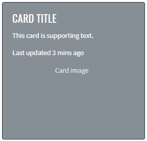

Here is an example with provided Bootstrap v4.3 code:

```java 
//@FindBy(css = "#card-image-overlay") 
@UI("#card-image-overlay")
public static CardImageOverlays cardImageOverlays;

public class CardImageOverlays extends Card {
    @UI("#card-svg") public VectorImage vectorImage;
    @UI("#card-overlay-section") public OverlaySection overlaySection;
}

@Test
public void availabilityTest() {
    cardImageOverlays.overlaySection.title.is()
            .displayed()
            .enabled();
    cardImageOverlays.overlaySection.title.is()
            .displayed()
            .enabled();
}

@Test
public void isValidationTest() {
    cardImageOverlays.overlaySection.title.is().text(is(TITLE));
    cardImageOverlays.vectorImage.assertThat().height(is(HEIGHT));
    cardImageOverlays.vectorImage.assertThat().width(is(WIDTH));
}

@Test
public void classTest() {
    cardImageOverlays.overlaySection.is().core().hasClass(OVERLAY_CLASS);
    cardImageOverlays.overlaySection.assertThat().core().hasClass(OVERLAY_CLASS);
    cardImageOverlays.vectorImage.is().core().hasClass(IMAGE_TOP_CLASS);
    cardImageOverlays.vectorImage.assertThat().core().hasClass(IMAGE_TOP_CLASS);
}

@Test
public void vectorInternalElementsTest() {
     assertEquals(cardImageOverlays.vectorImage.getText(VECTOR_TEXT_TAG), VECTOR_TEXT);
     assertEquals(cardImageOverlays.vectorImage.getAttribute(VECTOR_TEXT_TAG, VECTOR_TEXT_ATTR), VECTOR_TEXT_VALUE);
}
```

```html 
<div class="card bg-dark text-dark mb-3">
  
  <div class="card-img-overlay">
    <h5 class="card-title">Card title</h5>
    <p class="card-text">This is a wider card with supporting text below as a natural
      lead-in to additional content. This content is a little bit longer.</p>
    <p class="card-text">Last updated 3 mins ago</p>
  </div>
</div>
```

Card is represented by Section class in Java:

[Section](https://jdi-docs.github.io/jdi-light/#section)

Inner elements of Card Image Overlays represented by the following classes:

- [Text](https://jdi-docs.github.io/jdi-light/#text)
- [VectorImage](https://jdi-docs.github.io/jdi-light/#vector-image) <---No such element--->

And here are methods available in Java:

|Method | Description | Return Type
--- | --- | ---
**assertThat()** | property that returns object for work with assertions| TextAssert
**displayed()** | check item is displayed | TextAssert
**enabled()** | check item is enabled | TextAssert
**getAttribute(String tagName, String attr)** | get attribute of an element inside vector image by tag | String
**getText(String tagName)** | get text of an element inside vector image by tag | String
**hasClass(String className)** | check that expected className is presented | IsAssert
**is()** | property that returns object for work with assertions| TextAssert

[Bootstrap test examples](https://github.com/jdi-testing/jdi-light/blob/bootstrap/jdi-light-bootstrap-tests/src/test/java/io/github/epam/bootstrap/tests/composite/section/card/CardImageOverlaysTests.java)

#### Card Horizontal

[Card Horizontal](https://getbootstrap.com/docs/4.3/components/card/#horizontal) - using a combination of grid and
utility classes, cards can be made horizontal in a mobile-friendly and responsive way.


Here is an example with provided Bootstrap v4.3 code:

```java 
//FindBy(css = "#card-horizontal")
@UI("#card-horizontal")
public static CardHorizontal cardHorizontal;

public class CardHorizontal extends Card {
    @UI(".card-title") public Text title;
    @UI("//p[contains(text(), 'fictional character')]") public Text mainText;
    @UI(".text-muted") public Text smallText;
    @UI(".card-img") public Image image;
}

@Test
public void getSrcTest() {
    assertEquals(cardHorizontal.image.src(), imageSrc);
}

@Test
public void isValidationTest() {
    cardHorizontal.title.is().text(is(titleText));
    cardHorizontal.mainText.is().text(is(mainText));
    cardHorizontal.smallText.is().displayed()
            .and().text(is(smallText))
            .core()
            .css("font-size", is("11.2px"))
            .tag(is("small"));
    cardHorizontal.image.is().displayed()
            .and().src(is(imageSrc))
            .core()
            .attr("title", imageTitle);
    cardHorizontal.image.unhighlight();
    cardHorizontal.image.assertThat().width(anyOf(is(91), is(94)));
    cardHorizontal.image.assertThat().height(anyOf(is(146), is(150)));
}
```

```html 
<div class="card mb-3" id="card-horizontal" style="max-width: 540px;">
  <div class="row no-gutters">
    <div class="col-md-4">
      
    </div>
    <div class="col-md-8">
      <div class="card-body">
        <h5 class="card-title" id="card-horizontal-title">Wolverine</h5>
        <p class="card-text">Wolverine is a fictional character appearing in
          American comic books published by Marvel Comics, mostly in association
          with the X-Men. He is a mutant who possesses animal-keen senses,
          enhanced physical capabilities, powerful regenerative ability known as a
          healing factor, and three retractable claws in each hand. Wolverine has
          been depicted variously as a member of the X-Men, Alpha Flight, and the
          Avengers.</p>
        <p class="card-text"><small class="text-muted">The character appeared in
            #180 (1974)</small></p>
      </div>
    </div>
  </div>
</div>
```

Card is represented by Section class in Java:

[Section](https://jdi-docs.github.io/jdi-light/#section)

Inner elements of Card Horizontal represented by the following classes:<br>

- [Text](https://jdi-docs.github.io/jdi-light/#text)
- [Image](https://jdi-docs.github.io/jdi-light/#image)

Available methods in Java JDI Light:

|Method | Description | Return Type
--- | --- | ---
**alt()** | Assert alt image attribute | ImageAssert
**assertThat()** | Assert action | UIAssert
**getText()**| Returns text | String
**height()** | Assert image height | ImageAssert
**is()** |	Assert action | UIAssert
**src()** | Assert image src | ImageAssert
**width()** | Assert image width | ImageAssert

[Bootstrap test examples](https://github.com/jdi-testing/jdi-light/blob/bootstrap/jdi-light-bootstrap-tests/src/test/java/io/github/epam/bootstrap/tests/composite/section/card/CardHorizontalTests.java)

#### Card Background And Color

[Card Background And Color](https://getbootstrap.com/docs/4.3/components/card/#background-and-color) - use text and
background utilities to change the appearance of a card.


Here is an example with provided Bootstrap v4.3 code:

```java 
//@FindBy(css = "#card-bright-blue")
@UI("#card-bright-blue")
public static CardStyled cardBrightBlue;

public class CardStyled extends Card {
    @UI(".card-header") public Text header;
    @UI(".card-title") public Text title;
    @UI(".card-text") public Text body;
}

@Test(dataProvider = "cardColors")
public void checkColorCardsTest(CardWithHeaderAndFooter card, String cssClass, String color) {
    card.is()
            .core()
            .hasClass(cssClass)
            .css("background-color", is(color));

    card.header.is()
            .displayed().and()
            .core().css("background-color", is("rgba(0, 0, 0, 0.03)"));

    card.paragraph.is()
            .displayed().and()
            .core().css("background-color", is("rgba(0, 0, 0, 0)"));

}
```

```html 
<div class="card text-white bg-primary mb-3" style="max-width: 18rem;" id="card-bright-blue">
  <div class="card-header">Header</div>
  <div class="card-body">
    <h5 class="card-title">Primary card title</h5>
    <p class="card-text">Some quick example text to build on the card title and make up
      the bulk of the card's content.</p>
  </div>
</div>
```

Card is represented by Section class in Java:

[Section](https://jdi-docs.github.io/jdi-light/#section)

Inner elements of Card Background Color can be represented by the following classes:

- [Text](https://jdi-docs.github.io/jdi-light/#text)  
- [Button](https://jdi-docs.github.io/jdi-light/#button)

Available methods in Java JDI Light:

|Method | Description | Return Type
--- | --- | ---
**assertThat()** | Assert action | UIAssert
**css()** | Get element css value | String
**displayed()** | Check that element is displayed | TextAssert
**is()** | Assert action | UIAssert

[Bootstrap test examples](https://github.com/jdi-testing/jdi-light/blob/bootstrap/jdi-light-bootstrap-tests/src/test/java/io/github/epam/bootstrap/tests/composite/section/card/CardBackgroundAndColorTests.java)

#### Card Border

[Card Border](https://getbootstrap.com/docs/4.3/components/card/#border) - use border utilities to change just the
border-color of a card. Note that you can put `.text-{color}` classes on the parent `.card` or a subset of the card’s
contents as shown below.


Here is an example with provided Bootstrap v4.3 code:

```java 
//@FindBy(css = "#card-border-primatry")
@UI("#card-border-primary")//@FindBy(css = "#card-border-primatry")
public static CardStyled cardBorderPrimary;

public class CardStyled extends Card {
    @UI(".card-header") public Text header;
    @UI(".card-title") public Text title;
    @UI(".card-text") public Text body;
}

@Test(dataProvider = "cardBorderColor")
public void getBorderColorTest(CardBorder cardBorder, String color) {
    cardBorder.is().core().css("border-bottom-color", is(color));
    cardBorder.is().core().css("border-left-color", is(color));
    cardBorder.is().core().css("border-right-color", is(color));
    cardBorder.is().core().css("border-top-color", is(color));
}

@Test(dataProvider = "cardBorderHeaderText")
public void getHeaderTextTest(CardBorder cardBorder, String headerText) {
    assertEquals(cardBorder.border.getText(), headerText);
}
```

```html 
<div class="card border-primary mb-3" id="card-border-primary" style="max-width: 18rem;">
  <div class="card-header">Card with primary border</div>
  <div class="card-body text-primary">
    <h5 class="card-title">Primary card title</h5>
    <p class="card-text">Some quick example text to build on the card title and make up
      the bulk of the card's content.</p>
  </div>
</div>
```

Card is represented by Section class in Java:

[Section](https://jdi-docs.github.io/jdi-light/#section)

Inner elements of Card Border represented by the following classes:

[Text](https://jdi-docs.github.io/jdi-light/#text)

Available methods in Java JDI Light:

|Method | Description | Return Type
--- | --- | ---
**assertThat()** | Assert action | UIAssert
**css()** | Get element css value | String
**is()** | Assert action | UIAssert
**text()** | Assert text | TextAssert

[Bootstrap test examples](https://github.com/jdi-testing/jdi-light/blob/bootstrap/jdi-light-bootstrap-tests/src/test/java/io/github/epam/bootstrap/tests/composite/section/card/CardBorderTests.java)

#### Card Mixins Utilities

[Card Mixins Utilities](https://getbootstrap.com/docs/4.3/components/card/#mixins-utilities) - you can also change
the borders on the card header and footer as needed, and even remove their background-color with `.bg-transparent`.


Here is an example with provided Bootstrap v4.3 code:

```java 
//@FindBy(css = "#card-mixins-utilities")
@UI("#card-mixins-utilities")         
public static CardMixinsUtilities cardMixinsUtilities;

public class CardMixinsUtilities extends Card {
    @UI(".card-header") public Text header;
    @UI(".card-footer") public Text footer;
    @UI(".card-title") public Text title;
    @UI(".card-text") public Text text;
}

@Test
public void getHeaderTextTest() {
    assertEquals(cardMixinsUtilities.header.getText(), header);
}

@Test
public void isValidationTest() {
    cardMixinsUtilities.is().displayed()
            .and().core().css("border-color", "rgb(40, 167, 69)");
}
```

```html 
<div class="card border-success mb-3" id="card-mixins-utilities" style="max-width: 18rem;">
  <div class="card-header bg-transparent border-success">According To Samuel L. Jackson
  </div>
  <div class="card-body text-success">
    <h5 class="card-title">The Secret To Marvel Studios’ Success</h5>
    <p class="card-text">Because while the Marvel Cinematic Universe always includes
      plenty of spectacle and pulse pounding action, each blockbuster tells a very
      human story. The heroes of the world are flawed and funny, allowing audiences to
      connect with characters who are super powered and dealing with situations we
      truly can't comprehend.</p>
  </div>
  <div class="card-footer bg-transparent border-success">For Cinema Blend</div>
</div>
```

Card is represented by Section class in Java:

[Section](https://jdi-docs.github.io/jdi-light/#section)

Inner elements of Card Mixing Utilities represented by the following classes:

[Text](https://jdi-docs.github.io/jdi-light/#text)

Available methods in Java JDI Light:

|Method | Description | Return Type
--- | --- | ---
**assertThat()** | Assert action | UIAssert
**css()** | Get element css value | String
**is()** | Assert action | UIAssert
**text()** | Assert text | TextAssert

[Bootstrap test examples](https://github.com/jdi-testing/jdi-light/blob/bootstrap/jdi-light-bootstrap-tests/src/test/java/io/github/epam/bootstrap/tests/composite/section/card/CardMixinsUtilitiesTests.java)

#### Card Groups

[Card Groups](https://getbootstrap.com/docs/4.3/components/card/#card-groups) - use card groups to render cards as
a single, attached element with equal width and height columns.


Here is an example with provided Bootstrap v4.3 code:

```java 
//@FindBy(css = ".card-group:nth-of-type(1)") 
@UI(".card-group:nth-of-type(1)")
public static CardGroupedSection cardGroupSectionWithoutFooter;

public class CardGroupSection extends Section {
    @UI(".card:nth-of-type(1)") public CardGrouped card1;
    @UI(".card:nth-of-type(2)") public CardGrouped card2;
}

public class CardGrouped extends Card {
    @UI(".card-title") public Text title;
    @UI(".card-text:nth-of-type(1)") public Text mainText;
    @UI(".card-text .text-muted") public Text mutedText;
    @UI(".card-img-top") public Image image;
    @UI(".card-footer small") public Text footerText;
}

private String card1ImageSrc = "https://jdi-testing.github.io/jdi-light/images/spider-man.jpg";
private String card2ImageSrc = "https://jdi-testing.github.io/jdi-light/images/hulk.jpg";
private String card1ImageAlt = "spider-man";
private String card2ImageAlt = "hulk";

@Test
public void getSrcTest() {
    assertEquals(cardGroupSectionWithoutFooter.card1.image.src(), card1ImageSrc);
    assertEquals(cardGroupSectionWithoutFooter.card2.image.src(), card2ImageSrc);
}

@Test
public void getAltTest() {
    assertEquals(cardGroupSectionWithoutFooter.card1.image.alt(), card1ImageAlt);
    assertEquals(cardGroupSectionWithoutFooter.card2.image.alt(), card2ImageAlt);
}
```

```html 
<div class="card-group" style="margin-bottom: 10px;">
  <div class="card">
    <p style="text-align: center;"></p>
    <div class="card-body">
      <h5 class="card-title">Spider man</h5>
      <p class="card-text">Spider-Man is a fictional superhero created by
        writer-editor Stan Lee and writer-artist Steve Ditko.</p>
      <p class="card-text"><small class="text-muted">Peter Parker</small></p>
    </div>
  </div>
  <div class="card">
    <p style="text-align: center;">
    </p>
    <div class="card-body">
      <h5 class="card-title">Hulk</h5>
      <p class="card-text">The Hulk is a fictional superhero appearing in publications
        by the American publisher Marvel Comics.</p>
      <p class="card-text"><small class="text-muted">Bruce Banner</small></p>
    </div>
  </div>
</div>
```

##### Card Groups with Footer


Here is an example with provided Bootstrap v4.3 code:

```java 
//@FindBy(css = ".card-group:nth-of-type(2)")
@UI(".card-group:nth-of-type(2)")
public static CardGroupedSection cardGroupWithFooter;

public class CardGroupSection extends Section {
    @UI(".card:nth-of-type(1)") public CardGrouped card1;
    @UI(".card:nth-of-type(2)") public CardGrouped card2;
}

public class CardGrouped extends Card {
    @UI(".card-title") public Text title;
    @UI(".card-text:nth-of-type(1)") public Text mainText;
    @UI(".card-text .text-muted") public Text mutedText;
    @UI(".card-img-top") public Image image;
    @UI(".card-footer small") public Text footerText;
}

private String card1ImageSrc = "https://jdi-testing.github.io/jdi-light/images/spider-man.jpg";
private String card2ImageSrc = "https://jdi-testing.github.io/jdi-light/images/hulk.jpg";
private String card1ImageAlt = "spider-man";
private String card2ImageAlt = "hulk";

@Test
public void getSrcTest() {
    assertEquals(cardGroupWithFooter.card1.image.src(), card1ImageSrc);
    assertEquals(cardGroupWithFooter.card2.image.src(), card2ImageSrc);
}

@Test
public void getAltTest() {
    assertEquals(cardGroupWithFooter.card1.image.alt(), card1ImageAlt);
    assertEquals(cardGroupWithFooter.card2.image.alt(), card2ImageAlt);
}
```

```html 
<div class="card-group" style="margin-bottom: 10px;">
  <div class="card">
    <p style="text-align: center;"></p>
    <div class="card-body">
      <h5 class="card-title">Spider man</h5>
      <p class="card-text">Spider-Man is a fictional superhero created by
        writer-editor Stan Lee and writer-artist Steve Ditko.</p>
    </div>
    <div class="card-footer">
      <small class="text-muted">Peter Parker</small>
    </div>
  </div>
  <div class="card">
    <p style="text-align: center;">
    </p>
    <div class="card-body">
      <h5 class="card-title">Hulk</h5>
      <p class="card-text">The Hulk is a fictional superhero appearing in publications
        by the American publisher Marvel Comics.</p>
    </div>
    <div class="card-footer">
      <small class="text-muted">Bruce Banner</small>
    </div>
  </div>
</div>
```

Card is represented by Section class in Java:

[Section](https://jdi-docs.github.io/jdi-light/#section)

Inner elements of Card Grouped represented by the following classes:

- [Text](https://jdi-docs.github.io/jdi-light/#text)
- [Image](https://jdi-docs.github.io/jdi-light/#image)

[Bootstrap test examples](https://github.com/jdi-testing/jdi-light/tree/bootstrap/jdi-light-bootstrap-tests/src/test/java/io/github/epam/bootstrap/tests/composite/section/card/CardGroupsTests.java)

#### Card Decks

[Card Decks](https://getbootstrap.com/docs/4.3/components/card/#card-decks) - use card decks for a set of equal width
and height cards that aren't attached to one another.


Here is an example with provided Bootstrap v4.3 code:

```java 
//@FindBy(css = ".card-deck:nth-of-type(1)")
@UI(".card-deck:nth-of-type(1)")
public static CardDeckSection cardDeckSectionWithoutFooter;

public class CardDeckSection extends Section {
    @UI(".card:nth-of-type(1)") public CardGrouped card1;
    @UI(".card:nth-of-type(2)") public CardGrouped card2;
}

public class CardGrouped extends Card {
    @UI(".card-title") public Text title;
    @UI(".card-text:nth-of-type(1)") public Text mainText;
    @UI(".card-text .text-muted") public Text mutedText;
    @UI(".card-img-top") public Image image;
    @UI(".card-footer small") public Text footerText;
}

private static final String card1Title = "SPIDER MAN";
private static final String card2Title = "HULK";
private static final String card1MainText = "Spider-Man is a fictional superhero created by writer-editor Stan Lee and writer-artist Steve Ditko.";
private static final String card2MainText = "The Hulk is a fictional superhero appearing in publications by the American publisher Marvel Comics.";

@Test
public void getTitleTextTest() {
    cardDeckSectionWithoutFooter.highlight();
    assertEquals(cardDeckSectionWithoutFooter.card1.title.getText(), card1Title);
    assertEquals(cardDeckSectionWithoutFooter.card2.title.getText(), card2Title);
}

@Test
public void getMainTextTest() {
    cardDeckSectionWithoutFooter.highlight();
    assertEquals(cardDeckSectionWithoutFooter.card1.mainText.getText(), card1MainText);
    assertEquals(cardDeckSectionWithoutFooter.card2.mainText.getText(), card2MainText);
}
```

```html 
<div class="card-deck" style="margin-bottom: 10px;">
  <div class="card">
    <p style="text-align: center;"></p>
    <div class="card-body">
      <h5 class="card-title">Spider man</h5>
      <p class="card-text">Spider-Man is a fictional superhero created by
        writer-editor Stan Lee and writer-artist Steve Ditko.</p>
      <p class="card-text"><small class="text-muted">Peter Parker</small></p>
    </div>
  </div>
  <div class="card">
    <p style="text-align: center;">
    </p>
    <div class="card-body">
      <h5 class="card-title">Hulk</h5>
      <p class="card-text">The Hulk is a fictional superhero appearing in publications
        by the American publisher Marvel Comics.</p>
      <p class="card-text"><small class="text-muted">Bruce Banner</small></p>
    </div>
  </div>
</div>
```

##### Card Decks with Footer


Here is an example with provided Bootstrap v4.3 code:

```java 
//@FindBy(css = ".card-deck:nth-of-type(2)")
@UI(".card-deck:nth-of-type(2)")
public static CardDeckSection cardDeckSectionWithFooter;

public class CardGroupSection extends Section {
    @UI(".card:nth-of-type(1)") public CardGrouped card1;
    @UI(".card:nth-of-type(2)") public CardGrouped card2;
}

public class CardGrouped extends Card {
    @UI(".card-title") public Text title;
    @UI(".card-text:nth-of-type(1)") public Text mainText;
    @UI(".card-text .text-muted") public Text mutedText;
    @UI(".card-img-top") public Image image;
    @UI(".card-footer small") public Text footerText;
}

private static final String card1Title = "SPIDER MAN";
private static final String card2Title = "HULK";
private static final String card1MainText = "Spider-Man is a fictional superhero created by writer-editor Stan Lee and writer-artist Steve Ditko.";
private static final String card2MainText = "The Hulk is a fictional superhero appearing in publications by the American publisher Marvel Comics.";

@Test
public void getTitleTextTest() {
    cardDeckSectionWithFooter.highlight();
    assertEquals(cardDeckSectionWithFooter.card1.title.getText(), card1Title);
    assertEquals(cardDeckSectionWithFooter.card2.title.getText(), card2Title);
}

@Test
public void getMainTextTest() {
    cardDeckSectionWithFooter.highlight();
    assertEquals(cardDeckSectionWithFooter.card1.mainText.getText(), card1MainText);
    assertEquals(cardDeckSectionWithFooter.card2.mainText.getText(), card2MainText);
}    
```

```html 
<div class="card-deck" style="margin-bottom: 10px;">
  <div class="card">
    <p style="text-align: center;"></p>
    <div class="card-body">
      <h5 class="card-title">Spider man</h5>
      <p class="card-text">Spider-Man is a fictional superhero created by
        writer-editor Stan Lee and writer-artist Steve Ditko.</p>
    </div>
    <div class="card-footer">
      <small class="text-muted">Peter Parker</small>
    </div>
  </div>
  <div class="card">
    <p style="text-align: center;">
    </p>
    <div class="card-body">
      <h5 class="card-title">Hulk</h5>
      <p class="card-text">The Hulk is a fictional superhero appearing in publications
        by the American publisher Marvel Comics.</p>
    </div>
    <div class="card-footer">
      <small class="text-muted">Bruce Banner</small>
    </div>
  </div>
</div>
```

Card are represented by Section class in Java:

[Section](https://jdi-docs.github.io/jdi-light/#section)

Inner elements of Card Grouped can be represented by the following classes:

- [Text](https://jdi-docs.github.io/jdi-light/#text)  
- [Image](https://jdi-docs.github.io/jdi-light/#image)

Available methods in Java JDI Light:

|Method | Description | Return Type
--- | --- | ---
**alt()** | Get image alt() value | String
**assertThat()** | Assert action | TextAssert
**attr()** | Assert element attribute | IsAssert
**css()** | Get element css value | String
**displayed()** | Check that element is displayed | TextAssert
**getText()** | Get element text | String
**is()** | Assert action | TextAssert 
**src()** | Get image source path | String

[Bootstrap test examples](https://github.com/jdi-testing/jdi-light/blob/bootstrap/jdi-light-bootstrap-tests/src/test/java/io/github/epam/bootstrap/tests/composite/section/card/CardDeckTests.java)

#### Card Columns

[Card Columns](https://getbootstrap.com/docs/4.3/components/card/#card-columns) can also be extended and customized
with some additional code. For example `.card-columns` class to generate a set of responsive tiers for changing
the number of columns.
 

 
Here is an example with provided Bootstrap v4.3 code:
 
```java 
//@FindBy(css = ".card-columns") 
@UI(".card-columns")
public static CardColumns cardColumns; 

public class CardColumnsSection extends Section {
    @UI(".card:nth-of-type(1)") public CardWithinCardColumns topLeftCard;
    @UI(".card:nth-of-type(2)") public CardWithinCardColumns bottomLeftCard;
    @UI(".card:nth-of-type(3)") public CardWithinCardColumns topRightCard;
    @UI(".card:nth-of-type(4)") public CardWithinCardColumns middleRightCard;
    @UI(".card:nth-of-type(5)") public CardWithinCardColumns bottomRightCard;
}

public class CardWithinCardColumns extends Card {
    @UI(".card-title") public Text title;
    @UI("p:nth-of-type(1)") public Text mainText;
    @UI(".card-text small") public Text mutedText;
    @UI("footer small") public Text footerText;
    @UI(".card-img-top") public Image image;
}

@Test
public void checkElementsPositionTest() {
    assertTrue(cardColumnsSection.topLeftCard.core().getLocation().x <
            cardColumnsSection.topRightCard.core().getLocation().x);
    assertTrue(cardColumnsSection.topLeftCard.core().getLocation().y <
            cardColumnsSection.bottomLeftCard.core().getLocation().y);
    assertTrue(cardColumnsSection.topRightCard.core().getLocation().y <
            cardColumnsSection.middleRightCard.core().getLocation().y);
    assertTrue(cardColumnsSection.middleRightCard.core().getLocation().y <
            cardColumnsSection.bottomRightCard.core().getLocation().y);
    assertTrue(cardColumnsSection.bottomLeftCard.core().getLocation().x <
            cardColumnsSection.bottomRightCard.core().getLocation().x);
    assertTrue(cardColumnsSection.bottomLeftCard.core().getLocation().x <
            cardColumnsSection.middleRightCard.core().getLocation().x);
}
```

```html 
<div class="card-columns" style="column-count: 2">
  <div class="card p-3">
    <blockquote class="blockquote mb-0 card-body">
      <p>I don’t want to go.</p>
      <footer class="blockquote-footer">
        <small class="text-muted">
          Peter Parker in <cite title="Source Title">Avengers</cite>
        </small>
      </footer>
    </blockquote>
  </div>
  <div class="card">
    
    <div class="card-body">
      <h5 class="card-title">Who is Hulk?</h5>
      <p class="card-text">..A monster man who took "Go Green" too seriously.</p>
      <p class="card-text"><small class="text-muted">Last updated 3 mins ago</small>
      </p>
    </div>
  </div>
  <div class="card bg-primary text-white text-center p-3">
    <blockquote class="blockquote mb-0">
      <p>If toast is cut diagonally, I can’t eat it.</p>
      <footer class="blockquote-footer text-white">
        <small>
          Nick Fury in <cite title="Source Title">Captain Marvel</cite>
        </small>
      </footer>
    </blockquote>
  </div>
  <div class="card text-center">
    <div class="card-body">
      <h5 class="card-title">Iron Man</h5>
      <p class="card-text">I do anything and everything that Mr. Stark requires —
        including occasionally taking out the trash.</p>
      <p class="card-text"><small class="text-muted">Last updated 3 mins ago</small>
      </p>
    </div>
  </div>
  <div class="card">
    
  </div>
</div>
```

Card are represented by Section class in Java:

[Section](https://jdi-docs.github.io/jdi-light/#section)

Inner elements of Card Columns can be represented by the following classes:

- [Text](https://jdi-docs.github.io/jdi-light/#text)  
- [Image](https://jdi-docs.github.io/jdi-light/#image)

Available methods in Java JDI Light:

|Method | Description | Return Type
--- | --- | ---
**alt()** | Assert alt image attribute | ImageAssert
**assertThat()** |	Assert action | UIAssert
**getText()**| Returns text | String
**height()** | Assert image height | ImageAssert
**is()** | Assert action | UIAssert
**src()** | Assert image src | ImageAssert
**width()** | Assert image width | ImageAssert

[Bootstrap test examples](https://github.com/jdi-testing/jdi-light/tree/bootstrap/jdi-light-bootstrap-tests/src/test/java/io/github/epam/bootstrap/tests/composite/section/card/CardColumnsTests.java)

### Jumbotron

[Jumbotron](https://getbootstrap.com/docs/4.3/components/jumbotron) – Lightweight, flexible component for showcasing hero


Here is an example with provided Bootstrap v4.3 code:

```java 
// @FindBy(css = "#jumbotron")
@Css("#jumbotron")
public static Jumbotron jumbotron;

public class Jumbotron extends Section implements IsJumbotron {
    @Css(".display-4") public Text title;
    @Css(".lead") public Text description;
    @Css(".btn") public Button learnMoreBtn;
}

@Test
public void getTextTest() {
    assertEquals(jumbotron.getText(), mJumbotronWithButton);
}

@Test
public void clickTest() {
    jumbotron.learnMoreBtn.click();
    ArrayList<String> tabs = new ArrayList<>(WebDriverFactory.getDriver().getWindowHandles());
    WebDriver driver = WebDriverFactory.getDriver();
    driver.switchTo().window(tabs.get(1));
    assertEquals(getUrl(), mJumbotronUrl);
    driver.close();
    driver.switchTo().window(tabs.get(0));
} 
```

```html
<div class="jumbotron" id="jumbotron">
    <h1 class="display-4">Hello, world!</h1>
    <p class="lead">This is a simple hero unit, a simple
        jumbotron-style component for calling extra attention to
        featured content or information.</p>
    <hr class="my-4">
    <p>It uses utility classes for typography and spacing to
        space content out within the larger container.</p>
    <a class="btn btn-primary btn-lg"
       href="https://getbootstrap.com/docs/4.3/components/jumbotron/"
       target="_blank" role="button">Learn more</a>
</div>
```

Jumbotron is represented by Section class in Java:

[Section](https://jdi-docs.github.io/jdi-light/#section)

Inner elements of jumbotron can be represented by the following classes:

- [Text](https://jdi-docs.github.io/jdi-light/#text)
- [Button](https://jdi-docs.github.io/jdi-light/#button)
- [Label](https://jdi-docs.github.io/jdi-light/#label)
- [Link](https://jdi-docs.github.io/jdi-light/#link)

[See more elements](https://jdi-docs.github.io/jdi-light/#html5-common-elements)

[Bootstrap test examples](https://github.com/jdi-testing/jdi-light/tree/bootstrap/jdi-light-bootstrap-tests/src/test/java/io/github/epam/bootstrap/tests/composite/section/jumbotron)

### Dropdown
<a style="font-weight:bold" href="https://getbootstrap.com/docs/4.3/components/dropdowns/" target="_blank">Dropdowns</a> are toggleable, contextual overlays for displaying lists of links and more. 

For working with Dropdown there are two classes available in JDI:
 
  - __Java__: <a href="https://github.com/jdi-testing/jdi-light/blob/bootstrap/jdi-light-bootstrap/src/main/java/com/epam/jdi/light/ui/bootstrap/elements/composite/BootstrapDropdown.java">BootstrapDropdown</a>,
   <a href="https://github.com/jdi-testing/jdi-light/blob/bootstrap/jdi-light-bootstrap/src/main/java/com/epam/jdi/light/ui/bootstrap/elements/composite/DropdownMenu.java">DropdownMenu</a>
  - __C#__: TBD

<a href="https://github.com/jdi-testing/jdi-light/blob/bootstrap/jdi-light-bootstrap/src/main/java/com/epam/jdi/light/ui/bootstrap/elements/composite/BootstrapDropdown.java">BootstrapDropdown</a> class is designed to work with Dropdown element.
<a href="https://github.com/jdi-testing/jdi-light/blob/bootstrap/jdi-light-bootstrap/src/main/java/com/epam/jdi/light/ui/bootstrap/elements/composite/DropdownMenu.java">DropdownMenu</a> class 
extends <a href="https://github.com/jdi-testing/jdi-light/blob/bootstrap/jdi-light-bootstrap/src/main/java/com/epam/jdi/light/ui/bootstrap/elements/composite/BootstrapDropdown.java">BootstrapDropdown</a> class providing additional methods for working with the Dropdown menu items elements


Methods available for BootstrapDropdown class in Java JDI Light:

|Method/Property | Description | Return Type
--- | --- | ---
**assertThat()** | Assert action | BootstrapDropdownAssert
**collapse()** | Collapse dropdown | void
**collapsed()** | Assert that dropdown is collapsed | BootstrapDropdownAssert
**expand()** | Expand dropdown | void
**expanded()** | Assert that dropdown is expanded | BootstrapDropdownAssert
**expander()** | Get dropdown expander | Button
**has()** | Assert action | BootstrapDropdownAssert
**is()** | Assert action | BootstrapDropdownAssert
**isCollapsed()** | Return if dropdown expanded | boolean
**isExpanded()** | Return if dropdown expanded | boolean
**menu()** | Get dropdown menu | UIElement
**shouldBe()** | Assert action | BootstrapDropdownAssert
**verify()** | Soft assert action | BootstrapDropdownAssert
**waitFor()** | Assert action | BootstrapDropdownAssert

<br>
Additional methods available for DropdownMenu class in Java JDI Light:

|Method | Description | Return Type
--- | --- | ---
**active(int itemIndex)** | Check if item in dropdown menu is active | DropdownMenuAssert
**assertThat()** | Assert action | DropdownMenuAssert
**has()** | Assert action | DropdownMenuAssert
**hasItems(String... item)** | Return if dropdown contains all items | boolean
**hasItems(String... values)** | Asserts whether dropdown has all items from arguments | DropdownMenuAssert
**is()** | Assert action | DropdownMenuAssert
**itemValues()** | Get items text values | List<String>
**itemValues(String... values)** | Asserts whether dropdown are exactly match arguments  | DropdownMenuAssert
**list()** | Get dropdown items | WebList
**select(String item)** | Click at dropdown item | void
**select(int index)** | Click at dropdown item | void
**shouldBe()** | Assert action | DropdownMenuAssert
**verify()** | Soft assert action | DropdownMenuAssert
**waitFor()** | Assert action | DropdownMenuAssert

#### [Single button](https://getbootstrap.com/docs/4.3/components/dropdowns/#single-button)
Any single `.btn` can be turned into a dropdown toggle with some markup changes. Here’s how you can put them to work with either `<button>` elements:


Here is an example with provided Bootstrap v4.3 code for `<button>` elements:

```java 
//@FindBy(id = "simpleDropdown")
@UI("#simpleDropdown")
public static DropdownMenu simpleDropdown;

@Test
public void textTest() {
	simpleDropdown.assertThat()
		.core()
		.text(DROPDOWN);
	assertThat(simpleDropdown.core().getText(), is(DROPDOWN));
}

@Test
public void itemsTest() {
	simpleDropdown.expand();
	simpleDropdown.assertThat()
		.itemValues(is(Arrays.asList(ITEMS_ARR)))
		.hasItems(FIRSTITEM)
		.hasItems(SECONDITEM)
		.hasItems(LASTITEM)
		.hasItems(FIRSTITEM, LASTITEM);
	assertThat(simpleDropdown.itemValues(), is(Arrays.asList(ITEMS_ARR)));
}

@Test
public void clickTest() {
	simpleDropdown.expand();
	simpleDropdown.is()
		.expanded();
	simpleDropdown.collapse();
	simpleDropdown.is()
		.collapsed();
}
```

```html 
<div id="simpleDropdown" class="dropdown">
    <button class="btn btn-primary dropdown-toggle" type="button" 
    id="dropdownMenuButton" data-toggle="dropdown" aria-haspopup="true"
     aria-expanded="false" style="margin-bottom: 5px;">
        Dropdown
    </button>
    <div class="dropdown-menu" aria-labelledby="dropdownMenuButton" x-placement=
    "bottom-start" style="position: absolute; transform: translate3d(0px, 38px, 0px);
     top: 0px; left: 0px; will-change: transform;">
        <a class="dropdown-item" href="https://getbootstrap.com/" target="_blank">Action</a>
        <a class="dropdown-item" href="https://getbootstrap.com/docs/4.0/components/dropdowns/" target="_blank">Another
            action</a>
        <a class="dropdown-item" href="https://getbootstrap.com/docs/4.3/getting
        -started/introduction/" target="_blank">Separated link</a>
    </div>
</div>
```

<br><br><br><br><br><br><br><br><br><br><br><br><br><br><br><br><br>

And with `<a>` elements:

```java 
//@FindBy(id = "linkDropdown")
@UI("#linkDropdown")
public static DropdownMenu linkDropdown;

@Test
public void linkDropdownIsValidationTest() {
    linkDropdown.expander().is()
        .core()
        .tag(is("a"));
}
```

```html 
<div id="linkDropdown" class="dropdown show">
    <a class="btn btn-primary dropdown-toggle" href="https://
      getbootstrap.com/" role="button" id="dropdownMenuLink" data-toggle=
      "dropdown" aria-haspopup="true" aria-expanded="false" style="margin-bottom: 5px;">
        Dropdown link
    </a>
    <div class="dropdown-menu" aria-labelledby="dropdownMenuLink">
        <a class="dropdown-item" href="https://getbootstrap.com/docs/4.0/
        components/dropdowns/" target="_blank">Action</a>
        <a class="dropdown-item" href="https://getbootstrap.com/docs/4.0/
        components/dropdowns/" target="_blank">Another
        action</a>
        <a class="dropdown-item" href="https://getbootstrap.com/docs/4.3/
        getting-started/introduction/" target="_blank">Something else here</a>
    </div>
</div>
```

<a href="https://github.com/jdi-testing/jdi-light/blob/bootstrap/jdi-light-bootstrap-tests/src/test/java/io/github/epam/bootstrap/tests/composite/dropdown/DropdownTests.java">Bootstrap test examples</a>


#### <a href="https://getbootstrap.com/docs/4.3/components/dropdowns/#split-button">Split button</a>
Similarly, create split button dropdowns with virtually the same markup as single button dropdowns, but with the addition of ``.dropdown-toggle-split`` for proper spacing around the dropdown caret.


Here is an example with provided Bootstrap v4.3 code:

```java 
//@FindBy(id = "splitDropdown")
@UI("#splitDropdown")
public static DropdownMenu splitDropdown;

@Test
public void splitDropdownIsValidationTest() {
    splitDropdown.expander().is()
    .core()
    .hasClass("dropdown-toggle-split");
}
```

```html
<div id="splitDropdown" class="btn-group">
    <button type="button" class="btn btn-primary" style="margin-bottom: 5px;">Action
    </button>
    <button type="button" class="btn btn-primary dropdown-toggle dropdown-toggle-split"
            data-toggle="dropdown" aria-haspopup="true" aria-expanded="false"
            style="margin-bottom: 5px;">
        <span class="sr-only">Toggle Dropdown</span>
    </button>
    <div class="dropdown-menu">
        <a class="dropdown-item"
           href="https://getbootstrap.com/docs/4.0/components/dropdowns/"
           target="_blank">Action</a>
        <a class="dropdown-item"
           href="https://getbootstrap.com/docs/4.0/components/dropdowns/" target="_blank">Another
            action</a>
        <a class="dropdown-item"
           href="https://getbootstrap.com/docs/4.3/getting-started/introduction/"
           target="_blank">Something else here</a>
    </div>
</div>
```


<a href="https://github.com/jdi-testing/jdi-light/blob/bootstrap/jdi-light-bootstrap-tests/src/test/java/io/github/epam/bootstrap/tests/composite/dropdown/DropdownTests.java">Bootstrap test examples</a>

<br>

#### <a href="https://getbootstrap.com/docs/4.3/components/dropdowns/#sizing">Sizing</a>
Button dropdowns work with buttons of all sizes, including default and split dropdown buttons.


Here is an example of Large button code:

```java 
//@FindBy(id = "largeDropdown")
public static DropdownMenu largeDropdown;
@UI("#largeSplitDropdown")

@Test
public void largeDropdownIsValidationTest() {
    largeDropdown.expander().is()
        .core()
        .hasClass("btn-lg")
        .css(PADDING, is("8px 16px"))
        .css(FONTSIZE, is("20px"))
        .css(LINEHEIGHT, is("30px"))
        .css(BORDERRADIUS, is("4.8px"));
}
```

```html 
<div id="largeDropdown" class="btn-group show">
    <button class="btn btn-primary btn-lg dropdown-toggle" type="button" data-
    toggle="dropdown" aria-haspopup="true" aria-expanded="true" style="margin-
    bottom: 5px;">
        Large button
    </button>
    <div class="dropdown-menu show" x-placement="bottom-start" style="position:
    absolute; transform: translate3d(0px, 48px, 0px); top: 0px; left: 0px; will-
    change: transform;">
        <a class="dropdown-item" href="https://getbootstrap.com/
        docs/4.0/components/dropdowns/" target="_blank">Action</a>
        <a class="dropdown-item" href="https://getbootstrap.com/
        docs/4.0/components/dropdowns/" target="_blank">Another
            action</a>
        <a class="dropdown-item" href="https://getbootstrap.com/
        docs/4.3/getting-started/introduction/"
         target="_blank">Something else here</a>
    </div>
</div>
```


Here is an example of Large split button code:

```java 
//@FindBy(id = "largeSplitDropdown")
@UI("#largeSplitDropdown")
public static DropdownMenu largeSplitDropdown;

@Test
public void largeSplitDropdownIsValidationTest() {
    largeSplitDropdown.expander().is()
        .core()
        .hasClass("btn-lg")
        .hasClass("dropdown-toggle-split")
        .css(PADDING, is("8px 12px"))
        .css(FONTSIZE, is("20px"))
        .css(LINEHEIGHT, is("30px"))
        .css(BORDERRADIUS, is("0px 4.8px 4.8px 0px"));
}
```

```html 
<div id="largeSplitDropdown" class="btn-group">
    <button class="btn btn-primary btn-lg" type="button" style="margin-bottom: 5px;">
        Large split button
    </button>
    <button type="button" class="btn btn-lg btn-primary dropdown-toggle dropdown-toggle-split" data-toggle="dropdown" aria-haspopup="true" aria-expanded="false" style="margin-bottom: 5px;">
        <span class="sr-only">Toggle Dropdown</span>
    </button>
    <div class="dropdown-menu" x-placement="bottom-start" 
     style="position: absolute; transform: translate3d(180px, 48px, 0px);
     top: 0px; left: 0px; will-change: transform;">
        <a class="dropdown-item" href="https://getbootstrap.com/
         docs/4.0/components/dropdowns/" target="_blank">Action</a>
        <a class="dropdown-item" href="https://getbootstrap.com/
          docs/4.0/components/dropdowns/"
          target="_blank">Another action</a>
        <a class="dropdown-item" href="https://getbootstrap.com/
        docs/4.3/getting-started
        /introduction/" target="_blank">Something else here</a>
    </div>
</div>
```

<a href="https://github.com/jdi-testing/jdi-light/blob/bootstrap/jdi-light-bootstrap-tests/src/test/java/io/github/epam/bootstrap/tests/composite/dropdown/DropdownTests.java">Bootstrap test examples</a>


#### <a href="https://getbootstrap.com/docs/4.3/components/dropdowns/#directions">Directions</a>
Trigger dropdown menus <a href="https://getbootstrap.com/docs/4.3/components/dropdowns/#dropup">above</a> elements by adding ``.dropup`` to the parent element.<br>
Trigger dropdown menus <a href="https://getbootstrap.com/docs/4.3/components/dropdowns/#dropright">at the right</a> of the elements by adding ``.dropright`` to the parent element.<br>
Trigger dropdown menus <a href="https://getbootstrap.com/docs/4.3/components/dropdowns/#dropleft">at the left</a> of the elements by adding ``.dropleft`` to the parent element.


Here is an example of Dropup code:

```java 
//@FindBy(id = "dropUpDropdown")
@UI("#dropUpDropdown")
public static DropdownMenu dropUpDropdown;

@Test
public void dropUpDropdownIsValidationTest() {
    dropUpDropdown.is()
        .core()
        .hasClass("dropup");
    dropUpDropdown.menu().is()
        .core()
        .css(TOP, is("auto"))
        .css(BOTTOM, is("100%"));
}
```

```html
<div id="dropUpDropdown" class="btn-group dropup">
    <button type="button" class="btn btn-primary dropdown-toggle" data-toggle="dropdown"
            aria-haspopup="true" aria-expanded="false" style="margin-bottom: 5px;">
        Dropup
    </button>
    <div class="dropdown-menu">
        <a class="dropdown-item"
           href="https://getbootstrap.com/docs/4.0/components/dropdowns/"
           target="_blank">Action</a>
        <a class="dropdown-item"
           href="https://getbootstrap.com/docs/4.0/components/dropdowns/" target="_blank">Another
            action</a>
        <a class="dropdown-item"
           href="https://getbootstrap.com/docs/4.3/getting-started/introduction/"
           target="_blank">Something else here</a>
    </div>
</div>
```

<br>

Here is an example of Dropup split code:

```java 
//@FindBy(id = "dropUpSplitDropdown")
@UI("#dropUpSplitDropdown")
public static DropdownMenu dropUpSplitDropdown;

@Test
public void dropUpSplitDropdownIsValidationTest() {
    dropUpSplitDropdown.is()
        .core()
        .hasClass("dropup");
    dropUpSplitDropdown.menu().is()
        .core()
        .css(TOP, is("auto"))
        .css(BOTTOM, is("100%"));
    }
```

```html
<div id="dropUpSplitDropdown" class="btn-group dropup">
    <button type="button" class="btn btn-primary" style="margin-bottom: 5px;">
        Split dropup
    </button>
    <button type="button" class="btn btn-primary dropdown-toggle dropdown-toggle-split"
            data-toggle="dropdown" aria-haspopup="true" aria-expanded="false"
            style="margin-bottom: 5px;">
        <span class="sr-only">Toggle Dropdown</span>
    </button>
    <div class="dropdown-menu">
        <a class="dropdown-item"
           href="https://getbootstrap.com/docs/4.0/components/dropdowns/"
           target="_blank">Action</a>
        <a class="dropdown-item"
           href="https://getbootstrap.com/docs/4.0/components/dropdowns/" target="_blank">Another
            action</a>
        <a class="dropdown-item"
           href="https://getbootstrap.com/docs/4.3/getting-started/introduction/"
           target="_blank">Something else here</a>
    </div>
</div>
```

<br>

Here is an example of Dropright code:

```java 
//@FindBy(id = "dropRightDropdown")
@UI("#dropRightDropdown")
public static DropdownMenu dropRightDropdown;

@Test
public void dropRightDropdownIsValidationTest() {
    dropRightDropdown.is()
        .core()
        .hasClass("dropright");
    dropRightDropdown.menu().is()
        .core()
        .css(RIGHT, is("auto"))
        .css(LEFT, is("100%"));
}
```

```html
<div id="dropRightDropdown" class="btn-group dropright">
    <button type="button" class="btn btn-primary dropdown-toggle" data-toggle="dropdown"
            aria-haspopup="true" aria-expanded="false" style="margin-bottom: 5px;">
        Dropright
    </button>
    <div class="dropdown-menu">
        <a class="dropdown-item"
           href="https://getbootstrap.com/docs/4.0/components/dropdowns/"
           target="_blank">Action</a>
        <a class="dropdown-item"
           href="https://getbootstrap.com/docs/4.0/components/dropdowns/" target="_blank">Another
            action</a>
        <a class="dropdown-item"
           href="https://getbootstrap.com/docs/4.3/getting-started/introduction/"
           target="_blank">Something else here</a>
    </div>
</div>
```

<br><br>

Here is an example of Dropright split code:

```java 
//@FindBy(id = "dropRightSplitDropdown")
@UI("#dropRightSplitDropdown")
public static DropdownMenu dropRightSplitDropdown;

@Test
public void dropRightSplitDropdownIsValidationTest() {
    dropRightSplitDropdown.is()
        .core()
        .hasClass("dropright");
    dropRightSplitDropdown.menu().is()
        .core()
        .css(RIGHT, is("auto"))
        .css(LEFT, is("100%"));
    }
```

```html
<div id="dropRightSplitDropdown" class="btn-group dropright">
    <button type="button" class="btn btn-primary" style="margin-bottom: 5px;">
        Split dropright
    </button>
    <button type="button" class="btn btn-primary dropdown-toggle dropdown-toggle-split"
            data-toggle="dropdown" aria-haspopup="true" aria-expanded="false"
            style="margin-bottom: 5px;">
        <span class="sr-only">Toggle Dropright</span>
    </button>
    <div class="dropdown-menu">
        <a class="dropdown-item"
           href="https://getbootstrap.com/docs/4.0/components/dropdowns/"
           target="_blank">Action</a>
        <a class="dropdown-item"
           href="https://getbootstrap.com/docs/4.0/components/dropdowns/" target="_blank">Another
            action</a>
        <a class="dropdown-item"
           href="https://getbootstrap.com/docs/4.3/getting-started/introduction/"
           target="_blank">Something else here</a>
    </div>
</div>
```

<br>

Here is an example of Dropleft code:

```java 
//@FindBy(id = "dropLeftDropdown")
@UI("#dropLeftDropdown")
public static DropdownMenu dropLeftDropdown;

@Test
public void dropLeftDropdownIsValidationTest() {
    dropLeftDropdown.is()
        .core()
        .hasClass("dropleft");
    dropLeftDropdown.menu().is()
        .core()
        .css(LEFT, is("auto"))
        .css(RIGHT, is("100%"));
    }
```

```html
<div id="dropLeftDropdown" class="btn-group dropleft">
    <button type="button" class="btn btn-primary dropdown-toggle" data-toggle="dropdown"
            aria-haspopup="true" aria-expanded="false" style="margin-bottom: 5px;">
        Dropleft
    </button>
    <div class="dropdown-menu">
        <a class="dropdown-item"
           href="https://getbootstrap.com/docs/4.0/components/dropdowns/"
           target="_blank">Action</a>
        <a class="dropdown-item"
           href="https://getbootstrap.com/docs/4.0/components/dropdowns/" target="_blank">Another
            action</a>
        <a class="dropdown-item"
           href="https://getbootstrap.com/docs/4.3/getting-started/introduction/"
           target="_blank">Something else here</a>
    </div>
</div>
```

<br>

Here is an example of Dropleft split code:

```java 
//@FindBy(id = "dropLeftSplitDropdown")
@UI("#dropLeftSplitDropdown")
public static DropdownMenu dropLeftSplitDropdown;

@Test
public void dropLeftSplitDropdownIsValidationTest() {
    dropLeftSplitDropdown.menu().is()
        .core()
        .css(LEFT, is("auto"))
        .css(RIGHT, is("100%"));
}
```

```html 
<div id="dropLeftSplitDropdown" class="btn-group">
    <div class="btn-group dropleft" role="group">
        <button type="button" class="btn btn-primary dropdown-toggle dropdown-toggle-split" data-toggle="dropdown" aria-haspopup="true" aria-expanded="false" style="margin-bottom: 5px;">
            <span class="sr-only">Toggle Dropleft</span>
        </button>
        <div class="dropdown-menu" x-placement="left-start" style="position: absolute; transform: translate3d(-2px, 0px, 0px); top: 0px; left: 0px; will-change: transform;">
            <a class="dropdown-item" href="https://getbootstrap.com/docs/4.0/components/dropdowns/" target="_blank">Action</a>
            <a class="dropdown-item" href="https://getbootstrap.com/docs/4.0/components/dropdowns/" target="_blank">Another action</a>
            <a class="dropdown-item" href="https://getbootstrap.com/docs/4.3/getting-started/introduction/" target="_blank">Something else here</a>
        </div>
    </div>
    <button type="button" class="btn btn-primary" style="margin-bottom: 5px;">
        Split dropleft
    </button>
</div>
```
<a href="https://github.com/jdi-testing/jdi-light/blob/bootstrap/jdi-light-bootstrap-tests/src/test/java/io/github/epam/bootstrap/tests/composite/dropdown/DropdownTests.java">Bootstrap test examples</a>

<br>

#### <a href="https://getbootstrap.com/docs/4.3/components/dropdowns/#menu-items">Menu items</a>
Historically dropdown menu contents had to be links, but that’s no longer the case with v4. 
Now you can optionally use ``<button>`` elements in your dropdowns instead of just ``<a>``s.

  


Here is an example of Menu items code:

```java 
//@FindBy(css = "#dropdown-menu-items")
@UI("#dropdown-menu-items")
public static DropdownMenu dropdownMenuItems;

@DataProvider(name = "actionsDataProvider")
public Object[][] actionsDataProvider() {
    return new Object[][]{
        {"Action", "Action"},
        {"Another action", "Another action"},
        {"Something else here", "One more action"}
    };
}

@Test(dataProvider = "actionsDataProvider")
public void menuItemsActionsTest(String itemText, String alertText) {
    dropdownMenuItems.expand();
    dropdownMenuItems.select(itemText);
    Alerts.validateAlert(Matchers.is(alertText));
    dropdownMenuItems.collapse();
}
```

```html 
<div class="dropdown" id="dropdown-menu-items">
    <button class="btn btn-primary dropdown-toggle" type="button" id="dropdownMenu2" data-toggle="dropdown" aria-haspopup="true" aria-expanded="false" style="margin-bottom: 5px;">
        Menu items
    </button>
    <div class="dropdown-menu" aria-labelledby="dropdownMenu2">
        <button class="dropdown-item" type="button" onclick="alert('Action');">
            Action
        </button>
        <button class="dropdown-item" type="button" onclick="alert('Another action');">
            Another action
        </button>
        <button class="dropdown-item" type="button" onclick="alert('One more action');">
            Something else here
        </button>
    </div>
</div>
```
<br><br><br><br><br><br>
You can also create non-interactive dropdown items with ``.dropdown-item-text``. Feel free to style further with custom CSS or text utilities.


Here is an example of non-interactive dropdown items code:

```java 
//@FindBy(css = "dropdown-menu-text-item")
@UI("#dropdown-menu-text-item")
public static DropdownMenu dropdownMenuTextItem;

@Test(expectedExceptions = RuntimeException.class,
        expectedExceptionsMessageRegExp = ".*Expected: an array containing \"href\".*")
public void textItemTest() {
    dropdownMenuTextItem.expand();
    UIElement textItem = dropdownMenuTextItem.list().get("Dropdown item text");
    textItem.waitFor().enabled();
    textItem.assertThat()
        .tag("span");

    textItem.waitSec(1);
    textItem.assertThat()
        .hasAttr("href");
}
```

```html 
<div class="dropdown" id="dropdown-menu-text-item">
    <button class="btn btn-primary dropdown-toggle" type="button" data-toggle="dropdown" aria-haspopup="true" aria-expanded="false" style="margin-bottom: 5px;">
        Menu items with non-interactive
    </button>
    <div class="dropdown-menu" x-placement="bottom-start"
     style="position: absolute; transform: translate3d(0px, 37px, 0px);
     top: 0px; left: 0px; will-change: transform;">
        <span class="dropdown-item-text">Dropdown item text</span>
        <a class="dropdown-item" href="https://getbootstrap.com/
            docs/4.3/components/dropdowns/" target="_blank">Action</a>
        <a class="dropdown-item" href="https://getbootstrap.com/
            docs/4.3/getting-started/introduction/"
             target="_blank">Another action</a>
    </div>
</div>
```

<a href="https://github.com/jdi-testing/jdi-light/blob/bootstrap/jdi-light-bootstrap-tests/src/test/java/io/github/epam/bootstrap/tests/composite/dropdown/DropdownMenuItemsTest.java">Bootstrap test examples</a>

<br><br>
<a href="https://getbootstrap.com/docs/4.3/components/dropdowns/#active">**Active**</a><br>

Add ``.active`` to items in the dropdown to style them as active.

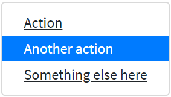

Here is a code example of items in the dropdown which are styled as active:

```java 
//@FindBy(css = "#dropdown-menu-items-active")
@UI("#dropdown-menu-items-active")
public static DropdownMenu dropdownMenuItemsActive;

@Test(dataProvider = "dropdownMenu")
public void dropdownMenuTest(String itemText, String itemHref) {
    dropdownMenuItemsActive.expand();
    int currWindowNum = WindowsManager.windowsCount();
    dropdownMenuItemsActive.select(itemText);
    WindowsManager.switchToWindow(currWindowNum + 1);
    String Url = WebPage.getUrl();
    assertEquals(Url, itemHref);
    WindowsManager.closeWindow();
    WindowsManager.switchToWindow(currWindowNum);
    dropdownMenuItemsActive.collapse();
}

@Test
public void isActiveTest() {
    dropdownMenuItemsActive.expand();
    dropdownMenuItemsActive.is().active(2);
    dropdownMenuItemsActive.collapse();
}
```

```html 
<div class="dropdown" id="dropdown-menu-items-active">
    <button class="btn btn-primary dropdown-toggle" type="button" data-toggle="dropdown" aria-haspopup="true" aria-expanded="false" style="margin-bottom: 5px;">
        Menu items with active
    </button>
    <div class="dropdown-menu">
        <a class="dropdown-item" href="https://getbootstrap.com/
        docs/4.3/components/dropdowns/#active" 
        target="_blank">Action</a>
        <a class="dropdown-item active" 
        href="https://getbootstrap.com/docs/4.3/components/dropdowns/"
         target="_blank">Another action</a>
        <a class="dropdown-item" href="https://getbootstrap.com/
        docs/4.3/getting-started/introduction/"
         target="_blank">Something else here</a>
    </div>
</div>
```
<a href="https://github.com/jdi-testing/jdi-light/blob/bootstrap/jdi-light-bootstrap-tests/src/test/java/io/github/epam/bootstrap/tests/composite/dropdown/DropdownActiveTests.java">Bootstrap test examples</a>
<br><br><br><br><br><br><br><br>
<a href="https://getbootstrap.com/docs/4.3/components/dropdowns/#disabled">**Disabled**</a><br>

Add ``.disabled`` to items in the dropdown to style them as disabled.


Here is a code example of items in the dropdown which are styled as disabled:

```java 
//@FindBy(css = "#dropdown-menu-disabled-item")
@UI("#dropdown-menu-disabled-item")
public static DropdownMenu dropdownMenuDisabledItem;

private final String DISABLED_ITEM_TEXT = "Disabled link";
private final String DISABLED_ITEM_HREF = "https://getbootstrap.com/docs/4.3/components/dropdowns/";

@Test
public void itemTest() {
    dropdownMenuDisabledItem.expand();
    dropdownMenuDisabledItem.list()
        .get(DISABLED_ITEM_TEXT)
        .assertThat()
        .tag("a")
        .attr("href", DISABLED_ITEM_HREF)
        .disabled();
    dropdownMenuDisabledItem.collapse();
}
```

```html 
<div class="dropdown" id="dropdown-menu-disabled-item">
    <button class="btn btn-primary dropdown-toggle" type="button" data-toggle="dropdown" aria-haspopup="true" aria-expanded="false" style="margin-bottom: 5px;">
        Menu items with disabled
    </button>
    <div class="dropdown-menu">
        <a class="dropdown-item" href="https://getbootstrap.com/
           docs/4.3/components/dropdowns/" 
           target="_blank">Regular link</a>
        <a class="dropdown-item disabled"
             href="https://getbootstrap.com/docs/4.3/components/
            dropdowns/" target="_blank">Disabled link</a>
        <a class="dropdown-item" href="https://getbootstrap.com/
            docs/4.3/getting-started/introduction/"
             target="_blank">Another link</a>
    </div>
</div>
```

<a href="https://github.com/jdi-testing/jdi-light/blob/bootstrap/jdi-light-bootstrap-tests/src/test/java/io/github/epam/bootstrap/tests/composite/dropdown/DisabledMenuItemTest.java">Bootstrap test examples</a>

<br>

#### <a href="https://getbootstrap.com/docs/4.3/components/dropdowns/#menu-alignment">Menu alignment</a>
By default, a dropdown menu is automatically positioned 100% from the top and along the left side of its parent. Add ``.dropdown-menu-right`` to a ``.dropdown-menu`` to right align the dropdown menu.

Here is an example of right-aligned menu:


Here is an example of right-aligned menu code:

```java 
//@FindBy(id = "rightAllignedDropdown")
@UI("#rightAllignedDropdown")
public static DropdownMenu rightAllignedDropdown;

@Test
public void rightAllignedDropdownIsValidationTest() {
    rightAllignedDropdown.menu().is()
        .core()
        .hasClass("dropdown-menu-right");
}
```

```html
<div id="rightAllignedDropdown" class="btn-group">
    <button type="button" class="btn btn-primary dropdown-toggle" data-toggle="dropdown"
            aria-haspopup="true" aria-expanded="false" style="margin-bottom: 5px;">
        Right-aligned menu example
    </button>
    <div class="dropdown-menu dropdown-menu-right">
        <button class="dropdown-item" type="button" onclick="alert('Action');">Action
        </button>
        <button class="dropdown-item" type="button" onclick="alert('Another action');">
            Another action
        </button>
        <button class="dropdown-item" type="button" onclick="alert('One more action');">
            Something else here
        </button>
    </div>
</div>
```

<a href="https://getbootstrap.com/docs/4.3/components/dropdowns/#responsive-alignment">**Responsive alignment**</a><br>

If you want to use responsive alignment, disable dynamic positioning by adding the<br> ``data-display="static"`` attribute and use the responsive variation classes.

To align **right** the dropdown menu with the given breakpoint or larger, add<br> ``.dropdown-menu{-sm|-md|-lg|-xl}-right``.

Here is an example of left-aligned but right aligned when large screen:


Here is an example of left-aligned but right aligned when large screen code:

```html 
<div class="btn-group">
    <button type="button" class="btn btn-primary dropdown-toggle" 
    data-toggle="dropdown" data-display="static" aria-haspopup="true" aria-expanded="false" style="margin-bottom: 5px;">
        Right aligned when large screen
    </button>
    <div class="dropdown-menu dropdown-menu-lg-right">
        <button class="dropdown-item" type="button" onclick="alert('Action');">Action
        </button>
        <button class="dropdown-item" type="button" onclick="alert('Another action');">
            Another action
        </button>
        <button class="dropdown-item" type="button" onclick="alert('One more action');">
            Something else here
        </button>
    </div>
</div>
```

To align **left** the dropdown menu with the given breakpoint or larger, add<br> ``.dropdown-menu-right`` and ``.dropdown-menu{-sm|-md|-lg|-xl}-left``.

Here is an example of right-aligned but left aligned when large screen code:

```java 
//@FindBy(id = "leftAllignedDropdown")
@UI("#leftAllignedDropdown")
public static DropdownMenu leftAllignedDropdown;

@Test
public void leftAllignedDropdownIsValidationTest() {
    leftAllignedDropdown.menu().is()
        .core()
        .hasClass("dropdown-menu-lg-left")
        .css(RIGHT, is("auto"))
        .css(LEFT, is("0px"));
}
```

```html 
<div id="leftAllignedDropdown" class="btn-group">
    <button type="button" class="btn btn-primary dropdown-toggle" data-toggle="dropdown" data-display="static" aria-haspopup="true" aria-expanded="false" style="margin-bottom: 5px;">
        Left aligned when large screen
    </button>
    <div class="dropdown-menu dropdown-menu-right dropdown-menu-lg-left">
        <button class="dropdown-item" type="button" onclick="alert('Action');">Action
        </button>
        <button class="dropdown-item" type="button" onclick="alert('Another action');">
            Another action
        </button>
        <button class="dropdown-item" type="button" onclick="alert('One more action');">
            Something else here
        </button>
    </div>
</div>
```
<a href="https://github.com/jdi-testing/jdi-light/blob/bootstrap/jdi-light-bootstrap-tests/src/test/java/io/github/epam/bootstrap/tests/composite/dropdown/DropdownTests.java">Bootstrap test examples</a>

<br>

#### <a href="https://getbootstrap.com/docs/4.3/components/dropdowns/#menu-content">Menu content</a>
<a href="https://getbootstrap.com/docs/4.3/components/dropdowns/#headers">**Headers**</a><br>

Add a header to label sections of actions in any dropdown menu.


Here is an example headers code in the menu items:

```java 
//@FindBy(id = "dropdown-content-header")
@UI("#dropdown-content-header")
public static DropdownMenuContent dropdownMenuContentHeader;

@Test
public void checkHeaderTest() {
    dropdownMenuContentHeader.show();
    dropdownMenuContentHeader.is().displayed();
    dropdownMenuContentHeader.expand();
    dropdownMenuContentHeader.menu().children().is().size(2);
    dropdownMenuContentHeader.header.is().core()
            .displayed()
            .tag("h6")
            .hasClass("dropdown-header")
            .text("DROPDOWN HEADER");
}
```

```html
<div class="dropdown-menu" id="dropdown-content-header">
    <h6 class="dropdown-header">Dropdown header</h6>
    <a class="dropdown-item" href="https://getbootstrap.com/"
     target="_blank">Action</a>
    <a class="dropdown-item" href="https://getbootstrap.com/docs/
     4.0/components/dropdowns/"
       target="_blank">Another action</a>
</div>
```

<a href="https://github.com/jdi-testing/jdi-light/blob/bootstrap/jdi-light-bootstrap-tests/src/test/java/io/github/epam/bootstrap/tests/composite/dropdown/DropdownMenuContentTests.java">Bootstrap test examples</a>

<br><br><br><br><br><br>

<a href="https://getbootstrap.com/docs/4.3/components/dropdowns/#dividers">**Dividers**</a><br>

Separate groups of related menu items with a divider.


Here is an example dividers code in the menu items:

```java 
//@FindBy(id = "dropdown-content-divider")
@UI("#dropdown-content-divider")
public static DropdownMenuContent dropdownMenuContentDivider;

@Test
public void checkDividerTest() {
    dropdownMenuContentDivider.show();
    dropdownMenuContentDivider.is().displayed();
    dropdownMenuContentDivider.expand();
    dropdownMenuContentDivider.menu().children().is().size(4);
    dropdownMenuContentDivider.divider.is().core()
            .displayed()
            .tag("div")
            .hasClass("dropdown-divider");
}
```

```html
<div class="dropdown-menu" id="dropdown-content-divider">
    <a class="dropdown-item" href="https://getbootstrap.com/"
     target="_blank">Action</a>
    <a class="dropdown-item" href="https://getbootstrap.com/docs
    /4.0/components/dropdowns/"
       target="_blank">Another action</a>
    <div class="dropdown-divider"></div>
    <a class="dropdown-item"
       href="https://getbootstrap.com/docs/4.3/getting-started/
        introduction/"
       target="_blank">Separated link</a>
</div>
```
<a href="https://github.com/jdi-testing/jdi-light/blob/bootstrap/jdi-light-bootstrap-tests/src/test/java/io/github/epam/bootstrap/tests/composite/dropdown/DropdownMenuContentTests.java">Bootstrap test examples</a>
<br><br><br><br>
<a href="https://getbootstrap.com/docs/4.3/components/dropdowns/#text">**Text**</a><br>

Place any freeform text within a dropdown menu with text and use <a href="https://getbootstrap.com/docs/4.3/utilities/spacing/">spacing utilities</a>. Note that you’ll likely need additional sizing styles to constrain the menu width.


Here is an example text code in the menu items:

```java 
//@FindBy(id = "dropdown-content-text")
@UI("#dropdown-content-text")
public static DropdownMenuContent dropdownMenuContentText;

@Test
public void checkTextTest() {
    dropdownMenuContentText.show();
    dropdownMenuContentText.is().displayed();
    dropdownMenuContentText.expand();
    dropdownMenuContentText.menu().children().is().size(2);
    dropdownMenuContentText.text.is()
           .values(TextTypes.TEXT, hasItems("Some example text that's free-flowing within the dropdown menu."));
    dropdownMenuContentText.text.is()
           .values(TextTypes.TEXT, hasItems("And this is more example text."));
}
```

```html
<div class="dropdown-menu p-4 text-muted" style="max-width: 200px;" id="dropdown-content-text">
    <p>
        Some example text that's free-flowing within the dropdown menu.
    </p>
    <p class="mb-0">
        And this is more example text.
    </p>
</div>
```
<br><br><br><br><br><br><br>
<a href="https://getbootstrap.com/docs/4.3/components/dropdowns/#forms">**Forms**</a><br>

Put a form within a dropdown menu, or make it into a dropdown menu, and use <a href="https://getbootstrap.com/docs/4.3/utilities/spacing/">margin or padding utilities</a> to give it the negative space you require.


Here is an example form code in the menu items:

```java 
public class DropdownForm extends DropdownMenu {
    @UI("//form") public FormDropdownLogin form;
}

@Test
public void fillTest() {
    dropdownForm.expand();

    dropdownForm.form.fill(USER);
    dropdownForm.form.check(USER);

    dropdownForm.collapse();
}

@Test
public void checkboxTests() {
    dropdownForm.expand();

    dropdownForm.form.remember.check();
    dropdownForm.form.remember.is().selected();
    dropdownForm.form.remember.uncheck();
    dropdownForm.form.remember.is().deselected();

    dropdownForm.collapse();
}

@Test
public void testButton(){
    dropdownForm.expand();

    dropdownForm.form.submit();
    validateAlert(is("Sign in"));

    dropdownForm.collapse();
}
```
```html
<div class="dropdown-menu">
    <form class="px-4 py-3">
        <div class="form-group">
            <label for="exampleDropdownFormEmail1">Email address</label>
            <input type="email" class="form-control" id="exampleDropdownFormEmail1"
                   placeholder="email@example.com">
        </div>
        <div class="form-group">
            <label for="exampleDropdownFormPassword1">Password</label>
            <input type="password" class="form-control" id="exampleDropdownFormPassword1"
                   placeholder="Password">
        </div>
        <div class="form-group">
            <div class="form-check">
                <input type="checkbox" class="form-check-input" id="dropdownCheck">
                <label class="form-check-label" for="dropdownCheck">
                    Remember me
                </label>
            </div>
        </div>
        <button type="button" class="btn btn-primary" onclick="alert('Sign in');">Sign in
        </button>
    </form>
    <div class="dropdown-divider"></div>
    <a class="dropdown-item" href="https://jdi-testing.github.io/jdi-light/index.html"
       target="_blank">New around here? Sign up</a>
    <a class="dropdown-item" href="https://jdi-testing.github.io/jdi-light/index.html"
       target="_blank">Forgot password?</a>
</div>
```


<a href="https://github.com/jdi-testing/jdi-light/blob/bootstrap/jdi-light-bootstrap-tests/src/test/java/io/github/epam/bootstrap/tests/composite/dropdown/DropdownFormTest.java" target="_blank">Bootstrap Test Examples</a>

<br><br><br><br><br><br>

<a target="_blank" href="https://getbootstrap.com/docs/4.3/components/dropdowns/#dropdown-options">**Dropdown Options**</a><br>

Use ``data-offset`` or ``data-reference`` to change the location of the dropdown.


```java 
//@FindBy(id = "offsetDropdown")
@UI("#offsetDropdown")
public static DropdownMenu offsetDropdown;

//@FindBy(id = "referenceDropdown")
@UI("#referenceDropdown")
public static DropdownMenu referenceDropdown;

@Test(dataProvider = "dropdownData")
public void expandCollapseTest(BootstrapDropdown dropdown) {
    dropdown.expand();
    dropdown.is().expanded();
    dropdown.collapse();
    dropdown.is().collapsed();
}

@Test
public void optionsCssTest() {
    offsetDropdown.expand();
    assertThat(offsetDropdown.core().children().get(1).getAttribute(DATA_OFFSET), is(DATA_OFFSET_VALUE));
    offsetDropdown.collapse();

    referenceDropdown.expand();
    assertThat(referenceDropdown.core().children().get(2).getAttribute(DATA_REFERENCE), is(DATA_REFERENCE_VALUE));
    referenceDropdown.collapse();
}
```

Here is an example with Bootstrap v4.3 code:

```html
<div id="referenceDropdown" class="btn-group">
    <button type="button" class="btn btn-secondary">Reference</button>
    <button type="button" class="btn btn-secondary dropdown-toggle dropdown-toggle-split" id="dropdownMenuReference" data-toggle="dropdown" aria-haspopup="true" aria-expanded="false" data-reference="parent">
        <span class="sr-only">Toggle Dropdown</span>
    </button>
    <div class="dropdown-menu" aria-labelledby="dropdownMenuReference">
        <a class="dropdown-item" href="javascript: void();" onclick="alert('Action clicked!');">Action</a>
        <a class="dropdown-item" href="javascript: void();" onclick="alert('Another action clicked!');">Another action</a>
        <a class="dropdown-item" href="javascript: void();" onclick="alert('Something else here clicked!');">Something else here</a>
        <div class="dropdown-divider"></div>
        <a class="dropdown-item" href="javascript: void();" onclick="alert('Separated link clicked!');">Separated link</a>
    </div>
</div>
```

<a href="https://github.com/jdi-testing/jdi-light/blob/bootstrap/jdi-light-bootstrap-tests/src/test/java/io/github/epam/bootstrap/tests/composite/dropdown/DropdownOptionsTests.java" target="_blank">Bootstrap Test Examples</a>


## JDI Features for parameters in BDD steps 

### Using aliases as locators parameters 
```gherkin
   Scenario: input element
       When I input "simple 1234" in "Name"
       Then the "Name" text matches to "\w{6} \d{4}"
       Then the "Logout" is hidden

   
    Scenario: click element
       When I click on "Red Button"
       Then the Alert text equals to "Red button"
 ```
Features have locators taken from file-based PageObjects instead of an element name.
<br><br><br><br><br><br><br><br>

```
html5page.json for json-based locators (contains css locators):
```
```json
    {
      "Red Button": "[value*='Red Button']",
      "Name": "#name",
      "Logout": ".fa-sign-out"
    }
```

**Note**: Locators are defined via json file/files with an arbitrary name. <br>
But these json file/files **must be** located in **json.page.objects** package.<br>

**Keep in mind**: All the elements are collected from these json file/files and are stored in global hash map.<br>
 Therefore it is **essential** that all the elements defined with **unique names**.<br>

[BDD feature test examples](https://github.com/jdi-testing/jdi-light/blob/bootstrap/jdi-light-bdd-no-po-tests/src/test/resources/features/TestsWithProperties.feature)<br>
[Json PageObject file example](https://github.com/jdi-testing/jdi-light/blob/bootstrap/jdi-light-bdd-no-po-tests/src/test/resources/json/page/objects/html5page.json)
<br><br><br>
### Using locators as parameters 
```gherkin
   Scenario: click element
       When I click on "[value*='Red Button']"
       Then the Alert text equals to "Red button"

   Scenario: clear element
       When I input "simple text" in "#name"
       Then the "#name" text equals to "simple text"
       When I clear "#name"
       Then the "#name" text equals to ""
 ```

Feature allows to use locator as parameter instead of an element name.<br><br><br><br><br><br><br>

[BDD feature test examples](https://github.com/jdi-testing/jdi-light/blob/bootstrap/jdi-light-bdd-no-po-tests/src/test/resources/features/TestsWithLocators.feature)
<br><br><br>
### Using element names defined with capital letter as locator IDs 
```gherkin
   Scenario: isDisabled element
       Then the "Disabled Name" is disabled
   
   Scenario: check element
       When check "Accept Conditions"
       Then the "Accept Conditions" is selected
 ```
```
"Disabled Name" element is automatically searched by the smart locator #disabled-name. 
"Accept Conditions" element is automatically searched by the smart locator #accept-conditions.
```

Features have locators automatically generated if there is no available PageObject json implementation 
and element name defined with capital letter.<br><br>
**When** \<I\> click on "Element name" <br>
Smart locator is generated like ID with lover case element name: **#element-name**.
 <br><br><br>

[BDD feature test examples](https://github.com/jdi-testing/jdi-light/blob/bootstrap/jdi-light-bdd-no-po-tests/src/test/resources/features/TestsWithName.feature) <br>
For better understanding of this test example remove **"Name": "#name"** from html5page.json to be sure how smart locator works.
<br><br><br>

### Using aliases for pages URLs 

```gherkin
   #Instead of this:
   Scenario: bootstrap page
       Given Page with url "\<LINK TO HOME PAGE\>" opened
   
   Scenario: contacts page
       When I open url "\<LINK TO CONTACTS PAGE\>"
       Then the url "\<LINK TO CONTACTS PAGE\>" is opened
 ```
```gherkin
   #Use this:
   Scenario: json based bootstrap page
       When I open "Bootstrap Page" page
       Then the "Bootstrap Page" page is opened
   
   Scenario: json based contacts page
       When I open "Contacts Page" page
       Then the "Contacts Page" page is opened
 ```

Pages can be opened by alias name instead of URL. 
<br><br><br><br><br><br><br><br><br><br><br><br><br><br><br>

```
pages.json:
```
```json 
    {
      "Home Page": "/",
      "Bootstrap Page": "/bootstrap.html"
    }
 ```
Alias for pages are defined via **[pages.json](https://github.com/jdi-testing/jdi-light/blob/bootstrap/jdi-light-bdd-no-po-tests/src/test/resources/json/page/objects/pages.json)**. <br>
Note: domain is read from test.properties automatically. <br><br><br><br><br>
[BDD feature test examples](https://github.com/jdi-testing/jdi-light/blob/bootstrap/jdi-light-bdd-no-po-tests/src/test/resources/features/JsonBasedPage.feature)
<br><br><br>

## JDI Light BDD Steps

### Label 

```gherkin
Label action examples:

When I click on "JDI Title"

Label validation examples:

Then the "JDI Title" text equals to "JDI TESTING PLATFORM"
Then the "JDI Title" text contains "JDI"
Then the "JDI Title" text matches to ".* TESTING .*"
Then the "JDI Title" is enabled 
Then the "JDI Title" is disabled 
Then the "JDI Title" is displayed 
Then the "JDI Title" disappears 
Then the "JDI Title" is hidden 
Then the "JDI Title" does not appear 
Then the "JDI Title" does not appear during "5" seconds 

Scenario example for Label:

 Scenario: Text equals
    Given I open "Html5 Page"
    Then the "Jdi Title" text equals to "JDI TESTING PLATFORM"
```
Actions: <br>

**When** \<I\> click on "\<ELEMENT NAME\>" <br>
<br>
Validations: <br>

**Then** the "\<ELEMENT NAME\>" text equals to "\<TEXT\>" <br>
**Then** the "\<ELEMENT NAME\>" text contains "\<TEXT\>" <br>
**Then** the "\<ELEMENT NAME\>" text matches to "\<REGEXP\>" <br>
**Then** the "\<ELEMENT NAME\>" is enabled <br>
**Then** the "\<ELEMENT NAME\>" is disabled <br>
**Then** the "\<ELEMENT NAME\>" is displayed <br>
**Then** the "\<ELEMENT NAME\>" disappears <br>
**Then** the "\<ELEMENT NAME\>" is hidden <br>
**Then** the "\<ELEMENT NAME\>" does not appear <br>
**Then** the "\<ELEMENT NAME\>" does not appear during "\<SECONDS\>" seconds <br>

More information in the [**Tutorial**](https://jdi-docs.github.io/jdi-light/?java#jdi-light-in-bdd-style-even-for-manual-qa)<br>
<a style="font-weight:bold" href="https://github.com/jdi-testing/jdi-light/blob/master/jdi-bdd-tests/src/test/resources/features/Label.feature" target="_blank">Cucumber tests</a> for Label<br>
<br><br><br><br>

### ColorPicker

```gherkin
ColorPicker action example:

When I set "Color Picker" to "#00FF00" color


ColorPicker validation examples:

Then the "Color Picker" color equals to "#00FF00"
Then the "Color Picker" label text equals to "Select a color"
Then the "Color Picker" color is "#00FF00"
Then the "Color Picker" is enabled 
Then the "Color Picker" is disabled 
Then the "Color Picker" is displayed 
Then the "Color Picker" disappears 
Then the "Color Picker" is hidden 
Then the "Color Picker" does not appear 
Then the "Color Picker" does not appear during "5" seconds 


Scenario example for ColorPicker:

  Scenario: Color picker set color test
    Given I open "Html5 Page"
    When I set "Color Picker" to "#ffd7a6" color
    Then the "Color Picker" color equals to "#ffd7a6"
    
```

Actions: <br>

**When** \<I\> set "\<ELEMENT NAME\>" to "\<COLOR HEX CODE\>"<br>
<br><br>
Validations: <br>

**Then** the "\<ELEMENT NAME\>" color equals to "\<COLOR HEX CODE>" <br>
**Then** the "\<ELEMENT NAME\>" label text equals to "\<TEXT>" <br>
**Then** the "\<ELEMENT NAME\>" color is "\<COLOR HEX CODE>" <br>
**Then** the "\<ELEMENT NAME\>" is enabled <br>
**Then** the "\<ELEMENT NAME\>" is disabled <br>
**Then** the "\<ELEMENT NAME\>" is displayed <br>
**Then** the "\<ELEMENT NAME\>" disappears <br>
**Then** the "\<ELEMENT NAME\>" is hidden <br>
**Then** the "\<ELEMENT NAME\>" does not appear <br>
**Then** the "\<ELEMENT NAME\>" does not appear during "\<SECONDS\>" seconds <br>

More information in the [**Tutorial**](https://jdi-docs.github.io/jdi-light/?java#tutorial)<br>
<a style="font-weight:bold" href="https://github.com/jdi-testing/jdi-light/blob/master/jdi-bdd-tests/src/test/resources/features/ColorPicker.feature" target="_blank">Cucumber tests</a> for ColorPicker<br>

<br><br><br><br><br><br>

### DropDown

```gherkin
DropDown action example:

When I Select "Pirate" field from "Drop Down"


DropDown validation examples:

Then the "Pirate" in "Drop Down" is selected
Then the "Drop Down" is enabled 
Then the "Drop Down" is disabled 
Then the "Drop Down" is displayed 
Then the "Drop Down" disappears 
Then the "Drop Down" is hidden 
Then the "Drop Down" does not appear 
Then the "Drop Down" does not appear during "5" seconds 


Scenario example for DropDown:

  Scenario: Selected Test
    Given I open "Html5 Page"
    When I Select "Pirate" field from "Dress Code"
    Then the "Pirate" in "Dress Code" is selected
    
```

Actions: <br>

**When** \<I\> select "\<TEXT\>" field from "\<ELEMENT NAME\>"<br>
<br><br>
Validations: <br>

**Then** the "\<TEXT\>" in "\<ELEMENT NAME>" is selected <br>
**Then** the "\<ELEMENT NAME\>" is enabled <br>
**Then** the "\<ELEMENT NAME\>" is disabled <br>
**Then** the "\<ELEMENT NAME\>" is displayed <br>
**Then** the "\<ELEMENT NAME\>" disappears <br>
**Then** the "\<ELEMENT NAME\>" is hidden <br>
**Then** the "\<ELEMENT NAME\>" does not appear <br>
**Then** the "\<ELEMENT NAME\>" does not appear during "\<SECONDS\>" seconds <br>

More information in the [**Tutorial**](https://jdi-docs.github.io/jdi-light/?java#tutorial)<br>
<a style="font-weight:bold" href="https://github.com/jdi-testing/jdi-light/blob/master/jdi-bdd-tests/src/test/resources/features/DropDown.feature" target="_blank">Cucumber tests</a> for DropDown<br>

<br><br><br><br><br>

### Image

````gherkin
Image validation examples:

  Then the "Jdi Logo" attribute "src" equals to "https;//jdi-testing.github.io/jdi-light/images/jdi-logo.jpg"
  Then the "Jdi Logo" attribute "alt" equals to "Jdi Logo 2"
  Then the "Jdi Logo" attribute "src" contains "jdi-logo.jpg"
  Then the "Jdi Logo" attribute "height" contains "100"
  Then the "Jdi Logo" attribute "width" contains "101"
  Then the "Jdi Logo" is enabled 
  Then the "Jdi Logo" is disabled 
  Then the "Jdi Logo" is displayed 
  Then the "Jdi Logo" disappears
  Then the "Jdi Logo" is hidden 
  Then the "Jdi Logo" does not appear 
  Then the "Jdi Logo" does not appear during "5" seconds 

Scenario example for Image:

  Scenario: Image validation test
    Given I open "Html5 Page"
    And refresh webpage
    Then the "Jdi Logo" attribute "src" contains "jdi-logo.jpg"
    And the "Jdi Logo" attribute "height" contains "100"
    And the "Jdi Logo" attribute "width" contains "101"

````

Validations: <br>
**Then** the "\<ELEMENT NAME\>" attribute "\<ATTRIBUTE NAME\>" equals to "\<TEXT\>" <br>
**Then** the "\<ELEMENT NAME\>" attribute "\<ATTRIBUTE NAME\>" contains "\<TEXT\>" <br>
**Then** the "\<ELEMENT NAME\>" is enabled <br>
**Then** the "\<ELEMENT NAME\>" is disabled <br>
**Then** the "\<ELEMENT NAME\>" is displayed <br>
**Then** the "\<ELEMENT NAME\>" disappears <br>
**Then** the "\<ELEMENT NAME\>" is hidden <br>
**Then** the "\<ELEMENT NAME\>" does not appear <br>
**Then** the "\<ELEMENT NAME\>" does not appear during "\<SECONDS\>" seconds <br>

More information in the [**Tutorial**](https://jdi-docs.github.io/jdi-light/#jdi-light-in-bdd-style-even-for-manual-qa)<br>
<a style="font-weight:bold" href="https://github.com/jdi-testing/jdi-light/blob/master/jdi-bdd-tests/src/test/resources/features/Image.feature" target="_blank">Cucumber tests</a> for Image <br>

<br><br><br><br><br><br><br><br><br><br><br><br><br><br>

### Icon

````gherkin
Image validation examples:

  Then the "Jdi Logo" attribute "src" equals to "http;//jdi-testing.github.io/jdi-light/images/jdi-logo.jpg"
  Then the "Jdi Logo" attribute "alt" equals to "Jdi Logo 2"
  Then the "Jdi Logo" attribute "src" contains "jdi-logo.jpg"
  Then the "Jdi Logo" attribute "height" contains "100"
  Then the "Jdi Logo" attribute "width" contains "101"
  Then the "Jdi Logo" is enabled 
  Then the "Jdi Logo" is disabled 
  Then the "Jdi Logo" is displayed 
  Then the "Jdi Logo" disappears
  Then the "Jdi Logo" is hidden 
  Then the "Jdi Logo" does not appear 
  Then the "Jdi Logo" does not appear during "5" seconds 

Scenario example for Image:

  Scenario: Image validation test
    Given I open "Html5 Page"
    And refresh webpage
    Then the "Jdi Logo" attribute "src" contains "jdi-logo.jpg"
    And the "Jdi Logo" attribute "height" contains "100"
    And the "Jdi Logo" attribute "width" contains "101"

````
Note: this element is an alias for Image<br>
<br>
Validations: <br>
**Then** the "\<ELEMENT NAME\>" attribute "\<ATTRIBUTE NAME\>" equals to "\<TEXT\>" <br>
**Then** the "\<ELEMENT NAME\>" attribute "\<ATTRIBUTE NAME\>" contains "\<TEXT\>" <br>
**Then** the "\<ELEMENT NAME\>" is enabled <br>
**Then** the "\<ELEMENT NAME\>" is disabled <br>
**Then** the "\<ELEMENT NAME\>" is displayed <br>
**Then** the "\<ELEMENT NAME\>" disappears <br>
**Then** the "\<ELEMENT NAME\>" is hidden <br>
**Then** the "\<ELEMENT NAME\>" does not appear <br>
**Then** the "\<ELEMENT NAME\>" does not appear during "\<SECONDS\>" seconds <br>

More information in the [**Tutorial**](https://jdi-docs.github.io/jdi-light/#jdi-light-in-bdd-style-even-for-manual-qa)<br>
<a style="font-weight:bold" href="https://github.com/jdi-testing/jdi-light/blob/master/jdi-bdd-tests/src/test/resources/features/Image.feature" target="_blank">Cucumber tests</a> for Image <br>

<br><br><br><br><br><br><br><br><br><br><br><br><br><br>
### Alert

````gherkin
Alert action examples:

  When I accept alert
  When dismiss alert


Alert validation examples:

  Then the Alert text equals to "Red Button"
  Then the Alert text contains "Red B"
  Then the Alert text matches to "\w{3} \d{6}"
    
Scenario example for Alert:

  Scenario: Alert text contains
    Given open "Html5 page"
    When click on "Red Button"
    Then the Alert text contains "Red B"   
    
````
<br>
Actions: <br>

**When** \<I\> accept alert<br>
**When** \<I\> dismiss alert<br>
<br>
Validations: <br>

**Then** the Alert text equals to "\<TEXT\>"<br>
**Then** the Alert text contains "\<TEXT\>"<br>
**Then** the Alert text matches to "\<REGEXP\>"<br>


More information in the [**Tutorial**](https://jdi-docs.github.io/jdi-light/?java#jdi-light-in-bdd-style-even-for-manual-qa)<br>
<a style="font-weight:bold" href="https://github.com/jdi-testing/jdi-light/blob/master/jdi-bdd-tests/src/test/resources/features/Alert.feature" target="_blank">Cucumber tests</a> for Alert<br>

<br>
<br>
<br>
<br>
<br>
<br>
<br>
<br>
<br>
<br>

### FileInput

```gherkin
FileInput action examples:

When I upload file "/res/general.xml" by "Avatar" file input element
When try to upload file "/res/general.xml" by "File Input" file input element


FileInput validation examples:

Then the "Avatar" file input element label equals to "Profile picture"
Then the "Avatar" file input element label contains "picture"
Then the "Avatar" file input element text equals to "fakepath\general.xml"
Then the "Avatar" file input element text contains "general.xml"
Then the "Avatar" attribute "id" equals to "avatar"
Then "File Input" is enabled
Then "File Input" is disabled
Then "File Input" is displayed
Then "File Input" disapears
Then "File Input" is hidden
Then "File Input" does not appear
Then "File Input" is does not appear during "5" seconds 


Scenario example for FileInput:

  Scenario: Upload file by enabled file input element
    Given I open "Html5 Page"
    When I upload file "/res/general.xml" by "Avatar" file input element
    Then the "Avatar" text contains "general.xml"
```

Actions:<br>
**When** \<I\> upload file "\<PATH TO FILE\>" by "\<ELEMENT NAME\>" file input element<br>
**When** \<I\> try to upload file "\<PATH TO FILE\>" by "\<ELEMENT NAME\>" file input element<br>

Validations:<br>
**Then** the "\<ELEMENT NAME\>" file input element label equals to "\<TEXT\>"<br>
**Then** the "\<ELEMENT NAME\>" file input element label contains "\<TEXT\>"<br>
**Then** the "\<ELEMENT NAME\>" file input element text equals to "\<TEXT\>"<br>
**Then** the "\<ELEMENT NAME\>" file input element text contains "\<TEXT\>"<br>
**Then** the "\<ELEMENT NAME\>" attribute "\<ATTRIBUTE NAME\>" equals to "\<TEXT\>"<br>
**Then** the "\<ELEMENT NAME\>" is enabled <br>
**Then** the "\<ELEMENT NAME\>" is disabled <br>
**Then** the "\<ELEMENT NAME\>" is displayed <br>
**Then** the "\<ELEMENT NAME\>" disappears <br>
**Then** the "\<ELEMENT NAME\>" is hidden <br>
**Then** the "\<ELEMENT NAME\>" does not appear <br>
**Then** the "\<ELEMENT NAME\>" does not appear during "\<SECONDS\>" seconds <br>


More information in the [**Tutorial**](https://jdi-docs.github.io/jdi-light/?java#tutorial)<br>
<a style="font-weight:bold" href="https://github.com/jdi-testing/jdi-light/blob/master/jdi-bdd-tests/src/test/resources/features/FileInput.feature" target="_blank">Cucumber tests</a> for FileInput<br>

<br><br><br><br><br><br>

### Link 

```gherkin
Link action examples:

When I click on "Github Link"
When I higlight "Github Link"
When I show "Github Link"
When I set "Github Link" attribute "alt" with value "Github JDI Link EDITED"

```

Actions: <br>

**When** \<I\> click on "\<ELEMENT NAME\>" <br>
**When** \<I\> highlight "\<ELEMENT NAME\>" <br>
**When** \<I\> show "\<ELEMENT NAME\>" <br>
**When** \<I\> set "\<ELEMENT NAME\>" attribute "\<ATTRIBUTE NAME\>" with value "\<ATTRIBUTE NAME\>" <br><br><br><br>

```gherkin
Link validation examples:

Then the "Github Link" is enabled
Then the "Github Link" is disabled
Then the "Github Link" is displayed
Then the "Github Link" is hidden
Then the "Github Link" URL path equals to "/jdi-testing"
Then the "Github Link" text equals to "Github JDI"
Then the "Github Link" text contains "JDI"
Then the "Github Link" text matches to "[a-zA-Z]{6} JE*DI"
Then the "Github Link" reference equals to "https//github.com/jdi-testing"
Then the "Github Link" reference contains "github"
Then the "Github Link" reference matches to "https//github.com/.*"
Then the "Github Link" alternative text equals to "Github JDI Link"
Then the "Github Link" alternative text contains "JDI"
Then the "Github Link" alternative text matches to "Git.* JE*DI Link"
Then the "Github Link" attribute "alt" equals to "Github JDI Link"
Then the "Github Link" attribute "href" contains "https//github.com"
Then the "Github Link" attribute "ui" matches to "github.link"
Then the "Github Link" does not appear
Then the "Github Link" does not appear during "5" seconds

Scenario examples for Link:

  Scenario: Click link test
     Given I open "Html5 Page"
     When click on "Github Link"
     Then the current URL is "https//github.com/jdi-testing"
    
  Scenario: Link alternative text matching to RegExp
     Given I open "Html5 Page"
     Then the "Github Link" alternative text matches to "Git.* JE*DI Link"
  

```

Validations: <br>

**Then** the "\<ELEMENT NAME\>" is enabled <br>
**Then** the "\<ELEMENT NAME\>" is disabled <br>
**Then** the "\<ELEMENT NAME\>" is displayed <br>
**Then** the "\<ELEMENT NAME\>" is hidden <br>
**Then** the "\<ELEMENT NAME\>" URL path equals to "\<TEXT\>" <br>
**Then** the "\<ELEMENT NAME\>" text equals to "\<TEXT\>" <br>
**Then** the "\<ELEMENT NAME\>" text contains "\<TEXT\>" <br>
**Then** the "\<ELEMENT NAME\>" text matches to "\<REGEXP\>" <br>
**Then** the "\<ELEMENT NAME\>" reference equals to "\<TEXT\>" <br>
**Then** the "\<ELEMENT NAME\>" reference contains "\<TEXT\>" <br>
**Then** the "\<ELEMENT NAME\>" reference match to "\<REGEXP\>" <br>
**Then** the "\<ELEMENT NAME\>" alternative text equals to "\<TEXT\>" <br>
**Then** the "\<ELEMENT NAME\>" alternative text contains "\<TEXT\>" <br>
**Then** the "\<ELEMENT NAME\>" alternative text matches to "\<REGEXP\>" <br>
**Then** the "\<ELEMENT NAME\>" attribute "\<ATTRIBUTE NAME\>" equals to "\<TEXT\>" <br>
**Then** the "\<ELEMENT NAME\>" attribute "\<ATTRIBUTE NAME\>" contains "\<TEXT\>" <br>
**Then** the "\<ELEMENT NAME\>" attribute "\<ATTRIBUTE NAME\>" matches to "\<REGEXP\>" <br>
**Then** the "\<ELEMENT NAME\>" does not appear <br>
**Then** the "\<ELEMENT NAME\>" does not appear during "\<SECONDS\>" seconds <br>

More information in the [**Tutorial**](https://jdi-docs.github.io/jdi-light/#jdi-light-in-bdd-style-even-for-manual-qa)<br>
<a style="font-weight:bold" href="https://github.com/jdi-testing/jdi-light/blob/master/jdi-bdd-tests/src/test/resources/features/Link.feature" target="_blank">Cucumber tests</a> for Link<br>


<br><br><br>
### Button

```gherkin
Button action examples:

When I click on "Red Button" 
When I click with JS on "Red Button" 	 
When I focus on "Blue Button"	
When I right click on "Red Button" 	
When I highlight "Blue Button"	
When I show "Red Button"	
When I set "Red Button" attribute "test-jdi" with vlaue "test-value"

Button validation examples:
  
Then the "Red Button" text equals to "Big Red Button-Input"	
Then the "Red Button" text contains "Red Button"	
Then the "Red Button" text matches to ".+"
Then the "Red Button" attribute "test-jdi" equals to "test-value"
Then the "Red Button" attribute "test-jdi" contains "test"
Then the "Red Button" attribute "test-jdi" matches to ".{10}"	
Then the "Red Button" is enabled
Then the "Disabled Button" is disabled
Then the "Disabled Button" is displayed
Then the "Ghost Button" is hidden	
Then the "Ghost Button" disappears
Then the "Ghost Button" does not appear	
Then the "Suspend Button" does not appear during "5" seconds
Then the "Red Button" css "font-size" equals to "14px"
Then the "Red Button" attribute "type" equals to "button"


Scenario example for Button:

  Given I open "Home Page" page
  Then the "Red Button" is displayed
  And the "Red Button" is enabled
  And the "Red Button" text equals to "Big Red Button-Input"
  And the "Red Button" text contains "Red Button"
  And the "Red Button" css "font-size" equals to "14px"
  And the "Red Button" attribute "type" equals to "button"
  And the "Disabled Button" is disabled
  When click on "Blue Button"
  Then the alert text equals to "Blue button"
   
```

 Actions: <br>

**When** \<I\> click on "\<ELEMENT NAME\>" <br>
**When** \<I\> click with JS on "\<ELEMENT NAME\>"	 <br>
**When** \<I\> focus on "\<ELEMENT NAME\>"	<br>
**When** \<I\> right click on "\<ELEMENT NAME\>"	<br>
**When** \<I\> highlight "\<ELEMENT NAME\>"	<br>
**When** \<I\> show "\<ELEMENT NAME\>"	<br>
**When** \<I\> set "\<ELEMENT NAME\>" attribute "\<ATTRIBUTE NAME\>" with value "\<ATTRIBUTE VALUE\>" <br>
  
 Validations: <br>
  
**Then** the "\<ELEMENT NAME\>" text equals to "\<TEXT\>"	<br>
**Then** the "\<ELEMENT NAME\>" text contains "\<TEXT\>"	<br>
**Then** the "\<ELEMENT NAME\>" text matches to "\<REGEXP\>" <br>
**Then** the "\<ELEMENT NAME\>" attribute "\<ELEMENT NAME\>" equals to "\<TEXT\>" <br>
**Then** the "\<ELEMENT NAME\>" attribute "\<ELEMENT NAME\>" contains "\<TEXT\>" <br>
**Then** the "\<ELEMENT NAME\>" attribute "\<ELEMENT NAME\>" matches to "\<REGEXP\>" <br>
**Then** the "\<ELEMENT NAME\>" is enabled <br>
**Then** the "\<ELEMENT NAME\>" is disabled <br>
**Then** the "\<ELEMENT NAME\>" is displayed <br>
**Then** the "\<ELEMENT NAME\>" is hidden <br>
**Then** the "\<ELEMENT NAME\>" disappears <br>
**Then** the "\<ELEMENT NAME\>" does not appear <br>
**Then** the "\<ELEMENT NAME\>" does not appear during "\<TIME\>" seconds <br>
**Then** the "\<ELEMENT NAME\>" css "\<ATTRIBUTE NAME\>" equals to "\<TEXT\>" <br>
**Then** the "\<ELEMENT NAME\>" attribute "\<ATTRIBUTE NAME\>" equals to "\<TEXT\>" <br>

```html 
<button type="button" id="red-button" class="btn btn-danger" onclick="alert('Red button');" ondblclick="alert('Double Click');" oncontextmenu="alert('Right Click');">Red button
                             </button>
```


More information in the [**Tutorial**](https://jdi-docs.github.io/jdi-light/?java#jdi-light-in-bdd-style-even-for-manual-qa)<br>
<a style="font-weight:bold" href="https://github.com/jdi-testing/jdi-light/blob/master/jdi-bdd-tests/src/test/resources/features/Button.feature" target="_blank">Cucumber tests</a>) for Button<br>

<br>
### DateTimeSelector

```gherkin
DateTimeSelector action example:

When I set date "2018-11-13" in "Birth Date"

DateTimeSelector validation example:

Then the "Birth Date" text equals to "1985-06-18"
Then the "Birth Date" text contains "1985"
Then the "Birth Date" is enabled
Then the "Birth Date" label text equals to "Birth date"
Then the "Birth Date" label text contains "Birth"
Then the "Birth Date" attribute min equals to "1970-01-01"
Then the "Birth Date" attribute max equals to "2030-12-31"

Scenario example for DateTimeSelector:

  Scenario: Set date
    Given I open "Html5 Page"
    Then the "Birth Date" text equals to "1985-06-18"
    When Set date "2018-11-13" in "Birth Date"
    Then the "Birth Date" text equals to "2018-11-13"

```
Actions:<br>

**When** \<I\> set date "\<TEXT\>" in "\<ELEMENT NAME\>" <br>

Validations:<br>

**Then** the "\<ELEMENT NAME\>" text equals to "\<TEXT\>" <br>
**Then** the "\<ELEMENT NAME\>" text contains "\<TEXT\>" <br>
**Then** the "\<ELEMENT NAME\>" is enabled <br>
**Then** the "\<ELEMENT NAME\>" label text equals to "\<TEXT\>" <br>
**Then** the "\<ELEMENT NAME\>" label text contains "\<TEXT\>"_ <br>
**Then** the "\<ELEMENT NAME\>" attribute min equals to "\<TEXT\>"<br>
**Then** the "\<ELEMENT NAME\>" attribute max equals to "\<TEXT\>"<br>

More information in the [**Tutorial**](https://jdi-docs.github.io/jdi-light/#jdi-light-in-bdd-style-even-for-manual-qa)<br>

There are BDD test examples for Input Type Date derivatives:<br>
[Input Type Date](https://github.com/jdi-testing/jdi-light/blob/master/jdi-bdd-tests/src/test/resources/features/Date.feature),
[Input Type Week](https://github.com/jdi-testing/jdi-light/blob/master/jdi-bdd-tests/src/test/resources/features/Week.feature),
[Input Type Month](https://github.com/jdi-testing/jdi-light/blob/master/jdi-bdd-tests/src/test/resources/features/Month.feature),<br>
[Input Type Time](https://github.com/jdi-testing/jdi-light/blob/master/jdi-bdd-tests/src/test/resources/features/Time.feature),
[DateTime-Local](https://github.com/jdi-testing/jdi-light/blob/master/jdi-bdd-tests/src/test/resources/features/DateTime.feature)<br><br>


### Checkbox  

```gherkin
Checkbox action examples:

When check "Accept Conditions"
When uncheck "Accept Conditions"
When click on "Accept Conditions"

Checkbox validation examples:

Then the "Accept Conditions" is enabled
Then the "Accept Conditions" is disabled
Then the "Accept Conditions" is displayed
Then the "Accept Conditions" is hidden
Then the "Accept Conditions" label text equals to "Accept terms and conditions"
Then the "Accept Conditions" label text contains "terms and conditions"
Then the "Accept Conditions" label text matches to "[a-zA-Z]{6} JE*DI"
Then the "Accept Conditions" does not appear
Then the "Accept Conditions" does not appear during "5" seconds


Scenario examples for Checkbox:

  Scenario: Get label text test
    Given I open "Html5 Page"
    When I check "Accept Conditions"
    Then the "Accept Conditions" label text equals to "Accept terms and conditions"
    
  Scenario: Click test
    Given I open "Html5 Page"
    When I check "Accept Conditions"
    Then "Accept Conditions" is selected
    When I click on "Accept Conditions"
    Then the "Accept Conditions" is deselected

```
Actions: <br>

**When** \<I\> check "\<ELEMENT NAME\>" <br>
**When** \<I\> uncheck "\<ELEMENT NAME\>" <br>
**When** \<I\> click on "\<ELEMENT NAME\>" <br>


Validations: <br>

**Then** the "\<ELEMENT NAME\>" is enabled <br>
**Then** the "\<ELEMENT NAME\>" is disabled <br>
**Then** the "\<ELEMENT NAME\>" is displayed <br>
**Then** the "\<ELEMENT NAME\>" is hidden <br>
**Then** the "\<ELEMENT NAME\>" label text equals to "\<TEXT\>" <br>
**Then** the "\<ELEMENT NAME\>" label text contains "\<TEXT\>" <br>
**Then** the "\<ELEMENT NAME\>" label text matches to "\<REGEXP\>" <br>
**Then** the "\<ELEMENT NAME\>" does not appear <br>
**Then** the "\<ELEMENT NAME\>" does not appear during "\<SECONDS\>" seconds <br>

More information in the [**Tutorial**](https://jdi-docs.github.io/jdi-light/?java#jdi-light-in-bdd-style-even-for-manual-qa)<br>
<a style="font-weight:bold" href="https://github.com/jdi-testing/jdi-light/blob/master/jdi-bdd-tests/src/test/resources/features/Checkbox.feature" target="_blank">Cucumber tests</a> for Checkbox<br>

<br><br><br><br><br><br><br><br>
### Progress Bar
  
```gherkin
Progress Bar validation examples:

Then the "Progress" attribute "max" equals to "110"
Then the "Progress" progress volume greater or equal to 10
Then the "Progress" progress volume less or equal to 110
Then the "Progress" label text equals to "Progress"
Then the "Progress" label text contains "ress"
Then the "Progress" is enabled
Then the "Progress" is disabled
Then the "Progress" is displayed
Then the "Progress" is hidden
Then the "Progress" does not appear
Then the "Progress" does not appear during "5" seconds <br>

Scenario example for Progress Bar:

  Scenario: progress bar validation
    Given I open "Html5 Page" page
    Then the "Progress" attribute "max" equals to "100"
    And the "Progress" progress volume greater or equal to 10
    And the "Progress" progress volume less or equal to 100
    And the "Progress" attribute "value" equals to "70"
    And the "Progress" is enabled
  
```

Validations: <br>

**Then** the "\<ELEMENT NAME\>" attribute "\<ATTRIBUTE NAME\>" equals to "\<TEXT\>" <br>
**Then** the "\<ELEMENT NAME\>" progress volume greater or equal to "\<TEXT\>" <br>
**Then** the "\<ELEMENT NAME\>" progress volume less or equal to "\<TEXT\>" <br>
**Then** the "\<ELEMENT NAME\>" label text equals to "\<TEXT\>" <br>
**Then** the "\<ELEMENT NAME\>" label text contains "\<TEXT\>" <br>
**Then** the "\<ELEMENT NAME\>" is enabled <br>
**Then** the "\<ELEMENT NAME\>" is disabled <br>
**Then** the "\<ELEMENT NAME\>" is displayed <br>
**Then** the "\<ELEMENT NAME\>" is hidden	 <br>
**Then** the "\<ELEMENT NAME\>" does not appear	<br>
**Then** the "\<ELEMENT NAME\>" does not appear during "\<NUMBER\>" seconds <br>

More information in the [**Tutorial**](https://jdi-docs.github.io/jdi-light/?java#tutorial) <br>
<a style="font-weight:bold" href="https://github.com/jdi-testing/jdi-light/blob/master/jdi-bdd-tests/src/test/resources/features/ProgressBar.feature" target="_blank">Cucumber tests</a> for Progress Bar<br>
<br><br><br><br><br><br><br><br>

### Text

```gherkin
Text validation examples:

Then the "Jdi Text" text equals to "Powerful Framework for UI Tests Automation. Suitable for any UI project such as Web(Html5, Angular, React...), Mobile(Android IOs), Desktop(Win app) etc."
Then the "Jdi Text" text contains "Powerful Framework for UI"
Then the "Jdi Text" is enabled
Then the "Jdi Text" text matches to ".+"
Then the "Jdi Text" css "font-size" equals to "14px"
Then the "Jdi Text" css "font-family" contains "Source Sans Pro"
Then the "Jdi Text" css "font-family" matches to "(.*)sans-serif"
Then the "Jdi Text" is enabled
Then the "Jdi Text" is disabled
Then the "Jdi Text" is displayed
Then the "Jdi Text" disappears
Then the "Jdi Text" is hidden
Then the "Jdi Text" does not appear
Then the "Jdi Text" does not appear during "5" seconds


Scenario example for Text:

    Scenario: Text validation test
        Given I open "Html5 Page"
        Then the "Jdi Text" is enabled
        Then the "Jdi Text" text contains "Powerful Framework for UI"

```
Validations:<br>

**Then** the "\<ELEMENT NAME\>" text equals to "\<TEXT\>" <br>
**Then** the "\<ELEMENT NAME\>" text contains "\<TEXT\>" <br>
**Then** the "\<ELEMENT NAME\>" text matches to "\<REGEXP\>" <br>
**Then** the "\<ELEMENT NAME\>" css "\<ATTRIBUTE NAME\>" equals to "\<TEXT\>"<br>
**Then** the "\<ELEMENT NAME\>" css "\<ATTRIBUTE NAME\>" contains "\<TEXT\>"<br>
**Then** the "\<ELEMENT NAME\>" css "\<ATTRIBUTE NAME\>" matches to "\<REGEXP\>"<br>
**Then** the "\<ELEMENT NAME\>" is enabled <br>
**Then** the "\<ELEMENT NAME\>" is disabled <br>
**Then** the "\<ELEMENT NAME\>" is displayed <br>
**Then** the "\<ELEMENT NAME\>" disappears <br>
**Then** the "\<ELEMENT NAME\>" is hidden	 <br>
**Then** the "\<ELEMENT NAME\>" does not appear	<br>
**Then** the "\<ELEMENT NAME\>" does not appear during "\<SECONDS\>" seconds <br>

More information in the [**Tutorial**](https://jdi-docs.github.io/jdi-light/#jdi-light-in-bdd-style-even-for-manual-qa)<br>
<a style="font-weight:bold" href="https://github.com/jdi-testing/jdi-light/blob/master/jdi-bdd-tests/src/test/resources/features/Text.feature" target="_blank">Cucumber tests</a> for Text<br><br>
<br><br><br><br><br><br><br><br>

### ComboBox

```gherkin
ComboBox action examples:

When select "Coconut" field from "Ice Cream"
When select index 5 in "Ice Cream"
When I clear "Ice Cream"
When I input "New text" in "Ice Cream"
When send keys "Test" to "Ice Cream"
When focus on "Ice Cream"


ComboBox validation examples:

Then the "Ice Cream" is enabled
Then the "Ice Cream" combobox selected value is "Coconut"
Then the "Ice Cream" text equals to "Coconut"
Then the "Ice Cream" text contains "Van"
Then the "Ice Cream" text matches to "(.*)nut"
Then the "Ice Cream" label text equals to "Choose your lovely icecream"
Then the "Ice Cream" label text contains "lovely icecream"
Then the "Ice Cream" label text matches to "(.*)icecream"
Then the "Ice Cream" placeholder equals to "Ice cream"
Then the "Ice Cream" placeholder contains "cream"
Then the "Ice Cream" placeholder matches to "(.*)cream"
Then the "Ice Cream" is disabled
Then the "Ice Cream" is displayed
Then the "Ice Cream" disappears
Then the "Ice Cream" is hidden
Then the "Ice Cream" does not appear
Then the "Ice Cream" does not appear during "5" seconds


Scenario example:

    Scenario: Select combobox value test
        Given I open "Html5 Page"
        When select "Chocolate" field from "Ice Cream"
        Then the "Ice Cream" combobox selected value is "Chocolate"
```

Actions:<br>
<br>
**When** \<I\> select "\<VALUE\>" field from "\<ELEMENT NAME\>"<br>
**When** \<I\> select value "\<INDEX NUMBER\>" in "\<ELEMENT NAME\>"<br>
**When** \<I\> clear "\<ELEMENT NAME\>"<br>
**When** \<I\> input "\<TEXT\>" in "\<ELEMENT NAME\>"<br>
**When** \<I\> send keys "\<TEXT\>" to "\<ELEMENT NAME\>"<br>
**When** \<I\> focus on "\<ELEMENT NAME\>"<br>
<br>
Validations:<br>
<br>
**Then** the "\<ELEMENT NAME\>" is enabled<br>
**Then** the "\<ELEMENT NAME\>" combobox selected value is "\<VALUE\>"<br>
**Then** the "\<ELEMENT NAME\>" text equals to "\<TEXT\>"<br>
**Then** the "\<ELEMENT NAME\>" text contains "\<TEXT\>"<br>
**Then** the "\<ELEMENT NAME\>" text matches to "\<REGEXP\>"<br>
**Then** the "\<ELEMENT NAME\>" label text equals to "\<TEXT\>"<br>
**Then** the "\<ELEMENT NAME\>" label text contains "\<TEXT\>"<br>
**Then** the "\<ELEMENT NAME\>" label text matches to "\<REGEXP\>"<br>
**Then** the "\<ELEMENT NAME\>" placeholder equals to "\<TEXT\>"<br>
**Then** the "\<ELEMENT NAME\>" placeholder contains "\<TEXT\>"<br>
**Then** the "\<ELEMENT NAME\>" placeholder matches to "\<REGEXP\>"<br>
**Then** the "\<ELEMENT NAME\>" is disabled <br>
**Then** the "\<ELEMENT NAME\>" is displayed <br>
**Then** the "\<ELEMENT NAME\>" disappears <br>
**Then** the "\<ELEMENT NAME\>" is hidden	 <br>
**Then** the "\<ELEMENT NAME\>" does not appear	<br>
**Then** the "\<ELEMENT NAME\>" does not appear during "\<SECONDS\>" seconds <br>

More information in the [**Tutorial**](https://jdi-docs.github.io/jdi-light/?java#tutorial)<br>
<a style="font-weight:bold" href="https://github.com/jdi-testing/jdi-light/blob/master/jdi-bdd-tests/src/test/resources/features/ComboBox.feature" target="_blank">Cucumber tests</a> for ComboBox<br><br>
<br><br><br><br><br><br><br><br>

### DataList

<p style="color:#FFA500">Note: this element is an alias for ComboBox</p>
```gherkin
Datalist action examples:

When select "Coconut" field from "Ice Cream"
When select index 5 in "Ice Cream"
When I clear "Ice Cream"
When I input "New text" in "Ice Cream"
When send keys "Test" to "Ice Cream"
When focus on "Ice Cream"


Datalist validation examples:

Then the "Ice Cream" is enabled
Then the "Ice Cream" datalist selected value is "Coconut"
Then the "Ice Cream" text equals to "Coconut"
Then the "Ice Cream" text contains "Van"
Then the "Ice Cream" text matches to "(.*)nut"
Then the "Ice Cream" label text equals to "Choose your lovely icecream"
Then the "Ice Cream" label text contains "lovely icecream"
Then the "Ice Cream" label text matches to "(.*)icecream"
Then the "Ice Cream" placeholder equals to "Ice cream"
Then the "Ice Cream" placeholder contains "cream"
Then the "Ice Cream" placeholder matches to "(.*)cream"
Then the "Ice Cream" is disabled
Then the "Ice Cream" is displayed
Then the "Ice Cream" disappears
Then the "Ice Cream" is hidden
Then the "Ice Cream" does not appear
Then the "Ice Cream" does not appear during "5" seconds


```

Actions:<br>
<br>
**When** \<I\> select "\<VALUE\>" field from "\<ELEMENT NAME\>"<br>
**When** \<I\> select value "\<INDEX NUMBER\>" in "\<ELEMENT NAME\>"<br>
**When** \<I\> clear "\<ELEMENT NAME\>"<br>
**When** \<I\> input "\<TEXT\>" in "\<ELEMENT NAME\>"<br>
**When** \<I\> send keys "\<TEXT\>" to "\<ELEMENT NAME\>"<br>
**When** \<I\> focus on "\<ELEMENT NAME\>"<br>
<br>
Validations:<br>
<br>
**Then** the "\<ELEMENT NAME\>" is enabled<br>
**Then** the "\<ELEMENT NAME\>" datalist selected value is "\<VALUE\>"<br>
**Then** the "\<ELEMENT NAME\>" text equals to "\<TEXT\>"<br>
**Then** the "\<ELEMENT NAME\>" text contains "\<TEXT\>"<br>
**Then** the "\<ELEMENT NAME\>" text matches to "\<REGEXP\>"<br>
**Then** the "\<ELEMENT NAME\>" label text equals to "\<TEXT\>"<br>
**Then** the "\<ELEMENT NAME\>" label text contains "\<TEXT\>"<br>
**Then** the "\<ELEMENT NAME\>" label text matches to "\<REGEXP\>"<br>
**Then** the "\<ELEMENT NAME\>" placeholder equals to "\<TEXT\>"<br>
**Then** the "\<ELEMENT NAME\>" placeholder contains "\<TEXT\>"<br>
**Then** the "\<ELEMENT NAME\>" placeholder matches to "\<REGEXP\>"<br>
**Then** the "\<ELEMENT NAME\>" is disabled <br>
**Then** the "\<ELEMENT NAME\>" is displayed <br>
**Then** the "\<ELEMENT NAME\>" disappears <br>
**Then** the "\<ELEMENT NAME\>" is hidden	 <br>
**Then** the "\<ELEMENT NAME\>" does not appear	<br>
**Then** the "\<ELEMENT NAME\>" does not appear during "\<SECONDS\>" seconds <br>

More information in the [**Tutorial**](https://jdi-docs.github.io/jdi-light/?java#tutorial)<br>
<a style="font-weight:bold" href="https://github.com/jdi-testing/jdi-light/blob/master/jdi-bdd-tests/src/test/resources/features/DataList.feature" target="_blank">Cucumber tests</a> for DataList<br><br>
<br><br><br><br><br><br><br><br>

### NumberSelector

````gherkin

NumberSelector action examples:

  When I set text "2.1" in "Height"	
  When I focus on "Height"  
  When I input "2.1" in "Height"
  When highlight "Height"
  When show "Height"	
  When set "Height" attribute "test-jdi" with vlaue "test"


NumberSelector validation examples:

  Then the "Height" label text equals to "Height (metres)"
  Then the "Height" label text contains "(metres)"
  Then the "Height" label text label text matches to "\w{15}"
  Then the "Height" placeholder equals to "20 cm increments. Range [0.3,2.5]"
  Then the "Height" placeholder contains "20 cm"
  Then the "Height" placeholder  matches to "\d{2}"
  Then the "Height" text equals to "2.1"
  Then the "Height" text contains "2.1"	
  Then the "Height" text matches to "\d{5}\w{4}"
  Then the "Height" attribute "jdi-test" equals to "jdi test"
  Then the "Height" attribute "jdi-test" contains "jdi"
  Then the "Height" attribute "jdi-test" matches to "\w{3} \w{4}"
  Then the "Height" number selector min is "0.3"
  Then the "Height" number selector max is "2.5"
  Then the "Height" number selector step is "0.2"
  Then the "Height" number selector value is greater or equal to "0.3"
  Then the "Height" number selector value less or equal to "2.5"
  Then the "Height" number selector value is greater than "0.0"
  Then the "Height" number selector value less than "3.0"
  Then the "Height" does not appear
  Then the "Height" does not appear during "5" seconds
 


   


Scenario example for NumberSelector:

    Scenario: Validation 
        Given I open "Html5 Page"
        Then the "Height" number selector min is "0.3"
        And the "Height" number selector max is "2.5"
        And the "Height" number selector step is "0.2"
        And the "Height" placeholder contains "20 cm increments"
        And the "Height" number selector value is greater or equal to "0.3"
        And the "Height" number selector value less or equal to "2.5"
        And the "Height" text equals to "2.1"  
    
````

Actions: <br>
<br>
**When** \<I\> Focus on "\<ELEMENT NAME\>"<br>
**When** \<I\> Set text "\<TEXT\>" in "\<ELEMENT NAME\>"<br>
**When** \<I\> Input "\<TEXT\>" in "\<ELEMENT NAME\>"	<br>
**When** \<I\> Highlight "\<ELEMENT NAME\>"<br>
**When** \<I\> Show "\<ELEMENT NAME\>"<br>
**When** \<I\> Set "\<ELEMENT NAME\>" attribute "\<ATTRIBUTE NAME\>" with value "\<ATTRIBUTE VALUE\>" <br>
<br>
<br>
Validations: <br>
<br>
**Then** the "\<ELEMENT NAME\>" label text equals to "\<TEXT\>" <br>
**Then** the "\<ELEMENT NAME\>" label text contains "\<TEXT\>" <br>
**Then** the "\<ELEMENT NAME\>" label text matches to "\<REGEXP\>" <br>
**Then** the "\<ELEMENT NAME\>" placeholder equals to "\<TEXT\>" <br>
**Then** the "\<ELEMENT NAME\>" placeholder contains "\<TEXT\>"	 <br>
**Then** the "\<ELEMENT NAME\>" placeholder matches to "\<REGEXP\>" <br>
**Then** the "\<ELEMENT NAME> text equals to "\<TEXT\>"	 <br>
**Then** the "\<ELEMENT NAME\>" text contains "\<TEXT\>"	 <br>
**Then** the "\<ELEMENT NAME\>" text matches to "\<REGEXP\>" <br>
**Then** the "\<ELEMENT NAME\>" attribute "\<ATTRIBUTE NAME\>" equals to "\<TEXT\>" <br>
**Then** the "\<ELEMENT NAME\>" attribute "\<ATTRIBUTE NAME\>" contains "\<TEXT\>" <br>
**Then** the "\<ELEMENT NAME\>" attribute "\<ATTRIBUTE NAME\>" matches to "\<REGEXP\>"	 <br>
**Then** the "\<ELEMENT NAME\>" number selector min is "\<VALUE\>" <br>
**Then** the "\<ELEMENT NAME\>" number selector max is "\<VALUE\>" <br>
**Then** the "\<ELEMENT NAME\>" number selector step is "\<VALUE\>" <br>
**Then** the "\<ELEMENT NAME\>" number selector value is greater or equal to "\<VALUE\>" <br>
**Then** the "\<ELEMENT NAME\>" number selector value less or equal to "\<VALUE\>" <br>
**Then** the "\<ELEMENT NAME\>" number selector value is greater than "\<VALUE\>" <br>
**Then** the "\<ELEMENT NAME\>" number selector value less than "\<VALUE\>" <br>
**Then** the "\<ELEMENT NAME\>" does not appear <br>
**Then** the "\<ELEMENT NAME\>" does not appear during "\<SECONDS\>" seconds <br>

More information in the [**Tutorial**](https://jdi-docs.github.io/jdi-light/?java#jdi-light-in-bdd-style-even-for-manual-qa)<br>
<a style="font-weight:bold" href="https://github.com/jdi-testing/jdi-light/blob/master/jdi-bdd-tests/src/test/resources/features/NumberSelector.feature" target="_blank">Cucumber tests</a> for NumberSelector<br>
<br>
<br>
<br>
<br>
<br>
<br>
<br>

### Range

```gherkin
Range action examples:

  When I install "Volume" value to 5


Range validation examples:

  Then the "Volume" attribute "min" equals to "10"
  Then the "Volume" range volume greater or equal to 10
  Then the "Volume" range volume less or equal to 100
  Then the "Volume" label text equals to "Volume"
  Then the "Volume" label text contains "lume"
  Then the "Volume" is enabled
  Then the "Volume" is disabled
  Then the "Volume" is displayed
  Then the "Volume" is hidden
  Then the "Volume" does not appear
  Then the "Volume" does not appear during "5" second


Scenario example for Range:

    Scenario: Validation Volume element test
        Then the "Volume" is enabled
        And the "Volume" attribute "min" equals to "10"
        And the "Volume" attribute "max" equals to "100"
        And the "Volume" attribute "step" equals to "5"
        And the "Volume" range volume greater or equal to 10
        And the "Volume" range volume less or equal to 100
        And the "Volume" attribute "value" equals to "90" 
  
  
```

Actions: <br>
<br>
**When** \<I\> set "\<ELEMENT NAME\>" value to "\<VALUE\>"  <br>
<br>
Validations: <br>
<br>
**Then** the "\<ELEMENT NAME\>" attribute "\<ATTRIBUTE NAME\>" equals to "\<TEXT\>" <br>
**Then** the "\<ELEMENT NAME\>" range volume greater or equal to "\<VALUE\>" <br>
**Then** the "\<ELEMENT NAME\>" range volume less or equal to \<VALUE\> <br>
**Then** the "\<ELEMENT NAME\>" label text equals to "\<TEXT\>" <br>
**Then** the "\<ELEMENT NAME\>" label text contains "\<TEXT\>" <br>
**Then** the "\<ELEMENT NAME\>" is enabled <br>
**Then** the "\<ELEMENT NAME\>" is disabled <br>
**Then** the "\<ELEMENT NAME\>" is displayed <br>
**Then** the "\<ELEMENT NAME\>" is hidden	 <br>
**Then** the "\<ELEMENT NAME\>" does not appear	<br>
**Then** the "\<ELEMENT NAME\>" does not appear during "\<SECONDS\>" seconds <br>
<br>
More information in the [**Tutorial**](https://jdi-docs.github.io/jdi-light/?java#tutorial) <br>
<a style="font-weight:bold" href="https://github.com/jdi-testing/jdi-light/blob/master/jdi-bdd-tests/src/test/resources/features/Range.feature" target="_blank">Cucumber tests</a> for Range<br>
<br>
<br>
<br>
<br>
<br>
<br>
<br>

### TextArea 

```gherkin
TextArea actions examples:

When I send keys "sent keys" to "Text Area"
When clear "Text Area"
When I input "text to input" in "Text Area"
When focus on "Text Area"
When I set text "text to set" in "Text Area"
When highlight "Text Area"
When show "Text Area"
When set "Text Area" attribute "minlength" with value "1" element
When I input in the "Text Area" line "only one line of text"
When I input in the "Text Area" lines
| line1 |
| line 2 |

TextArea validations examples:

Then the "Text Area" label text equals to "Text example"
Then the "Text Area" label text contains "Text"
Then the "Text Area" label text matches to "Text example."
Then the "Text Area" placeholder equals to "Input huge text"
Then the "Text Area" placeholder contains "huge text"
Then the "Text Area" placeholder matches to "I.*"
Then the "Text Area" text equals to "some text"
Then the "Text Area" text contains "some"
Then the "Text Area" text matches to ".*"
Then the "Text Area" attribute "id" equals to "text-area"
Then the "Text Area" attribute "id" contains "area"
Then the "Text Area" attribute "id" matches to "text-?area"
Then the "Text Area" is enabled
Then the "Text Area" is disabled
Then the "Text Area" is displayed
Then the "Text Area" is hidden
Then the "Text Area" does not appear
Then the "Text Area" does not appear during "5" seconds
Then the "Text Area" rows count equals 3
Then the "Text Area" columns count equals 33
Then the "Text Area" minimal length equals 10
Then the "Text Area" maximal length equals 200
Then the lines in the "Text Area" are equal
| line1 |
| line2 |

Scenario example for TextArea:

  Scenario: Add new line test
    Given I open "Html5 Page"
    When I clear "Text Area"
    When I input in the "Text Area" line "line1"
    And I input in the "Text Area" line "line2"
    Then the lines in the "Text Area" are equal
      |       |
      | line1 |
      | line2 |


```

Actions: <br>

**When** \<I\> send keys "\<TEXT\>" to "\<ELEMENT NAME\>" <br>
**When** \<I\> clear "\<ELEMENT NAME\>" <br>
**When** \<I\> input "\<TEXT\>" in "\<ELEMENT NAME\>" <br>
**When** \<I\> focus on "\<ELEMENT NAME\>" <br>
**When** \<I\> set text "\<TEXT\>" in "\<ELEMENT NAME\>" <br>
**When** \<I\> highlight "\<ELEMENT NAME\>" <br>
**When** \<I\> show "\<ELEMENT NAME\>" <br>
**When** \<I\> set "\<ELEMENT NAME\>" attribute "\<ATTRIBUTE NAME\>" with value "\<TEXT\>" element <br>
**When** \<I\> input in the "\<ELEMENT NAME\>" line "\<TEXT\>" <br>
**When** \<I\> input in the "\<ELEMENT NAME\>" lines <br>
&nbsp;&nbsp;&nbsp;&nbsp;|\<GHERKIN DATA TABLE\>| <br>

Validations: <br>

**Then** the "\<ELEMENT NAME\>" label text equals to "\<TEXT\>" <br>
**Then** the "\<ELEMENT NAME\>" label text contains "\<TEXT\>" <br>
**Then** the "\<ELEMENT NAME\>" label text matches to "\<REGEXP\>" <br>
**Then** the "\<ELEMENT NAME\>" placeholder equals to "\<TEXT\>" <br>
**Then** the "\<ELEMENT NAME\>" placeholder contains "\<TEXT\>" <br>
**Then** the "\<ELEMENT NAME\>" placeholder matches to "\<REGEXP\>" <br>
**Then** the "\<ELEMENT NAME\>" text equals to "\<TEXT\>" <br>
**Then** the "\<ELEMENT NAME\>" text contains "\<TEXT\>" <br>
**Then** the "\<ELEMENT NAME\>" text matches to "\<REGEXP\>" <br>
**Then** the "\<ELEMENT NAME\>" attribute "\<ATTRIBUTE NAME\>" equals to "\<TEXT\>" <br>
**Then** the "\<ELEMENT NAME\>" attribute "\ATTRIBUTE NAME\>" contains "\<TEXT\>" <br>
**Then** the "\<ELEMENT NAME\>" attribute "\<ATTRIBUTE NAME\>" matches to "\<REGEXP\>" <br>
**Then** the "\<ELEMENT NAME\>" is enabled <br>
**Then** the "\<ELEMENT NAME\>" is disabled <br>
**Then** the "\<ELEMENT NAME\>" is displayed <br>
**Then** the "\<ELEMENT NAME\>" is hidden <br>
**Then** the "\<ELEMENT NAME\>" does not appear <br>
**Then** the "\<ELEMENT NAME\>" does not appear during "\<SECONDS\>" seconds <br>
**Then** the "\<ELEMENT NAME\>" rows count equals "\<TEXT\>"<br>
**Then** the "\<ELEMENT NAME\>" columns count equals "\<TEXT\>"<br>
**Then** the "\<ELEMENT NAME\>" minimal length equals "\<TEXT\>"<br>
**Then** the "\<ELEMENT NAME\>" maximal length equals "\<TEXT\>"<br>
**Then** the lines in the "\<ELEMENT NAME\>" are equal <br> 
&nbsp;&nbsp;&nbsp;&nbsp;|\<GHERKIN DATA TABLE\>|<br> 

More information in the [**Tutorial**](https://jdi-docs.github.io/jdi-light/#jdi-light-in-bdd-style-even-for-manual-qa)<br>
<a style="font-weight:bold" href="https://github.com/jdi-testing/jdi-light/blob/master/jdi-bdd-tests/src/test/resources/features/Textarea.feature" target="_blank">Cucumber tests</a> for TextArea <br>


<br>
<br>
<br>
<br>
<br>
<br>
<br>
<br>
<br>

### Menu 

```gherkin
Menu actions examples:

When I select "Contact form" in "Left Menu" menu
When I select "Service;Dates" items in "Left Menu" menu
When I show "Contact form" in "Left Menu" menu

Menu validations examples:

Then the "Left Menu" is enabled
Then the "Left Menu" is disabled
Then the "Left Menu" is displayed
Then the "Left Menu" is hidden
Then the "Left Menu" does not appear
Then the "Left Menu" does not appear during "5" seconds
Then the "Contact form" in "Left Menu" menu is selected
Then the "Contact form" in "Left Menu" menu is deselected

Scenario examples for Menu:

  Scenario: Select items test
    Given I open "Html5 Page"
    When I check "Accept Conditions"
    When select items in "Left Menu" menu
     | Service |
     | Dates   |
    Then the "Dates Page" page is opened

  Scenario: Is validation test
    Given I open "Html5 Page"
    When I check "Accept Conditions"
    Then the "HTML 5" in "Left Menu" menu is selected

```

Actions: <br>

**When** \<I\> select "\<VALUE\>" in "\<ELEMENT NAME\>" menu <br>
**When** \<I\> select items in "\<ELEMENT NAME\>" menu:<br>
 &nbsp;&nbsp;&nbsp;&nbsp;|\<GHERKIN DATA TABLE\>|<br>
**When** \<I\> show "\<VALUE\>" in "\<ELEMENT NAME\>" menu <br>


Validations: <br>

**Then** the "\<ELEMENT NAME\>" is enabled <br>
**Then** the "\<ELEMENT NAME\>" is disabled <br>
**Then** the "\<ELEMENT NAME\>" is displayed <br>
**Then** the "\<ELEMENT NAME\>" is hidden <br>
**Then** the "\<ELEMENT NAME\>" does not appear <br>
**Then** the "\<ELEMENT NAME\>" does not appear during "\<SECONDS\>" seconds <br>
**Then** the "\<VALUE\>" in "\<ELEMENT NAME\>" menu is selected <br>
**Then** the "\<VALUE\>" in "\<ELEMENT NAME\>" menu is deselected <br>

More information in the [**Tutorial**](https://jdi-docs.github.io/jdi-light/#jdi-light-in-bdd-style-even-for-manual-qa)<br>
<a style="font-weight:bold" href="https://github.com/jdi-testing/jdi-light/blob/master/jdi-bdd-tests/src/test/resources/features/Menu.feature" target="_blank">Cucumber tests</a> for Menu<br>
<br>
<br>
<br>
<br>
<br>
<br>
<br>
<br>
<br>
<br>
<br>
### TextField
```gherkin
TextField action example:

When I send keys "Lorem" to "Name"
When I set text "Lorem" in "Name"
When I clear "Name"
When I input "Lorem" in "Name"

TextField validation examples:

Then the "Name" placeholder equals to "Input name"
Then the "Name" text equals to "Lorem"
Then the "Name" text is "Lorem"
Then the "Name" is enabled
Then the "Name" is disabled
Then the "Name" is displayed 
Then the "Name" is hidden 
Then the "Name" text does not appear 
Then the "Name" text does not appear during 5 seconds

Scenario example for TextField:

  Scenario: sendKeys test
    Given I open "Html5 Page"
    When I send keys "Lorem" to "Name"
    Then the "Name" text equals to "Lorem"
    
```
Actions: <br>

**When** \<I\> send keys "\<TEXT\>" to "\<ELEMENT NAME\>"<br>
**When** \<I\> set text "\<TEXT\>" to "\<ELEMENT NAME\>"<br>
**When** \<I\> clear "\<ELEMENT NAME\>"<br>
**When** \<I\> input "\<TEXT\>" to "\<ELEMENT NAME\>"<br>

Validations: <br>

**Then** the "\<ELEMENT NAME\>" placeholder equals to "\<TEXT\>" <br>
**Then** the "\<ELEMENT NAME\>" text equals to "\<TEXT\>" <br>
**Then** the "\<ELEMENT NAME\>" text is "\<TEXT\>" <br>
**Then** the "\<ELEMENT NAME\>" is enabled <br>
**Then** the "\<ELEMENT NAME\>" is disabled <br>
**Then** the "\<ELEMENT NAME\>" is displayed <br>
**Then** the "\<ELEMENT NAME\>" is hidden <br>
**Then** the "\<ELEMENT NAME\>" does not appear <br>
**Then** the "\<ELEMENT NAME\>" does not appear during "\<SECONDS\>" seconds <br>

More information in the [**Tutorial**](https://jdi-docs.github.io/jdi-light/?java#tutorial)<br>
<a style="font-weight:bold" href="https://github.com/jdi-testing/jdi-light/blob/master/jdi-bdd-tests/src/test/resources/features/TextField.feature" target="_blank">Cucumber tests</a> for TextField<br>
<br>
<br>
<br>

### MultiSelector
```gherkin
MultiSelector actions examples:

 When I check in the "Multi Dropdown" values
      | Electro | Metalic |
 When I check in the "Multi Dropdown" values by number
      | 1 | 5 |
 When I check value "Steam" in the "Multi Dropdown"

```
Actions: <br>

 **When** \<I\> check in the  \<ELEMENT NAME\>  values:<br>
  &nbsp;&nbsp;&nbsp;&nbsp;|\<GHERKIN DATA TABLE\>|<br>
 **When** \<I\> check in the  \<ELEMENT NAME\>  values by number:<br>
  &nbsp;&nbsp;&nbsp;&nbsp;|\<GHERKIN DATA TABLE\>|<br>
 **When** \<I\> check value  \<ELEMENT NAME\>  in the  \<ELEMENT NAME\> <br>

```gherkin
MultiSelector validation examples:

 Then the "Multi Dropdown" selected values
      | Electro | Wood |
 Then the "Multi Dropdown" selected value is "Steam"
 Then the "Multi Dropdown" values has item "Wood"
 Then the "Multi Dropdown" has disabled item "Disabled"
 Then the "Multi Dropdown" has no enabled item "Disabled"
 Then the "Multi Dropdown" has enabled items
      | Electro | Metalic |
 Then the "Multi Dropdown" contains items
      | Disabled | Wood | Steam | Electro | Metalic |
    
Scenario: MultiSelector validation
    Given I open "Html5 Page"
    Then the "Ages" selected value is "Steam"
    And the "Ages" values has item "Wood"
    And  the "Ages" has disabled item "Disabled"
    And the "Ages" has no enabled item "Disabled"
    And the "Ages" has enabled items
      | Electro | Metalic |

```
Validations: <br>

 **Then** the \<ELEMENT NAME\> selected values:<br>
  &nbsp;&nbsp;&nbsp;&nbsp;|\<GHERKIN DATA TABLE\>|<br>
 **Then** the \<ELEMENT NAME\> selected value is \<VALUE\> <br>
 **Then** the \<ELEMENT NAME\> values has item \<VALUE\> <br>
 **Then** the \<ELEMENT NAME\> has disabled item \<VALUE\> <br>
 **Then** the \<ELEMENT NAME\> has no enabled item \<VALUE\> <br>
 **Then** the \<ELEMENT NAME\> has enabled items:<br>
  &nbsp;&nbsp;&nbsp;&nbsp;|\<GHERKIN DATA TABLE\>|<br>
 **Then** the \<ELEMENT NAME\> contains items:<br>
  &nbsp;&nbsp;&nbsp;&nbsp;|\<GHERKIN DATA TABLE\>|<br>


More information in the [**Tutorial**](https://jdi-docs.github.io/jdi-light/?java#checklist)<br>
<a style="font-weight:bold" href="https://github.com/jdi-testing/jdi-light/blob/master/jdi-bdd-tests/src/test/resources/features/MultiDropDown.feature" target="_blank">Cucumber tests</a> for CheckList<br>
<br>
<br>
<br>
<br>
<br>
<br>

### MultiDropDown

<p style="color:#FFA500">Note: this element is an alias for MultiSelector</p>

```gherkin
MultiDropDown actions examples:

 When I check in the "Multi Dropdown" values
      | Electro | Metalic |
 When I check in the "Multi Dropdown" values by number
      | 1 | 5 |
 When I check value "Steam" in the "Multi Dropdown"

```
Actions: <br>

 **When** \<I\> check in the  \<ELEMENT NAME\>  values:<br>
  &nbsp;&nbsp;&nbsp;&nbsp;|\<GHERKIN DATA TABLE\>|<br>
 **When** \<I\> check in the  \<ELEMENT NAME\>  values by number:<br>
  &nbsp;&nbsp;&nbsp;&nbsp;|\<GHERKIN DATA TABLE\>|<br>
 **When** \<I\> check value  \<ELEMENT NAME\>  in the  \<ELEMENT NAME\> <br>

```gherkin
MultiDropDown validation examples:

 Then the "Multi Dropdown" selected values
      | Electro | Wood |
 Then the "Multi Dropdown" selected value is "Steam"
 Then the "Multi Dropdown" values has item "Wood"
 Then the "Multi Dropdown" has disabled item "Disabled"
 Then the "Multi Dropdown" has no enabled item "Disabled"
 Then the "Multi Dropdown" has enabled items
      | Electro | Metalic |
 Then the "Multi Dropdown" contains items
      | Disabled | Wood | Steam | Electro | Metalic |
    
Scenario: MultiDropDown validation
    Given I open "Html5 Page"
    Then the "Ages" selected value is "Steam"
    And the "Ages" values has item "Wood"
    And  the "Ages" has disabled item "Disabled"
    And the "Ages" has no enabled item "Disabled"
    And the "Ages" has enabled items
      | Electro | Metalic |

```
Validations: <br>

 **Then** the \<ELEMENT NAME\> selected values:<br>
  &nbsp;&nbsp;&nbsp;&nbsp;|\<GHERKIN DATA TABLE\>|<br>
 **Then** the \<ELEMENT NAME\> selected value is \<VALUE\> <br>
 **Then** the \<ELEMENT NAME\> values has item \<VALUE\> <br>
 **Then** the \<ELEMENT NAME\> has disabled item \<VALUE\> <br>
 **Then** the \<ELEMENT NAME\> has no enabled item \<VALUE\> <br>
 **Then** the \<ELEMENT NAME\> has enabled items:<br>
  &nbsp;&nbsp;&nbsp;&nbsp;|\<GHERKIN DATA TABLE\>|<br>
 **Then** the \<ELEMENT NAME\> contains items:<br>
  &nbsp;&nbsp;&nbsp;&nbsp;|\<GHERKIN DATA TABLE\>|<br>


More information in the [**Tutorial**](https://jdi-docs.github.io/jdi-light/?java#checklist)<br>
<a style="font-weight:bold" href="https://github.com/jdi-testing/jdi-light/blob/master/jdi-bdd-tests/src/test/resources/features/MultiDropDown.feature" target="_blank">Cucumber tests</a> for CheckList<br>
<br>
<br>
<br>
<br>
<br>

### CheckList

```gherkin
CheckList actions examples:

When I check element "Hot option" in "Weather" checklist
When I select fields from "Weather" checklist
     | Cold       | 
     | Hot option |
When I check elements in "Weather" checklist
     | Hot option |
When I select in "Weather" checklist elements by numbers
     | 1 |
     | 2 |
When I check all elements in "Weather" checklist
When I uncheck all elements in "Weather" checklist
When I check elements in "Weather" checklist
     | Rainy day |
     | Sunny     |


CheckList validation examples:

Then in the "Weather" checklist checked element is "Cold"
Then the "Weather" checklist text is "Hot option"
Then count of selected elements in "Weather" checklist is "2"
Then in the "Weather" checklist checked elements are
     | Hot option |
     | Sunny      |

Scenario example for CheckList:

Scenario: Check element via numbers test
  When I check in "Weather" checklist elements by numbers
      | 1 |
      | 4 |
  Then in the "Weather" checklist checked elements are
      | Hot option |
      | Sunny      |

```
Actions: <br>

 **When**  \<I\> check element "\<VALUE\>" in "\<ELEMENT NAME\>" checklist <br>
 **When**  \<I\> select fields from "\<ELEMENT NAME\>" checklist:  <br>
      &nbsp;&nbsp;&nbsp;&nbsp;|\<GHERKIN DATA TABLE\>| <br>
 **When**  \<I\> check elements in "\<ELEMENT NAME\>" checklist:  <br>
     &nbsp;&nbsp;&nbsp;&nbsp;|\<GHERKIN DATA TABLE\>| <br>
 **When**  \<I\> uncheck element "\<VALUE\>" in "\<ELEMENT NAME\>" checklist <br>
 **When**  \<I\> uncheck in "\<ELEMENT NAME\>" checklist elements:  <br>
     &nbsp;&nbsp;&nbsp;&nbsp;|\<GHERKIN DATA TABLE\>| <br>
 **When**  \<I\> uncheck in "\<ELEMENT NAME\>" checklist elements by numbers: <br>
   &nbsp;&nbsp;&nbsp;&nbsp;|\<GHERKIN DATA TABLE\>| <br>
 **When**  \<I\> uncheck in "\<ELEMENT NAME\>" checklist element by numbers "\<NUMBER\>"<br> 
 **When**  \<I\> check in "\<ELEMENT NAME\>" checklist element by numbers "\<NUMBER\>"<br>
 **When**  \<I\> check in "\<ELEMENT NAME\>" checklist elements by numbers: <br> 
     &nbsp;&nbsp;&nbsp;&nbsp;|\<GHERKIN DATA TABLE\>| <br>
 **When**  \<I\> select in "\<ELEMENT NAME\>" checklist elements by numbers: <br>
     &nbsp;&nbsp;&nbsp;&nbsp;|\<GHERKIN DATA TABLE\>| <br>
 **When**  \<I\> select in "\<ELEMENT NAME\>" checklist element by numbers "\<NUMBER\>"<br>
 **When**  \<I\> check all elements in "\<ELEMENT NAME\>" checklist  <br>
 **When**  \<I\> uncheck all elements in "\<ELEMENT NAME\>" checklist  <br> 
 
Validations: <br>

**Then** in the "\<ELEMENT NAME\>" checklist checked element is "\<VALUE\>" <br>
**Then** count of selected elements in "\<ELEMENT NAME\>" checklist is "\<COUNT\>" <br>
**Then** in the "\<ELEMENT NAME\>" checklist checked element are: <br>
    &nbsp;&nbsp;&nbsp;&nbsp;|\<GHERKIN DATA TABLE\>|<br>
**Then** the "\<ELEMENT NAME\>" checklist text is "\<ELEMENT NAME\>" <br>
**Then** the "\<ELEMENT NAME\>" is enabled <br>
**Then** the "\<ELEMENT NAME\>" is disabled <br>
**Then** the "\<ELEMENT NAME\>" is displayed <br>
**Then** the "\<ELEMENT NAME\>" is hidden	 <br>
**Then** the "\<ELEMENT NAME\>" does not appear	<br>
**Then** the "\<ELEMENT NAME\>" does not appear during "\<SECONDS\>" seconds <br>


More information in the [**Tutorial**](https://jdi-docs.github.io/jdi-light/?java#checklist)<br>
<a style="font-weight:bold" href="https://github.com/jdi-testing/jdi-light/blob/master/jdi-bdd-tests/src/test/resources/features/CheckList.feature" target="_blank">Cucumber tests</a> for CheckList<br>

<br><br><br><br><br><br><br><br><br><br><br>

### Table

```gherkin
Table actions examples:

When I click the cell in row "2" in column "2" of the table "Simple Table"

Table validation examples:

Then the "Users Table" is enabled
Then the "Users Table" is disabled
Then the "Users Table" is displayed
Then the "Users Table" is hidden
Then the cell in row "1" in column "3" of the table "Simple Table" is selected
Then the cell in row "1" in column "3" of the table "Simple Table" is deselected
Then the "Users Table" does not appear
Then the "Users Table" does not appear during "5" seconds
Then the "Users Table" table columns count equals "4"
Then the "Users Table" table rows count equals "6"
Then the "Users Table" table header has items
Then the "Users Table" table preview equals values
Then the "Users Table" table has size "6"
Then the "Users Table" table has size greater than "3"
Then the "Users Table" table has size less or equal to "6"
Then the "Users Table" table is not empty
Then the "Users Table" table has row that contains value "Ivan" in column "User"
Then the "Users Table" table all rows contain value "Vip" in column "Description"
Then the "Users Table" table has no rows which contain value "Vip" in column "Description"
Then the "Users Table" table has at least "3" rows which contain value " " in column "User"
Then the "Users Table" table has exact "2" rows which contain value "R" in column "User"
Then the "Users Table" table has exact "1" rows which have value "Roman" in column "User"

Scenario examples for Table:

  Scenario: Get label text test
    Given I open "Users Page"
    Then the "Users Table" table columns count equals "4"
    And the "Users Table" table rows count equals "6"
    And the "Users Table" table header has items
      | Number      |
      | Type        |
      | User        |
      | Description |

  Scenario: Common matchers test
    Given I open "Users Page"
    Then the "Users Table" table has size "6"
    And the "Users Table" table has size greater than "3"
    And the "Users Table" table has size less or equal to "6"
    And the "Users Table" table is not empty

```
Actions: <br>

 **When** \<I\> click the cell in row \<ROW NUMBER\> in column \<COLUMN NUMBER\> of the table \<ELEMENT\><br>
 
Validations: <br>

**Then** the "\<ELEMENT NAME\>" is enabled <br>
**Then** the "\<ELEMENT NAME\>" is disabled <br>
**Then** the "\<ELEMENT NAME\>" is displayed <br>
**Then** the "\<ELEMENT NAME\>" is hidden <br>
**Then** the cell in row \<ROW NUMBER\> in column \<COLUMN NUMBER\> of the table \<ELEMENT\> is selected <br>
**Then** the cell in row \<ROW NUMBER\> in column \<COLUMN NUMBER\> of the table \<ELEMENT\> is deselected <br>
**Then** the "\<ELEMENT NAME\>" does not appear <br>
**Then** the "\<ELEMENT NAME\>" does not appear during "\<SECONDS\>" seconds <br>
**Then** the "\<ELEMENT NAME\>" table columns count equals "\<COUNT\>" <br>
**Then** the "\<ELEMENT NAME\>" table rows count equals "\<COUNT\>" <br>
**Then** the "\<ELEMENT NAME\>" table header has items: <br>
     &nbsp;&nbsp;&nbsp;&nbsp;|\<GHERKIN DATA TABLE\>| <br>
**Then** the "\<ELEMENT NAME\>" table preview equals values: <br>
     &nbsp;&nbsp;&nbsp;&nbsp;|\<GHERKIN DATA TABLE\>| <br>
**Then** the "\<ELEMENT NAME\>" table has size "\<SIZE\>" <br>
**Then** the "\<ELEMENT NAME\>" table has size greater than "\<SIZE\>" <br>
**Then** the "\<ELEMENT NAME\>" table has size less or equal to "\<SIZE\>" <br>
**Then** the "\<ELEMENT NAME\>" table is not empty <br>
**Then** the "\<ELEMENT NAME\>" table has row that contains value "\<TEXT\>" in column "\<COLUMN\>" <br>
**Then** the "\<ELEMENT NAME\>" table all rows contain value "\<TEXT\>" in column "\<COLUMN\>" <br>
**Then** the "\<ELEMENT NAME\>" table has no rows which contain value "\<TEXT\>" in column "\<COLUMN\>" <br>
**Then** the "\<ELEMENT NAME\>" table has at least "\<COUNT\>" rows which contain value "\<TEXT\>" in column "\<COLUMN\>" <br>
**Then** the "\<ELEMENT NAME\>" table has exact "\<COUNT\>" rows which contain value "\<TEXT\>" in column "\<COLUMN\>" <br>
**Then** the "\<ELEMENT NAME\>" table has exact "\<COUNT\>" rows which have value "\<TEXT\>" in column "\<COLUMN\>" <br>

More information in the [**Tutorial**](https://jdi-docs.github.io/jdi-light/#jdi-light-in-bdd-style-even-for-manual-qa)<br>
<a style="font-weight:bold" href="https://github.com/jdi-testing/jdi-light/blob/master/jdi-bdd-tests/src/test/resources/features/Table.feature" target="_blank">Cucumber tests</a> for Table<br>
<br><br><br><br><br><br><br><br><br><br><br>

### DataTable

Note: this element is an alias for Table

```gherkin
Table validation examples:

Then the "Users Table" is enabled
Then the "Users Table" is disabled
Then the "Users Table" is displayed
Then the "Users Table" is hidden
Then the "Users Table" does not appear
Then the "Users Table" does not appear during "5" seconds
Then the "Users Table" table columns count equals "4"
Then the "Users Table" table rows count equals "6"
Then the "Users Table" table header has items
Then the "Users Table" table preview equals values
Then the "Users Table" table has size "6"
Then the "Users Table" table has size greater than "3"
Then the "Users Table" table has size less or equal to "6"
Then the "Users Table" table is not empty
Then the "Users Table" table has row that contains value "Ivan" in column "User"
Then the "Users Table" table all rows contain value "Vip" in column "Description"
Then the "Users Table" table has no rows which contain value "Vip" in column "Description"
Then the "Users Table" table has at least "3" rows which contain value " " in column "User"
Then the "Users Table" table has exact "2" rows which contain value "R" in column "User"
Then the "Users Table" table has exact "1" rows which have value "Roman" in column "User"

Scenario examples for Table:

  Scenario: Get label text test
    Given I open "Users Page"
    Then the "Users Table" table columns count equals "4"
    And the "Users Table" table rows count equals "6"
    And the "Users Table" table header has items
      | Number      |
      | Type        |
      | User        |
      | Description |

  Scenario: Common matchers test
    Given I open "Users Page"
    Then the "Users Table" table has size "6"
    And the "Users Table" table has size greater than "3"
    And the "Users Table" table has size less or equal to "6"
    And the "Users Table" table is not empty

```

Validations: <br>

**Then** the "\<ELEMENT NAME\>" is enabled <br>
**Then** the "\<ELEMENT NAME\>" is disabled <br>
**Then** the "\<ELEMENT NAME\>" is displayed <br>
**Then** the "\<ELEMENT NAME\>" is hidden <br>
**Then** the "\<ELEMENT NAME\>" does not appear <br>
**Then** the "\<ELEMENT NAME\>" does not appear during "\<SECONDS\>" seconds <br>
**Then** the "\<ELEMENT NAME\>" table columns count equals "\<COUNT\>" <br>
**Then** the "\<ELEMENT NAME\>" table rows count equals "\<COUNT\>" <br>
**Then** the "\<ELEMENT NAME\>" table header has items: <br>
     &nbsp;&nbsp;&nbsp;&nbsp;|\<GHERKIN DATA TABLE\>| <br>
**Then** the "\<ELEMENT NAME\>" table preview equals values: <br>
     &nbsp;&nbsp;&nbsp;&nbsp;|\<GHERKIN DATA TABLE\>| <br>
**Then** the "\<ELEMENT NAME\>" table has size "\<SIZE\>" <br>
**Then** the "\<ELEMENT NAME\>" table has size greater than "\<SIZE\>" <br>
**Then** the "\<ELEMENT NAME\>" table has size less or equal to "\<SIZE\>" <br>
**Then** the "\<ELEMENT NAME\>" table is not empty <br>
**Then** the "\<ELEMENT NAME\>" table has row that contains value "\<TEXT\>" in column "\<COLUMN\>" <br>
**Then** the "\<ELEMENT NAME\>" table all rows contain value "\<TEXT\>" in column "\<COLUMN\>" <br>
**Then** the "\<ELEMENT NAME\>" table has no rows which contain value "\<TEXT\>" in column "\<COLUMN\>" <br>
**Then** the "\<ELEMENT NAME\>" table has at least "\<COUNT\>" rows which contain value "\<TEXT\>" in column "\<COLUMN\>" <br>
**Then** the "\<ELEMENT NAME\>" table has exact "\<COUNT\>" rows which contain value "\<TEXT\>" in column "\<COLUMN\>" <br>
**Then** the "\<ELEMENT NAME\>" table has exact "\<COUNT\>" rows which have value "\<TEXT\>" in column "\<COLUMN\>" <br>

More information in the [**Tutorial**](https://jdi-docs.github.io/jdi-light/#jdi-light-in-bdd-style-even-for-manual-qa)<br>
<a style="font-weight:bold" href="https://github.com/jdi-testing/jdi-light/blob/master/jdi-bdd-tests/src/test/resources/features/Table.feature" target="_blank">Cucumber tests</a> for Table<br>
<br><br><br><br><br><br><br><br><br><br><br>

### Form

```gherkin
Form actions examples:

When fill form "Contact Form" with data
    | name | Roman |
    | lastName| Iovlev |
    | position| ChiefQA |
    | passportNumber| 654321 |
    | passportSeria| 1234 |
    | description| JDI - awesome UI automation tool |
    | acceptConditions| true | 
    | gender| Female |
    | religion| Other |
When I submit form "Contact Form"
When I save form

JSON data file examples:
When fill form "Contact Form" with "Roman Contacts"
When send form "Contact Form" with "Roman Contacts"

Form validation examples:

Then the form "Contact Form" data equals to
    | name| Roman |
    | lastName | Iovlev |
    | position | ChiefQA |
    | passportNumber | 654321 |
    | passportSeria | 1234 |
    | description | JDI - awesome UI automation tool |
    | acceptConditions | true |
    | gender| Female |
    | religion| Other |
Then the form "Contact Form" is displayed
Then the form "Contact Form" is hidden
Then the form "Contact Form" does not appear
Then the form "Contact Form" does not appear during 7
Then the form "Contact Form" disappear

JSON data file examples:
Then the form "Contact Form" data equals to "Roman Contacts"

Form scenario example:

  Scenario: fillContactForm
    Given I open "Contact Form Page"
    When fill form "Contact Form" with data
    | name| Roman |
    | lastName | Iovlev |
    | position | ChiefQA |
    | passportNumber | 654321 |
    | passportSeria | 1234 |
    | description | JDI - awesome UI automation tool |
    | acceptConditions | true |
    | gender | Female |
    | religion | Other |
    And I submit form "Contact Form"
    Then the form "Contact Form" data equals to
    | name | Roman |
    | lastName | Iovlev |
    | position | ChiefQA |
    | passportNumber | 654321 |
    | passportSeria | 1234 |
    | description | JDI - awesome UI automation tool |
    | acceptConditions | true |
    | gender | Female |
    | religion | Other |

```
Actions: <br>

 **When** \<I\> fill form \<ELEMENT NAME\> with data:<br>
     &nbsp;&nbsp;&nbsp;&nbsp;|\<GHERKIN DATA TABLE\>| <br>
 **When** \<I\> [submit|login as|send|add|publich|save|update|cancel|close|back|select|next|search] form \<ELEMENT NAME\> with data:<br>
 &nbsp;&nbsp;&nbsp;&nbsp;|\<GHERKIN DATA TABLE\>| <br>
 **When** \<I\> [submit|login as|send|add|publich|save|update|cancel|close|back|select|next|search] form<br>
 
 It's also possible to use JSON data files:<br>
 **When** \<I\> fill form \<ELEMENT NAME\> with \<JSON DATA FILE NAME\><br>
 **When** \<I\> [submit|login as|send|add|publich|save|update|cancel|close|back|select|next|search] form \<ELEMENT NAME\> with \<JSON DATA FILE NAME\><br>
 <a href="https://github.com/jdi-testing/jdi-light/blob/master/jdi-bdd-tests/src/test/resources/json/test/data/Roman%20Contacts.json" target="_blank">JSON data file example</a>
 
Validations: <br>

 **Then** the form \<ELEMENT NAME\> data equals to: <br>
     &nbsp;&nbsp;&nbsp;&nbsp;|\<GHERKIN DATA TABLE\>|<br>
 **Then** the form \<ELEMENT NAME\> is displayed<br>
 **Then** the form \<ELEMENT NAME\> is hidden<br>
 **Then** the form \<ELEMENT NAME\> does not appear<br>
 **Then** the form \<ELEMENT NAME\> does not appear during \<SECONDS\><br>
 **Then** the form \<ELEMENT NAME\> disappear<br>
 
 It's also possible to use JSON data files:<br>
 **Then** the form \<ELEMENT NAME\> data equals to \<JSON DATA FILE NAME\><br>
 <a href="https://github.com/jdi-testing/jdi-light/blob/master/jdi-bdd-tests/src/test/resources/json/test/data/Roman%20Contacts.json" target="_blank">JSON data file example</a>


More information in the [**Tutorial**](https://jdi-docs.github.io/jdi-light/?java#jdi-light-in-bdd-style-even-for-manual-qa)<br>
<a style="font-weight:bold" href="https://github.com/jdi-testing/jdi-light/blob/master/jdi-bdd-tests/src/test/resources/features/Form.feature" target="_blank">Cucumber tests</a> for Form<br>
<br><br><br><br><br><br><br><br><br><br><br><br><br><br><br><br><br><br><br>
<br><br><br><br><br><br><br><br><br><br><br><br>


<br>
### Radiobuttons

```gherkin
Radiobuttons actions examples:

When I select "Blue" field from "Colors"
When select the radio button with "1" index from "Colors" 
When I highlight "Colors"	
When set "Colors" attribute "test-jdi" with value "test-value" 

Radiobuttons validation examples:

Then the "Colors" text equals to "Blue"	
Then the "Colors" text contains "Blue"	
Then the "Colors" text matches to "\w{15}" 
Then the "Colors" is enabled 
Then the "Colors" is disabled 
Then the "Colors" is displayed 
Then the "Colors" is hidden 
Then the "Colors" disappears 
Then the "Colors" does not appear 
Then the "Colors" does not appear during "2" seconds 
Then the "Colors" css "type" equals to "radio" 
Then the "Colors" consists of next values 
Then the "Colors" contains "Blue" radio button 
Then the "Colors" contains "Yellow" disabled radio button 
Then the "Colors" does not contain "Yellow" enabled radio button 
Then the "Colors" contains next enabled values
	| Red | Green | Blue | Yellow |

Scenario example for Radiobuttons:

 Given I open "Html5 Page" page
 Then the "Html5 Page.Colors" consists of next values
      | Red | Green | Blue | Yellow |
 When I highlight "Colors"	
 When I Select "Blue" field from "Html5 Page.Colors"
 Then the "Html5 Page.Colors" text equals to "Blue"


```
Actions: <br><br>

**When** \<I\> select "TEXT" field from "\<ELEMENT NAME\>" <br>
**When** \<I\> select the radio button with "\<INDEX\>" index from "\<ELEMENT NAME\>" <br>
**When** \<I\> highlight "\<ELEMENT NAME\>"	<br>
**When** \<I\> set "\<ELEMENT NAME\>" attribute "\<ATTRIBUTE NAME\>" with value "\<ATTRIBUTE VALUE\>" <br>
 
Validations: <br><br>
**Then** the "\<ELEMENT NAME\>" text equals to "\<TEXT\>"	<br>
**Then** the "\<ELEMENT NAME\>" text contains "\<TEXT\>"	<br>
**Then** the "\<ELEMENT NAME\>" text matches to "\<REGEXP\>" <br>
**Then** the "\<ELEMENT NAME\>" is enabled <br>
**Then** the "\<ELEMENT NAME\>" is disabled <br>
**Then** the "\<ELEMENT NAME\>" is displayed <br>
**Then** the "\<ELEMENT NAME\>" is hidden <br>
**Then** the "\<ELEMENT NAME\>" disappears <br>
**Then** the "\<ELEMENT NAME\>" does not appear <br>
**Then** the "\<ELEMENT NAME\>" does not appear during "\<SECONDS\>" seconds <br>
**Then** the "\<ELEMENT NAME\>" css "\<ATTRIBUTE NAME\>" equals to "\<TEXT\>" <br>
**Then** the "\<ELEMENT NAME\>" attribute "\<ATTRIBUTE NAME\>" equals to "\<TEXT\>" <br>
**Then** the "\<ELEMENT NAME\>" consists of next values <br>
**Then** the "\<ELEMENT NAME\>" contains "\<TEXT\>" radio button <br>
**Then** the "\<ELEMENT NAME\>" contains "\<TEXT\>" disabled radio button <br>
**Then** the "\<ELEMENT NAME\>" does not contain "\<TEXT\>" enabled radio button <br>
**Then** the "\<ELEMENT NAME\>" contains next enabled values: <br>
    |"\<RADIO_3\>" | "\<RADIO_2\>" | "\<RADIO_3\>" |

More information in the [**Tutorial**](https://jdi-docs.github.io/jdi-light/#jdi-light-in-bdd-style-even-for-manual-qa)<br>
<a style="font-weight:bold" href="https://github.com/jdi-testing/jdi-light/blob/master/jdi-bdd-tests/src/test/resources/features/RadioButtons.feature" target="_blank">Cucumber tests</a> for Radiobuttons<br>
<br><br><br><br><br><br><br><br><br><br><br><br>

### WebPage
```gherkin
WebPage action examples:

When I scroll to the bottom of the page
When I scroll to the top of the page
When I scroll "30" px down
When I scroll "20" px up
When I scroll "10" px right
When I scroll "5" px left
When I zoom in
When I go back
When I go forward
When I refresh webpage

WebPage validation examples:

Then the current page title is "Home Page"
Then current page url is "https//jdi-testing.github.io/jdi-light/contacts.html"
Then the bottom of the page is reached
Then the top of the page is reached
Then the page is scrolled "30" px down
Then the page is scrolled "20" px up
Then the page is scrolled "10" px right
Then the page is scrolled "5" px left
Then the page is zoomed

Scenario example for WebPage:

  Scenario: scroll to bottom test
    Given I should be logged in
    When I open "Contact Form Page"
    And I scroll to the bottom of the page
    Then the bottom of the page is reached
    
```

Actions: <br>

**When** \<I\> scroll to the bottom of the page<br>
**When** \<I\> scroll to the top of the page<br>
**When** \<I\> scroll "\<NUMBER OF PIXELS\>" down<br>
**When** \<I\> scroll "\<NUMBER OF PIXELS\>" up<br>
**When** \<I\> scroll "\<NUMBER OF PIXELS\>" right<br>
**When** \<I\> scroll "\<NUMBER OF PIXELS\>" left<br>
**When** \<I\> zoom in<br>
**When** \<I\> go back<br>
**When** \<I\> go forward<br>
**When** \<I\> refresh webpage<br>

Validations: <br>

**Then** the current page title is "\<TEXT\>" <br>
**Then** current page url is "\<URL\>" <br>
**Then** the bottom of the page is reached <br>
**Then** the top of the page is reached <br>
**Then** the page is scrolled "\<NUMBER OF PIXELS\>" px down <br>
**Then** the page is scrolled "\<NUMBER OF PIXELS\>" px up <br>
**Then** the page is scrolled "\<NUMBER OF PIXELS\>" px right <br>
**Then** the page is scrolled "\<NUMBER OF PIXELS\>" px left <br>
**Then** the page is zoomed <br>

More information in the [**Tutorial**](https://jdi-docs.github.io/jdi-light/?java#tutorial)<br>
<a style="font-weight:bold" href="https://github.com/jdi-testing/jdi-light/blob/master/jdi-bdd-tests/src/test/resources/features/WebPage.feature" target="_blank">Cucumber tests</a> for WebPage<br>
<br>


## UI Objects
TBD

###Web 

## Non-Static Site initialization

```java

public class NonStaticTestsInit {

    protected NonStaticSite nonStaticSite;

    @BeforeSuite(alwaysRun = true)
    public void setUp() {

        nonStaticSite = new NonStaticSite();

        PageFactory.initElements(nonStaticSite);

        nonStaticSite.getHomePage().open();

        WebSettings.logger.toLog("Non Static site page opened");
    }

    @AfterSuite(alwaysRun = true)
    public void cleanUp() {

        WebDriverUtils.killAllSeleniumDrivers();
    }
}

```

- Project is <a href="https://github.com/jdi-testing/jdi-light/tree/bootstrap/jdi-light-examples">here</a>

- Simple non-static Page Object is <a href="https://github.com/jdi-testing/jdi-light/tree/bootstrap/jdi-light-examples/src/main/java/io/github/com/NonStaticSite.java">here</a>

- Parent class for test-cases with non-static initialization is <a href="https://github.com/jdi-testing/jdi-light/tree/bootstrap/jdi-light-examples/src/test/java/io/github/epam/NonStaticTestsInit.java">here</a>

<br><br><br><br><br>
Simple non-static site initialization example ------>


## Smart Locators

[See details and examples for Smart locators in the documentation](https://jdi-docs.github.io/jdi-light/?java#smart-locators)

## JDI Locators

JDI provides various ways for detecting elements (including using Css locators and Xpath expressions). 
JDI Light supports Selenium @FindBy(s) locators, while also providing custom locators such as Selenium-like **@FindBy(s)**, aliases **@Css**/**@XPath** and custom **@ByText** and **@WithText** locators. 

Furthermore, JDI Light introduces the **@UI** locator, which provides additional features for css support.

Apart from locator annotations JDI Light provides support for smart locators. When using this feature, there is no need to explicitly provide locators for elements at all. 

### Selenium-like annotations

|Annotation | Description | Example
--- | --- | ---
**@FindAll** | TBD. The JDI Light annotation should correspond exactly to Selenium @FindAll annotation | TBD
**@FindBy** | This JDI Light locator corresponds to Selenium @FindBy locator. It is used to locate an element using one of the predefined strategies. JDI Light supports most of the Selenium strategies: **id**, **name**, **className**, **css**, **tagName**, **linkText**, **partialLinkText**, **xpath**. Added strategy is **text**, which allows detecting element(s) with the given text inside its text nodes. The **group** annotation parameter allows to use different **@FindBy** locators for different test groups. | @FindBy(css = "#passport")
**@FindBys** | TBD. The JDI Light annotation should correspond exactly to Selenium @FindBys annotation | @FindBys({@FindBy(css = ".main-form"), @FindBy(css = "#accept-conditions")})

### JDI Light specific annotations

|Annotation | Description | Example
--- | --- | ---
**@ByText("text")** | This locator allows detecting element(s) with the given text inside its text nodes. It is equivalent to xpath = ".//*/text()\[normalize-space(.) = 'text'\]/parent::\*" | @ByText("Calculate")
**@Css("expr")** | This locator is an alias for @FindBy(css = "expr")| @Css(".fa-sign-out")
**@JDropdown** | This locator helps locate dropdown elements and <a href='https://jdi-docs.github.io/jdi-light/?java#dropdown' target="_blank">provides additional features</a> | @JDropdown(root = "div\[ui=combobox\]", value = "input", list = "li", expand = ".caret")
**@UI("'expr\[n\]")** | Such notation allows to enhance css locators to choose an element at a specific position. It is equivalent to xpath = ".//xpath-expr\[n\]" | @UI("\[type=checkbox\]\[1\]")
**@UI("\['text'\]")** | Such notation allows to enhance css locators to detect element(s) with given text inside its text nodes. It is equivalent to xpath = ".//\*/text()\[normalize-space(.) = 'text'\]/parent::\*" | @UI(".user\['Roman'\]") or @UI("\['Accept'\] input") 
**@UI("\[\*'text'\]")** | Such notation allows to enhance css locators to detect element(s) which contain(s) given text inside its text nodes. It is equivalent to xpath = ".//\*/text()\[contains(normalize-space(.), 'text')\]/parent::\*" | @UI(".user\[\*'Roma'\]") or @UI("\[\*'Accept'\] input")
**@UI("expr")** | This locator accepts either a css locator or an xpath expression as an argument and locates element accordingly. It provides additional features as described below. Additionally, the **group** annotation parameter allows to use different **@UI** locators for different test groups. | @UI("#users-table")
**@UI("expr<")** | Such notation allows to enhance css locators by allowing to move up the DOM to the parent of the element. E.g. \[’text’\]**<**\[type=checkbox\] is the same as //\*\[text()=’text’\]/..//*\[@type=‘checkbox’\] | @UI("\[’Ice Cream’\]<\[type=checkbox\]")
**@WithText("text")** | This locator allows detecting element with the given text inside its text nodes. It is equivalent to xpath = ".//*/text()\[contains(normalize-space(.), 'text')\]/parent::\*" | @WithText("Calculat")
**@XPath("expr")** | This locator is an alias for @FindBy(xpath = "expr") | @XPath(".//button\[@type='submit'\]")


### Smart locators

[See details and examples for Smart locators in the documentation](https://jdi-docs.github.io/jdi-light/?java#smart-locators)


## Windows/Tabs manager
```java 
//example 1
homePage.shouldBeOpened();
githubLink.click();
System.out.println("New window is opened: " + newWindowIsOpened());
System.out.println("Windows count: " + windowsCount());
originalWindow(); // open original (first) window
switchToWindow(2); // open second window
assertEquals(repoDescription.getText(), DESCRIPTION_TEXT);

//example 2
homePage.shouldBeOpened();
openNewTab();
switchToWindow(2);
contactFormPage.open();
```
JDI has good support for managing opened windows and tabs of the browser. It can help create/switch/close windows/tabs in the browser. Let's look at methods available in Java:

|Method | Description | Return Type
--- | --- | ---
**closeWindow()** | Close current window | void
**closeWindow(String value)** | Close window with a specific name. | void
**getWindows()** | Returns a list of all windows/tabs | Set<String>
**newWindowIsOpened()** | Check the new window is opened | boolean
**openNewTab()** | Open a new tab | void
**originalWindow()** | Switch to the original window | void
**setWindowName(String value)** | Set readable name for current opened windows | void
**switchToNewWindow()** | Switch to a new window | void
**switchToWindow(String value)** | Switch to windows with names. To set name for the current window, we should use the **setWindowName()** method | void
**switchToWindow(int number)** | Switch to window with a number. _switchToWindow(2) means switch to the second window_ | void
**windowsCount()** | Get window count | int

## Alerts
```java 
alertButton.click();
acceptAlert();
```
```csharp 
AlertButton.Click();
GetAlert().AcceptAlert();
```
```java 
alertButton.click();
dismissAlert();
```
```csharp 
AlertButton.Click();
GetAlert().DismissAlert();
```
**Alert** –  a window with a message that displays on the screen and pauses the execution of the script until user performs an action

<aside class="notice">
Note that you can make a static import (Alerts.acceptAlert() > acceptAlert()) in order to simplify your code.
</aside>

Handle Window alerts/confirm/prompt dialogs described on <a href='https://developer.mozilla.org/en-US/docs/Web/API/Window' target="_blank">MDN</a>

alert('Alert')


```java 
alertButton.click();
String text = getAlertText();
assertEquals(text, "Alert Button");
acceptAlert();
```
```csharp 
AlertButton.Click();
String text = GetAlert().GetAlertText()
GetAlert().AcceptAlert();
```
```java 
alertButton.click();
validateAlert(is("Red button"));
validateAlert(equalToIgnoringCase("red button"));
validateAlert(containsString("Red"));
```
```csharp 
TBD ValidateAlert
```

confirm()


```java 
alertButton.click();
inputAndAcceptAlert("Some Text");
```
```csharp 
AlertButton.Click();
GetAlert().InputAndAcceptAlert("Some text");
```

prompt('Alert', 'Default value')


Available methods in Java

|Method | Description | Return Type
--- | --- | ---
**acceptAlert()** | Accept alert | void
**dismissAlert()** | Dismiss alert | void
**getAlertText()** | Get alert text | String
**inputAndAcceptAlert(String text)** | Input the specified text in the alert and accept it | void
**validateAlert(Matcher<String> text)** | Validate alert by matching passed value with the alert text | void

[BDD Steps example](https://jdi-docs.github.io/jdi-light/?java#alert)

## Logs
```java 
//setup loglevel before running a test (for example in TestInit)
logger.setLogLevel(STEP);

@Test
public void loginTest() {
    homePage.open();
    userIcon.click();
    loginForm.loginAs(DEFAULT_USER);
    homePage.checkOpened();
}
//results in the log
[22:17.102  STEP] : Open 'Home Page'(url=>https://jdi-testing.github.io/jdi-light/index.html)
[22:23.617  STEP] : Click on 'User Icon'
[22:23.727  STEP] : Login as User(userName:epam; password:1234)
[22:24.516  STEP] : Check that 'Home Page' is opened (url CONTAINS '/index.html'; title EQUALS 'Home Page')
```
JDI uses the _log4j library_, but provides more levels of logging. (require log4j.xml / log2j2.xml)
**logger.setLogLevel(STEP);**
Level _STEP_ can show business-related information in the console output, and you will find the same log in the **_target/.logs/<logName>.log_** file.

|LogLevel | Description 
--- | --- 
**OFF(0)** | No logging
**FATAL(100)** | Unexpected errors
**ERROR(200)** | Critical errors
**WARNING(300)** | Errors due to wrong params
**STEP(350)** | Business related info (JDI related loglevel)
**INFO(400)** | Actions Info
**DEBUG(500)** | Debug info (do not use for production stage)
**TRACE(600)** | Trace info (do not use for production stage)
**ALL(MAX_VALUE)** | All log messages (do not use for production stage)


## Reports
### Allure

JDILogger
<br>

|Method | Description 
--- | --- 
**void error(String msg, Object... args)** | Log failed step
**void step(String msg, Object... args)** | Log successful step


AllureLoggerHelper
<br>

|Method | Description 
--- | --- 
**void failStep(String uuid, String screenName)** | Log step is failed
**void passStep(String uuid)** | Log step is successfully completed
**void startStep(String uuid, String message)** | Start logging step

<a style="font-weight:bold" href="https://github.com/jdi-testing/jdi-light/tree/bootstrap/jdi-light-examples/src/test/java/io/github/epam/tests/allurereport" target="_blank">Allure screenshoots tests</a> for WebPage<br>

### Report Portal
TBD

## SoftAsserts

```java 
    @Test
    public void buttonSoftAssertTest() {
        assertSoft();
        try {
            redButton.assertThat().hidden().displayed()
                .disabled().enabled()
                .disappear().cssClass(is("uui-button red"))
                .text(is("Big Red *** Button-Input"))
                .text(containsString("Red Button"))
                .attr("type", is("button"))
                .tag(is("input"))

                .assertResults();
            Assert.fail("Test should throw asserts");
        } catch (Throwable tr) {
            assertThat(tr.getMessage(), is("[java.lang.AssertionError: \n" +
                "Expected: is \"hidden\"\n" +
                "     but: was \"displayed\", java.lang.AssertionError: \n" +
                "Expected: is \"disabled\"\n" +
                "     but: was \"enabled\", java.lang.AssertionError: \n" +
                "Expected: is \"disappear\"\n" +
                "     but: was \"displayed\", java.lang.AssertionError: \n" +
                "Expected: is \"Big Red *** Button-Input\"\n" +
                "     but: was \"Big Red Button-Input\"]"));
        }
    }
    @Test
    public void multipleValidationsTest() {
        assertSoft();
        try {
            redButton.is().hidden().displayed().disabled().enabled();
            jdiLogo.is().alt(is("Jdi Logo 777"))
                .src(containsString("jdi-logo.jpg777"))
                .height(is(100))
                .width(is(1000));

            SoftAssert.assertResults();
            Assert.fail("Test should throw asserts");
        } catch (Throwable tr) {
            assertThat(tr.getMessage(), is("[java.lang.AssertionError: \n" +
                "Expected: is \"hidden\"\n" +
                "     but: was \"displayed\", java.lang.AssertionError: \n" +
                "Expected: is \"disabled\"\n" +
                "     but: was \"enabled\", java.lang.AssertionError: \n" +
                "Expected: is \"Jdi Logo 777\"\n" +
                "     but: was \"Jdi Logo 2\", java.lang.AssertionError: \n" +
                "Expected: a string containing \"jdi-logo.jpg777\"\n" +
                "     but: was \"https://jdi-testing.github.io/jdi-light/images/jdi-logo.jpg\", java.lang.AssertionError: \n" +
                "Expected: is <1000>\n" +
                "     but: was <101>]"));
        }
    }
```

**Soft Assert** - assert that collects errors during test run. It doesn't throw exceptions when asserts fail but instead saves them. 

Here is the list of available SoftAssert class methods:

|Method | Description | Return Type
--- | --- | ---
**assertResults()** |Outputs assert results | void
**assertSoft()** |Set the soft type of asserts | void
**assertStrict()** |Set the strict type of asserts | void
**clearResults()** |Resets assert results | void
**setAssertType(String type)** |Set the type of asserts | void

**Settings:**

- **test.properties** file - to choose the type of assertions, you need to update the **assert.type** property - select **soft** or **strict** type (_#assert.type=soft | strict_)

- to enable or disable SoftAssert in code, use **assertSoft()** or **assertStrict()** methods from SoftAssert class

 **Output results** 
 
There are two ways to use **assertResults()** method:

- As a method in a chain after asserts (e.g. _buttonSoftAssertTest_)

- As a separate method if you need to check several elements (e.g. _multipleValidationsTest_)

## JDI asserts

Also we have some classes with JDI special asserts in the next packages:

- com.epam.jdi.light.asserts.generic

**ListAssert.class** includes next asserts:

|Method | Description |
--- | --- |
**each(JFunc1<T, Boolean> condition)** | - assert that each of list elements meet condition |
**any(JFunc1<T, Boolean> condition)** | - assert that any of list elements meet condition |
**onlyOne(JFunc1<T, Boolean> condition)** | - assert that only one of list elements meet condition |
**noOne(JFunc1<T, Boolean> condition)** | - assert that none of list elements meet condition |

**TextAssert.class** includes next asserts:

|Method | Description |
--- | --- |
**text(Matcher<String> condition)** | - asserts that element has presented text |

**UIAssert.class** includes next asserts:

|Method | Description |
--- | --- |
**displayed()** | - assert that element is displayed |
**visible()** | - assert that element is visible for user |
**notVisible()** | - assert that element is not visible by user |
**disappear()** | - assert that element is disappeared |
**hidden()** | - assert that element is hidden |
**notAppear(int timeoutSec)** | - assert that element does not appear during presented seconds |
**attr(String attrName, Matcher<String> condition)** | - assert that element has presented attribute |
**css(String css, Matcher<String> condition)** | - assert that element has presented css |
**hasClass(String className)** | - assert that element has presented css class |
**hasAttribute(String attrName)** | - assert that element has presented css class attribute |
**enabled()** | - assert that element is enabled |
**disabled()** | - assert that element is disabled |

**UISelectAssert.class** includes next asserts:

|Method | Description |
--- | --- |
**selected(Matcher<String> condition)** | - assert that option selected for element |
**selected(String option)** | - assert that option selected for element |
**selected(int i)** | - assert that option selected for element |
**values(Matcher<? super List<String>> condition)** | - assert that element contains values |
**values(String... values)** | - assert that element contains values |
**enabled(String... enabled)** | - assert that items enabled |
**size(Matcher<Integer> condition)** | - assert element size |
**size(int size)** | - assert that element size is equals to presented size |
**empty()** | - assert that element size is empty |
**notEmpty()** | - assert that element size is not empty |
**displayed()** | - assert that element is displayed |
**expanded()** | - assert that element is expanded |
**collapsed()** | - assert that element is collapsed |
**disappear()** | - assert that element is disappeared |
**hidden()** | - assert that element is hidden |
**notAppear(int timeoutSec)** | - assert that element does not appear during presented seconds |

- com.epam.jdi.light.ui.html.asserts

**CheckboxAssert.class** includes next asserts:

|Method | Description |
--- | --- |
**selected()** | - assert that element is selected |
**text(Matcher<String> condition)** | - assert that element has presented text |
**deselected()** | - assert that element is not selected | 

**ColorAssert.class** includes next asserts:

|Method | Description |
--- | --- |
**color(String color)** | - assert that element has presented color |

**DateTimeAssert.class** includes next asserts:

|Method | Description |
--- | --- |
**text(Matcher<String> condition)** | - assert that element has presented text |
**date(Matcher<String> date)** | - assert that element has presented date |
**month(Matcher<String> month)** | - assert that element has presented month |
**week(Matcher<String> week)** | - assert that element has presented week |
**time(Matcher<String> time)** | - assert that element has presented time |
**min(Matcher<Float> min)** | - assert that element has presented minimum value |
**max(Matcher<Float> max)** | - assert that element has presented maximum value |

**ImageAssert.class** includes next asserts:

|Method | Description |
--- | --- |
**src(Matcher<String> condition)** | - assert that element has presented src |
**fileName(Matcher<String> condition)** | - assert that element has presented file name |
**alt(Matcher<String> condition)** | - assert that element has presented alt |
**height(Matcher<Integer> condition)** | - assert that element has presented height |
**width(Matcher<Integer> condition)** | - assert that element has presented width |

**LinkAssert.class** includes next asserts:

|Method | Description |
--- | --- |
**text(Matcher<String> condition)** | - assert that element has presented text |
**alt(Matcher<String> condition)** | - assert that element has presented alt |
**ref(Matcher<String> condition)** | - assert that element has presented ref |

**NumberAssert.class** includes next asserts:

|Method | Description |
--- | --- |
**text(Matcher<String> condition)** | - assert that element has presented text |
**min(Matcher<Double> min)** | - assert that element has presented minimum value |
**max(Matcher<Double> max)** | - assert that element has presented maximum value |
**step(Matcher<Double> step)** | - assert that element step is equals to presented |
**placeholder(Matcher<String> placeholder)** | - assert that element placeholder is equals to presented |
**number(Matcher<Double> number)** | - assert that element number is equals to presented |

**ProgressAssert.class** includes next asserts:

|Method | Description |
--- | --- |
**max(Matcher<Integer> max)** | - assert that element has presented maximum value |
**value(Matcher<Integer> value)** | - assert that element value is equals to presented  

**RangeAssert.class** includes next asserts:

|Method | Description |
--- | --- |
**value(Matcher<Integer> value)** |- assert that element value is equals to presented |
**min(Matcher<Integer> min)** | - assert that element has presented minimum value |
**max(Matcher<Integer> max)** | - assert that element has presented maximum value |
**step(Matcher<Integer> step)** | - assert that element step is equals to presented |

**TextAreaAssert.class** includes next asserts:

|Method | Description |
--- | --- |
**text(Matcher<String> condition)** | - assert that element has presented text |
**rowsCount(Matcher<Integer> condition)** | - assert that element has presented quantity of rows |
**colsCount(Matcher<Integer> condition)** | - assert that element has presented quantity of columns |
**minlength(Matcher<Integer> condition)** | - assert minimum length of element |
**maxlength(Matcher<Integer> condition)** | - assert minimum length of element |

## Driver Settings
We can change default settings placed in the test.properties file (src/test/resources)

|Property name | Description | Examples
--- | --- | ---
**chrome.capabilities.path** | Path to the Chrome properties file. File should be located in (src/test/resources). | chrome.capabilities.path=chrome.properties
**driver** | Describe what kind of driver we want to use: chrome, firefox, ie… or we can just replace it with ${driver} and read the exact driver name from command line or pom file | driver = ${driver} <br> driver=chrome
**driver.remote.url** | <a href="https://jdi-docs.github.io/jdi-light/?java#remote-test-runs">Tests can run on remote web servers<a> | driver.remote.url=http://localhost:4444/wd/hub
**drivers.folder** | Set up the driver folder. Use only absolute path. If no parameter specified default value is "resources\drivers". Note there is no filename specifying  required, use 'driver' property instead  | drivers.folder = C:\\Selenium
**drivers.version** | By default, JDI Light will download the latest version of the driver for us, but if we need a specific version we can put it here (in this case the framework will find and download exactly the version specified) | drivers.version = LATEST<br>drivers.version = PRELATEST<br> driver.version = 2.23.0 <br> driver.version=3.0.0-beta4
**ff.capabilities.path** | Path to the Firefox properties file. File should be located in (src/test/resources). | ff.capabilities.path=ff.properties
**ie.capabilities.path** | Path to the Internet Explorer properties file. File should be located in (src/test/resources). | ie.capabilities.path=ie.properties
**timeout.wait.element** | Wait for an element on the opened page, by default = 10 seconds. Valid values are integers from 0 to 999. | timeout.wait.element = 20

```java 
public class TestsInit {
    private final String pathToDriver = "src\\test\\resources\\Driver\\chromedriver.exe";

    public static WebDriver getMyDriver() {
        System.setProperty("webdriver.chrome.driver", pathToDriver);
        return new ChromeDriver();
    }

    @BeforeSuite(alwaysRun = true)
    public static void setUp() {
        WebDriverFactory.useDriver("my_driver", () -> getMyDriver());
        initSite(StaticSite.class);
        openUrl(DOMAIN);
    }
}
    
```

This is example how to initialize of custom driver:

## JDI Settings

|Property name | Description | Examples
--- | --- | ---
**assert.type** | <a href="https://jdi-docs.github.io/jdi-light/?java#softasserts">Assert type</a>: soft or strict | assert.type = soft
**browser.kill** | Set up at what time browser should be shut down | browser.kill=afterAndBefore<br>browser.kill=after<br>browser.kill=before
**browser.size** | the size of the tested browser. By default, JDI Light will maximize the browser, but we can set exact values | browser.size = MAXIMIZE<br>browser.size = 1024x762
**domain** | Web application root URL (used if we're working with one application in tests). Can be also read from the command line, e.g. _${domain}_ | domain = https://jdi-testing.github.io/jdi-light/ <br> domain = http://127.0.0.1:8080
**element.search.strategy** | Can find only one element on a page (_single_), many elements on a page (_multiple_). Also, we can define whether we want to search through visible elements only or not. Consists of 2 params: visibility (_visible_ can use _displayed_, _inview_, _enabled_ or _any_), and the type of search. Options: _soft (=any, multiple)_; _strict(=visible, single)_; or _combined from visible/displayed/inview/enabled/any/all and single/multiple_. Note: _visible=displayed_, _any=all_ | element.search.strategy = visible, multiple<br>element.search.strategy = inview, strict
**html.code.logging** | Defines a strategy for writting html-code of the web element last processed before test failure to log. If it set to "on fail" value, then web element's html-code will be logged (and added to Allure report as well) when test fails, if possible. Options: _on fail, off_ | html.code.logging = off
**log.level** | Defines a level of categorizing the entries in your log file: _OFF_ - no logging; _FATAL_ - unexpected errors; _ERROR_ - critical errors; _WARNING_ - errors due to wrong params; _STEP_ - business related info; _INFO_ - actions info; _DEBUG_ - debug messages; _TRACE_ - trace info; _ALL_ - all log messages. If no level specified log level is _INFO_ by default | log.level = STEP <br> log.level = ERROR
**page.check.after.open** | Check the page has been opened. Available options: _NONE, NEW_PAGE, EVERY_PAGE_ | page.check.after.open = NONE
**page.load.strategy** | Like in <a href="https://seleniumhq.github.io/selenium/docs/api/javascript/module/selenium-webdriver/lib/capabilities_exports_PageLoadStrategy.html" target="_blank">Selenium strategies</a> to load the page. Options: _normal, eager, none_ | page.load.strategy = normal
**screens.folder** | Set up the screenshot folder | screens.folder = C:\\Test-screenshot
**screenshot.strategy** | Defines screenshoting strategy. If it set to "on fail" value, then when test fails, web element last processed will be highlighted and page screenshot will be taken, saved and added to Allure report as well, if possible. Options: _on fail, off_ | screenshot.strategy = off
**smart.locators** | A list of templates for <a href="https://jdi-docs.github.io/jdi-light/#smart-locators">Smart locators</a>. Should be separated by ; symbol | smart.locators=#%s;[ui=%s]
**timeout.wait.page** | JDI Light automatically defines that new page is opened and in this case will use this timeout (usually it is more than enough for an element). By default, it's 30 seconds. Valid values are integers from 0 to 999. | timeout.wait.page = 40

## Parallel tests run
TBD

## Remote test runs
TBD

## Multiple domains example
Here is the example [MultipleDomainsExampleTest.java](https://github.com/jdi-testing/jdi-light/blob/bootstrap/jdi-light-bootstrap-tests/src/test/java/io/github/epam/bootstrap/tests/common/MultipleDomainsExampleTest.java) 
of test class with multiple domain. For this example the following files were added to the project:

- [MultipleDomainsTestInit.java](https://github.com/jdi-testing/jdi-light/blob/bootstrap/jdi-light-bootstrap-tests/src/test/java/io/github/epam/MultipleDomainsTestInit.java)

- [DocsSite.java](https://github.com/jdi-testing/jdi-light/blob/bootstrap/jdi-light-bootstrap-tests/src/main/java/io/github/com/DocsSite.java)

- [DocsPage.java](https://github.com/jdi-testing/jdi-light/blob/bootstrap/jdi-light-bootstrap-tests/src/main/java/io/github/com/pages/DocsPage.java)

## Review Guide

### Easy way to pass review
+ Good code style
+ No Wildcards imports (with asterisk *). You can use settings from the picture below
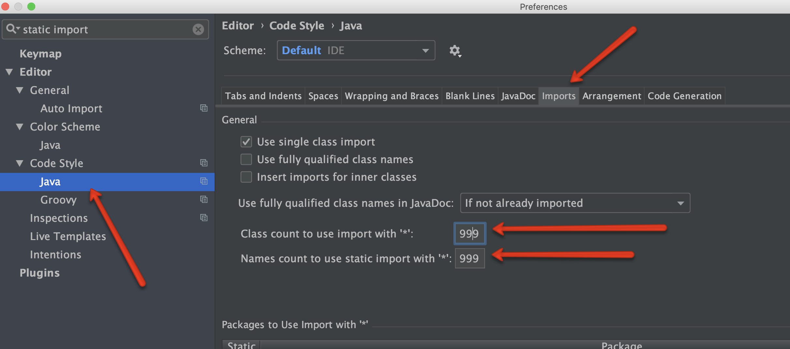
+ `Ctrl+Alt+O` & `Ctrl+Alt+L` in IDEA IDE before any commit
+ Right branch and label in PR

### Short checklist
1. Branch
2. Label
3. Codacy
4. *Other checks
5. Changed files

### Detailed list
1. Branch should NOT be ***master***
2. For it shold be ***bootstrap***
3. Codacy check should be OK. If not then you need to see what's wrong
4. *When Travis would be fixed
5. Also reviewing files you can mark them with checkboxes. Should be checked:
   + Code style
   + Understandable naming
   + JDI asserts instead of others
   + Unnecessary empty lines and spaces
   + Unnecessary or forgotten comments
   + Chaining should be separated by lines

### Recommended tools
1. Intellij IDEA
2. Git

### Using libraries
1. As log library: slf4j + logback-classic (TO_VERIFY)
2. As tests runner: TestNG (TO_VERIFY)
3. As reporter: Allure Framework (TO_VERIFY)
4. As test framework: JDI (TO_VERIFY)

### Intellij IDEA Preferences
1. Preferences -> Version Control -> Commit Dialog > Before commit block, setup checkboxes: Reformat Code, Rearrange code, Optimize imports
2. In app press hotkeys: `Ctrl+Shift+Alt+L`, choose checkboxes: Optimize imports, Rearrange Code
3. When you work to apply autoreformatting please use (on file, on directory or inside file) `Ctrl-Alt-L` hotkey
4. To fast open any class by its name use `Ctrl+N`/`Cmd+O`
5. Be sure that NOT checked: Settings->Editor-> Code Style -> Java -> Tabs and Indents -> Use tab character
6. Be sure that equals to 4: Settings->Editor-> Code Style -> Java -> Tabs and Indents -> Tab size field and Indent field
7. Turn off wildcard imports: set to 999 for Settings -> Editor -> Code style -> Java -> Imports -> Class count to use imports with `*` field and Names count to use static imports with `*`

### CVS section
1. Use Git
   + Name branches with useful names 
2. Merge code into any branch only through GitHub pull request (PR)
   + Name PR with useful name
3. Before add reviewers to your PR be ensure: 
   + no codacy issues
   + code is ready to review
   + you push the last changes
   + you have last changes from target branch
   + there is no merge conflicts
   + you take into account all review comments (if such were)
4. Add ReviewTeam as reviewers or re-request review (if there is already reviewers in PR)
5. When you get review changes request you should resolve all issues and re-request code review from the same reviewers
6. Repeat until branch will be merged by reviewers
7. Keep actual **.gitignore** file

### Code style
1. Use spaces, 1 tab size equals to 4
2. Don't use wildcard imports
3. Use Intellij's autoreformatting, imports optimization and rearrange option
4. Fix all Codacy issues
5. If Codacy issue shouldn't be resolved use warnings suppressions
6. Use semantic-value names for classes , variables, methods and so on. Use full version of words (human instead of h and so on). Common abbreviations (as id, uid and so on are applied). Use valuable names, for example instead of accountList use accounts and so on
7. Remove double empty lines, use empty lines only when it make sense (additionally to autoreformatting)
8. Use correct line breaks: (PROVIDE_SAMPLES)
9. Try to use lines with no more 100-120 symbols (including indents) 
10. Use chaining style, recommended sample:
```java 
object
    .method(1)
    .otherMethod();
```
11. Always use `{}` braces for even empty if, for, etc.
12. Follow to the sequence of keywords: public protected private abstract default static final transient volatile synchronized native strictfp
13. Don't use such conveniences as: `mValue`, `_value`, and so on. Acceptable `__` as unused argument of data provider in test methods
14. Feel free to smart refactoring
15. Feel free to use smart ?:
16. Use `UpperCamelCase` naming style for classes, `lowerCamelCase` for fields and methods, `UPPERCASE` for enums, `lowercase` for packages
17. Always use `@Override` annotation
18. Don't leave empty `catch{}`, use relevant exceptions with messages
19. Try to not use global variables
20. Use variables for integer, string and other values (for instance, `int piNumber=3.14; println(piNumber)`)
21. Write comments in English
22. It's better to write code than create task to write code
23. It's better to create task and `TODO` with this task number than to write simple `TODO` in code
24. It's better to write simple understandable `TODO` in code than to tell about problem to someone
25. It's better to tell about a problem to someone than to not take actions at all
26. Always leave newline symbol as a last symbol of file

