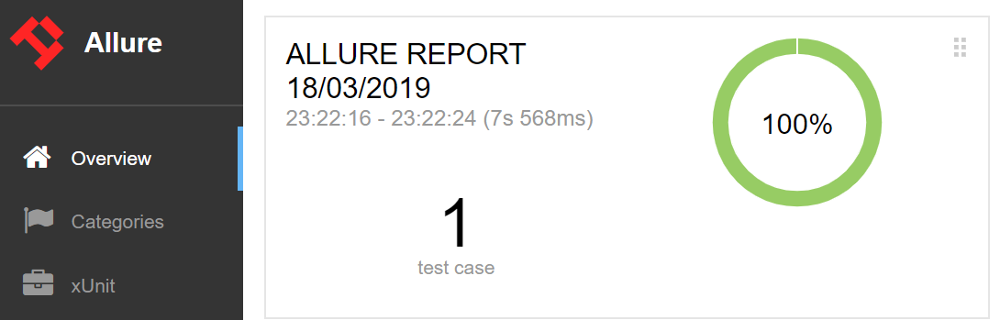

# Introduction
## Simple JDI examples
### Create a simple Login test
First of all, let's see how JDI solves typical problems. Let's start with Login, since most tests start with signing in.

You can find a Java code example <a href='https://github.com/jdi-examples/jdi-introduction' target="_blank">here</a>

**Test Scenario**

```java 
@Test
public void loginTest() {
    homePage.open();
    userIcon.click();
    loginForm.loginAs(DEFAULT_USER);
    homePage.checkOpened();
}
```
1. Open HomePage (<a href='https://jdi-testing.github.io/jdi-light/index.html' target="_blank">https://jdi-testing.github.io/jdi-light/index.html</a>)
2. Click on User Icon (to open login dialog)
2. Login as default user
    - Enter 'Roman' in login textfield
    - Enter 'Jdi1234' in password textfield
    - Press 'Enter'
3. Validate that HomePage has been opened

```
[22:17.102  STEP] : Open 'Home Page'(url=>https://jdi-testing.github.io/jdi-light/index.html)
[22:23.617  STEP] : Click on 'User Icon'
[22:23.727  STEP] : Login as User (userName:epam; password:1234)
[22:24.516  STEP] : Check that 'Home Page' is opened (url CONTAINS '/index.html'; title EQUALS 'Home Page')
```
**So simple!**<br/>
But this is not all. Try to run this test in your IDE and see what you get...

 - A detailed log in the Console output:<br/>

**Nice**, isn't it?

 - The same log in the log file (<i>src/test/.logs/</i>) in case you'd like to see the test execution results remotely <i>(requires <b>log4j2.xml</b> file in src/test/resources)</i><br/>
 - A nice Allure report of your test execution! (<i>requires Allure settings in <b>pom.xml</b></i>)<br/>



Just move the <b>allure-results</b> folder to your local folder and run Maven > Plugins > Allure > allure:serve<br/>


```java 
@JSite("https://jdi-testing.github.io/jdi-light/")
public class JdiTestSite {
    public static HomePage homePage;
}
@BeforeSuite(alwaysRun = true)
public static void setUp() {
    initElements(JdiTestSite.class);
}

@Url("/index.html") @Title("Home Page")
public class HomePage extends WebPage {
    @Css("form") public static LoginForm loginForm;
    @Css("img#user-icon") public static Icon userIcon;
}

public class LoginForm extends Form<User> {
    @Css("#name") TextField userName;
    @Css("#password")  TextField password;
    @Css("[type=submit]") Button enter;
}
```
### UI PageObjects
Now let's have a look at PageObjects in JDI. For example, for "Login test" above we used the following PageObjects:<br/>

- **Site** - your application entity. It contains all the Pages of your application and can be initiated with a single command.

- **HomePage** - Pages contain elements: <i>common, complex</i> and <i>composite</i>. Pages also contain meta information about Url and Title, and you can execute common actions with them, e.g.: <i>open, checkOpened, get Url/Titile, zoom, scroll, work with cookies</i> etc.

- **LoginForm** - Forms and Sections are logical parts of pages, they can include other sections or just elements. Forms also have additional actions like <i>fill, submit, check</i> etc.

- **UI elements** (typified elements), e.g. <i>Button, TextField, Checkbox, Icon etc.</i>, are simple elements representing real UI ones.

Below you can find a common JDI project structure:

```java 
@Test
public void nonPageObjectTest() {
    WebPage.openUrl("https://jdi-testing.github.io/jdi-light/index.html");
    $("img#user-icon").click();
    $("form #name").input("Roman");
    $("form #password").input("Jdi1234");
    $("form [type=submit]").click();
    Assert.assertEquals(WebPage.getUrl(), "https://jdi-testing.github.io/jdi-light/index.html");
}
public class LoginForm extends Form<User> {
    TextField userName = $("#name");
    TextField password = $("#password");
    Button enter = $("[type=submit]");
}
```
### Short term non-Page Object style
If you need a quick test (i.e. you don't need Page Objects), you can simply use "JQuery/Selenide" style without any additional code.

You can also initialize your Page Objects directly with elements if you don't like annotations.
<br/><br/><br/><br/><br/><br/><br/>
### Smart Test locators

[See details and examples for Smart locators in the documentation](https://jdi-docs.github.io/jdi-light/?java#smart-locators)

```java 
@Test
public void assertTest{
  title.is().text(containsString("jdi"));
  name.assertThat().text(is("Roman"));
  color.has().attr("color", is("red"))
}
@Test
public void chainAssertTest{
  title.assertThat()
    .text(containsString("jdi"))
    .attr("color", is("red"))
    .tag(is("h1"))
}
@Test
public void listAssertTest{
	searchResults.is().notEmpty();
	searchResults.assertThat()		
		.size(equalTo(10))
		.any(e -> e.name.equals("Jdi intro 2"))
		.each(e -> e.name.toLowerCase().contains("jdi"))
		.onlyOne(e -> e.name.contains("Jdi intro 1"))
		.noOne(e -> e.name.contains("Selenide"));
}
@Test
public void tableChainTest() {
	users.assertThat()
		.displayed().size(6).size(greaterThan(3))
		.notEmpty().row(d -> d.user.contains("Ivan"))
		.allRows(d -> d.user.length() > 4)
		.atLeast(3).rows(d -> d.type.contains("User"))       
		.row(SPIDER_MAN)
		.exact(2).rows(d -> d.description.contains(":VIP"))
		.exact(1).rows(SPIDER_MAN);
}
```
### Asserts/Matchers integrated with elements

JDI has a really flexible set of matchers integrated into it.

- To access elements matchers, you can use the following methods:<br/>
<b>is()</b><br/>
<b>assertThat()</b><br/>
<b>has()</b><br/>
<b>waitFor()</b><br/>
<b>shouldBe()</b><br/>
They all work similarly. The only difference is the name, which is just for readability. <br/>
- JDI matchers are powered by [Hamcrest](http://hamcrest.org/JavaHamcrest/), the most popular matcher library in the Java world. <br/>
And of course, you can chain these matchers for validating multiple conditions.<br/>
- With JDI you will no more have to wait or execute sloppy tests.<br/>
JDI matchers handle most kinds of problems. They will pass when you expect them to and fail whenever there is a real error. <br/>
**Really useful, don't you agree?**
<br/><br/><br/><br/><br/><br/><br/><br/><br/>

### Custom elements

```java 
public class Checklist extends HtmlElement {
    @Override
    public boolean isSelected() {
        return find("<<").hasClass("active");
    }
}
public class Checklist extends HtmlChecklist {
    @Override
    public boolean isSelected(HtmlElement value) {
        return hasClass("active") && attr("ui").equals("label");
    }
}
public class ContactForm extends Form<Contacts> {
	TextField name, lastName, position, passportNumber, passportSeria;
...
	@UI("['Submit']") public Button submit;

	@Override
	public void fillAction(Field field, Object element, Object parent, String setValue) {
		if (isInterface(field, TextField.class))
			((TextField)element).higlight();
		super.fillAction(field, element, parent, setValue);
	}
}
```
JDI html elements can handle typical standard cases, but each application has its unique culture of layout development. <br/>
So if your developers are not following common standards, you can easily create a pack of elements specific to your application and use them in JDI.<br/>
You can create your own elements or just extend the existing ones by overriding a couple of functions. <br/>
Check these examples: <br/>
<a href='https://github.com/jdi-testing/jdi-light/blob/master/jdi-light-html-tests/src/main/java/io/github/com/custom/MenuItem.java' target="_blank">Menu Check item</a> <br/>
<a href='https://github.com/jdi-testing/jdi-light/blob/master/jdi-performance/src/main/java/org/mytests/uiobjects/example/site/sections/ContactForm.java' target="_blank">Contact Form</a>

## Start a new project with JDI
You can start a new Test Automation Project with JDI in mere seconds! <br/>
Just download one of the templates at <a href='https://github.com/jdi-templates' target="_blank">Github > jdi-light-...</a> <br/>

### Java + Allure + TestNg (recommended)
<a href='https://github.com/jdi-templates/jdi-light-testng-template' target="_blank">Github link</a> <br/>
### Java + Allure + JUnit
<a href='https://github.com/jdi-templates/jdi-light-junit-template' target="_blank">Github link</a> <br/>

### CSharp + NUnit
<a href='https://github.com/jdi-templates/jdi-light-csharp-template' target="_blank">Github link</a> <br/>


## How to improve your Selenium project with new capabilities in just a few minutes
## Logging and Reporting
